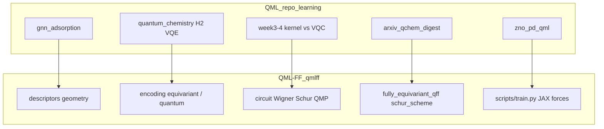

# QML-FF（等变量子力场框架）与学习计划对齐

> **工程路径**：`/Users/shl/nvidia/QML-FF`（若你本地目录名为 `QMFF`，请指向同一仓库或创建符号链接）。  
> **包名**：`qmlff`  
> **主技术文档**：`QML-FF/docs/QMLFF_TECHNICAL_DOCUMENT_CN.md`  
> **等变理论/路线图**：`QML-FF/docs/量子等变力场_理论实现与路线图_统一文档.md`

本仓库（`QML/`）侧重 **教程、基线、轻量管线与文献工作流**；**QML-FF** 是你开发的 **生产级量子机器学习分子力场** 框架，尤其在 **SO(3) 等变、Wigner/Schur、量子消息传递（QMP）** 上与下列阶段一一对应。

## 架构关系（简图）

## 各阶段如何接入 QML-FF

| 学习计划阶段 | 本仓库（QML） | QML-FF 建议动作 |
|--------------|----------------|-----------------|
| **0：H₂ 基线** | `docs/PHASE0_H2_BASELINE.md`、`01_complete_h2_vqe.py` | 对照 `QML-FF/docs/TRAIN_QMP_H2_PARAMETERS.md`、`scripts/train_qmp_h2.py`：同一 **H₂** 故事在 **等变量子消息传递** 管线中的超参与资源。 |
| **1：核 vs VQC、贫瘠高原** | `docs/QML_KERNEL_VS_VQC.md`、`docs/notes/qml_training_landscape_compendium.md` | 阅读 `qmlff/models/fully_equivariant_qff.py` 文档字符串：可选 **QuantumEquivariantMessagePassing（类 QNTK 冻结随机）** 以降低贫瘠高原；与 week4 **浅层 VQC** 形成设计对照。 |
| **2：结构→性质、轨迹** | `gnn_adsorption`、`zno_pd_qml`、`docs/PHASE2_PIPELINES.md` | **主战场**：`qmlff` 的 **DFT/结构数据**（`dft_loader`、`load_structure_data`）、**周期性**与 **JAX 力**（`compute_forces_from_energy`）。内部报告优先用 QML-FF 产出的 **MAE/力误差**，本仓库烟测作辅线。 |
| **3：对外资产与专精** | `docs/EXTERNAL_ANCHORS.md` | 深挖 `QMLFF_TECHNICAL_DOCUMENT_CN.md` §对称性、`DESCRIPTOR_COMPARISON.md`、`ENCODING.md`；对外叙事：**不变量输入 + 标量能量 + JAX 力（自动等变）**。 |
| **4：可复现 benchmark** | `benchmarks/reproducible_h2_vqe_benchmark.py` | 并行维护 QML-FF 侧 `scripts/phase4_scientific_evaluation.py`（若存在）或 `configs/*.yaml` + **固定 seed** 的训练快照；白皮书数字以 **YAML + commit hash** 为准。 |

## 等变量子力场：你在 QML-FF 中的核心模块（速查）

| 主题 | QML-FF 位置 |
|------|-------------|
| 能量不变 / 力等变（理论） | `QMLFF_TECHNICAL_DOCUMENT_CN.md` §1.2 |
| Wigner D、球谐、整数 \(l\) 嵌入 | `core/encoding/equivariant/wigner_l.py` |
| Schur / CG、方案 A–D | `量子等变力场_理论实现与路线图_统一文档.md` Part III–IV |
| 全等变 QFF（FE-QFF） | `models/fully_equivariant_qff.py` |
| 量子消息传递 | `pure_jax/jax_equivariant/quantum_message_passing.py`、`cg_qmp_layer.py` |
| 训练入口 | `scripts/train.py --config configs/default.yaml` |

## 与文献/Le 等工作的关系

仓库内 [`docs/topics/molecular_ff_survey_base.md`](topics/molecular_ff_survey_base.md) 讨论 **对称性不变/等变 QML 力场**（如 Le et al.）。**QML-FF** 将同类思想落实为 **可训练流水线**（描述符 → 等变/量子编码 → 电路 → 标量能量 → **JAX 梯度力**），精读论文时应用 [`docs/literature/chemistry_materials_reading.md`](literature/chemistry_materials_reading.md) 中 Q1–Q5，并把 **公式编号** 映射到上表模块，避免只写摘要。

## 同步节奏建议

1. **每周**：本仓库 `tools/arxiv_qchem_digest.py` 仍负责 **文献雷达**；精读笔记中单独标签 `#qmlff` 表示可能改代码的论文。  
2. **每月**：在 QML-FF 的 `docs/` 中选 **一章**（如对称性或 Schur）与 **一篇** arXiv 对照阅读。  
3. **版本冻结**：对外演示固定 `qmlff` 的 git commit 与 `config_used.yaml`（你已有 `results/.../config_used.yaml` 范式）。
