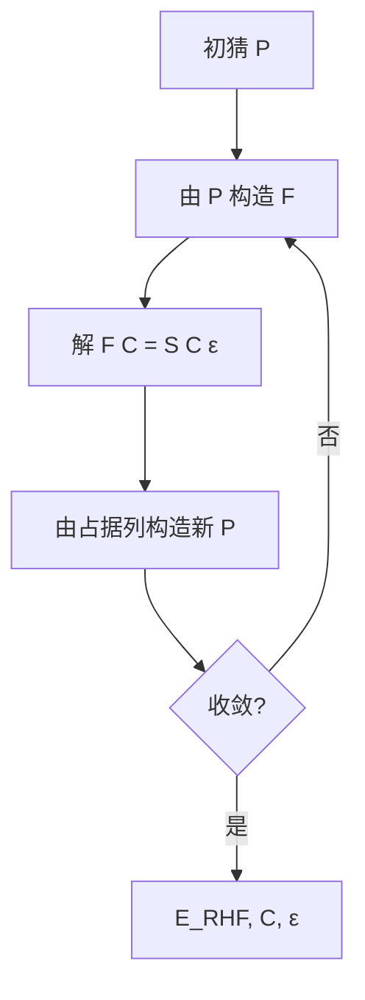

# Hartree–Fock 方法：从理论到 Roothaan–SCF 算法（逐步推导）

2026-04  
学习笔记 · 与 [经典量子化学方法详解.md](./经典量子化学方法详解.md) **§3** 配套

---

## 0. 记号与约定

- **原子单位（a.u.）**：$\hbar = m_e = e = 1$；距离为 Bohr，能量为 Hartree。
- **空间轨道** $\phi_i(\mathbf{r})$：仅空间坐标；**自旋轨道** $\psi_i(\mathbf{x}) = \phi_i(\mathbf{r})\,\sigma(s)$，$\mathbf{x}=(\mathbf{r},s)$。
- **双电子积分（Mulliken / chemist 记号）**：

$$
(\mu\nu\vert\lambda\sigma) \equiv \iint
\frac{\chi_\mu^*(\mathbf{r}_1)\chi_\nu(\mathbf{r}_1)\,\chi_\lambda^*(\mathbf{r}_2)\chi_\sigma(\mathbf{r}_2)}
{|\mathbf{r}_1-\mathbf{r}_2|}\,
\mathrm{d}\mathbf{r}_1\,\mathrm{d}\mathbf{r}_2.
$$

- **闭壳层 RHF**：$N$ 为偶数，$N/2$ 个空间轨道各填 **2** 个电子（$\alpha,\beta$ 自旋相反）。

下文 **§1–§5** 给出 HF 的变分定义与驻点方程；**§6–§9** 给出 LCAO–Roothaan 矩阵形式与 SCF 算法；**§10** 起为 UHF 与常用定理的简表。

---

## 1. Born–Oppenheimer 下的电子哈密顿量

核坐标固定时，电子问题由

$$
\hat{H}_{\mathrm{elec}}
= \sum_{i=1}^{N}\Bigl(-\tfrac{1}{2}\nabla_i^2 - \sum_{A}\frac{Z_A}{r_{iA}}\Bigr)
+ \sum_{i<j}\frac{1}{r_{ij}}
\equiv \sum_i \hat{h}(i) + \sum_{i<j}\hat{g}(i,j)
$$

描述。其中 $\hat{h}(i)$ 为 **单电子算符**（动能 + 核吸引），$\hat{g}(i,j)=1/r_{ij}$ 为 **双电子排斥**。

**HF 近似**：在反对称性约束下，将 $N$ 体波函数限制为 **单个 Slater 行列式**，并在该约束下 **变分求能量极小**。

---

## 2. Slater 行列式与反对称性

取 **一组正交归一** 自旋轨道 $\{\psi_1,\ldots,\psi_N\}$。归一化 Slater 行列式

$$
\Phi(\mathbf{x}_1,\ldots,\mathbf{x}_N)
= \frac{1}{\sqrt{N!}}
\det\bigl[\psi_i(\mathbf{x}_j)\bigr]_{i,j=1}^{N}.
$$

它自动满足 **Pauli 原理**（交换两电子坐标，行列式变号）。

**Hartree 积**（无反对称）会允许两电子占据同一自旋–空间态；Slater 行列式通过反对称 **禁止** 此类非物理情况，并产生 **Fermi 相关**（同自旋电子的交换空穴）。

---

## 3. 单行列式的能量期望值（一般自旋轨道形式）

对归一化单行列式 $\Phi$，能量

$$
E = \langle\Phi\vert\hat{H}_{\mathrm{elec}}\vert\Phi\rangle
$$

可用 **Slater–Condon 规则** 写出。对 **正交归一自旋轨道**，最紧凑的形式为

$$
E = \sum_{i=1}^{N} \langle i\vert\hat{h}\vert i\rangle
+ \frac{1}{2}\sum_{i=1}^{N}\sum_{j=1}^{N}
\Bigl(\langle ij\Vert ij\rangle\Bigr),
$$

其中 **反对称双电子积分**

$$
\langle ij\Vert ij\rangle \equiv
\iint \psi_i^*(\mathbf{x}_1)\psi_j^*(\mathbf{x}_2)\,
\frac{1}{r_{12}}\,
\bigl[\psi_i(\mathbf{x}_1)\psi_j(\mathbf{x}_2) - \psi_j(\mathbf{x}_1)\psi_i(\mathbf{x}_2)\bigr]
\,\mathrm{d}\mathbf{x}_1\mathrm{d}\mathbf{x}_2.
$$

展开括号即得 **直接（Coulomb）项** 与 **交换项**：

$$
E = \sum_i \langle i\vert\hat{h}\vert i\rangle
+ \frac{1}{2}\sum_{ij}\Bigl(\langle ij\vert ij\rangle - \langle ij\vert ji\rangle\Bigr),
$$

这里 $\langle ij\vert ij\rangle$ 表示按空间–自旋坐标积分的 **非反对称** Coulomb 型矩阵元（与上节 Mulliken 空间积分类似，但带自旋）。

---

## 4. 闭壳层 RHF 的能量公式

闭壳层下，占据自旋轨道成对出现：对每个空间轨道 $\phi_i$ 有 $\psi_{i\alpha}=\phi_i\alpha$、$\psi_{i\beta}=\phi_i\beta$。代入上式并对自旋求和，得到仅用 **空间轨道** 的表达：

$$
E_{\mathrm{RHF}}
= 2\sum_{i=1}^{N/2} h_{ii}
+ \sum_{i=1}^{N/2}\sum_{j=1}^{N/2}\bigl[2J_{ij} - K_{ij}\bigr],
$$

其中

$$
h_{ii} = \langle \phi_i\vert\hat{h}\vert\phi_i\rangle,
$$

$$
J_{ij} = (\phi_i\phi_i\vert\phi_j\phi_j)
= \iint \frac{\lvert\phi_i(\mathbf{r}_1)\rvert^2\,\lvert\phi_j(\mathbf{r}_2)\rvert^2}{r_{12}}\,
\mathrm{d}\mathbf{r}_1\mathrm{d}\mathbf{r}_2,
$$

$$
K_{ij} = (\phi_i\phi_j\vert\phi_j\phi_i)
= \iint \frac{\phi_i^*(\mathbf{r}_1)\phi_j^*(\mathbf{r}_2)\,\phi_i(\mathbf{r}_2)\phi_j(\mathbf{r}_1)}{r_{12}}\,
\mathrm{d}\mathbf{r}_1\mathrm{d}\mathbf{r}_2.
$$

**物理解读**：

- $2\sum_i h_{ii}$：电子在核场中的单粒子能量（动能 + 核吸引）之和（每个空间轨道贡献两次自旋）。
- $2J_{ij}$：经典 Coulomb 排斥（$i$ 的电子云与 $j$ 的电子云）。
- $-K_{ij}$：**交换** 修正（纯量子，无经典点电荷对应）；对同自旋必需，且与 $J$ 配合消除 **自相互作用** 的非物理部分。

当 $i=j$ 时，$J_{ii}=K_{ii}$，故 $(2J_{ii}-K_{ii})=J_{ii}$，即 **自相互作用** 在闭壳层形式下只保留一份 Coulomb 项，这是交换项的关键作用之一。

---

## 5. Hartree–Fock 变分问题与 Fock 方程

### 5.1 变分原理

HF 问题表述为：在 $\{\phi_i\}$ 张成的 Slater 行列式流形上，**最小化** $E[\{\phi_i\}]$，并满足 **正交归一** 约束

$$
\langle \phi_i\vert\phi_j\rangle = \delta_{ij}.
$$

### 5.2 Lagrange 乘子与驻点条件（从泛函到 Fock 方程）

将 **§4** 的 $E_{\mathrm{RHF}}[\{\phi_i\}]$ 视为 $\{\phi_i\}$ 的泛函，在约束 $\langle\phi_i|\phi_j\rangle=\delta_{ij}$ 下求驻点。构造 Lagrange 泛函（**闭壳层**下只需对 **空间** 轨道变分；$\alpha,\beta$ 给出相同方程）

$$
\mathcal{L}[\{\phi_i\},\{\varepsilon_{ij}\}]
= E_{\mathrm{RHF}}[\{\phi_i\}]
- \sum_{i,j=1}^{N/2}\varepsilon_{ij}\bigl(\langle\phi_i\vert\phi_j\rangle - \delta_{ij}\bigr),
$$

其中 $\varepsilon_{ij}$ 为 **Lagrange 乘子矩阵**（常取为 Hermite：$\varepsilon_{ij}=\varepsilon_{ji}^*$）。

对 $\phi_k^*(\mathbf{r})$ 做一阶变分 $\delta\phi_k^*$，要求 $\delta\mathcal{L}=0$。将 $E_{\mathrm{RHF}}$ 中显含 $\phi_k^*$ 的项逐项变分（单电子项给出 $\hat{h}\phi_k$；双电子项经 Coulomb/交换的对称配对后，可合并为 **对占据 $j$ 求和的 $2\hat{J}_j-\hat{K}_j$** 作用在 $\phi_k$ 上），约束项给出 $-\sum_j \varepsilon_{kj}\phi_j$。于是驻点满足

$$
\hat{f}\,\phi_k = \sum_{j=1}^{N/2} \varepsilon_{kj}\,\phi_j,
\qquad
\hat{f}=\hat{h}+\sum_{j=1}^{N/2}\bigl(2\hat{J}_j-\hat{K}_j\bigr).
$$

这是一组 **耦合的 integro-differential 方程**。由于占据子空间上的 **酉不变性**，可在不改变 Slater 行列式（至多整体相位）的前提下，选取 $\{\phi_j\}$ 使 $\varepsilon_{kj}$ **对角化**，记 $\varepsilon_{kk}\equiv\varepsilon_k$，得到 **正则 Hartree–Fock 方程**

$$
\hat{f}\,\phi_i = \varepsilon_i\,\phi_i,
$$

其中 $\hat{f}$ 即前一段已写出的 $\hat{f}=\hat{h}+\sum_j(2\hat{J}_j-\hat{K}_j)$（作用在电子坐标 $\mathbf{r}_1$ 上）。**Coulomb 算符** $\hat{J}_j$ 与 **交换算符** $\hat{K}_j$ 对任意试探函数 $\varphi(1)$ 的作用定义为

$$
\hat{J}_j(1)\,\varphi(1)
= \Biggl[\int \frac{\lvert\phi_j(2)\rvert^2}{r_{12}}\,\mathrm{d}2\Biggr]\varphi(1),
$$

$$
\hat{K}_j(1)\,\varphi(1)
= \Biggl[\int \frac{\phi_j^*(2)\,\varphi(2)}{r_{12}}\,\mathrm{d}2\Biggr]\phi_j(1).
$$

于是 $\hat{f}$ 是 **有效单电子哈密顿量**：每个电子在 **核场 + 其余 $N-1$ 个电子产生的平均 Coulomb 场 − 同自旋交换势** 中运动。由于 $\hat{J},\hat{K}$ 通过 $\{\phi_j\}$ 依赖于解本身，方程 **非线性**，需 **自洽场（SCF）** 迭代。

### 5.3 轨道能 $\varepsilon_i$ 与总能量

由 $\langle \phi_i\vert\hat{f}\vert\phi_i\rangle = \varepsilon_i$ 可得

$$
\varepsilon_i = h_{ii} + \sum_j (2J_{ij} - K_{ij}).
$$

总能量 **不等于** $\sum_i 2\varepsilon_i$（否则会 **双重计算** 电子–电子相互作用）。常用关系：

$$
E_{\mathrm{RHF}} = \sum_{i=1}^{N/2} 2\varepsilon_i - \sum_{i,j=1}^{N/2}(2J_{ij} - K_{ij})
= \sum_i 2\varepsilon_i - \sum_{ij}(2J_{ij} - K_{ij}).
$$

（第二项与 $E=2\sum h_{ii}+\sum(2J-K)$ 等价，代数恒等。）

### 5.4 占据子空间的酉不变性（补充）

在同一 **占据子空间** 内对 $\{\phi_i\}$ 做酉变换，Slater 行列式最多改变一个 **整体相位**，故 $E_{\mathrm{RHF}}$ 不变。**正则轨道** $\hat{f}\phi_i=\varepsilon_i\phi_i$ 只是选取了使 $\mathbf{\varepsilon}$ 对角化的一组便利基；虚轨道同理在虚子空间内酉等价。

---

## 6. LCAO 展开：从连续轨道到矩阵代数

将每个空间轨道在 **原子轨道（AO）基** $\{\chi_\mu\}_{\mu=1}^{K}$ 上展开：

$$
\phi_i(\mathbf{r}) = \sum_{\mu=1}^{K} C_{\mu i}\,\chi_\mu(\mathbf{r}).
$$

定义 **密度矩阵**（闭壳层）

$$
P_{\mu\nu} = 2\sum_{i=1}^{N/2} C_{\mu i}\,C_{\nu i}^{*}.
$$

（若 AO 为实函数且 $C$ 为实矩阵，可写 $C_{\nu i}$。）  
**电子密度** 为

$$
\rho(\mathbf{r}) = 2\sum_{i}\lvert\phi_i(\mathbf{r})\rvert^2
= \sum_{\mu\nu} P_{\mu\nu}\,\chi_\mu(\mathbf{r})\chi_\nu(\mathbf{r}).
$$

**重叠矩阵**

$$
S_{\mu\nu} = \langle \chi_\mu\vert\chi_\nu\rangle.
$$

**单电子积分**

$$
h_{\mu\nu} = \langle \chi_\mu\vert\hat{h}\vert\chi_\nu\rangle.
$$

---

## 7. Fock 矩阵的 AO 矩阵元

将 Fock 方程 $\hat{f}\phi_i=\varepsilon_i\phi_i$ 投影到 AO 基，得到 **Fock 矩阵** $\mathbf{F}$，其元素为

$$
F_{\mu\nu} = h_{\mu\nu} + G_{\mu\nu},
$$

其中 **G 矩阵（双电子部分）** 为

$$
G_{\mu\nu}
= \sum_{\lambda\sigma} P_{\lambda\sigma}\Bigl[
(\mu\nu\vert\lambda\sigma) - \tfrac{1}{2}(\mu\lambda\vert\nu\sigma)
\Bigr].
$$

**逐项对应**：

- $(\mu\nu\vert\lambda\sigma)$：Coulomb 型收缩，与密度 $P_{\lambda\sigma}$ 配对后给出 **平均 Hartree 势** 对 $F_{\mu\nu}$ 的贡献。
- $-\tfrac{1}{2}(\mu\lambda\vert\nu\sigma)$：**交换** 贡献；系数 $\tfrac{1}{2}$ 来自闭壳层自旋求和与矩阵元对称性的标准整理。

若将 $\mathbf{G}$ 写为 **Coulomb 矩阵** $\mathbf{J}$ 与 **交换矩阵** $\mathbf{K}$ 的组合，有 $\mathbf{G} = \mathbf{J} - \tfrac{1}{2}\mathbf{K}$（定义因程序而异，上式为 **Gaussian / 多数量子化学教材** 常用写法）。

---

## 8. Roothaan–Hall 广义本征方程

MO 系数矩阵 $\mathbf{C}$（$K\times K$，列向量为各 MO 在 AO 基下的系数）满足

$$
\mathbf{F}\,\mathbf{C} = \mathbf{S}\,\mathbf{C}\,\boldsymbol{\varepsilon},
$$

其中 $\boldsymbol{\varepsilon}=\mathrm{diag}(\varepsilon_1,\ldots,\varepsilon_K)$。这是 **广义本征问题**；当 $\mathbf{S}=\mathbf{I}$（正交基）时退化为普通本征问题 $\mathbf{F}\mathbf{C}=\mathbf{C}\boldsymbol{\varepsilon}$。

### 8.1 从 $\hat{f}\phi_i=\varepsilon_i\phi_i$ 到矩阵形式（投影）

将 $\phi_i=\sum_{\nu} C_{\nu i}\chi_\nu$ 代入 $\hat{f}\phi_i=\varepsilon_i\phi_i$，左乘 $\langle\chi_\mu|$ 得

$$
\sum_{\nu} F_{\mu\nu} C_{\nu i} = \varepsilon_i \sum_{\nu} S_{\mu\nu} C_{\nu i}.
$$

记 $\mathbf{c}_i$ 为列向量 $(C_{1i},\ldots,C_{Ki})^{\mathsf T}$，则 $\mathbf{F}\mathbf{c}_i=\varepsilon_i\mathbf{S}\mathbf{c}_i$；把所有列并排即 $\mathbf{F}\mathbf{C}=\mathbf{S}\mathbf{C}\boldsymbol{\varepsilon}$。

**非正交 AO** 时常用 **对称正交化（Löwdin）**：$\mathbf{X}=\mathbf{S}^{-1/2}$，定义

$$
\mathbf{F}' = \mathbf{X}^{\mathsf T}\mathbf{F}\mathbf{X},\qquad
\mathbf{C}' = \mathbf{X}^{-1}\mathbf{C},
$$

则

$$
\mathbf{F}'\mathbf{C}' = \mathbf{C}'\boldsymbol{\varepsilon}
$$

为标准本征问题，求得 $\mathbf{C}'$ 后还原 $\mathbf{C}=\mathbf{X}\mathbf{C}'$。

---

## 9. RHF 的 SCF 算法（逐步）

**输入**：$h_{\mu\nu}$、$S_{\mu\nu}$、$(\mu\nu\vert\lambda\sigma)$（或按壳层/密度拟合）、电子数 $N$。

**输出**：收敛的 $\mathbf{P},\mathbf{C}$、$E_{\mathrm{RHF}}$。

1. **初猜** $\mathbf{P}^{(0)}$（如 Hückel、叠加原子密度、或对角化 $\mathbf{h}$ 得到系数再构造 $\mathbf{P}$）。
2. 对迭代 $k=0,1,2,\ldots$：
   - **构造 Fock 矩阵** $\mathbf{F}^{(k)}$：用 $\mathbf{P}^{(k)}$ 计算 $G_{\mu\nu}$（若用 **直接 SCF**，不预存全积分，则按批计算 $(\mu\nu|\lambda\sigma)$ 与 $\mathbf{P}$ 收缩）。
   - **求解** $\mathbf{F}^{(k)}\mathbf{C}=\mathbf{S}\mathbf{C}\boldsymbol{\varepsilon}$，取 **最低的 $N/2$ 个** 空间轨道为占据（**Aufbau**）。
   - **更新密度** $\mathbf{P}^{(k+1)}$（闭壳层公式同上）。
3. **收敛判据**：例如 $\Delta E < \delta_E$，和/或 $\lVert\mathbf{P}^{(k+1)}-\mathbf{P}^{(k)}\rVert < \delta_P$。
4. **能量**：

$$
E_{\mathrm{RHF}}
= \sum_{\mu\nu} P_{\mu\nu} h_{\mu\nu}
+ \frac{1}{2}\sum_{\mu\nu\lambda\sigma} P_{\mu\nu} P_{\lambda\sigma}\Bigl[
(\mu\nu\vert\lambda\sigma) - (\mu\lambda\vert\nu\sigma)
\Bigr].
$$

（注意闭壳层因子：有的文献把 $\tfrac{1}{2}$ 吸收进 $\mathbf{P}$ 定义，需自洽核对。上式与 **§4** 的 $2\sum h_{ii}+\sum(2J-K)$ 在 LCAO 下等价。）

**DIIS（可选加速）**：用前若干步的 **误差向量**（如 $\mathbf{F}\mathbf{P}\mathbf{S}-\mathbf{S}\mathbf{P}\mathbf{F}$）外推下一个 $\mathbf{F}$，显著减少迭代次数（尤其是带金属/弱束缚体系）。

---

## 10. UHF：两套轨道与自旋污染（公式骨架）

**Unrestricted HF**：$\alpha$ 与 $\beta$ 用 **不同** 的空间轨道 $\phi_i^\alpha,\phi_j^\beta$。能量

$$
E_{\mathrm{UHF}}
= \sum_{i\in\mathrm{occ}_\alpha}\langle i\vert\hat{h}\vert i\rangle
+ \sum_{j\in\mathrm{occ}_\beta}\langle j\vert\hat{h}\vert j\rangle
+ \frac{1}{2}\sum_{ij\in\mathrm{occ}_\alpha}\langle ij\Vert ij\rangle
+ \frac{1}{2}\sum_{ij\in\mathrm{occ}_\beta}\langle ij\Vert ij\rangle
+ \sum_{i\in\alpha}\sum_{j\in\beta} J_{ij},
$$

最后一项为 **$\alpha$–$\beta$ Coulomb**（无交换，因自旋相反）。  
分别定义 $\mathbf{P}^\alpha,\mathbf{P}^\beta$ 与 $\mathbf{F}^\alpha,\mathbf{F}^\beta$，仍解两个广义本征问题并交替更新直至自洽。  
**缺点**：$\langle \hat{S}^2\rangle$ 常偏离纯自旋多重态，即 **自旋污染**。

---

## 11. 与后 HF 衔接的两个定理（陈述）

- **Brillouin 定理**：RHF 参考与 **单激发** 行列式之间的 $\langle\Phi_0|\hat{H}|\Phi_i^a\rangle=0$。故 MP2 等 **一阶能量修正** 主要来自 **双激发**。
- **Koopmans 定理**：在 **冻结轨道** 近似下，$\varepsilon_i$（占据）$\approx$ 移去该电子的 **电离能** 的负值；对虚轨道与电子亲和的类比更粗糙。实际量化计算中常作 **定性** 使用。

---

## 12. 计算复杂度小结

| 环节 | 标度（粗） |
|:---|:---|
| 双电子积分（存盘） | $O(K^4)$ |
| 一轮 Fock 构造（直接收缩） | 亦可表为与积分筛选相关的近 $O(K^4)$ |
| 对角化 / 广义本征 | $O(K^3)$ |
| 整体 SCF | 常记 **$O(K^3)$–$O(K^4)$** 量级（与基与积分阈值强相关） |

---

## 13. 与主笔记 §3 的对应关系

| 主笔记 §3 小节 | 本文 |
|:---:|:---|
| 3.1 平均场 + 单行列式 | **§2–§5** |
| 3.2 Fock 与 Roothaan | **§6–§8** |
| 3.3 SCF | **§9** |
| 3.4 RHF/UHF/ROHF | **§4, §10**（ROHF 细节从略） |
| 3.5–3.7 物理与标度 | **§4, §11–§12** |

更完整的 **CI/CC/DFT** 脉络仍以主笔记后续章节为准。

---

## 参考文献式延伸（自学）

- Szabo & Ostlund, *Modern Quantum Chemistry*（Roothaan 方程与 SCF 经典入门）。  
- Helgaker, Jørgensen, Olsen, *Molecular Electronic-Structure Theory*（矩阵元与实现细节）。  
- Levine, *Quantum Chemistry*（变分推导与 Koopmans）。

---
