# 分裂价、极化基组与原子轨道（s, p, d, f）及杂化

2026-04  
学习笔记整理（含示意图）

---

## 说明

本文在 **LCAO–MO / Hartree–Fock–Roothaan** 框架下，把三件事放在一起：

1. **分裂价（split-valence）** 基组为何能调节价层电子云的 **径向胖瘦**；
2. **极化（polarization）** 函数为何能描述 **角向形变**；
3. **原子轨道角动量** $s,p,d,f$ 与化学中常用的 **$\mathrm{sp},\mathrm{sp}^2,\mathrm{sp}^3$ 杂化** 的形状直觉。

文中的 **二维截面** 图由 `generate_orbital_figures.py` 生成（氢样径向包络 × 实笛卡尔角向因子）；**§3.1 三维** 图由 `generate_orbital_3d_figures.py` 生成。二者均为 **定性示意** 角向对称性，不替代具体基组 contracted GTO 系数。

---

## 1. 分裂价：径向“多尺度”如何让环境调节胖瘦

### 1.1 最小基的局限

在 **极小基** 中，每个原子每种对称类型（如价层一个 $s$、一组 $p$）往往只有 **一套** 固定的径向形状（由基组参数中的指数与收缩决定）。  
电子密度在环境中常常同时需要：

- **近核**更紧（控制核吸引能、避免不合理的外散）；
- **键间 / 价层外区**更松（把密度放到核间区域，或描述带电、激发等更弥散的价层）。

若只有 **一个** 径向模板，就像用单尺度去拟合“核附近陡、远处拖尾”的分布，**变分最优解仍被模板卡住**——这是基组 **径向不完备** 的来源之一。

### 1.2 分裂价的数学图像

分裂价（如 6-31G 中的 “31”）把价层写成 **同一角动量对称性** 下多个径向自由度的线性组合：

$$
\chi_{\mathrm{valence}} = c_1\,\chi_{\mathrm{tight}} + c_2\,\chi_{\mathrm{loose}} + \cdots
$$

直觉上，$\chi_{\mathrm{tight}}$ 对应 **较大** 的高斯指数 $\zeta$（更集中在核附近），$\chi_{\mathrm{loose}}$ 对应 **较小** 的指数（更弥散）。  
系数 $(c_1,c_2,\ldots)$ **不是手调的经验规则**，而是由 **Roothaan–Hall（或 Kohn–Sham）广义本征方程** 在 SCF 迭代中自动给出——等价于在更大的有限维子空间里做变分，使总能量最低。

化学环境（邻近原子、电荷、外场等）改变 **Fock / KS 矩阵元** $\Rightarrow$ 最优系数改变 $\Rightarrow$ 价层径向分布改变。这就是“**随环境自动调节电子云胖瘦**”的严格含义。

### 1.3 示意图：紧 + 松

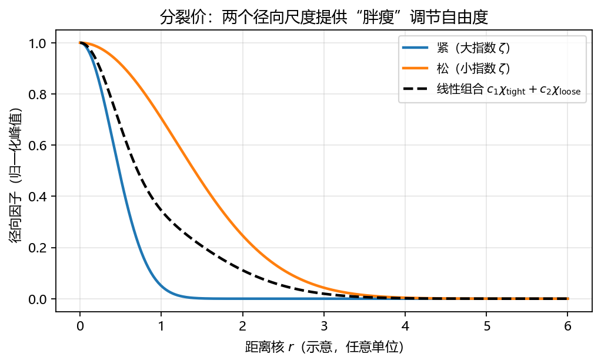

---

## 2. 极化函数：角向自由度如何让电子云“形变”

### 2.1 为什么 $s$ 不够

$l=0$ 的 $s$ 轨道是 **球对称** 的：绕核任意旋转，密度不变。  
而成键方向、外加电场、低对称晶格环境等，往往给出 **各向异性** 的有效势。若基组在某一中心只有 $s$，则在该中心上可调的主要仍是 **球对称的径向调配**，**缺少把密度从一侧搬到另一侧的角向基**。

### 2.2 在 $s$ 集合上加 $p$（或在 $p$ 上加 $d$）

**极化函数** 指在较低角动量壳层上增加 **更高角动量** 的函数（如碳的 $2s$ 上配 $2p$ 型极化、$2p$ 上配 $3d$ 型极化）。  
物理图像：允许占据轨道出现

$$
\phi \approx c_s \chi_s + c_p \chi_{p} + \cdots
$$

的小的 $p$（或 $d$）混入，使原本近球形的密度获得 **偶极 / 更高多极** 的角向修正，从而降低在 **各向异性势** 下的能量。  
计算实现上，它们只是 **更多的 AO 基函数** $\{\chi_\mu\}$，进入同样的重叠矩阵 $S_{\mu\nu}$ 与 Fock 矩阵 $F_{\mu\nu}$；**形变**来自解出的 MO 系数在这些函数上 **非零**。

### 2.3 示意图：$s$ 与 $s+\varepsilon p_z$

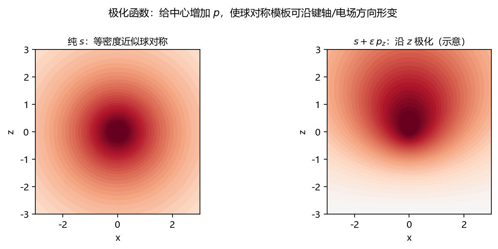

---

## 3. 量子数与角动量：$s,p,d,f$ 是什么

单电子原子（或 AO 的角向因子）用 **球谐函数** $Y_{l}^{m}(\theta,\varphi)$ 描述角向部分；$l$ 决定 **节面数与对称类型**：

| 符号 | $l$ | 简并度（不计自旋） | 角向特征（直觉） |
|:---:|:---:|:---:|:---|
| $s$ | 0 | 1 | 球对称，无角向节面 |
| $p$ | 1 | 3 | 哑铃形，一个平面节面 |
| $d$ | 2 | 5 | 四瓣/环等，两个角向节面（型式依实组合） |
| $f$ | 3 | 7 | 更复杂的六瓣等图案 |

**磁量子数** $m_l$ 标记角动量在某轴上的投影；化学绘图里常用 **实组合的笛卡尔型** $p_x,p_y,p_z$、$d_{z^2},d_{xz},\ldots$、$f_{xyz},\ldots$（与虚指数 $e^{im\varphi}$ 组合等价，仅换基）。

### 3.1 三维角向形状（示意图）

下面给出与上表对应的 **三维** 图形（脚本 `generate_orbital_3d_figures.py`）。画法：在单位球方向 $(\theta,\varphi)$ 上取点 $(x,y,z)=(\sin\theta\cos\varphi,\,\sin\theta\sin\varphi,\,\cos\theta)$，将 **实笛卡尔角向因子** $A(x,y,z)$（与 §4–§6 截面图同一套多项式）映射为

- **矢径**：$R \propto \varepsilon + |A|^{1/2}$（常数 $\varepsilon$ 使 $s$ 仍接近球面，$l>0$ 时瓣状鼓起，便于看出节面与对称性）；
- **颜色**：$A$ 的 **正负**（红–白–蓝，定性对应波函数两瓣符号）。

每个子图 **左下角**（相对子图边框的嵌入小窗）附有 **右手直角坐标架**（红 $x$、绿 $y$、蓝 $z$），**视角与主图相同**（`elev`/`azim` 一致），便于对照屏幕上的空间取向。

这不是氢原子某能级下的 **固定半径** $|\psi|^2$ 等值面，而是 **突出角向对称性** 的教学示意；真实 AO 还需乘以径向因子 $R_{nl}(r)$，等值面会随主量子数 $n$ 改变。

**按 $l$ 各选一例**（与表中「哑铃 / 四瓣 / 更复杂」直觉对照）：

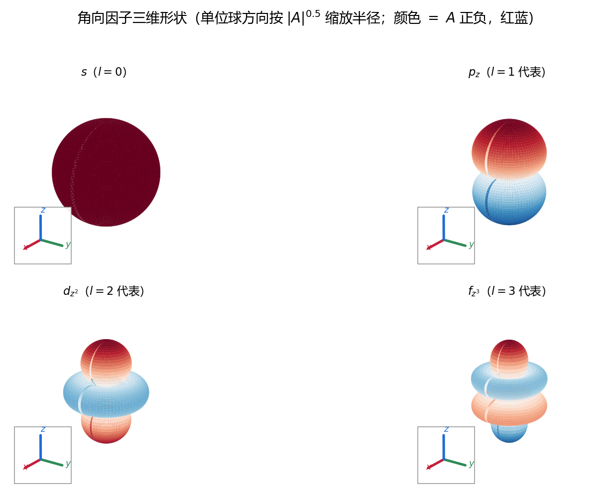

**$p$（简并度 3）**：

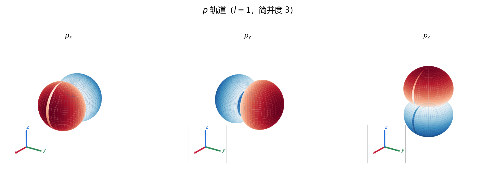

**$d$（简并度 5）**：

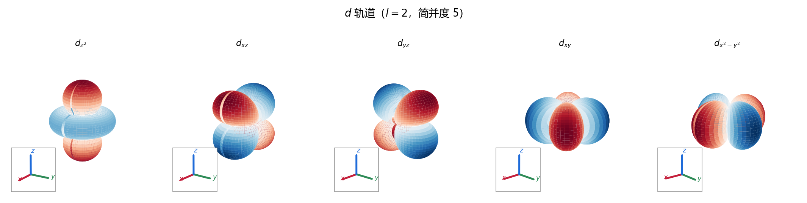

**$f$（简并度 7）**：

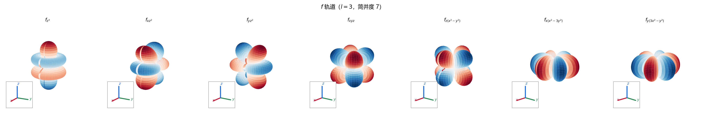

---

## 4. 图示：$s,p$ 与截面选择

下图使用 **$xz$ 平面**（$y=0$）与 **$xy$ 平面**（$z=0$）两种截面。注意：**$p_y \propto y$ 在 $y=0$ 截面上恒为 0**，因此观察 $p_y$ 应看 $xy$ 截面。

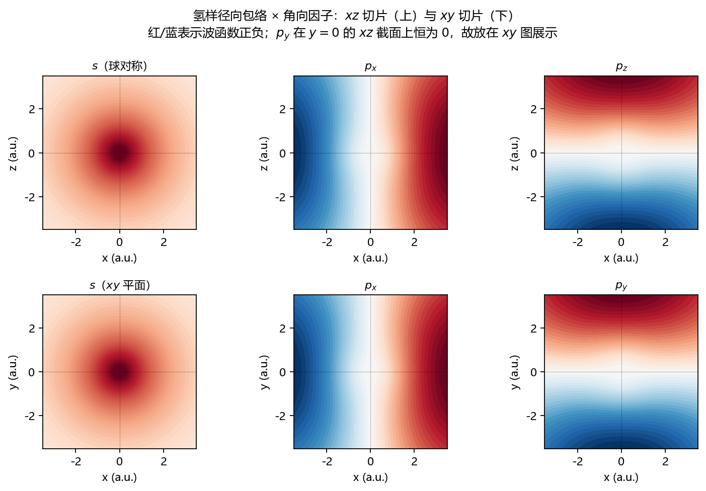

---

## 5. 图示：$d$ 轨道（实笛卡尔型）

$d$ 角向为 **二次齐次多项式**（乘以径向因子）。不同截面会突出不同分量：例如 $d_{xy}$ 在 $xy$ 平面最明显，而在 $xz$（$y=0$）截面上为 0。

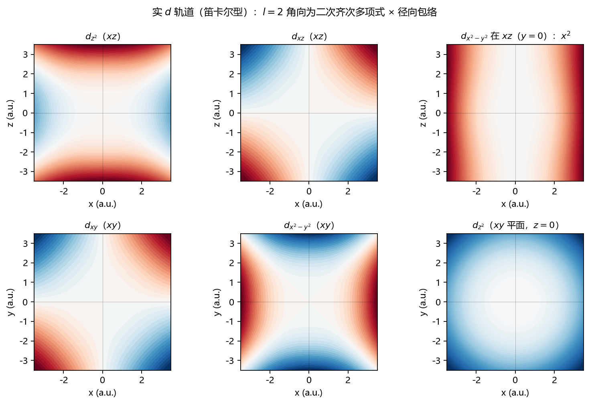

---

## 6. 图示：$f$ 轨道（实组合；混合截面）

$f$ 为 $l=3$，化学与量子化学程序中常用 **7 个实立方谐函数**（命名因文献略有差异，此处采用与 Gaussian 系程序常见的笛卡尔型命名一致的一类）。

**为何不能全是 $xz$（$y{=}0$）？** 三个分量 **整体含有因子 $y$**（因而写在 $xz$ 上时恒为 0）：

- $f_{yz^2} \propto y$；
- $f_{xyz} \propto xy$（在 $y{=}0$ 或 $x{=}0$ 或 $z{=}0$ 的坐标平面上都会消失，故用 **$x{=}y$ 斜面** $(u,u,z)$ 展示）；
- $f_{y(3x^2-y^2)} \propto y$。

若强行只画 $xz$，这三幅会变成 **全零截面**（`contourf` 看起来像空白），**不是程序出错**。当前图里对它们分别改用 **$yz$（$x{=}0$）**、**$x{=}y$**、**$xy$（$z{=}0$）** 切片，其余四个仍用 $xz$。

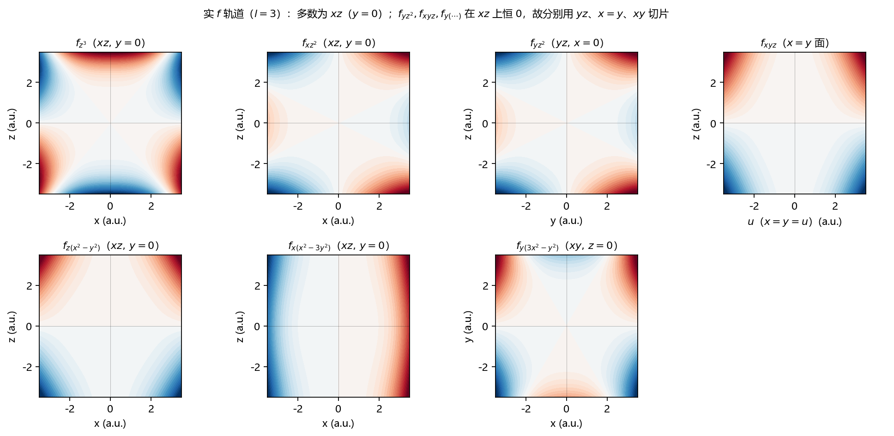

---

## 7. 杂化（hybridization）：$sp$，$sp^2$，$sp^3$

### 7.1 与 MO 理论的关系（重要）

**杂化不是哈密顿量的本征函数**：孤立原子的能量本征态仍按 $l$ 分类为 $s,p,d,\ldots$。  
杂化是 **同一原子价层子空间** 内，把 $s$ 与 $p$（有时含 $d$）做 **固定的幺正线性组合**，使每个杂化轨道 **指向特定几何方向**，便于与键轴对齐来解释 **VSEPR / 成键方向**。  
在完整的 LCAO–MO 计算中，**不必先声明杂化**：只要基组包含全部 $s,p,\ldots$，分子轨道会自行混合；杂化是 **同一线性空间** 的 **换基** 叙述。

### 7.2 常见组合（归一化，示意）

令原子价层有 $s,p_x,p_y,p_z$。

- **$\mathrm{sp}$**（直线，如炔烃 sp–C 的 $\sigma$ 框架常用此语言）：两个等价方向相反，例如

$$
h_\pm = \frac{1}{\sqrt{2}}\bigl(s \pm p_z\bigr)
$$

（键轴若沿 $z$。）

- **$\mathrm{sp}^2$**（平面三角，$120^\circ$）：三个杂化轨道在平面内互成 $120^\circ$，典型写法

$$
h_k = \frac{1}{\sqrt{3}}\Bigl(s + \sqrt{2}\bigl(\cos\theta_k\, p_x + \sin\theta_k\, p_y\bigr)\Bigr),\quad \theta_k = 0,\ \frac{2\pi}{3},\ \frac{4\pi}{3}.
$$

- **$\mathrm{sp}^3$**（四面体，如甲烷）：四个等价方向，例如

$$
\begin{aligned}
h_1 &= \tfrac{1}{2}(s+p_x+p_y+p_z),\\
h_2 &= \tfrac{1}{2}(s-p_x-p_y+p_z),\\
h_3 &= \tfrac{1}{2}(s-p_x+p_y-p_z),\\
h_4 &= \tfrac{1}{2}(s+p_x-p_y-p_z).
\end{aligned}
$$

### 7.3 图示

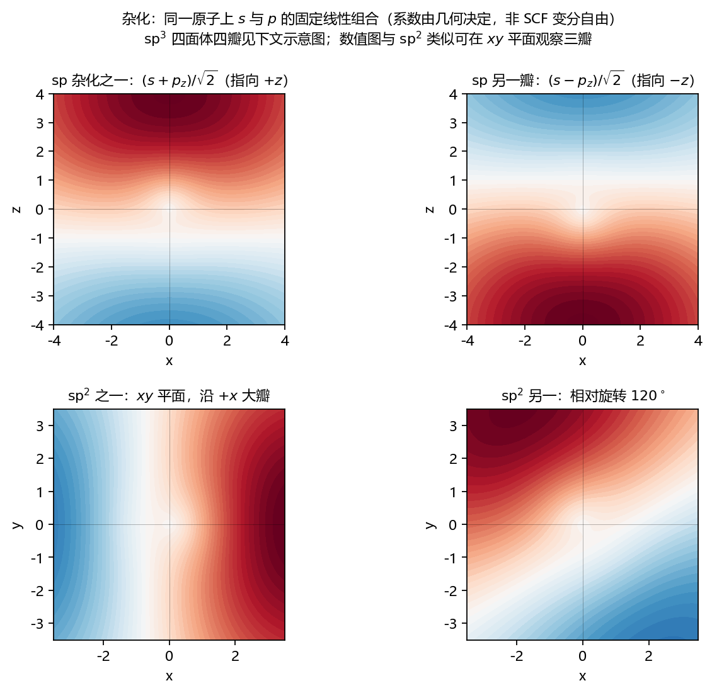

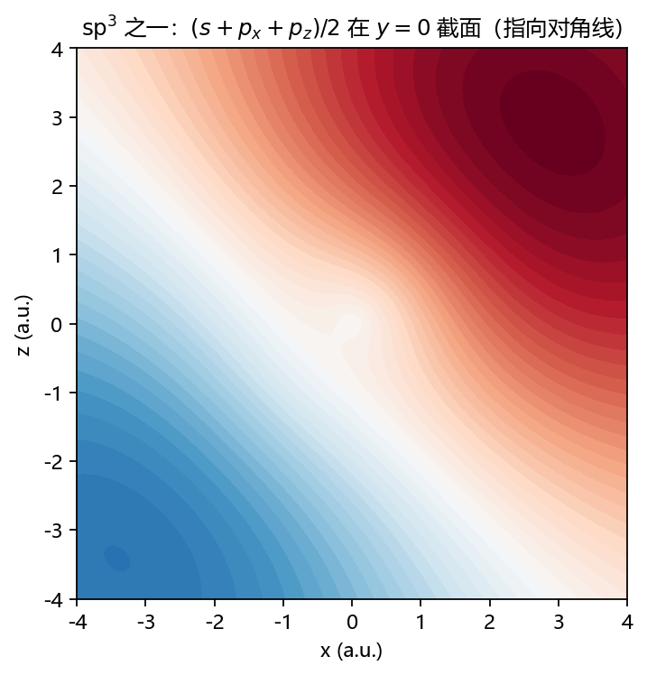

---

## 8. 与基组设计的对应（小结）

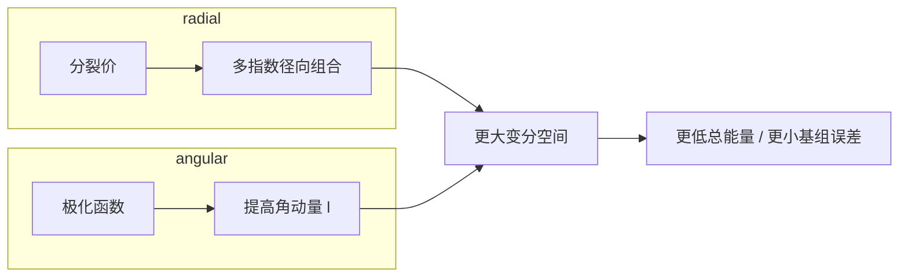

- **分裂价**：补 **径向多尺度**（紧/松），让 **同一 $l$** 的价层密度伸缩。  
- **极化函数**：补 **角向**，让中心密度响应 **非球对称势**。  
- **$s,p,d,f$ 与杂化**：描述 **AO 角向结构** 与 **价层指向性的化学语言**；数值 HF/DFT 中由 **基函数完备性与系数** 自动实现，不必手工指定杂化。

---

## 9. 重新生成插图

在目录 `PandM/materials/learning/classical-chem/script/` 下执行：

```bash
python generate_orbital_figures.py
python generate_orbital_3d_figures.py
```

输出目录：`script/assets/orbitals/`（相对 `classical-chem/`；二维与三维 PNG 均在此）。本文中的插图路径为 `../script/assets/orbitals/`（相对 `learning/`）。

---

## 参见

- 同目录总览笔记：[经典量子化学方法详解.md](./经典量子化学方法详解.md) **§2 基组**。
