# 经典量子化学方法详解

2026-04  
学习笔记 · 孙宏亮

---

## 说明

本文系统梳理 **经典（非量子计算）量子化学** 的主要近似方法——从 Hartree–Fock 到后 HF 波函数方法（CI、MBPT、Coupled Cluster、多参考），再到密度泛函理论（DFT），以及 **2020–2026 年的发展趋势**。目的是为 **量子计算化学** 的学习提供 **经典对标基线**：理解量子算法在做什么、替代什么、补充什么。

- 公式：行内 `$...$`；独立公式 `$$` 单独成行，**块末 `$$` 后空一行** 再接正文（与 `literature/` 目录译文/问答约定一致）。
- 术语首次出现附英文或缩写。
- 不追求推导完备，侧重 **直觉、层次、实践判断**。
- **AO（径向×球谐）→ LCAO 分子轨道 → 反对称化与 Slater 行列式 → FCI** 的公式衔接见 **§2.1** 小节「AO 的径向×球谐形式、Slater 行列式与 FCI」。
- 相关问答：[QA_EHF_Hartree-Fock_energy.md](../literature/QA_EHF_Hartree-Fock_energy.md)、[QA_classical_correlation_hard_cases.md](../literature/QA_classical_correlation_hard_cases.md)、[学习问答记录.md](../literature/学习问答记录.md) 条目 24、31、33–35。

---

# Part I：基础

---

## §1 电子结构问题：从薛定谔方程到近似

### 1.1 非相对论电子哈密顿量

在 **Born–Oppenheimer（BO）近似** 下，原子核位置固定（参数化），电子运动由 **电子哈密顿量** 决定（原子单位 $\hbar = m_e = e = 1$）：

$$
\hat{H}_{\mathrm{elec}} = \underbrace{-\frac{1}{2}\sum_{i=1}^{N}\nabla_i^2}_{\hat{T}_e} \underbrace{- \sum_{i=1}^{N}\sum_{A=1}^{M}\frac{Z_A}{r_{iA}}}_{\hat{V}_{ne}} \underbrace{+ \sum_{i<j}\frac{1}{r_{ij}}}_{\hat{V}_{ee}}
$$

三项依次为：电子动能 $\hat{T}_e$、核–电子吸引 $\hat{V}_{ne}$、电子–电子排斥 $\hat{V}_{ee}$。

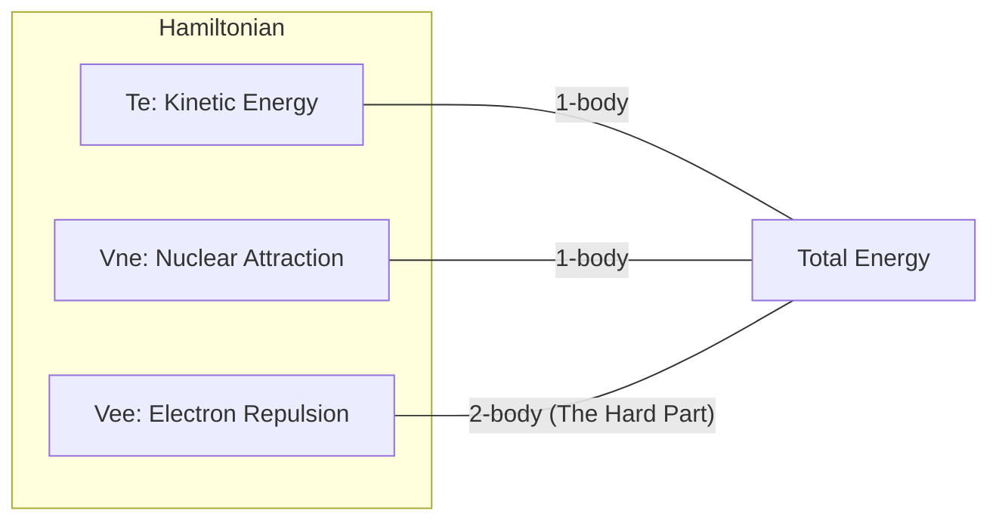

**图 1-1**：哈密顿量的结构。量子化学的所有近似本质上都是为了处理 **$\hat{V}_{ee}$（电子排斥项）**，因为它将所有电子的运动耦合在一起，使得方程无法分离变量。

### 1.2 为什么精确解不可行

#### Hilbert 空间的维度爆炸

在给定的有限基组（$K$ 个空间轨道 → $2K$ 个自旋轨道）下，电子薛定谔方程 **原则上** 可通过 **全组态相互作用（Full Configuration Interaction, FCI）** 精确求解：将波函数在所有可能的 $N$-电子 Slater 行列式构成的完备基中展开。

$$
|\Psi_{\mathrm{FCI}}\rangle = \sum_I c_I |\Phi_I\rangle
$$

#### FCI 维度公式

$N$ 个电子分布在 $K$ 个空间轨道中，其行列式总数（即 Hilbert 空间维数）为：

$$
D_{\mathrm{FCI}} = \binom{K}{N_\alpha} \times \binom{K}{N_\beta}
$$

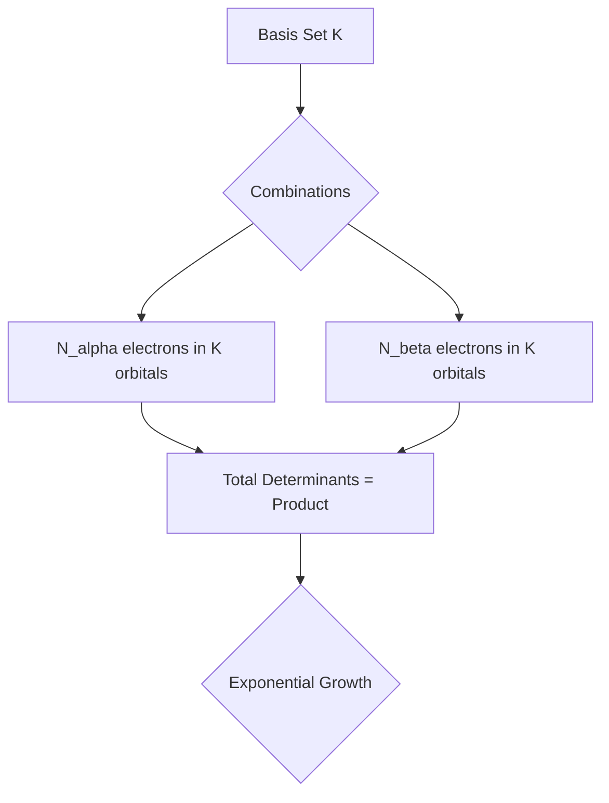

**图 1-2**：FCI 维度的组合爆炸。随着体系增大，存储哈密顿矩阵所需的内存 and 对角化所需的时间呈指数级增长。

#### 具体数值示例

| 分子 | 电子数 $N$ | 基组 | 空间轨道数 $K$ | FCI 维度 $D_{\mathrm{FCI}}$ | 难度级别 |
|:---|:---:|:---|:---:|:---:|:---|
| H₂ | 2 | STO-3G | 2 | 4 | 手算/入门 |
| H₂O | 10 | STO-3G | 7 | 441 | 笔记本秒算 |
| H₂O | 10 | cc-pVDZ | 24 | $\sim 1.8 \times 10^7$ | 工作站级 |
| H₂O | 10 | cc-pVTZ | 58 | $\sim 1.5 \times 10^{13}$ | 超算极限 |
| C₆H₆ | 42 | cc-pVDZ | 114 | $\sim 10^{51}$ | **指数墙** |

#### 近似的必然性

为了跨越“指数墙”，经典量子化学发展了四类主要策略：

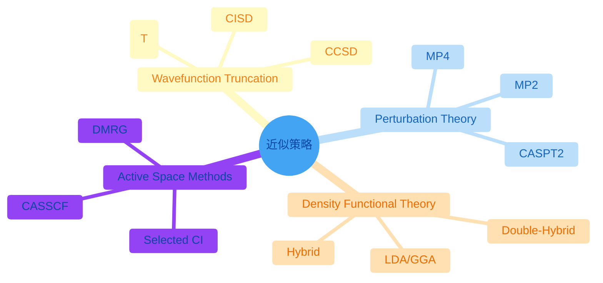

**图 1-3**：电子结构理论的近似版图（mindmap：`look: classic` 扁平样式无 neo 阴影；`base` 主题下 **浅红 / 浅黄 / 浅蓝 / 浅橙** 填充 + **深红 / 深橙 / 深蓝 / 深橙** 字与描边，根为浅蓝；`themeCSS` 去掉 `circle` 上 SVG `filter` 以免残留投影感）。

### 1.3 电子相关能

**相关能（Correlation Energy）** 定义为：

$$
E_{\mathrm{corr}} = E_{\mathrm{exact}} - E_{\mathrm{HF}}
$$

虽然相关能仅占总能量 of ~1%，但它决定了 **化学键的断裂与生成、激发态能级、弱相互作用** 等关键性质。

#### 动态相关 vs 静态相关

| 类型 | 物理图像 | 波函数特征 | 常用方法 |
|:---|:---|:---|:---|
| **动态相关**<br/>(Dynamic) | 电子间的“瞬时回避”，像舞池中跳舞的人互相躲闪。 | 单参考权重高，需大量小激发的叠加。 | MP2, CCSD(T) |
| **静态相关**<br/>(Static) | 轨道近简并，电子有多种等权重的排布方式。 | 多个行列式权重接近，单参考失效。 | CASSCF, DMRG |

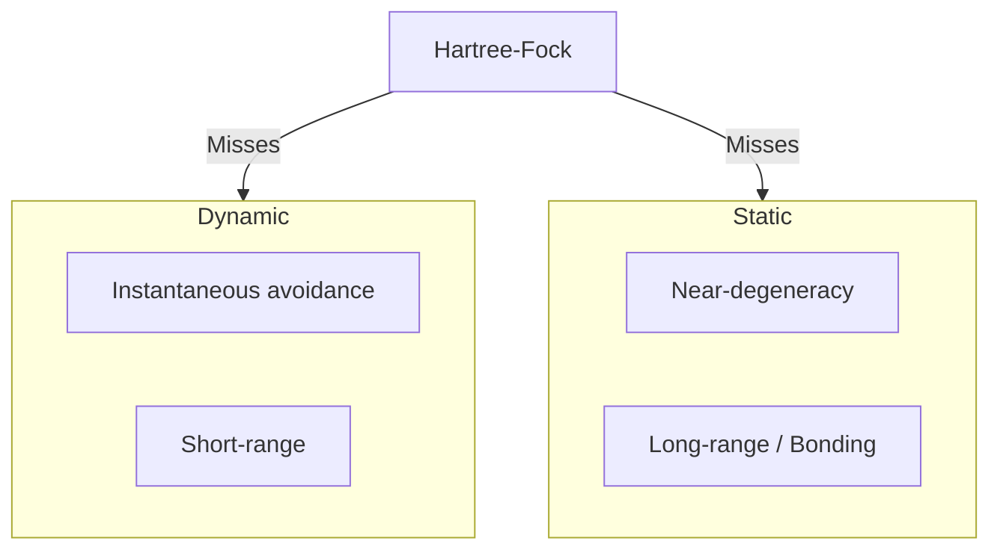

**图 1-4**：相关能的分类。HF 方法作为“平均场”，既忽略了电子的瞬时回避（动态），也无法描述多组态混合（静态）。

---

## §2 基组（Basis Sets）

### 2.1 为什么要基组：LCAO 近似

在计算机中，我们无法直接处理连续函数，必须将分子轨道（MO）投影到一组已知的原子轨道（AO）基函数上：

$$
\phi_i(\mathbf{r}) = \sum_{\mu=1}^{K} C_{\mu i}\, \chi_\mu(\mathbf{r})
$$

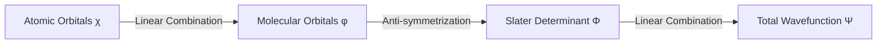

**图 2-1**：从原子轨道到总波函数的构建层次。

### 2.2 STO 与 GTO 的博弈

| 特性 | Slater 型 (STO) | Gaussian 型 (GTO) |
|:---|:---|:---|
| **形式** | $e^{-\zeta r}$ | $e^{-\alpha r^2}$ |
| **物理正确性** | 高（核处有尖峰，远程衰减对） | 低（核处平滑，远程衰减快） |
| **计算效率** | 极低（多中心积分无解析解） | **极高**（高斯乘积定理） |

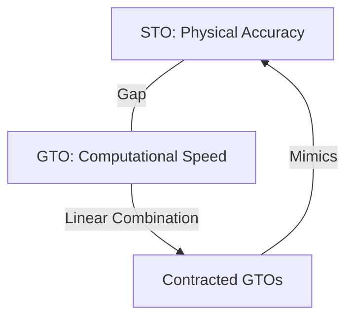

**图 2-2**：收缩高斯函数（CGTO）的逻辑：用多个计算极快的 GTO 叠加来模拟物理正确的 STO。

### 2.3 基组的层级：从极小基到 CBS

```mermaid
stack
    title Basis Set Hierarchy
    CBS[Complete Basis Set Limit]
    5Z[5-zeta: cc-pV5Z]
    QZ[Quadruple-zeta: cc-pVQZ]
    TZ[Triple-zeta: 6-311G, cc-pVTZ]
    DZ[Double-zeta: 6-31G, cc-pVDZ]
    Min[Minimal: STO-3G]
```

**图 2-3**：基组的系统性改进路径。

#### 分裂价、极化与 AO 角向（扩展阅读）

分裂价与极化函数的 **更细直觉**、与 **$\mathrm{s,p,d,f}$ 轨道及 $\mathrm{sp,sp^2,sp^3}$ 杂化** 的配图说明，见同目录专文：**[分裂价极化与原子轨道杂化.md](./分裂价极化与原子轨道杂化.md)**（含可重生成插图脚本 `generate_orbital_figures.py`）。

---

## §3 Hartree–Fock（HF）方法

从电子哈密顿量到 Roothaan 方程、SCF 循环的 **逐步公式推导** 见专文：**[Hartree-Fock理论推导与算法.md](./Hartree-Fock理论推导与算法.md)**。

### 3.1 核心思想：平均场 + 单行列式

HF 将 $N$ 电子波函数限制为 **单个 Slater 行列式**（反对称乘积态）：

$$
\lvert\Phi_{\mathrm{HF}}\rangle = \lvert\phi_1 \phi_2 \cdots \phi_N\rangle_{\mathrm{det}}
$$

坐标表象下 $\Phi_{\mathrm{HF}}(\mathbf{x}_1,\ldots,\mathbf{x}_N)=\frac{1}{\sqrt{N!}}\det[\psi_i(\mathbf{x}_j)]$ 与 **§2.1**（反对称化算符 $\mathcal{A}$、Hartree 积）一致；$\psi_i$ 为自旋轨道，$\phi_i$ 为 MO 的空间因子。

$$
E_{\mathrm{HF}} = \langle\Phi_{\mathrm{HF}}\lvert\hat{H}\rvert\Phi_{\mathrm{HF}}\rangle
$$

对于闭壳层 RHF，还可写成更“能量分项”的形式：

$$
E_{\mathrm{RHF}} = 2\sum_i h_{ii} + \sum_{ij}\bigl(2J_{ij}-K_{ij}\bigr)
$$

其中

$$
h_{ii}=\langle i\lvert \hat{h}\rvert i\rangle,\qquad
J_{ij}=(ii\vert jj),\qquad
K_{ij}=(ij\vert ji)
$$

这里 $h_{ii}$ 是单电子动能 + 核吸引，$J_{ij}$ 是经典 Coulomb 排斥，$K_{ij}$ 是由反对称性强制出现的交换项。这个公式很值得记，因为它把 HF 的物理图像压缩成一句话：**HF = 单电子项 + 平均 Coulomb 场 + 交换修正**。

**从变分到单电子方程**：在单行列式约束下对轨道变分（保持正交归一），驻点条件即 **Hartree–Fock 方程**。**正则轨道** $\{\psi_i\}$ 满足同一形式的 **有效单电子方程**

$$
\hat{f}\,\psi_i = \varepsilon_i \psi_i
$$

**Fock 算符** $\hat{f}$ 只作用在 **一个** 电子的坐标上：动能 + 核吸引 + 由 **全体占据轨道** 构造的势。也就是说：多体问题在 HF 中被代换成「每个电子都在同一个 **自洽** 有效哈密顿量 $\hat{f}$ 里求本征态」——这正是 **平均场** 的数学含义：**不显式跟踪** 每一对电子的瞬时 $1/r_{ij}$，而用 **整体电荷分布** 生成单电子感受到的势。

**为何叫「平均」**：库仑项用电子密度 $\rho(\mathbf{r}')=\sum_{j}^{\mathrm{occ}}|\psi_j(\mathbf{r}')|^2$ 形成经典型势（如 $J(\mathbf{r})=\int \rho(\mathbf{r}')/|\mathbf{r}-\mathbf{r}'|\,d\mathbf{r}'$），相当于把其余电子的 **概率分布抹成密度** 再作用；同自旋的 **交换项** 与反对称单行列式一致，并抵消库仑自相互作用。$\hat{f}$ 依赖 $\{\psi_i\}$，故需 **SCF 迭代** 至自洽。

**需避免的误解**：此处的「等价」是 **HF 变分 ⟺ 自洽 Fock 方程 ⟺ 平均场单粒子图像**；**不** 表示与真实多体动力学或 **相关能**（超越平均场的部分）等价，后者需 CI/CC 等（§1.3、§4 以后）。

### 3.2 Fock 算符与 Roothaan–Hall 方程

对闭壳层（RHF），令 $\mathbf{F}$ 为 **Fock 矩阵**（在 AO 基下），$\mathbf{S}$ 为重叠矩阵：

$$
\mathbf{F}\mathbf{C} = \mathbf{S}\mathbf{C}\boldsymbol{\varepsilon}
$$

其中 $\mathbf{C}$ 为分子轨道系数矩阵，$\boldsymbol{\varepsilon}$ 为轨道能量对角矩阵。

Fock 矩阵：

$$
F_{\mu\nu} = h_{\mu\nu} + \sum_{\lambda\sigma} P_{\lambda\sigma}\Bigl[(\mu\nu\vert\lambda\sigma) - \tfrac{1}{2}(\mu\lambda\vert\nu\sigma)\Bigr]
$$

若写成“算符作用”形式，单个自旋轨道满足

$$
\hat{f}(1) = \hat{h}(1) + \sum_{j}^{\mathrm{occ}}\bigl[\hat{J}_j(1)-\hat{K}_j(1)\bigr]
$$

其中 Coulomb 与 exchange 算符分别对任意试探轨道 $\varphi(1)$ 作用为

$$
\hat{J}_j(1)\varphi(1)=\left[\int \frac{|\psi_j(2)|^2}{r_{12}}\,d2\right]\varphi(1)
$$

$$
\hat{K}_j(1)\varphi(1)=\left[\int \frac{\psi_j^*(2)\varphi(2)}{r_{12}}\,d2\right]\psi_j(1)
$$

这两式特别能说明 **HF 为什么是平均场但又不只是经典静电学**：$\hat{J}$ 像“由电子密度抹开的平均排斥势”，而 $\hat{K}$ 则是纯量子力学的交换非局域作用，它没有经典对应物。

第一项 $h_{\mu\nu}$ 是单电子（动能+核吸引）积分；第二项是 **Coulomb 减 Exchange** 的双电子贡献，依赖密度矩阵 $P_{\lambda\sigma}$。

### 3.3 SCF 迭代

由于 $\mathbf{F}$ 依赖 $\mathbf{P}$（即 $\mathbf{C}$），必须 **自洽场（Self-Consistent Field, SCF）** 迭代：

1. 初猜密度矩阵 $\mathbf{P}^{(0)}$
2. 构造 $\mathbf{F}^{(k)}$
3. 解广义本征值问题 → $\mathbf{C}^{(k)},\boldsymbol{\varepsilon}^{(k)}$
4. 更新 $\mathbf{P}^{(k+1)}$
5. 判断收敛（能量变化、密度变化 < 阈值）；未收敛则回到步骤 2

实际程序中常用 **DIIS（Direct Inversion in the Iterative Subspace）** 加速收敛。

```mermaid
flowchart TD
    A[Initial guess density P0] --> B[Build Fock matrix F[P]]
    B --> C[Solve FC = SCe]
    C --> D[Update orbitals and density]
    D --> E{Converged?}
    E -- No --> B
    E -- Yes --> F[HF stationary point]
```

**图 3-1**：SCF 的本质是一个非线性不动点问题。因为 Fock 矩阵依赖密度，而密度又来自 Fock 方程的本征矢，所以必须“猜测 -> 生成有效势 -> 重新解轨道 -> 更新密度”循环到自洽。

### 3.4 RHF / UHF / ROHF

| 变体 | 适用 | 轨道限制 |
|------|------|----------|
| **RHF**（Restricted HF） | 闭壳层（所有电子成对） | $\alpha,\beta$ 共享空间轨道 |
| **UHF**（Unrestricted HF） | 开壳层、键断裂 | $\alpha,\beta$ 独立优化 |
| **ROHF**（Restricted Open-shell HF） | 开壳层但要求自旋本征态 | 已占轨道受限，开壳层有特殊处理 |

**UHF 的自旋污染（spin contamination）**：UHF 波函数不是 $\hat{S}^2$ 的本征态，$\langle S^2\rangle$ 偏离目标值，可能导致能量与性质偏差。

### 3.5 HF 捕捉了什么、遗漏了什么

| HF 包含 | HF 遗漏 |
|---------|---------|
| 动能 | 动态相关（瞬时电子回避） |
| 核–电子吸引 | 静态相关（多组态混合） |
| 经典 Coulomb 排斥（平均场） | 色散 / van der Waals |
| **交换**（Fermi 洞，同自旋排斥） | Coulomb 洞（异自旋相关） |

### 3.6 重要定理

- **Brillouin 定理**：在 RHF 收敛轨道下，$\langle\Phi_0\lvert\hat{H}\rvert\Phi_i^a\rangle = 0$（HF 与单激发之间的哈密顿矩阵元为零）。因此 **相关能的一阶修正来自双激发**（MP2 里只有双激发项对能量有贡献）。
- **Koopmans 定理**：HF 轨道能 $\varepsilon_i \approx -\mathrm{IP}_i$（第 $i$ 占据轨道的电离能），前提是忽略轨道弛豫和相关效应。是 **粗估** 电离势/电子亲和势的快速工具。

### 3.7 计算标度

| 步骤 | 标度 |
|------|------|
| 双电子积分生成 | $O(K^4)$（$K$ 为基函数数） |
| Fock 矩阵构建 + 对角化 | $O(K^3)$–$O(K^4)$ |
| 典型 SCF 总成本 | 常记为 $O(N^3)$–$O(N^4)$ |

---

## §4 组态相互作用（Configuration Interaction, CI）

### 4.1 基本思想

在 HF 给出的 **分子轨道** 基下，将多电子波函数写成 **所有可能 Slater 行列式的线性组合**：

$$
|\Psi_{\mathrm{CI}}\rangle = c_0|\Phi_0\rangle + \sum_{ia} c_i^a|\Phi_i^a\rangle + \sum_{ijab} c_{ij}^{ab}|\Phi_{ij}^{ab}\rangle + \cdots
$$

其中 $|\Phi_0\rangle$ 为 HF 参考，$|\Phi_i^a\rangle$ 表示从占据轨道 $i$ 到虚轨道 $a$ 的 **单激发**，$|\Phi_{ij}^{ab}\rangle$ 为 **双激发**，以此类推。

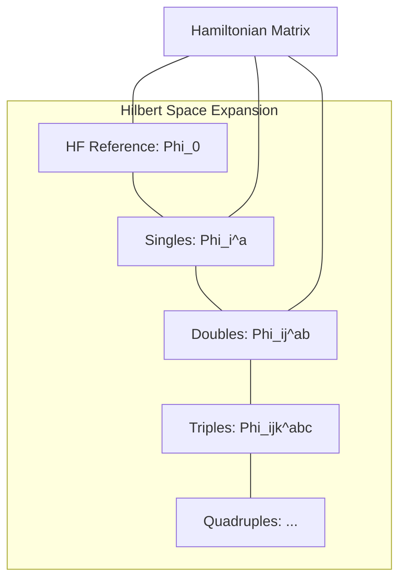

**图 4-1**：CI 方法的变分空间。通过在 HF 参考态上叠加不同激发阶的行列式，逐步恢复电子相关。

然后在哈密顿矩阵 $H_{IJ} = \langle\Phi_I|\hat{H}|\Phi_J\rangle$ 中对角化求最低本征值与本征矢量。

### 4.2 Full CI（FCI）

若包含 **所有** 可能的激发（直到 $N$ 重激发），即 **Full CI（FCI）**，它在 **给定基组** 下给出 **精确解**（数值精确，仍受基组截断限制）。

$$
\dim(\text{FCI}) = \binom{K}{N_\alpha}\binom{K}{N_\beta}
$$

对 $K=100, N=20$ 量级，FCI 维度已达天文数字，实际只能用于 **极小体系**（几个电子 + 极小基）。

### 4.3 截断 CI：CIS, CISD, CISDT...

实际常截断到某一激发阶：

| 方法 | 包含激发 | 标度 | 说明 |
|:---|:---|:---|:---|
| **CIS** | 单激发 | $O(K^4)$ | 常用于激发态（但基态无改进：Brillouin） |
| **CISD** | 单+双激发 | $O(K^6)$ | 最常用的截断 CI 方法 |
| **CISDT** | 单+双+三重 | $O(K^8)$ | 很贵，较少用 |

### 4.4 CI 的致命缺陷：大小一致性问题

**截断 CI 不满足大小一致性（size-consistency）**：对两个无相互作用的子系统 A 和 B，

$$
E_{\mathrm{CISD}}(A+B) \neq E_{\mathrm{CISD}}(A) + E_{\mathrm{CISD}}(B)
$$

原因：CISD 对 A+B 联合体系只包含「联合 S+D」，而 A 的双激发 $\times$ B 的双激发 = 联合四重激发，被截掉了。这导致截断 CI 在描述大体系或解离过程时存在本质缺陷。

**Davidson 校正（+Q）** 可 **近似** 补偿该误差：

$$
\Delta E_Q \approx (1 - c_0^2)\,(E_{\mathrm{CISD}} - E_{\mathrm{HF}})
$$

### 4.5 Selected CI（选择性 CI）

近年发展的 **Selected CI** 方法不是按激发阶截断，而是 **自适应选择** 最重要的行列式：

- **CIPSI**（Configuration Interaction using a Perturbative Selection made Iteratively）
- **HCI**（Heat-Bath CI）
- **SHCI**（Semistochastic HCI）
- **ASCI**（Adaptive Sampling CI）

这些方法可以处理比传统 FCI 更大的活性空间（可达 ~50 轨道），是 **经典端逼近 FCI 的现代利器**。

---

## §5 多体微扰理论（MBPT / Møller–Plesset）

### 5.1 Rayleigh–Schrödinger 微扰论思路

将哈密顿量分解为 **零阶**（可解）+ **微扰**：

$$
\hat{H} = \hat{H}_0 + \lambda\hat{V}
$$

在 Møller–Plesset（MP）划分中，$\hat{H}_0$ 取为 **Fock 算符之和**（$\hat{H}_0 = \sum_i \hat{f}(i)$），微扰 $\hat{V} = \hat{H} - \hat{H}_0$ 是双电子排斥减去 HF 平均场的 **波动势（fluctuation potential）**。

### 5.2 MP2：最常用的微扰

**二阶 Møller–Plesset（MP2）** 能量修正：

$$
E^{(2)} = \sum_{i<j}^{\mathrm{occ}}\sum_{a<b}^{\mathrm{vir}} \frac{|\langle ij \| ab\rangle|^2}{\varepsilon_i + \varepsilon_j - \varepsilon_a - \varepsilon_b}
$$

其中 $\langle ij \| ab\rangle$ 为 **反对称化双电子积分**，$\varepsilon$ 为 HF 轨道能量。

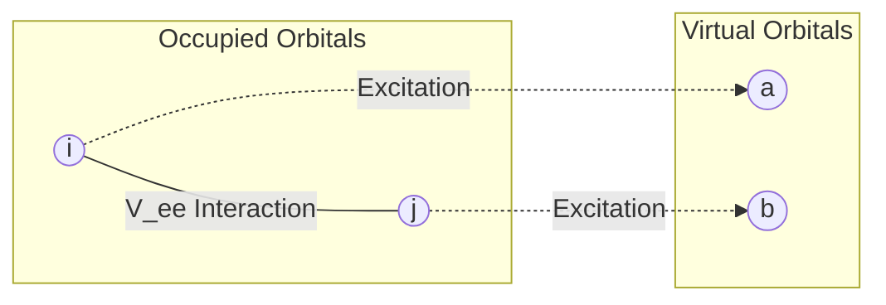

**图 5-1**：MP2 的物理图像。电子对 $(i,j)$ 通过瞬时排斥作用，同时激发到虚轨道 $(a,b)$。MP2 是相关能的第一个非零修正（一阶修正为零）。

**关键要点**：
- 标度：**$O(N^5)$** ——比 HF 贵，但远比 CCSD 便宜。
- MP2 通常恢复 **60–80%** 的相关能。
- 适合弱关联闭壳层分子；在小能隙体系容易失效。

### 5.3 MP3, MP4 与收敛性

| 阶 | 标度 | 说明 |
|:---|:---|:---|
| **MP3** | $O(N^6)$ | 修正不大，性价比一般 |
| **MP4** | $O(N^7)$ | 包含三重激发（MP4(SDTQ)），精度较高 |

**收敛性问题**：MP 展开 **不保证收敛**。对强关联或 UHF 自旋污染严重的情形，MP 序列可能振荡甚至发散。

---

## §6 耦合簇理论（Coupled Cluster, CC）

### 6.1 核心思想：指数 ansatz

耦合簇将波函数写为 **指数形式**：

$$
|\Psi_{\mathrm{CC}}\rangle = e^{\hat{T}}|\Phi_0\rangle = (1 + \hat{T} + \frac{1}{2}\hat{T}^2 + \cdots)|\Phi_0\rangle
$$

其中 $\hat{T} = \hat{T}_1 + \hat{T}_2 + \cdots$。指数展开会自动产生 **非连接激发（disconnected excitations）**，如 $\hat{T}_2^2/2!$ 产生的四重激发。

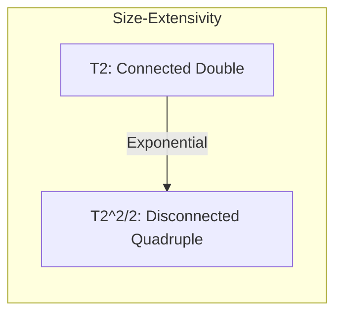

**图 6-1**：CC 的指数逻辑。通过低阶算符的幂次自动包含高阶激发，从而保证了 **大小延展性（size-extensivity）**：能量随粒子数线性增加。

### 6.2 常用截断与“金标准”

| 方法 | 算符包含 | 标度 | 说明 |
|:---|:---|:---|:---|
| **CCSD** | $\hat{T}_1 + \hat{T}_2$ | $O(N^6)$ | 现代标准水平 |
| **CCSD(T)** | CCSD + 三重激发微扰 | $O(N^7)$ | **“金标准”**，化学精度的标杆 |
| **CCSDT** | $\hat{T}_1+\hat{T}_2+\hat{T}_3$ | $O(N^8)$ | 极贵，用于基准测试 |

### 6.3 CC 的局限

- **非变分**：能量可能低于 FCI（无下界保证）。
- **单参考前提**：若 HF 参考权重不高（强关联），CC 结果不可靠。

### 6.7 激发态：EOM-CCSD

**Equation-of-Motion CCSD（EOM-CCSD）** 在 CC 基态之上，用线性算符 $\hat{R}$ 描述激发态：

$$
\lvert\Psi_k\rangle = \hat{R}_k\, e^{\hat{T}}\lvert\Phi_0\rangle
$$

对 $\bar{H}$ 做非对称本征问题，给出激发能和跃迁性质。EOM-CCSD 是 **单参考激发态** 最系统的波函数方法之一，标度同 CCSD（$O(N^6)$），但对 **双激发占主导** 的态效果差。

---

## §7 多参考方法（Multi-Reference Methods）

### 7.1 为什么需要多参考

当 **多个行列式以相近权重参与基态** 时（如键断裂、过渡金属、双自由基），单参考方法（HF, MP2, CC）的起点即错误。

### 7.2 CASSCF（Complete Active Space SCF）

**CASSCF** 同时优化 **CI 系数** 和 **分子轨道**。

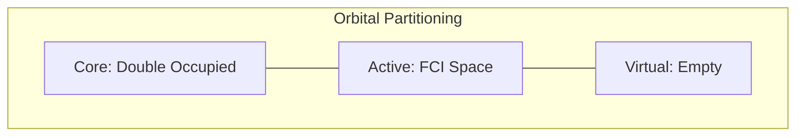

**图 7-1**：活性空间（Active Space）示意图。CASSCF 在活性空间内做完全 CI，捕捉 **静态相关**。

### 7.3 动态相关的补充：CASPT2 与 NEVPT2

CASSCF 遗漏了活性空间外的 **动态相关**，需后续修正：

| 方法 | 特点 |
|:---|:---|
| **CASPT2** | 以 CASSCF 为零阶做 2 阶微扰；最常用 but 有入侵态问题。 |
| **NEVPT2** | 严格无入侵态，更稳健；现代程序推荐。 |
| **MRCI** | 多参考 + SD 激发；最系统 but 标度极高。 |

### 7.4 DMRG（Density Matrix Renormalization Group）

**DMRG** 可作为 **大活性空间（~100 轨道）** 的 FCI 求解器，突破了传统 CASSCF (~18 轨道) 的限制，是处理复杂过渡金属体系的核心工具。

| 方法 | 思路 | 优缺点 |
|------|------|--------|
| **CASPT2**（Complete Active Space Perturbation Theory, 2nd order） | 以 CASSCF 为零阶做 2 阶微扰 | 最常用；有入侵态（intruder state）问题，需 IPEA shift 等 |
| **NEVPT2**（N-Electron Valence Perturbation Theory） | 类似 CASPT2 但严格无入侵态 | 更稳健；OpenMolcas、PySCF 均支持 |
| **MRCI**（Multi-Reference CI） | 多参考 + SD 激发 | 最系统但标度高；需 Davidson +Q 校正大小一致性 |
| **ic-MRCC**（internally contracted MRCC） | 多参考耦合簇 | 理论最优雅但实现极复杂 |

### 7.5 态平均 CASSCF（SA-CASSCF）

当关心 **多个能量接近的电子态**（如激发态排序、圆锥交叉），单态优化可能导致 **根翻转** 或轨道对其他态不均衡。**态平均 CASSCF** 对若干态的能量加权平均后统一优化轨道：

$$
E_{\mathrm{SA}} = \sum_{k=1}^{n_{\mathrm{states}}} w_k\, E_k(\mathbf{C}_{\mathrm{MO}})
$$

### 7.6 DMRG（Density Matrix Renormalization Group）

**DMRG** 是 **张量网络方法** 在一维/准一维系统中的高效变体。在量子化学中，DMRG 可作为 **替代 FCI 的活性空间求解器**，处理 **传统 CASSCF 无法企及的大活性空间**（50–100 轨道）。

核心参数是 **键维度（bond dimension）** $M$：$M$ 越大越精确，但成本 $\sim O(K^3 M^3)$ 或 $O(K^4 M^2)$ 量级。

DMRG-SCF = DMRG 替代 FCI + 轨道优化. 后接 DMRG-CASPT2 / DMRG-NEVPT2 可补动态相关.

### 7.7 多参考方法与量子计算的衔接

多参考方法的核心瓶颈是 **活性空间内的 FCI 指数爆炸**——正是量子计算最有可能提供价值的地方。在 **嵌入 + 量子求解器** 框架中（如 DMET + VQE/SQD），量子处理器充当 **活性空间内的 FCI 求解器**，经典端负责轨道选择、嵌入构造和动态相关。详见 [量子计算-QC-ppt.md](../literature/量子计算-QC-ppt.md) §10 与 [学习问答记录.md](../literature/学习问答记录.md) 条目 33–34。

---

## §8 DFT 理论基础

### 8.1 从波函数到电子密度

波函数方法的变量是 $3N$ 维的多电子波函数 $\Psi(\mathbf{r}_1,\ldots,\mathbf{r}_N)$。DFT 的核心思想：**电子密度** $\rho(\mathbf{r})$ 作为基本变量（3 维函数）**原则上足以确定** 基态的一切性质。

$$
\rho(\mathbf{r}) = N\int |\Psi(\mathbf{r},\mathbf{r}_2,\ldots,\mathbf{r}_N)|^2\, d\mathbf{r}_2\cdots d\mathbf{r}_N
$$

### 8.2 Hohenberg–Kohn 定理

**第一定理（存在性）**：外势 $v_{\mathrm{ext}}(\mathbf{r})$ 与基态密度 $\rho_0(\mathbf{r})$ 之间存在 **一一对应**。因此基态能量是密度的 **唯一泛函**：

$$
E[\rho] = T[\rho] + V_{\mathrm{ee}}[\rho] + \int v_{\mathrm{ext}}(\mathbf{r})\,\rho(\mathbf{r})\,d\mathbf{r}
$$

**第二定理（变分原理）**：对任何试探密度 $\tilde{\rho}$（满足 $\int\tilde{\rho}=N$）：

$$
E[\tilde{\rho}] \ge E_0
$$

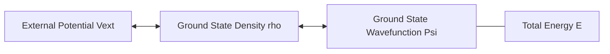

**图 8-1**：Hohenberg–Kohn 定理的逻辑映射。电子密度包含了构建哈密顿量所需的所有信息，从而决定了体系的所有性质。

### 8.3 Kohn–Sham 方案

Kohn–Sham（KS）引入一个 **虚拟的无相互作用参考体系**，其密度与真实体系 **完全相同**：

$$
\rho(\mathbf{r}) = \sum_{i=1}^{N} |\phi_i^{\mathrm{KS}}(\mathbf{r})|^2
$$

能量泛函重组为：

$$
E[\rho] = T_s[\rho] + J[\rho] + E_{\mathrm{xc}}[\rho] + \int v_{\mathrm{ext}}\,\rho\,d\mathbf{r}
$$

其中 $E_{\mathrm{xc}}[\rho]$ 是 **交换–相关泛函**，包含所有未知的复杂相互作用。

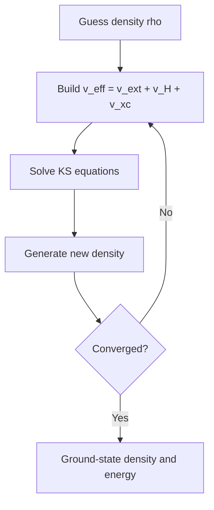

**图 8-2**：KS-DFT 的自洽场（SCF）流程。

### 8.4 自相互作用误差（SIE）

在 DFT 中，近似 $E_{\mathrm{xc}}$ 不能精确抵消 $J[\rho]$ 中的自排斥部分，导致 **自相互作用误差（SIE）**。这是 DFT 许多系统性偏差（如能垒偏低、带隙偏小）的根源。

---

## §9 交换–相关泛函：Jacob's Ladder

John Perdew 提出的 **Jacob's ladder**（雅各布天梯）按泛函依赖的信息量从少到多分为五阶：

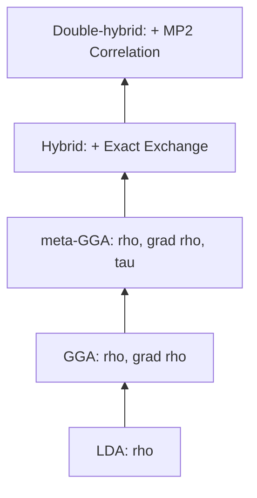

**图 9-1**：Jacob's ladder。每一阶都引入了更多的物理信息，理论上精度逐步提高。

### 9.1 常用泛函分类

| 阶层 | 代表泛函 | 特点 |
|:---|:---|:---|
| **LDA** | SVWN | 均匀电子气模型，分子计算中已少用 |
| **GGA** | PBE, BLYP | 引入密度梯度，固体与大体系常用 |
| **meta-GGA** | SCAN, M06-L | 引入动能密度，精度优于 GGA |
| **Hybrid** | B3LYP, PBE0 | 混合 HF 交换，有机化学的通用选择 |
| **Double-Hybrid** | B2PLYP, XYG3 | 包含 MP2 相关，精度接近 CCSD(T) |

### 9.2 色散校正（Dispersion Correction）

标准 DFT 无法描述 van der Waals 力。常用 **Grimme 的 DFT-D3/D4** 校正：

$$
E_{\mathrm{total}} = E_{\mathrm{DFT}} + E_{\mathrm{disp}}
$$

这对于描述分子间相互作用（如 $\pi-\pi$ 堆积、蛋白质折叠）至关重要。

---

## §10 DFT 实践指南

### 10.1 方法选择建议

| 场景 | 推荐泛函 | 理由 |
|:---|:---|:---|
| **有机反应** | ωB97X-D, M06-2X | 包含色散与高比例交换，能垒准确 |
| **大规模固体** | PBE, SCAN | 效率高，结构描述好 |
| **激发态 (TDDFT)** | CAM-B3LYP | 范围分离泛函改善电荷转移态 |
| **过渡金属** | PBE0, TPSSh | 杂化泛函缓解离域误差 |

### 10.2 TDDFT（含时 DFT）

**含时密度泛函理论（TDDFT）** 是计算激发态的主流方法。其核心是求解 **Casida 方程**：

$$
\begin{pmatrix} \mathbf{A} & \mathbf{B} \\ \mathbf{B}^* & \mathbf{A}^* \end{pmatrix} \begin{pmatrix} \mathbf{X} \\ \mathbf{Y} \end{pmatrix} = \omega \begin{pmatrix} \mathbf{1} & \mathbf{0} \\ \mathbf{0} & -\mathbf{1} \end{pmatrix} \begin{pmatrix} \mathbf{X} \\ \mathbf{Y} \end{pmatrix}
$$

这允许我们获得激发能 $\omega$ 和振子强度。

```mermaid
graph TD
    GS[Ground State Density rho_0] --> |"Time-dependent Potential v(t)"| TDS[Time-dependent Density rho(t)]
    TDS --> |"Linear Response"| Exc[Excited States / Spectra]
```

**图 10-1**：TDDFT 的物理逻辑。通过密度对随时间变化的外场的响应来获取激发态信息。

---

# Part IV：层次、对比与现代发展

---

## §11 方法层次与决策

### 11.1 Pople 图（精度 vs 成本）

方法精度大致遵循 **Pople 图** 的双轴框架：

- **纵轴**：方法层次（HF → MP2 → CCSD → CCSD(T) → FCI）
- **横轴**：基组大小（STO-3G → DZ → TZ → QZ → CBS）

精度随两个方向的提升而提高，最终收敛到 **非相对论 BO 精确解**。

```mermaid
flowchart LR
    A[Small basis + low-level method] --> B[DZ/TZ + MP2 or hybrid DFT]
    B --> C[Large basis + CCSD(T)]
    C --> D[CBS / benchmark limit]
    E[DFT path] --> F[Accuracy depends on functional, not monotonic ladder]
```

**图 11-1**：Pople 图。理解两种独立改进方向：一是扩大一电子空间（基组），二是优化多电子相关（方法）。

### 11.2 方法对照表

| 方法 | 标度 | 大小一致 | 变分 | 适用 | 典型精度 |
|:---|:---|:---|:---|:---|:---|
| **HF** | $O(N^4)$ | 是 | 是 | 起点/参考 | 无相关，差 |
| **MP2** | $O(N^5)$ | 是 | 否 | 弱关联闭壳层 | ~80% 相关能 |
| **CCSD** | $O(N^6)$ | 是 | 否 | 中等精度 | ~95% 相关能 |
| **CCSD(T)** | $O(N^7)$ | 是 | 否 | **金标准** | ~1 kcal/mol |
| **FCI** | $\exp(N)$ | 是 | 是 | 小体系 | 精确（基组内） |
| **DFT** | $O(N^3)$ | 是 | 否 | 大体系、材料 | 泛函依赖 |

### 11.3 方法选择决策树

```mermaid
graph TD
    Start[Choose Method] --> Main[Main Group?]
    Main -->|Yes| SingleRef[Single Reference?]
    SingleRef -->|Yes| Quick[Quick/Large?]
    Quick -->|Yes| DFT[DFT: B3LYP-D3, wB97X-D]
    Quick -->|No| Gold[Gold Standard: CCSD(T)/CBS]
    SingleRef -->|No| MultiRef[Multi-Reference: CASSCF + NEVPT2]
    Main -->|No| Metal[Transition Metal?]
    Metal -->|Yes| DFTU[DFT+U / Hybrid DFT]
    Metal -->|No| Solid[Solid State?]
    Solid -->|Yes| PBE[PBE / SCAN]
```

**图 11-2**：量子化学方法选择决策逻辑。

---

## §12 现代发展趋势（2020–2026）

### 12.1 局域相关方法：DLPNO-CCSD(T)

利用电子相关的 **局域性**，将成本降至 **近线性标度**：

$$
\text{DLPNO-CCSD(T)} \sim O(N^{1\text{-}2})
$$

这使得对 **数百个原子** 的大分子进行 CCSD(T) 精度的计算成为可能。

### 12.2 机器学习势能面（MLIP）

目标是 **以量子化学精度训练、以分子力学成本预测**：

| 方法 | 代表 | 关键特征 |
|:---|:---|:---|
| **NequIP** | 2022 | E(3)-等变图神经网络 |
| **MACE** | 2022 | 高阶等变消息传递 |
| **通用力场** | MACE-MP-0 | 2024–26 年的主流趋势 |

### 12.3 经典方法与量子计算的衔接

量子算法 **不替代** 经典的轨道准备，而是在 **最难的子问题**（如活性空间内的 FCI）上提供加速。

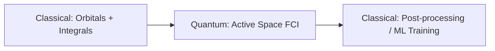

**图 12-1**：经典与量子计算的混合流程。

### 12.8 经典方法与量子计算的衔接点

```
经典前端                        量子中间层                    经典后端
─────────────────────────      ──────────────                ────────────
DFT/HF → 轨道 + 积分   ──→   活性空间 + 映射（JW/BK） ──→   1-RDM 回写
AVAS → 活性空间选择     ──→   VQE / SQD / QPE         ──→   片段能量
DMET/嵌入 → bath 构造   ──→   量子求解器              ──→   ML 训练数据
CASSCF → 多参考参考     ──→   UCC ansatz 设计         ──→   DFT 校正
```

核心要点：
- 量子算法 **不替代** 经典的轨道/积分/嵌入准备，而是在 **最难的子问题**（活性空间内的 FCI）上提供另一条路
- 经典方法的精度天花板（尤其 **活性空间 FCI 的指数爆炸**）正是量子计算的切入点
- DLPNO-CCSD(T)、DMRG、Selected CI 的进步也在 **抬高经典基线**，量子算法需要瞄准经典确实做不到的问题

---

## 参考文献

### 教科书

[T1] A. Szabo, N. S. Ostlund. *Modern Quantum Chemistry: Introduction to Advanced Electronic Structure Theory*. Dover, 1996.

[T2] T. Helgaker, P. Jørgensen, J. Olsen. *Molecular Electronic-Structure Theory*. Wiley, 2000.

[T3] R. G. Parr, W. Yang. *Density-Functional Theory of Atoms and Molecules*. Oxford, 1989.

[T4] F. Jensen. *Introduction to Computational Chemistry*. 3rd ed., Wiley, 2017.

[T5] C. J. Cramer. *Essentials of Computational Chemistry: Theories and Models*. 2nd ed., Wiley, 2004.

### 综述与关键论文

[R1] J. P. Perdew, K. Schmidt. Jacob's ladder of density functional approximations for the exchange-correlation energy. *AIP Conf. Proc.* **577**, 1 (2001).

[R2] S. Grimme, A. Hansen, J. G. Brandenburg, C. Bannwarth. Dispersion-corrected mean-field electronic structure methods. *Chem. Rev.* **116**, 5105 (2016).

[R3] C. Riplinger, P. Pinski, U. Becker, E. F. Valeev, F. Neese. Sparse maps — A systematic infrastructure for reduced-scaling electronic structure methods. II. Linear scaling domain based pair natural orbital coupled cluster theory. *J. Chem. Phys.* **144**, 024109 (2016).

[R4] N. Mardirossian, M. Head-Gordon. Thirty years of density functional theory in computational chemistry: an overview and extensive assessment of 200 density functionals. *Mol. Phys.* **115**, 2315 (2017).

[R5] M. G. Medvedev, I. S. Bushmarinov, J. Sun, J. P. Perdew, K. A. Lyssenko. Density functional theory is straying from the path toward the exact functional. *Science* **355**, 49 (2017).

[R6] J. J. Eriksen et al. The ground state electronic energy of benzene. *J. Phys. Chem. Lett.* **11**, 8922 (2020).

[R7] G. K.-L. Chan, S. Sharma. The density matrix renormalization group in quantum chemistry. *Annu. Rev. Phys. Chem.* **62**, 465 (2011).

[R8] B. O. Roos, P. R. Taylor, P. E. M. Siegbahn. A complete active space SCF method (CASSCF) using a density matrix formulated super-CI approach. *Chem. Phys.* **48**, 157 (1980).

[R9] J. P. Perdew, M. Ernzerhof, K. Burke. Rationale for mixing exact exchange with density functional approximations. *J. Chem. Phys.* **105**, 9982 (1996).

[R10] S. Grimme, J. Antony, S. Ehrlich, H. Krieg. A consistent and accurate ab initio parametrization of density functional dispersion correction (DFT-D) for the 94 elements H-Pu. *J. Chem. Phys.* **132**, 154104 (2010).

[R11] P. G. Szalay, T. Müller, G. Gidofalvi, H. Lischka, R. Shepard. Multiconfiguration self-consistent field and multireference configuration interaction methods and applications. *Chem. Rev.* **112**, 108 (2012).

[R12] K. D. Vogiatzis, D. Ma, J. Olsen, L. Gagliardi, W. A. de Jong. Pushing configuration-interaction to the limit: Towards massively parallel MCSCF calculations. *J. Chem. Phys.* **147**, 184111 (2017).

[R13] L. Goerigk, A. Hansen, C. Bauer et al. A look at the density functional theory zoo with the advanced GMTKN55 database for general main group thermochemistry, kinetics and noncovalent interactions. *Phys. Chem. Chem. Phys.* **19**, 32184 (2017).

---

*本文档为学习笔记，侧重直觉与层次。更深入的推导参见上列教科书 [T1]–[T5]。与量子计算化学的衔接参见 [量子计算-QC-ppt.md](../literature/量子计算-QC-ppt.md)、[量子计算在计算化学中的方法与文献地图.md](../literature/量子计算在计算化学中的方法与文献地图.md)、[学习问答记录.md](../literature/学习问答记录.md)。*
