# 量子化学理论基础与方法（合并本）

## 阅读顺序

### 第一部分：量子力学基础与电子结构问题

1. 量子力学数学基础
2. 时间无关薛定谔方程的数学结构
3. 电子结构问题：从薛定谔方程到近似

### 第二部分：近似思想与基组表示

4. 变分原理
5. 基组、LCAO 与轨道形状直觉

### 第三部分：Hartree-Fock 理论与算法

6. Hartree-Fock：从平均场到自洽场

### 第四部分：电子相关与后 Hartree-Fock 方法

7. 电子相关性的数学描述
8. 后 Hartree-Fock 方法

### 第五部分：密度泛函理论

9. 密度泛函理论

### 第六部分：方法比较、误差分析与现代发展

10. 方法层次与决策
11. 误差分析和数学性质
12. 现代发展趋势（2020-2026）
13. 理论思想总结
14. 思考题
15. 总结
16. 参考文献

---

# 第一部分：量子力学基础与电子结构问题

## 1. 量子力学数学基础

### 1.1 希尔伯特空间（Hilbert Space）

#### 定义

希尔伯特空间 $\mathcal{H}$ 是一个完备的内积空间，满足：

- **内积性质**：对于任意 $|\psi\rangle, |\phi\rangle \in \mathcal{H}$，内积 $\langle\psi|\phi\rangle$ 满足：

  - 共轭对称性：$\langle\psi|\phi\rangle = \langle\phi|\psi\rangle^*$
  - 线性性：$\langle\psi|a\phi_1 + b\phi_2\rangle = a\langle\psi|\phi_1\rangle + b\langle\psi|\phi_2\rangle$
  - 正定性：$\langle\psi|\psi\rangle \geq 0$，且 $\langle\psi|\psi\rangle = 0$ 当且仅当 $|\psi\rangle = 0$
- **完备性**：所有柯西序列都收敛到空间内的元素

#### 柯西序列（Cauchy Sequence）

**定义**：在内积空间（或度量空间）中，序列 $\{|\psi_n\rangle\}_{n=1}^\infty$ 称为柯西序列，如果对于任意给定的 $\epsilon > 0$，存在正整数 $N$，使得当 $m, n > N$ 时，有：

$$
\|\psi_m - \psi_n\| < \epsilon

$$

其中 $\|\psi_m - \psi_n\| = \sqrt{\langle\psi_m - \psi_n|\psi_m - \psi_n\rangle}$ 是两个向量之间的距离。

**直观理解**：

- 柯西序列是"自我收敛"的序列：随着指标增大，序列中的元素彼此之间越来越接近
- 换句话说，当 $m$ 和 $n$ 都很大时，$|\psi_m\rangle$ 和 $|\psi_n\rangle$ 应该非常接近

**完备性的含义**：

- 如果一个内积空间是**完备的**（即希尔伯特空间），那么任何柯西序列都在该空间内有一个极限
- 这意味着不存在"收敛到空间外"的柯西序列，即空间的"洞"被填满了

**例子**：

- **有理数**：有理数序列 $\{1, 1.4, 1.41, 1.414, \ldots\}$（$\sqrt{2}$ 的近似）在有理数中不收敛，因为 $\sqrt{2}$ 不是有理数
- **实数**：同样的序列在实数中是柯西序列且收敛到 $\sqrt{2}$
- **希尔伯特空间**：所有柯西序列都收敛到空间内的元素，这使得我们可以安全地进行极限操作和展开

**物理意义**：

- 在量子力学中，完备性保证我们可以用本征函数展开任意波函数
- 当我们用基组展开波函数时，增加基函数数量得到更好的近似，这些近似序列是柯西序列，完备性保证它们收敛到真实的波函数（在基组完备的情况下）

#### 波函数空间

对于 $N$ 电子系统，波函数 $\psi(\mathbf{r}_1, \mathbf{r}_2, \ldots, \mathbf{r}_N)$ 属于 $L^2(\mathbb{R}^{3N})$ 空间，即平方可积函数空间：

$$
\int |\psi(\mathbf{r}_1, \ldots, \mathbf{r}_N)|^2 d\mathbf{r}_1 \cdots d\mathbf{r}_N < \infty

$$

内积定义为：

$$
\langle\psi|\phi\rangle = \int \psi^*(\mathbf{r}_1, \ldots, \mathbf{r}_N) \phi(\mathbf{r}_1, \ldots, \mathbf{r}_N) d\mathbf{r}_1 \cdots d\mathbf{r}_N

$$

#### 物理意义

- 波函数的模方 $|\psi|^2$ 表示概率密度
- 归一化条件：$\langle\psi|\psi\rangle = 1$
- 正交性：不同本征态之间正交，$\langle\psi_i|\psi_j\rangle = \delta_{ij}$

### 1.2 算符理论（Operator Theory）

#### 线性算符

算符 $\hat{A}$ 是线性的，如果：

$$
\hat{A}(c_1|\psi_1\rangle + c_2|\psi_2\rangle) = c_1\hat{A}|\psi_1\rangle + c_2\hat{A}|\psi_2\rangle

$$

#### 厄米算符（Hermitian Operator）

算符 $\hat{A}$ 是厄米的，如果 $\hat{A}^\dagger = \hat{A}$，其中 $\hat{A}^\dagger$ 是伴随算符，满足：

$$
\langle\phi|\hat{A}\psi\rangle = \langle\hat{A}^\dagger\phi|\psi\rangle

$$

**重要性质**：

1. 厄米算符的本征值是实数
2. 厄米算符的本征函数构成正交完备基
3. 可观测量的算符必须是厄米的

**证明**：设 $\hat{A}|\psi_n\rangle = a_n|\psi_n\rangle$，则：

$$
\langle\psi_n|\hat{A}\psi_n\rangle = a_n\langle\psi_n|\psi_n\rangle = a_n

$$

同时：

$$
\langle\psi_n|\hat{A}\psi_n\rangle = \langle\hat{A}^\dagger\psi_n|\psi_n\rangle = \langle\hat{A}\psi_n|\psi_n\rangle = a_n^*\langle\psi_n|\psi_n\rangle = a_n^*

$$

因此 $a_n = a_n^*$，即本征值为实数。

### 1.3 本征值问题（Eigenvalue Problem）

#### 时间无关薛定谔方程

$$
\hat{H}|\psi_n\rangle = E_n|\psi_n\rangle

$$

其中：

- $\hat{H}$ 是哈密顿算符（厄米算符）
- $E_n$ 是能量本征值（实数）
- $|\psi_n\rangle$ 是能量本征态

#### 谱定理

对于厄米算符 $\hat{H}$，存在正交归一的本征函数系 $\{|\psi_n\rangle\}$，使得任意波函数可以展开为：

$$
|\psi\rangle = \sum_n c_n|\psi_n\rangle, \quad c_n = \langle\psi_n|\psi\rangle

$$

#### 完备性关系

$$
\sum_n |\psi_n\rangle\langle\psi_n| = \hat{I}

$$

其中 $\hat{I}$ 是单位算符。

#### 将薛定谔方程投影到组态空间：详细推导

（注：以下内容详细介绍如何将连续空间的薛定谔方程投影到离散组态空间，这是CI方法的数学基础）

#### 一、基本思想

#### 1.1 问题的提出

**连续空间的问题**：

- 精确的薛定谔方程：$\hat{H}|\psi\rangle = E|\psi\rangle$ 在无限维的连续函数空间中
- 波函数 $|\psi(\mathbf{r}_1, \ldots, \mathbf{r}_N)\rangle$ 依赖于 $3N$ 个连续坐标
- 直接求解需要处理无限维积分，计算上不可行

**离散化的思想**：

- 将无限维的连续空间**投影**到有限维的离散空间
- 使用**基组展开**：用有限个基函数（如Slater行列式）的线性组合来近似波函数
- 将微分方程（薛定谔方程）转化为**矩阵本征值问题**

#### 1.2 投影方法的核心

**关键步骤**：

1. **选择基组**：$\{|\Phi_I\rangle\}_{I=1}^M$（例如，Slater行列式集合）
2. **波函数展开**：$|\psi\rangle = \sum_I c_I |\Phi_I\rangle$
3. **投影方程**：将薛定谔方程投影到每个基函数上
4. **矩阵方程**：得到矩阵本征值问题 $\mathbf{H}\mathbf{c} = E\mathbf{c}$

**物理意义**：

- 投影方法将"在连续空间中寻找波函数"转化为"在离散基组中寻找展开系数"
- 这是所有量子化学计算方法的基础

#### 二、数学推导

#### 2.1 波函数展开

**基组选择**：
选择一组正交归一的基函数（Slater行列式）：

$$
\{|\Phi_I\rangle\}_{I=1}^M, \quad \langle\Phi_I|\Phi_J\rangle = \delta_{IJ}

$$

其中：

- $|\Phi_0\rangle$ 是参考组态（通常是HF基态）
- $|\Phi_I\rangle$（$I \geq 1$）是激发组态（单激发、双激发等）

**波函数展开**：
将精确波函数 $|\psi\rangle$ 展开为基函数的线性组合：

$$
|\psi\rangle = \sum_{I=0}^{M-1} c_I |\Phi_I\rangle

$$

其中 $c_I$ 是展开系数（待求）。

**归一化条件**：

$$
\langle\psi|\psi\rangle = \sum_{I,J} c_I^* c_J \langle\Phi_I|\Phi_J\rangle = \sum_I |c_I|^2 = 1

$$

#### 2.2 薛定谔方程

**原始方程**：

$$
\hat{H}|\psi\rangle = E|\psi\rangle

$$

**代入展开**：

$$
\hat{H}\sum_J c_J |\Phi_J\rangle = E\sum_J c_J |\Phi_J\rangle

$$

**整理**：

$$
\sum_J c_J \hat{H}|\Phi_J\rangle = E\sum_J c_J |\Phi_J\rangle

$$

#### 2.3 投影操作

**投影到基函数 $|\Phi_I\rangle$**：
将方程两边同时左乘 $\langle\Phi_I|$（投影到第 $I$ 个基函数）：

$$
\langle\Phi_I|\sum_J c_J \hat{H}|\Phi_J\rangle = \langle\Phi_I|E\sum_J c_J |\Phi_J\rangle

$$

**展开左边**：

$$
\sum_J c_J \langle\Phi_I|\hat{H}|\Phi_J\rangle = E\sum_J c_J \langle\Phi_I|\Phi_J\rangle

$$

**利用正交性**：
由于 $\langle\Phi_I|\Phi_J\rangle = \delta_{IJ}$，右边简化为：

$$
\sum_J c_J \langle\Phi_I|\hat{H}|\Phi_J\rangle = Ec_I

$$

**矩阵形式**：

$$
\sum_J H_{IJ} c_J = Ec_I

$$

其中 $H_{IJ} = \langle\Phi_I|\hat{H}|\Phi_J\rangle$ 是哈密顿矩阵元。

#### 2.4 矩阵本征值问题

**对所有基函数投影**：
对每个 $I = 0, 1, \ldots, M-1$，我们得到一个方程：

$$
\sum_J H_{IJ} c_J = Ec_I

$$

**矩阵形式**：
将所有方程写成矩阵形式：

$$
\begin{pmatrix}
H_{00} & H_{01} & H_{02} & \cdots \\
H_{10} & H_{11} & H_{12} & \cdots \\
H_{20} & H_{21} & H_{22} & \cdots \\
\vdots & \vdots & \vdots & \ddots
\end{pmatrix}
\begin{pmatrix}
c_0 \\
c_1 \\
c_2 \\
\vdots
\end{pmatrix}
= E
\begin{pmatrix}
c_0 \\
c_1 \\
c_2 \\
\vdots
\end{pmatrix}

$$

**简写**：

$$
\mathbf{H}\mathbf{c} = E\mathbf{c}

$$

其中：

- $\mathbf{H}$ 是 $M \times M$ 的哈密顿矩阵，元素为 $H_{IJ} = \langle\Phi_I|\hat{H}|\Phi_J\rangle$
- $\mathbf{c} = (c_0, c_1, \ldots, c_{M-1})^T$ 是系数向量
- $E$ 是能量本征值

#### 三、矩阵元的计算

#### 3.1 哈密顿矩阵元

**定义**：

$$
H_{IJ} = \langle\Phi_I|\hat{H}|\Phi_J\rangle

$$

**展开哈密顿量**：

$$
\hat{H} = \sum_i \hat{h}_i + \frac{1}{2}\sum_{i\neq j} \frac{1}{|\mathbf{r}_i - \mathbf{r}_j|}

$$

其中：

- $\hat{h}_i = -\frac{1}{2}\nabla_i^2 - \sum_A \frac{Z_A}{|\mathbf{r}_i - \mathbf{R}_A|}$ 是单电子算符
- $\frac{1}{|\mathbf{r}_i - \mathbf{r}_j|}$ 是双电子算符

#### 3.2 Slater-Condon规则

**关键定理**：如果 $|\Phi_I\rangle$ 和 $|\Phi_J\rangle$ 是Slater行列式，那么：

1. **相同行列式**（$I = J$）：

   $$
   H_{II} = \langle\Phi_I|\hat{H}|\Phi_I\rangle = \sum_{i \in I} h_i + \frac{1}{2}\sum_{i,j \in I} (J_{ij} - K_{ij})

   $$

   其中 $h_i, J_{ij}, K_{ij}$ 是单电子和双电子积分。
2. **相差一个轨道**（单激发）：

   $$
   H_{IJ} = \langle\Phi_I|\hat{H}|\Phi_J\rangle = h_{ia} + \sum_{j \in I} (J_{ij} - K_{ij})

   $$

   其中 $i$ 是占据轨道，$a$ 是虚轨道。
3. **相差两个轨道**（双激发）：

   $$
   H_{IJ} = \langle\Phi_I|\hat{H}|\Phi_J\rangle = J_{ij} - K_{ij}

   $$

   其中 $i,j$ 是占据轨道，$a,b$ 是虚轨道。
4. **相差超过两个轨道**：

   $$
   H_{IJ} = 0

   $$

   这是**Slater-Condon规则**的核心：只有相差不超过两个轨道的行列式之间才有非零矩阵元。

##### 为什么相差超过两个轨道矩阵元为零？

**核心原因**：哈密顿量最多是双电子算符，没有三电子或更高阶的算符。

**哈密顿量的结构**：

$$
\hat{H} = \underbrace{\sum_i \hat{h}_i}_{\text{单电子算符}} + \underbrace{\frac{1}{2}\sum_{i\neq j} \frac{1}{|\mathbf{r}_i - \mathbf{r}_j|}}_{\text{双电子算符}}

$$

**单电子算符的贡献**：

- $\hat{h}_i$ 只作用于电子 $i$
- 积分时，其他电子的轨道必须正交归一配对
- 如果两个行列式相差超过1个轨道，必有轨道无法配对
- 由正交性 $\int \phi_a^* \phi_b = \delta_{ab}$，积分为零
- **结论**：单电子算符只能在相差0或1个轨道的行列式之间产生非零矩阵元

**双电子算符的贡献**：

- $\frac{1}{|\mathbf{r}_i - \mathbf{r}_j|}$ 同时作用于电子 $i$ 和 $j$
- 积分时，其他 $N-2$ 个电子的轨道必须配对
- 如果两个行列式相差超过2个轨道，必有轨道无法配对
- **结论**：双电子算符只能在相差0、1或2个轨道的行列式之间产生非零矩阵元

**具体例子**：

设两个4电子行列式相差3个轨道：

- $|\Phi_I\rangle = |\phi_1 \phi_2 \phi_3 \phi_4\rangle$
- $|\Phi_J\rangle = |\phi_1 \phi_5 \phi_6 \phi_7\rangle$

计算矩阵元时：

- 哈密顿量最多同时作用于2个电子
- 但有3对轨道不同：($\phi_2,\phi_5$), ($\phi_3,\phi_6$), ($\phi_4,\phi_7$)
- 即使算符作用于其中2对，第3对仍需要配对
- 由于 $\int \phi_3^* \phi_6 = 0$（正交），整个积分为零

**总结表**：


| 行列式相差轨道数 | 单电子算符 | 双电子算符 | 总矩阵元 |
| :----------------: | :----------: | :----------: | :--------: |
|        0        |     ✓     |     ✓     |   非零   |
|        1        |     ✓     |     ✓     |   非零   |
|        2        |     ✗     |     ✓     |   非零   |
|       ≥3       |     ✗     |     ✗     |  **零**  |

**物理直觉**：哈密顿量描述单电子运动和两电子相互作用，无法同时"改变"三个或更多电子的状态，因此相差超过两个轨道的行列式之间没有直接耦合。

##### 3.2.1 “相差几个轨道”的精确定义（相对谁？）

Slater-Condon 规则比较的是 **两个行列式 $|\Phi_I\rangle$ 与 $|\Phi_J\rangle$ 彼此** 的占据情况，而不是各自相对某个参考态 $|\Phi_0\rangle$ 是几激发。下面用占据集与 **激发秩** 把这句话说严。

取一组 **正交归一** 自旋轨道 $\{\chi_p\}$。设 $|\Phi_I\rangle$ 的占据集为 $S_I\subset\{1,2,\ldots\}$，$|S_I|=N$。定义两行列式之间的 **激发秩**（有时亦称连接秩）为将 $S_I$ 变为 $S_J$ 所需的最少 **单电子替换** 次数，记为 $r_{IJ}$。等价地，令对称差 $S_I\triangle S_J=(S_I\setminus S_J)\cup(S_J\setminus S_I)$，则

$$
|S_I\triangle S_J| = 2\,r_{IJ}.

$$

例如：若 $S_I=\{1,2,3,4\}$、$S_J=\{1,5,6,7\}$，则 $S_I\triangle S_J=\{2,3,4,5,6,7\}$，$|S_I\triangle S_J|=6$，故 $r_{IJ}=3$（三重替换）。Slater-Condon 的“至多相差两个轨道”在多数教材中对应 **$r_{IJ}\le 2$**（即两行列式占据集对称差至多涉及 **4** 个自旋轨道标号）。

##### 3.2.2 二次量子化形式下的推导要点

在正交归一自旋轨道基下，可将 $N$ 电子行列式写成

$$
|\Phi_I\rangle = \Big(\prod_{p\in S_I}^{\rightarrow} a_p^\dagger\Big)|\mathrm{vac}\rangle,

$$

其中 $a_p^\dagger,a_q$ 满足 $\{a_p,a_q^\dagger\}=\delta_{pq}$。Born-Oppenheimer 电子哈密顿量的 **非相对论** 形式只含单体与双体项，可写为

$$
\hat{H}=\sum_{pq} h_{pq}\,a_p^\dagger a_q+\frac{1}{2}\sum_{pqrs} g_{pqrs}\,a_p^\dagger a_q^\dagger a_s a_r,

$$

其中 $h_{pq}$ 为核-电子动能与势的单体矩阵元，$g_{pqrs}$ 为两电子排斥在自旋轨道基下的积分（具体对称性依约定而定，此处只需其为 **四指标双体耦合**）。

**单体项** $\hat{O}^{(1)}=\sum_{pq} h_{pq}a_p^\dagger a_q$：对给定 $|\Phi_J\rangle$，$a_q$ 仅在 $q\in S_J$ 时非零；随后 $a_p^\dagger$ 在已移除 $q$ 的组态上产生 $p$。要使 $\langle\Phi_I|\hat{O}^{(1)}|\Phi_J\rangle\neq 0$，所得占据集必须与 $S_I$ 完全一致，因而 **$|S_I\triangle S_J|\le 2$**，即 **$r_{IJ}\le 1$**。更形式的论证可用 **Wick 定理** 或对产生、湮灭算符串的完全收缩：$\hat{O}^{(1)}$ 的正规乘积展开中至多留下 **一对** 未与 $\langle\Phi_I|$、$|\Phi_J\rangle$ 配对抵消的激发，故无法连接 $r_{IJ}\ge 2$ 的组态。

**双体项** $\hat{O}^{(2)}=\frac{1}{2}\sum_{pqrs} g_{pqrs}a_p^\dagger a_q^\dagger a_s a_r$：一次作用含 **两个** 湮灭算符与 **两个** 产生算符，对占据集最多产生 **两次** 单粒子替换，故仅当 **$r_{IJ}\le 2$** 时 $\langle\Phi_I|\hat{O}^{(2)}|\Phi_J\rangle$ 才可能非零。

**合并**：$\hat{H}=\hat{O}^{(1)}+\hat{O}^{(2)}$ 不含三体及以上算符，因而

$$
\boxed{\quad r_{IJ}\ge 3 \;\Longrightarrow\; \langle\Phi_I|\hat{H}|\Phi_J\rangle = 0.\quad}

$$

这与上表“$\ge 3$ 次替换（依本书记号即相差超过两个 **替换**）→ 矩阵元为零”一致。**注意**：若用语“相差 $k$ 个轨道”指 **$k$ 次替换**，则阈值是 **$k>2$**；若指对称差 $|S_I\triangle S_J|$，则应换算为 $r_{IJ}=|S_I\triangle S_J|/2$，避免口语歧义。

##### 3.2.3 常见疑问：$\langle\Phi_0|\hat{H}|\Phi_T\rangle=0$ 时为何 CI 中仍可出现三重及以上激发？

Slater-Condon 约束的是 **哈密顿矩阵的单个矩阵元** $H_{IJ}=\langle\Phi_I|\hat{H}|\Phi_J\rangle$，**并不**蕴含“凡标记为三重激发的行列式在精确波函数中系数必为零”。

**（1）间接耦合（多步连通）**
即使 $\langle\Phi_0|\hat{H}|\Phi_T\rangle=0$（参考 $|\Phi_0\rangle$ 与某三重 $|\Phi_T\rangle$ 激发秩 $r_{0T}=3$），仍可能存在双激发 $|\Phi_D\rangle$ 使得

$$
\langle\Phi_0|\hat{H}|\Phi_D\rangle\neq 0,\qquad
\langle\Phi_D|\hat{H}|\Phi_T\rangle\neq 0,

$$

因为常有 $r_{0D}\le 2$、$r_{DT}\le 1$（$|\Phi_D\rangle$ 与 $|\Phi_T\rangle$ 相对彼此往往只差一次替换）。在矩阵语言中，$|\Phi_T\rangle$ 通过 **非零非对角元** 与低激发块相连，从而在整体本征向量中获得非零权重。

**（2）全 CI 是整体本征问题**
FCI 求解

$$
\mathbf{H}\mathbf{c}=E\mathbf{c},\qquad
|\Psi\rangle=\sum_I c_I|\Phi_I\rangle.

$$

$\mathbf{H}$ 稀疏，但 **本征向量 $\mathbf{c}$** 由整张矩阵的谱决定；$c_T$ 是否非零取决于 $\mathbf{H}$ 在行列式空间诱导的 **图**（顶点为组态、边为非零 $H_{IJ}$）的连通性，而非仅看矩阵的第一行 $\langle\Phi_0|\hat{H}|\cdot\rangle$。

**（3）耦合簇与微扰论**
CC 波函数 $|\Psi\rangle\propto e^{\hat{T}}|\Phi_0\rangle$ 中，$\hat{T}=\hat{T}_1+\hat{T}_2+\cdots$ 的指数展开 **显式生成** 高阶激发行列式；Slater-Condon 只说明 $\hat{H}$ 在行列式基上的 **局域** 稀疏结构，并不限制 $e^{\hat{T}}$ 的展开范围。Moller-Plesset 等高阶能量表达式中，亦可通过 **中间组态**（常为双激发等）间接包含三重及以上效应。

**一句话小结**：Slater-Condon 给出 $\hat{H}$ 的 **直连稀疏性**（激发秩 $r_{IJ}>2\Rightarrow H_{IJ}=0$）；高阶激发是否重要，由 **间接路径** 与 **整体对角化**（及 CC/MP 的代数结构）共同决定。

#### 3.3 矩阵的稀疏性

**重要性质**：

- 哈密顿矩阵 $\mathbf{H}$ 是**稀疏的**（大部分元素为零）
- 只有少数矩阵元非零（根据Slater-Condon规则）
- 这大大减少了计算量

**例子**：

- 如果有 $M = 1000$ 个组态
- 完整矩阵有 $M^2 = 1,000,000$ 个元素
- 但根据Slater-Condon规则，只有约 $O(M)$ 个非零元素
- 稀疏性使得可以处理更大的系统

##### 3.3.1 补充：$\mathbf{H}$ 的稀疏与「波函数稀疏」不是同一句话

口语里的「利用波函数的稀疏性」「只算重要组态」常与下面两层含义混在一起，**宜分开表述**。

**（1）哈密顿矩阵 $\mathbf{H}$ 的稀疏——由算符结构决定，普遍成立**
$H_{IJ}=\langle\Phi_I|\hat{H}|\Phi_J\rangle$ 在激发秩 $r_{IJ}>2$ 时 **严格为零**（§3.2、§3.2.2），故在行列式基下 $\mathbf{H}$ **大量元素为零**。Davidson 对角化、稀疏存储、积分筛选等利用的 **首要** 是这一 **结构性** 稀疏，与待求本征态 $|\Psi\rangle$ 的具体形式 **无涉**。

**（2）CI / FCI 展开系数 $\mathbf{c}$ 的「稀疏」——本征向量，体系依赖**
将 $|\Psi\rangle=\sum_I c_I|\Phi_I\rangle$，问系数向量 $\mathbf{c}$ 是否稀疏：**不是量子力学普遍定理**。在 **单参考主导、弱动态相关** 的常见情形下，常有 $|c_0|\gg |c_{I\neq 0}|$，大量 $c_I$ **数值上可忽略**，因而 **截断 CI**、**选组态（selected CI）**、**微扰筛选重要行列式** 等策略有效。反之，在 **强相关**（键断裂、近简并、多组态权重接近）时，许多 $|c_I|$ 可 **同量级**，$\mathbf{c}$ **并不稀疏**，需大活性空间、多参考 CI、DMRG 等，不能指望「少数组态」即够。

**小结**：$\mathbf{H}$ 稀疏来自「哈密顿量仅含单体+双体」；「只保留重要组态」更多是在利用 $\mathbf{c}$ 在 **特定展开、特定体系** 下的 **经验性近似稀疏**。**算法利用 $\mathbf{H}$ 的零元结构** 与 **截断展开空间** 是两件可并行、但概念上不同的事。与本条对照的「缓解策略·稀疏表示」表述，见后文 **「维度灾难（Curse of Dimensionality）」** 小节中的 **「维度灾难的缓解策略」第 2 点**。

#### 四、求解矩阵本征值问题

#### 4.1 标准本征值问题

**矩阵方程**：

$$
\mathbf{H}\mathbf{c} = E\mathbf{c}

$$

**求解方法**：

- **对角化**：$\mathbf{H} = \mathbf{U}\mathbf{D}\mathbf{U}^\dagger$

  - $\mathbf{D}$ 是对角矩阵，对角元素是本征值 $E_0, E_1, \ldots, E_{M-1}$
  - $\mathbf{U}$ 是酉矩阵，列向量是对应的本征向量 $\mathbf{c}_0, \mathbf{c}_1, \ldots, \mathbf{c}_{M-1}$
- **基态能量**：$E_0 = \min\{E_i\}$（最低本征值）
- **基态波函数**：$|\psi_0\rangle = \sum_I c_{0,I} |\Phi_I\rangle$（对应 $E_0$ 的本征向量）

#### 4.2 变分原理的体现

**变分原理**：

- 投影方法自动满足变分原理
- 基态能量 $E_0$ 是真实基态能量的上界
- 增加基组大小（$M$ 增大），$E_0$ 单调下降，逼近精确值

**数学证明**：
设精确基态为 $|\psi_{exact}\rangle$，投影得到的基态为 $|\psi_0\rangle$，则：

$$
E_0 = \langle\psi_0|\hat{H}|\psi_0\rangle \geq E_{exact}

$$

等号成立当且仅当 $|\psi_0\rangle = |\psi_{exact}\rangle$（在基组完备时）。

#### 五、实际应用示例：CI方法

投影方法是组态相互作用（CI）方法的数学基础。CI方法将精确波函数展开为多个Slater行列式的线性组合：

$$
|\Psi_{CI}\rangle = c_0|\Phi_0\rangle + \sum_{i,a} c_i^a|\Phi_i^a\rangle + \sum_{i<j,a<b} c_{ij}^{ab}|\Phi_{ij}^{ab}\rangle + \cdots

$$

通过投影到组态空间，得到矩阵方程：$\mathbf{H}\mathbf{c} = E\mathbf{c}$

（注：关于CI方法的详细内容，包括截断级别、大小一致性等，参见第6.1节"组态相互作用"部分）

#### 六、投影方法总结

**投影方法的核心思想**：

1. **离散化**：将无限维连续空间投影到有限维离散空间
2. **基组展开**：用基函数的线性组合近似波函数
3. **矩阵方程**：将微分方程转化为矩阵本征值问题
4. **求解**：通过矩阵对角化得到能量和波函数

**数学框架**：

- **波函数展开**：$|\psi\rangle = \sum_I c_I |\Phi_I\rangle$
- **投影方程**：$\langle\Phi_I|\hat{H}|\psi\rangle = E\langle\Phi_I|\psi\rangle$
- **矩阵方程**：$\mathbf{H}\mathbf{c} = E\mathbf{c}$

**优势**：

- 将连续问题转化为离散问题
- 可以利用线性代数的成熟方法
- 矩阵的稀疏性减少计算量

**限制**：

- 基组截断误差
- 矩阵大小随基组指数增长（FCI）
- 需要高效的矩阵对角化算法

## 2. 时间无关薛定谔方程的数学结构

### 2.1 多体问题的数学表述

#### N电子系统的哈密顿量

**完整的分子哈密顿量**（包含核和电子）：

$$
\hat{H}_{total} = \hat{T}_n + \hat{T}_e + \hat{V}_{nn} + \hat{V}_{ne} + \hat{V}_{ee}

$$

其中：

- **核动能**：$\hat{T}_n = -\sum_A \frac{1}{2M_A} \nabla_A^2$（$M_A$ 是核质量）
- **电子动能**：$\hat{T}_e = -\frac{1}{2}\sum_{i=1}^N \nabla_i^2$
- **核-核相互作用**：$\hat{V}_{nn} = \frac{1}{2}\sum_{A\neq B} \frac{Z_A Z_B}{|\mathbf{R}_A - \mathbf{R}_B|}$
- **核-电子相互作用**：$\hat{V}_{ne} = -\sum_{i=1}^N \sum_{A=1}^{N_{nuc}} \frac{Z_A}{|\mathbf{r}_i - \mathbf{R}_A|}$
- **电子-电子相互作用**：$\hat{V}_{ee} = \frac{1}{2}\sum_{i\neq j}^N \frac{1}{|\mathbf{r}_i - \mathbf{r}_j|}$

**在Born-Oppenheimer近似下的电子哈密顿量**：

$$
\hat{H}_e(\mathbf{R}) = \hat{T}_e + \hat{V}_{ne}(\mathbf{R}) + \hat{V}_{ee}

$$

其中核坐标 $\{\mathbf{R}_A\}$ 被视为**固定参数**（不是量子变量）。

**重要说明：核-核相互作用项在哪里？**

**问题**：为什么电子哈密顿量中没有核-核相互作用项 $\hat{V}_{nn}$？

**答案**：核-核项并没有"消失"，而是：

1. **在电子问题中，核-核项是常数**：

   - 核-核相互作用：$\hat{V}_{nn} = \frac{1}{2}\sum_{A\neq B} \frac{Z_A Z_B}{|\mathbf{R}_A - \mathbf{R}_B|}$
   - 在Born-Oppenheimer近似下，核坐标 $\{\mathbf{R}_A\}$ 是**固定的参数**
   - 因此 $\hat{V}_{nn}$ 只是一个**常数**（对于给定的核构型），不作用于电子坐标
2. **电子哈密顿量 vs 总能量**：

   - **电子哈密顿量**（见上面定义）：只包含作用于电子坐标的算符，核-核项不作用于电子，所以不包含在内
   - **总能量**：$E_{total}(\mathbf{R}) = E_e(\mathbf{R}) + V_{nn}(\mathbf{R})$

     - $E_e(\mathbf{R})$ 是电子能量（电子哈密顿量的本征值）
     - $V_{nn}(\mathbf{R})$ 是核-核相互作用能（常数项）
3. **为什么分开处理？**

   - **电子问题**：求解 $\hat{H}_e(\mathbf{R}) \psi(\mathbf{R}; \mathbf{r}) = E_e(\mathbf{R}) \psi(\mathbf{R}; \mathbf{r})$

     - 这给出电子能量 $E_e(\mathbf{R})$（依赖于核构型）
   - **核-核项**：$V_{nn}(\mathbf{R}) = \frac{1}{2}\sum_{A\neq B} \frac{Z_A Z_B}{|\mathbf{R}_A - \mathbf{R}_B|}$

     - 这只是核坐标的函数，不涉及电子
     - 可以直接计算（不需要求解薛定谔方程）
4. **势能面**：

   - 总能量作为核坐标的函数：$E_{total}(\mathbf{R}) = E_e(\mathbf{R}) + V_{nn}(\mathbf{R})$
   - 这形成**势能面**，核在这个势能面上运动
   - 核-核项是势能面的重要组成部分

**总结**：

- 核-核项**没有消失**，只是不包含在电子哈密顿量中
- 它在总能量中作为常数项出现
- 这样分离使得问题更易处理：电子问题只涉及电子坐标，核-核项可以直接计算

#### 核-电子项可以"分离"吗？Born-Oppenheimer近似

（注：以下内容详细解释Born-Oppenheimer近似的数学原理，与上面关于核-核项的解释是相关的）

**关键问题**：波函数是否可以写成核坐标和电子坐标的乘积形式？

$$
\Psi(\mathbf{R}_1, \ldots, \mathbf{R}_{N_{nuc}}, \mathbf{r}_1, \ldots, \mathbf{r}_N) \stackrel{?}{=} \chi(\mathbf{R}_1, \ldots, \mathbf{R}_{N_{nuc}}) \psi(\mathbf{r}_1, \ldots, \mathbf{r}_N)

$$

**答案**：在精确量子力学中**不能**，但在Born-Oppenheimer近似下**可以**。

##### 精确量子力学：不能分离

**数学原因**：

- 完整的分子波函数 $\Psi(\mathbf{R}, \mathbf{r})$ 依赖于核坐标 $\mathbf{R}$ 和电子坐标 $\mathbf{r}$
- 核-电子相互作用项 $\hat{V}_{ne} = -\sum_{i,A} \frac{Z_A}{|\mathbf{r}_i - \mathbf{R}_A|}$ 同时依赖于 $\mathbf{R}_A$ 和 $\mathbf{r}_i$
- 类似于电子-电子项，这使得波函数**不能**写成乘积形式

**物理原因**：

- 核和电子是**耦合的**：核的运动影响电子，电子的运动也影响核
- 这种耦合使得核和电子的波函数不能分离

##### Born-Oppenheimer近似：可以分离

**基本思想**：

- 核的质量远大于电子（$M_A \gg m_e$，通常 $M_A/m_e \sim 10^3-10^5$）
- 核运动比电子慢得多（时间尺度分离）
- 电子可以"瞬时"适应核的位置

**数学表述**：
在Born-Oppenheimer近似下，分子波函数可以写成：

$$
\Psi(\mathbf{R}, \mathbf{r}) = \chi(\mathbf{R}) \psi(\mathbf{R}; \mathbf{r})

$$

其中：

- $\chi(\mathbf{R})$ 是核波函数
- $\psi(\mathbf{R}; \mathbf{r})$ 是电子波函数，**依赖于核坐标作为参数**

**关键点**：

- 电子波函数 $\psi(\mathbf{R}; \mathbf{r})$ 中的 $\mathbf{R}$ 是**参数**，不是变量
- 对于每个固定的核构型 $\mathbf{R}$，我们求解电子薛定谔方程：
  $$
  \hat{H}_e(\mathbf{R}) \psi(\mathbf{R}; \mathbf{r}) = E_e(\mathbf{R}) \psi(\mathbf{R}; \mathbf{r})

  $$
- 其中电子哈密顿量（见上面定义）依赖于 $\mathbf{R}$ 作为参数

**为什么核-电子项可以"分离"？**

在Born-Oppenheimer近似下：

1. **核坐标固定**：对于给定的核构型 $\mathbf{R}$，核-电子项 $\hat{V}_{ne}(\mathbf{R})$ 只是电子坐标的函数
2. **电子波函数求解**：对于固定的 $\mathbf{R}$，求解电子薛定谔方程得到 $\psi(\mathbf{R}; \mathbf{r})$
3. **势能面**：电子能量 $E_e(\mathbf{R})$ 作为核坐标的函数，加上核-核项 $V_{nn}(\mathbf{R})$ 得到总能量 $E_{total}(\mathbf{R}) = E_e(\mathbf{R}) + V_{nn}(\mathbf{R})$，形成势能面（见上面"势能面"部分的详细解释）
4. **核运动**：核在这个势能面上运动

**数学上**：

- 核-电子项：$\hat{V}_{ne} = -\sum_{i,A} \frac{Z_A}{|\mathbf{r}_i - \mathbf{R}_A|}$
- 当 $\mathbf{R}_A$ 固定时，这只是 $\mathbf{r}_i$ 的函数
- 因此可以包含在电子哈密顿量中，作为依赖于 $\mathbf{R}$ 的参数

**对比电子-电子项**：

- 电子-电子项：$\hat{V}_{ee} = \frac{1}{2}\sum_{i\neq j} \frac{1}{|\mathbf{r}_i - \mathbf{r}_j|}$
- 这**同时**依赖于多个电子坐标 $\mathbf{r}_i$ 和 $\mathbf{r}_j$
- 因此电子波函数不能写成单电子函数的乘积

**总结**：


| 项          | 精确量子力学             | Born-Oppenheimer近似       |
| ------------- | -------------------------- | ---------------------------- |
| 核-电子项   | 不能分离（核和电子耦合） | 可以分离（核坐标作为参数） |
| 电子-电子项 | 不能分离（电子相关）     | 不能分离（电子相关）       |

**实际应用**：

- 在量子化学计算中，几乎总是使用Born-Oppenheimer近似
- 对于每个核构型，求解电子结构问题
- 这大大简化了问题，将 $3(N+N_{nuc})$ 维问题分解为：
  - 电子问题：$3N$ 维（对于每个 $\mathbf{R}$）
  - 核问题：$3N_{nuc}$ 维（在势能面上）

#### 波函数空间

对于 $N$ 电子系统，波函数 $\psi(\mathbf{r}_1, \sigma_1, \ldots, \mathbf{r}_N, \sigma_N)$ 必须满足：

1. **反对称性**（费米子统计）：

   $$
   \psi(\ldots, \mathbf{r}_i, \sigma_i, \ldots, \mathbf{r}_j, \sigma_j, \ldots) = -\psi(\ldots, \mathbf{r}_j, \sigma_j, \ldots, \mathbf{r}_i, \sigma_i, \ldots)

   $$
2. **归一化**：

   $$
   \sum_{\sigma_1,\ldots,\sigma_N} \int |\psi(\mathbf{r}_1, \sigma_1, \ldots, \mathbf{r}_N, \sigma_N)|^2 d\mathbf{r}_1 \cdots d\mathbf{r}_N = 1

   $$

#### 维度灾难（Curse of Dimensionality）

维度灾难是指在处理高维问题时，计算复杂度、存储需求和采样点数随维数呈指数增长的现象。

##### 维度增长

- **单电子系统**：3维空间（3个空间坐标 $x, y, z$）
- **N电子系统**：$3N$ 维空间（每个电子3个坐标）
- **例子**：
  - H$_2$O（10电子）：30维
  - C$_6$H$_6$（42电子）：126维
  - 蛋白质分子（数千电子）：数千维

##### 基组展开的组合爆炸

在使用基组展开时，维度灾难表现为组合爆炸：

**重要概念澄清：基组、轨道和函数的关系**

**"轨道"就是函数！** 这是量子化学中的术语习惯：

- **轨道（orbital）**：单电子波函数，是空间坐标的函数 $\phi(\mathbf{r})$ 或 $\phi(\mathbf{x})$（包含自旋）
- **基组（basis set）**：一组基函数的集合 $\{\chi_\mu(\mathbf{r})\}_{\mu=1}^M$
- **轨道用基组展开**：任意轨道可以表示为基函数的线性组合：
  $$
  \phi_i(\mathbf{r}) = \sum_{\mu=1}^M c_{i\mu} \chi_\mu(\mathbf{r})

  $$

**为什么叫"轨道"而不直接叫"函数"？**

- 历史原因：早期量子力学中，电子的轨道概念来自原子结构（如s轨道、p轨道、d轨道）
- 物理含义：轨道描述了电子在空间的分布
- 约定俗成：量子化学领域一直沿用这个术语

**分子轨道 vs 多电子分子波函数（先辨一层）**：二者**不是同一对象**。分子轨道（MO）是 **单电子** 空间函数（再与自旋组合成自旋轨道），用于 LCAO 与 HF 本征问题；多电子分子波函数 $\Psi(\mathbf{x}_1,\ldots,\mathbf{x}_N)$ 定义在 **$3N$ 维电子坐标**（及自旋）上，且必须 **反对称**。HF 下 $\Psi$ 是 **单个 Slater 行列式**，由占据 MO 拼成；CI/CC 下 $\Psi$ 是 **许多行列式** 的线性组合。**MO 是构造 $\Psi$ 的砖块，不是 $\Psi$ 本身。** 基组如何经原语收缩接到 MO 与 $\Psi$、并以 **STO-3G** 数值为例的完整叙述，见 **§5.2** 中 **2.1b、2.1c** 节。

**具体说明**：

1. **基组**：$\{\chi_1(\mathbf{r}), \chi_2(\mathbf{r}), \ldots, \chi_M(\mathbf{r})\}$ 是一组基函数

   - 例如：高斯型轨道（GTO）、Slater型轨道（STO）
   - 这些是**函数**，定义在空间坐标 $\mathbf{r}$ 上
2. **轨道**：$\phi_i(\mathbf{r})$ 也是**函数**，可以用基组展开：

   $$
   \phi_i(\mathbf{r}) = \sum_{\mu=1}^M c_{i\mu} \chi_\mu(\mathbf{r})

   $$
3. **占据轨道**：在 $N$ 电子系统中，有 $N$ 个电子，所以需要 $N$ 个轨道（每个电子一个轨道）

   - 这些是**占据轨道**（occupied orbitals）
   - 剩余的 $M-N$ 个轨道是**虚轨道**（virtual orbitals，未占据）

**为什么M个基函数能构造出M个轨道？**

这是线性代数的基本结论：

**线性无关性**：

- 假设基函数 $\{\chi_1, \chi_2, \ldots, \chi_M\}$ 是线性无关的
- 这意味着：$\sum_{\mu=1}^M a_\mu \chi_\mu = 0$ 当且仅当 $a_1 = a_2 = \cdots = a_M = 0$

**轨道构造**：

- 任意轨道可以表示为：$\phi_i = \sum_{\mu=1}^M c_{i\mu} \chi_\mu$
- 由于基函数是线性无关的，我们可以构造最多 $M$ 个线性无关的轨道
- 具体地，我们可以构造 $M$ 个正交归一的轨道 $\{\phi_1, \phi_2, \ldots, \phi_M\}$

**为什么恰好是M个？**

- 基组 $\{\chi_\mu\}$ 张成一个 $M$ 维的线性空间
- 在这个空间中，最多只能有 $M$ 个线性无关的向量（函数）
- 因此，最多可以构造 $M$ 个正交归一的轨道

**数学证明**（简要）：

- 如果我们尝试构造第 $(M+1)$ 个轨道 $\phi_{M+1} = \sum_{\mu=1}^M c_{M+1,\mu} \chi_\mu$
- 由于 $\{\chi_\mu\}$ 只有 $M$ 个，$\phi_{M+1}$ 必须能表示为前 $M$ 个轨道的线性组合
- 因此无法有 $M+1$ 个线性无关的轨道

**为什么需要构造M个轨道，而不是只构造N个占据轨道？**

**关键原因**：

1. **变分原理的要求**：

   - 在Hartree-Fock方法中，我们需要**优化轨道**
   - 通过变分原理，我们求解Fock方程：$\hat{F}\phi_i = \epsilon_i \phi_i$
   - Fock方程的解（本征函数）正好有 $M$ 个（对应 $M$ 个本征值 $\epsilon_1, \epsilon_2, \ldots, \epsilon_M$）
   - 我们无法只解出 $N$ 个，而必须解出所有 $M$ 个
2. **占据轨道的选择**：

   - 在解出所有 $M$ 个轨道后，按照能量排序：$\epsilon_1 \leq \epsilon_2 \leq \cdots \leq \epsilon_M$
   - 根据Aufbau原理，能量最低的 $N$ 个轨道被占据（每个轨道放2个电子，考虑自旋）
   - 这 $N$ 个是**占据轨道**（occupied orbitals）
   - 剩余的 $M-N$ 个是**虚轨道**（virtual orbitals）
3. **虚轨道的作用**：

   - **后HF方法需要**：CI、CC、MP等方法需要虚轨道来描述激发态
   - **激发过程**：电子从占据轨道激发到虚轨道
   - **相关能**：电子相关主要通过虚轨道的贡献来捕获
   - **变分优化**：即使在HF中，虚轨道也影响占据轨道的形状（通过优化过程）

**具体例子**：

- H$_2$O分子：10个电子
- 使用6-31G基组：约25个基函数（$M=25$）
- HF计算给出：
  - 5个占据轨道（$N=10$，但考虑自旋配对，空间轨道为5个）
  - 20个虚轨道（$M-N=20$）
- 如果我们只用5个轨道，无法：
  - 描述电子激发
  - 捕获电子相关
  - 进行后HF计算

**Slater行列式的构造**：

- 如果基组有 $M$ 个基函数 $\{\chi_\mu\}$，我们可以构造 $M$ 个轨道 $\{\phi_i\}$
- 要构造 $N$ 电子的Slater行列式，需要从 $M$ 个可能的轨道中选择 $N$ 个占据轨道
- Slater行列式的数量为：$\binom{M}{N} = \frac{M!}{N!(M-N)!}$
- 这包括了所有可能的占据-虚轨道分配方式

**总结**：

- **基组** = 一组基函数（如 $\{\chi_\mu\}$），有 $M$ 个
- **轨道** = 单电子波函数，最多可以构造 $M$ 个线性无关的正交轨道
- **占据轨道** = 能量最低的 $N$ 个轨道，被电子占据
- **虚轨道** = 剩余的 $M-N$ 个轨道，未占据但对描述电子相关至关重要

**数量级示例**：

- $M=20, N=10$：$\binom{20}{10} = 184,756$ 个行列式
- $M=50, N=20$：$\binom{50}{20} \approx 4.7 \times 10^{13}$ 个行列式
- $M=100, N=50$：$\binom{100}{50} \approx 1.0 \times 10^{29}$ 个行列式

**FCI（全组态相互作用）**：包含所有可能的激发，Slater行列式数量为：

$$
\sum_{k=0}^{M-N} \binom{M}{N+k} = 2^M \quad \text{(对于轨道数等于基组大小的情况)}

$$

##### 高维积分的困难

**网格积分的复杂度**：

- 在 $d$ 维空间中，如果每个维度用 $n$ 个格点
- 总格点数为：$n^d$
- **例子**：
  - 1维：$n = 10$ 个格点
  - 3维：$n^3 = 1,000$ 个格点
  - 6维（He原子）：$n^6 = 1,000,000$ 个格点
  - 30维（H$_2$O）：$n^{30} = 10^{30}$ 个格点（不可行！）

**蒙特卡洛方法的困难**：

- 虽然不依赖网格，但需要大量采样点
- 在高维空间中，大部分体积在边界附近（维度灾难的另一个表现）
- 有效采样区域变得非常小

##### 维度灾难的数学本质

**体积集中在边界**：

这是维度灾难的一个反直觉但重要的现象。让我们用数学来说明：

**单位超球的体积分布**：

- 在 $d$ 维空间中，半径为 $R$ 的球的体积为：$V_d(R) = \frac{\pi^{d/2}}{\Gamma(d/2+1)} R^d$
- 对于单位球（$R=1$），体积为：$V_d(1) = \frac{\pi^{d/2}}{\Gamma(d/2+1)}$
- 半径为 $r$ 的球的体积为：$V_d(r) = V_d(1) \cdot r^d$

**关键观察**：
考虑单位球内的体积分布。在半径 $r = 1-\epsilon$ 和 $r = 1$ 之间的球壳体积为：

$$
\Delta V = V_d(1) - V_d(1-\epsilon) = V_d(1)[1 - (1-\epsilon)^d]

$$

当 $d$ 很大时，$(1-\epsilon)^d \approx e^{-d\epsilon}$（当 $\epsilon$ 很小时）

**具体例子**：

- 对于 $d = 100$ 维单位球
- 考虑 $r > 0.99$ 的薄壳层（$\epsilon = 0.01$）
- 薄壳层的体积比例为：$1 - (0.99)^{100} \approx 1 - e^{-1} \approx 0.63$
- **63%的体积**在半径 $r > 0.99$ 的薄壳层中！

**为什么会出现这个现象？**

- 体积正比于 $r^d$，当 $d$ 很大时，这是一个非常陡峭的函数
- 当 $r$ 从 $0.9$ 增加到 $1.0$ 时，体积增加了 $(1/0.9)^d - 1$
- 对于 $d=100$，$(1/0.9)^{100} \approx 37,649$ 倍！
- 因此，即使是一个很薄的壳层，也包含了大部分体积

**直观理解（虽然很难直观想象高维）**：
想象一个多维的洋葱：

- 在低维（如3维），大部分体积在中心附近
- 但在高维（如100维），大部分"洋葱肉"都在最外层薄皮中
- 中心部分实际上体积很小

**对量子化学的意义**：

- 在 $3N$ 维的电子坐标空间中，波函数的大部分"权重"可能集中在边界区域
- 这使得均匀采样变得非常困难
- 需要智能的采样策略（如重要性采样）来有效采样高维空间

**距离失去意义**：

- 在高维空间中，所有点之间的距离都变得相似
- 最近邻和最远邻的距离比接近1
- 这使得基于距离的方法失效

**稀疏性**：

- $d$ 维单位立方体的体积为 $1^d = 1$
- 但如果用边长为 $0.1$ 的小立方体填充，需要 $10^d$ 个小立方体
- 当 $d=100$ 时，需要 $10^{100}$ 个小立方体（远超可观测宇宙的原子数）

##### 量子化学中的具体影响

**1. 精确方法不可扩展**：

- FCI方法：计算复杂度 $O(2^M)$，只能处理很小系统
- 即使中等大小的分子（如苯），FCI也是不可能的

**2. 近似方法的必要性**：

- Hartree-Fock：$O(M^4)$，多项式复杂度
- DFT：$O(M^3)$ 或 $O(M^4)$
- 后HF方法：CCSD为 $O(M^6)$，CCSDT为 $O(M^8)$

**3. 基组选择的重要性**：

- 必须平衡精度和计算成本
- 使用紧凑但准确的基组（如Dunning基组）
- 使用赝势减少核心电子

**4. 机器学习方法的机会**：

- 神经网络可能用更少的参数表示复杂函数
- 但仍然面临高维采样问题
- 需要开发特殊的技术（如重要性采样、变分方法）

##### 维度灾难的缓解策略

1. **维数约简**：

   - 使用自然轨道（自然轨道有更快的收敛性）
   - 主成分分析（PCA）降维
2. **稀疏表示**（宜分清 $\mathbf{H}$ 与 $\mathbf{c}$；详见 **§1.3「3.3 矩阵的稀疏性」→「3.3.1」**）：

   - **$\mathbf{H}$ 稀疏**：Slater–Condon 使 $H_{IJ}$ 大量严格为零，矩阵–向量乘、Davidson 等直接受益（**结构先验**，普遍成立）。
   - **$\mathbf{c}$ 常近似稀疏**：FCI/CI 本征向量中许多 $|c_I|$ 在弱相关、单参考主导时可极小，因而可 **截断 / 选组态**；强相关时 **未必** 稀疏，不可与上一条混为一谈。
   - **只算重要组态**：多指在展开系数或能量贡献上筛选行列式；其有效性依赖体系，**不是**「波函数必然稀疏」的推论。
3. **分层方法**：

   - 将问题分解为低维子问题
   - 使用多尺度方法
4. **近似方法**：

   - 接受近似以获得可扩展性
   - 使用物理直觉指导近似
5. **特殊方法**：

   - 变分蒙特卡洛（不依赖网格）
   - 机器学习方法（自适应表示）

**（扩写）** 关于「维度灾难在 **传统机器学习** 高维特征空间中的具体表现、对 KNN/聚类等的影响，以及 PCA、特征选择、正则化、核方法、深度学习、集成与流形学习等对策，外加 **量子化学 + ML** 的对称性/图网络/等变网络等注意点，已 **整段移至** 独立文件：[量子化学笔记附录/维度灾难在传统机器学习中的表现.md](./量子化学笔记附录/维度灾难在传统机器学习中的表现.md)。

#### 5. 总结对比


| 方面         | 量子化学                                                                   | 传统机器学习           |
| -------------- | ---------------------------------------------------------------------------- | ------------------------ |
| **维度来源** | 电子坐标（$3N$维）                                                         | 特征维度（$d$维）      |
| **体积集中** | 波函数在边界附近                                                           | 数据在边界附近         |
| **距离失效** | 电子坐标距离                                                               | 特征空间距离           |
| **稀疏性**   | $\mathbf{H}$ 稀疏（Slater–Condon）；$\mathbf{c}$ 常近似稀疏（弱相关经验） | 特征空间数据稀疏       |
| **解决方案** | 变分方法、ML                                                               | 降维、正则化、深度学习 |

**共同点**：

- 都面临维度灾难
- 都需要智能的方法来处理高维
- 都受益于稀疏性和结构先验

**不同点**：

- 量子化学有物理约束（对称性、反对称性）
- 传统ML更灵活，但需要更多数据
- 量子化学可以结合物理知识

### 2.2 薛定谔方程的求解难点

#### 数学难点

1. **高维积分**：需要计算 $3N$ 维积分
2. **电子相关**：$\hat{V}_{ee}$ 项使得波函数不能写成单电子函数的乘积（详见下面的详细解释）
3. **反对称约束**：波函数必须满足费米子反对称性
4. **基组完备性**：需要无限大的基组才能精确表示

#### 为什么电子相互作用使得波函数不能写成乘积形式？

**波函数不能写成简单乘积有两个独立原因**：

1. **反对称性要求**（见4.1节）：费米子必须反对称 → 解决方案：Slater行列式
2. **电子相关**（见5.2节）：库仑相互作用使电子运动相关 → 需要多个Slater行列式

**简要总结**：

- 电子-电子相互作用项 $\frac{1}{|\mathbf{r}_i - \mathbf{r}_j|}$ 同时依赖于多个电子坐标
- Slater行列式解决了反对称性问题，但单个行列式仍忽略电子相关
- 精确波函数需要多个Slater行列式的线性组合（见第5、6节）

#### 物理难点

1. **电子相关能**：电子之间的瞬时相关
2. **交换相关**：费米子统计导致的交换能
3. **多体效应**：不能简单分解为单电子问题

## 3. 电子结构问题：从薛定谔方程到近似

### 1.1 非相对论电子哈密顿量

在 **Born–Oppenheimer（BO）近似** 下，原子核位置固定（参数化），电子运动由 **电子哈密顿量** 决定（原子单位 $\hbar = m_e = e = 1$）：

$$
\hat{H}_{\mathrm{elec}} = \underbrace{-\frac{1}{2}\sum_{i=1}^{N}\nabla_i^2}_{\hat{T}_e} \underbrace{- \sum_{i=1}^{N}\sum_{A=1}^{M}\frac{Z_A}{r_{iA}}}_{\hat{V}_{ne}} \underbrace{+ \sum_{i<j}\frac{1}{r_{ij}}}_{\hat{V}_{ee}}

$$

三项依次为：电子动能 $\hat{T}_e$、核–电子吸引 $\hat{V}_{ne}$、电子–电子排斥 $\hat{V}_{ee}$。

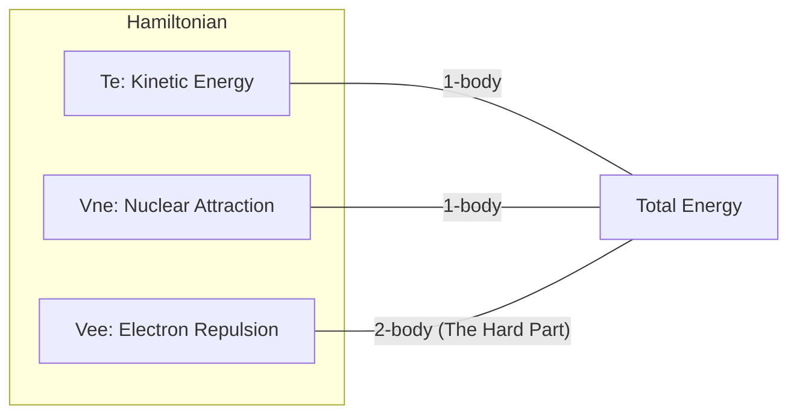

**图 1-1**：哈密顿量的结构。量子化学的所有近似本质上都是为了处理 **$\hat{V}_{ee}$（电子排斥项）**，因为它将所有电子的运动耦合在一起，使得方程无法分离变量。

### 1.2 为什么精确解不可行

#### Hilbert 空间的维度爆炸

在给定的有限基组（$K$ 个空间轨道 → $2K$ 个自旋轨道）下，电子薛定谔方程 **原则上** 可通过 **全组态相互作用（Full Configuration Interaction, FCI）** 精确求解：将波函数在所有可能的 $N$-电子 Slater 行列式构成的完备基中展开。

$$
|\Psi_{\mathrm{FCI}}\rangle = \sum_I c_I |\Phi_I\rangle

$$

#### FCI 维度公式

$N$ 个电子分布在 $K$ 个空间轨道中，其行列式总数（即 Hilbert 空间维数）为：

$$
D_{\mathrm{FCI}} = \binom{K}{N_\alpha} \times \binom{K}{N_\beta}

$$

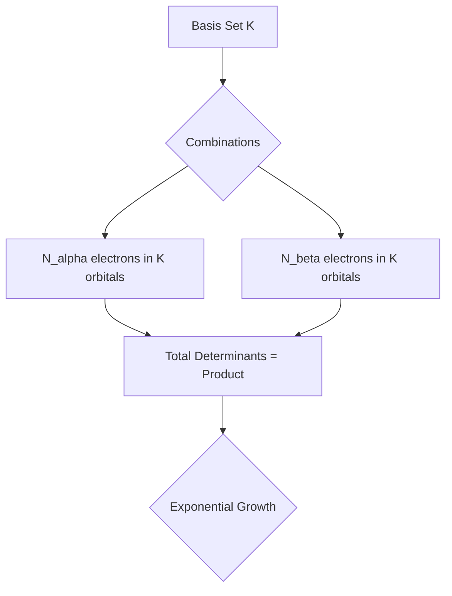

**图 1-2**：FCI 维度的组合爆炸。随着体系增大，存储哈密顿矩阵所需的内存 and 对角化所需的时间呈指数级增长。

#### 具体数值示例


| 分子   | 电子数$N$ | 基组    | 空间轨道数$K$ | FCI 维度$D_{\mathrm{FCI}}$ | 难度级别   |
| :------- | :---------: | :-------- | :-------------: | :--------------------------: | :----------- |
| H₂    |     2     | STO-3G  |       2       |             4             | 手算/入门  |
| H₂O   |    10    | STO-3G  |       7       |            441            | 笔记本秒算 |
| H₂O   |    10    | cc-pVDZ |      24      |   $\sim 1.8 \times 10^7$   | 工作站级   |
| H₂O   |    10    | cc-pVTZ |      58      | $\sim 1.5 \times 10^{13}$ | 超算极限   |
| C₆H₆ |    42    | cc-pVDZ |      114      |       $\sim 10^{51}$       | **指数墙** |

#### 近似的必然性

为了跨越“指数墙”，经典量子化学发展了四类主要策略：

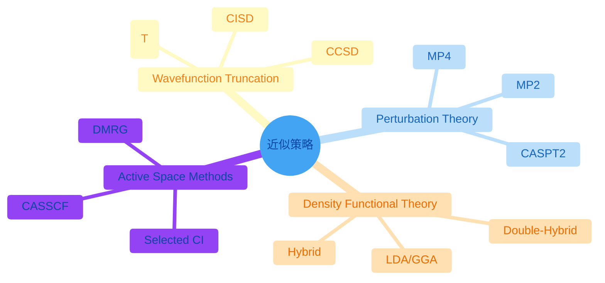

**图 1-3**：电子结构理论的近似版图（mindmap：`look: classic` 扁平样式无 neo 阴影；`base` 主题下 **浅红 / 浅黄 / 浅蓝 / 浅橙** 填充 + **深红 / 深橙 / 深蓝 / 深橙** 字与描边，根为浅蓝；`themeCSS` 去掉 `circle` 上 SVG `filter` 以免残留投影感）。

### 1.3 电子相关能

**相关能（Correlation Energy）** 定义为：

$$
E_{\mathrm{corr}} = E_{\mathrm{exact}} - E_{\mathrm{HF}}

$$

虽然相关能仅占总能量 of ~1%，但它决定了 **化学键的断裂与生成、激发态能级、弱相互作用** 等关键性质。

#### 动态相关 vs 静态相关


| 类型                       | 物理图像                                         | 波函数特征                         | 常用方法     |
| :--------------------------- | :------------------------------------------------- | :----------------------------------- | :------------- |
| **动态相关**<br/>(Dynamic) | 电子间的“瞬时回避”，像舞池中跳舞的人互相躲闪。 | 单参考权重高，需大量小激发的叠加。 | MP2, CCSD(T) |
| **静态相关**<br/>(Static)  | 轨道近简并，电子有多种等权重的排布方式。         | 多个行列式权重接近，单参考失效。   | CASSCF, DMRG |

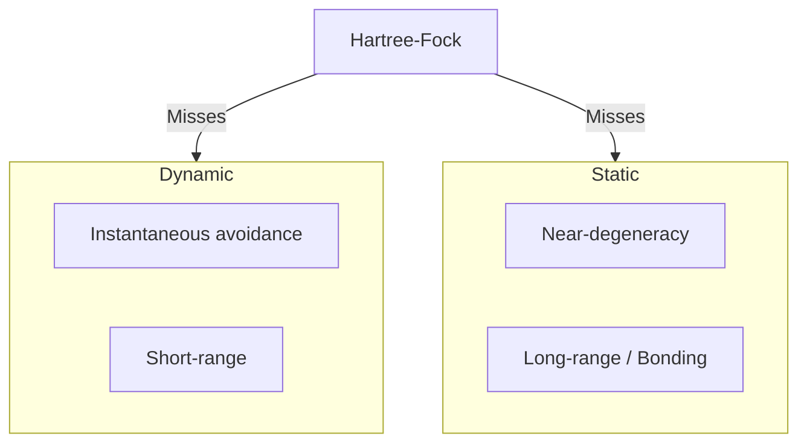

**图 1-4**：相关能的分类。HF 方法作为“平均场”，既忽略了电子的瞬时回避（动态），也无法描述多组态混合（静态）。

---

---

---

# 第二部分：近似思想与基组表示

## 3. 变分原理（Variational Principle）

### 3.1 变分原理的数学表述

#### 试探波函数与本征函数的关系

**重要概念**：试探波函数（trial wave function）通常**不是**精确的本征函数。

**定义**：

- **本征函数**：满足 $\hat{H}|\psi_n\rangle = E_n|\psi_n\rangle$ 的波函数，是精确解
- **试探波函数**：我们猜测或构造的近似波函数 $|\tilde{\psi}\rangle$，通常不满足本征方程

**关键区别**：

1. **本征函数是精确的**：

   - 满足 $\hat{H}|\psi_n\rangle = E_n|\psi_n\rangle$
   - 如果我们已经知道精确的本征函数，就不需要变分法了
2. **试探波函数是近似的**：

   - 通常不满足 $\hat{H}|\tilde{\psi}\rangle = E|\tilde{\psi}\rangle$（除非恰好是精确解）
   - 我们不知道精确解，所以用试探函数来近似
3. **特殊情况**：

   - 如果试探波函数**恰好是**精确的基态本征函数，那么：
     - $\hat{H}|\tilde{\psi}\rangle = E_0|\tilde{\psi}\rangle$
     - $E[\tilde{\psi}] = E_0$（达到精确值）
   - 但在实际中，这种情况几乎不可能发生

**实际应用**：

- 我们使用试探波函数（如Slater行列式、神经网络等）来**逼近**精确本征函数
- 通过优化参数，使试探函数尽可能接近精确解
- 变分原理告诉我们：即使试探函数不是精确解，我们也能得到能量上界

#### 定理

对于任意归一化的试探波函数 $|\tilde{\psi}\rangle$，其能量期望值满足：

$$
E[\tilde{\psi}] = \frac{\langle\tilde{\psi}|\hat{H}|\tilde{\psi}\rangle}{\langle\tilde{\psi}|\tilde{\psi}\rangle} \geq E_0

$$

其中 $E_0$ 是基态能量。

#### 证明

将 $|\tilde{\psi}\rangle$ 按能量本征态展开：

$$
|\tilde{\psi}\rangle = \sum_n c_n|\psi_n\rangle

$$

其中 $\{|\psi_n\rangle\}$ 是 $\hat{H}$ 的归一化本征态，$E_n$ 是对应本征值，且 $E_0 \leq E_1 \leq E_2 \leq \cdots$。

能量期望值为：

$$
E[\tilde{\psi}] = \frac{\langle\tilde{\psi}|\hat{H}|\tilde{\psi}\rangle}{\langle\tilde{\psi}|\tilde{\psi}\rangle} = \frac{\sum_{n,m} c_n^* c_m \langle\psi_n|\hat{H}|\psi_m\rangle}{\sum_n |c_n|^2}

$$

由于 $\langle\psi_n|\hat{H}|\psi_m\rangle = E_m \delta_{nm}$，得到：

$$
E[\tilde{\psi}] = \frac{\sum_n |c_n|^2 E_n}{\sum_n |c_n|^2} \geq \frac{\sum_n |c_n|^2 E_0}{\sum_n |c_n|^2} = E_0

$$

**关键结论**：

- 等号成立当且仅当 $|\tilde{\psi}\rangle$ 是基态本征函数 $|\psi_0\rangle$
- 这意味着：如果试探波函数**不是**精确的本征函数，那么 $E[\tilde{\psi}] > E_0$
- 只有当试探波函数**恰好是**精确的基态本征函数时，才能得到精确的基态能量

**物理意义**：

- 试探波函数可以表示为各个本征函数的叠加：$|\tilde{\psi}\rangle = \sum_n c_n|\psi_n\rangle$
- 如果 $c_0 = 1$ 且 $c_n = 0$（$n \neq 0$），则 $|\tilde{\psi}\rangle = |\psi_0\rangle$，这是精确的基态
- 在实际中，$|\tilde{\psi}\rangle$ 通常包含基态和激发态的混合，因此 $E[\tilde{\psi}] > E_0$

**例子**：

- Hartree-Fock波函数：是试探波函数，通常不是精确的本征函数
- 神经网络量子态：是试探波函数，通过优化可以逼近精确解
- 精确的基态：如果我们能构造出精确的基态，它既是本征函数，也可以作为试探函数（这时能量达到精确值）

### 3.2 变分原理的物理意义

1. **上界性质**：任何试探波函数给出的能量都是基态能量的上界
2. **优化方向**：通过优化波函数参数，可以不断降低能量，逼近基态
3. **误差估计**：能量误差与波函数误差的平方成正比

#### 试探波函数 vs 本征函数：总结

**核心答案**：试探波函数通常**不是**本征函数，但我们可以通过优化使其**逼近**本征函数。

**详细说明**：

1. **理想情况（我们不知道精确解）**：

   - 试探波函数 $|\tilde{\psi}\rangle$ 不是精确的本征函数
   - $\hat{H}|\tilde{\psi}\rangle \neq E|\tilde{\psi}\rangle$（一般情况）
   - $E[\tilde{\psi}] > E_0$（能量高于精确值）
2. **特殊情况（试探函数恰好是精确解）**：

   - 如果试探波函数恰好是精确的基态本征函数：$|\tilde{\psi}\rangle = |\psi_0\rangle$
   - 则 $\hat{H}|\tilde{\psi}\rangle = E_0|\tilde{\psi}\rangle$
   - $E[\tilde{\psi}] = E_0$（达到精确值）
3. **实际策略**：

   - 我们不知道精确的本征函数，所以使用试探函数
   - 通过变分优化，使试探函数尽可能接近精确本征函数
   - 能量会不断下降，逼近 $E_0$

**实际例子**：

- **Hartree-Fock方法**：

  - HF波函数是试探函数（单Slater行列式）
  - 通常不是精确的本征函数（因为忽略了电子相关）
  - HF能量 > 精确基态能量
- **CI方法**：

  - CI波函数是多个Slater行列式的线性组合（试探函数）
  - 随着包含更多行列式，越来越接近精确本征函数
  - FCI（包含所有可能行列式）在基组完备时给出精确本征函数
- **神经网络量子态**：

  - 神经网络参数化的波函数是试探函数
  - 通过优化神经网络参数，逼近精确本征函数
  - 理论上可以精确表示，但实际只能近似

### 3.3 变分法求解

#### 泛函变分

将波函数参数化：$|\psi(\boldsymbol{\theta})\rangle$，其中 $\boldsymbol{\theta}$ 是参数向量。

能量泛函：

$$
E[\boldsymbol{\theta}] = \frac{\langle\psi(\boldsymbol{\theta})|\hat{H}|\psi(\boldsymbol{\theta})\rangle}{\langle\psi(\boldsymbol{\theta})|\psi(\boldsymbol{\theta})\rangle}

$$

最优参数通过求解得到：

$$
\frac{\partial E[\boldsymbol{\theta}]}{\partial \theta_i} = 0, \quad \forall i

$$

#### 梯度计算

$$
\frac{\partial E}{\partial \theta_i} = 2 \text{Re}\left[\frac{\langle\frac{\partial\psi}{\partial\theta_i}|\hat{H}|\psi\rangle}{\langle\psi|\psi\rangle} - E \frac{\langle\frac{\partial\psi}{\partial\theta_i}|\psi\rangle}{\langle\psi|\psi\rangle}\right]

$$

---

## 5. 基组、LCAO 与轨道形状直觉

本章先从基组完备性与完备基组极限理解基组的数学地位，再进入 LCAO、STO/GTO、分裂价与极化函数的设计思想，最后补上原子轨道角动量与杂化的几何直观。

### 5.1 基组展开的数学原理

#### 8.1 基组完备性

##### 数学表述

基函数集合 $\{\chi_\mu(\mathbf{r})\}$ 是完备的，如果任意函数 $f(\mathbf{r}) \in L^2$ 可以表示为：

$$
f(\mathbf{r}) = \lim_{M \to \infty} \sum_{\mu=1}^M c_\mu \chi_\mu(\mathbf{r})

$$

##### 收敛性

随着基组增大，能量单调下降（变分原理）：

$$
E(M+1) \leq E(M)

$$

##### 完备基组极限（CBS）

$$
E_{CBS} = \lim_{M \to \infty} E(M)

$$

#### 8.2 基组类型

##### 原子轨道基组

- **STO**：Slater型轨道，$\chi(\mathbf{r}) = r^{n-1} e^{-\zeta r} Y_{lm}(\theta,\phi)$
- **GTO**：高斯型轨道，$\chi(\mathbf{r}) = x^l y^m z^n e^{-\alpha r^2}$

##### 基组大小

- **最小基组**：每个原子一个轨道
- **双zeta（DZ）**：每个原子轨道用两个函数
- **三zeta（TZ）**：三个函数
- **四zeta（QZ）**：四个函数

##### 极化函数

添加角动量更高的函数，例如在碳原子上添加 $d$ 函数。

##### 弥散函数

添加指数很小的函数，描述远离原子核的电子。

##### "紧凑但精确"的基组：Dunning基组为例

**问题**：什么是"紧凑但精确"的基组？

**核心概念**：

- **紧凑（Compact）**：基函数数量少，计算效率高
- **精确（Accurate）**：能够达到高精度结果
- **看似矛盾**：通常更多基函数 = 更高精度，但计算成本也更高

**Dunning基组的设计哲学**：

###### 1. 紧凑性（Compactness）

**定义**：用尽可能少的基函数达到目标精度。

**实现方式**：

- **优化的指数**：仔细选择高斯函数的指数 $\alpha$，使其在关键区域有好的覆盖
- **收缩基组（Contracted Basis Sets）**：
  - 将多个原始高斯函数（primitive Gaussians）线性组合成收缩函数（contracted functions）
  - 例如：$(6s, 3p)$ 表示6个原始s函数收缩成3个s函数
  - 减少基函数数量，但保持灵活性

**例子**：cc-pVDZ（Dunning基组）

- **cc** = correlation-consistent（相关一致）
- **p** = polarized（极化）
- **VDZ** = Valence Double Zeta（价层双zeta）
- 对于C原子：$(9s, 4p, 1d) \rightarrow [3s, 2p, 1d]$（9个原始s函数收缩成3个s函数）

###### 2. 精确性（Accuracy）

**定义**：能够准确描述电子结构，特别是：

- 价层电子（化学键）
- 电子相关效应
- 激发态

**实现方式**：

- **相关一致设计**：

  - 基组设计时考虑电子相关
  - 不同角动量函数（s, p, d, f...）的指数系统化选择
  - 使得相关能计算更准确
- **系统化改进**：

  - **cc-pVDZ**：双zeta + 极化（价层2个函数，1个d函数）
  - **cc-pVTZ**：三zeta + 极化（价层3个函数，1个d函数，1个f函数）
  - **cc-pVQZ**：四zeta + 极化（价层4个函数，更多极化函数）
  - 系统化地增加基组大小，可以外推到CBS极限

###### 3. 为什么"紧凑但精确"是可能的？

**关键洞察**：

**1. 不是所有基函数都同等重要**：

- 价层电子（参与化学键）需要更精确的描述
- 核心电子（靠近原子核）可以用较少函数描述
- 虚轨道（未占据）的精度要求较低

**2. 优化的基函数选择**：

- 传统基组：可能包含冗余或低效的基函数
- Dunning基组：每个基函数都经过优化，贡献最大化

**3. 收缩策略**：

- 原始函数：很多个（如9个s函数）
- 收缩函数：较少个（如3个s函数）
- 但收缩函数是原始函数的线性组合，保留了大部分信息

**数学表述**：

**原始基组**：$\{\chi_\mu^{primitive}\}_{\mu=1}^{M_{prim}}$

- 例如：9个原始s函数

**收缩基组**：$\{\chi_\nu^{contracted}\}_{\nu=1}^{M_{cont}}$

- 例如：3个收缩s函数
- 其中：$\chi_\nu^{contracted} = \sum_{\mu} c_{\nu\mu} \chi_\mu^{primitive}$

**关键**：$M_{cont} < M_{prim}$，但收缩基组几乎保留了原始基组的表达能力。

###### 4. Dunning基组系列

**cc-pVDZ（Correlation-Consistent Polarized Valence Double Zeta）**：

- **大小**：中等（对于C：14个基函数）
- **精度**：中等（误差通常 < 5 kcal/mol）
- **用途**：快速计算，初步研究

**cc-pVTZ（Triple Zeta）**：

- **大小**：较大（对于C：30个基函数）
- **精度**：高（误差通常 < 1 kcal/mol）
- **用途**：标准高精度计算

**cc-pVQZ（Quadruple Zeta）**：

- **大小**：很大（对于C：55个基函数）
- **精度**：很高（误差通常 < 0.1 kcal/mol）
- **用途**：极高精度，接近CBS

**aug-cc-pVXZ（Augmented）**：

- **aug** = 添加弥散函数
- **用途**：描述负离子、激发态、弱相互作用

###### 5. 紧凑 vs 精确的权衡

**传统基组（如STO-3G）**：

- **紧凑**：✓ 基函数很少
- **精确**：✗ 精度低（误差可能 > 50 kcal/mol）

**大基组（如cc-pV6Z）**：

- **紧凑**：✗ 基函数很多（计算昂贵）
- **精确**：✓ 精度很高（接近CBS）

**Dunning基组（如cc-pVTZ）**：

- **紧凑**：✓ 相对紧凑（比大基组小）
- **精确**：✓ 高精度（比小基组精确得多）
- **平衡**：在紧凑性和精确性之间找到最佳平衡

###### 6. 实际性能对比

**例子**：H$_2$O分子的能量计算


| 基组    | 基函数数 | 能量误差 (kcal/mol) | 计算时间 |
| --------- | ---------- | --------------------- | ---------- |
| STO-3G  | 7        | ~50                 | 很快     |
| 6-31G   | 13       | ~10                 | 快       |
| cc-pVDZ | 24       | ~3                  | 中等     |
| cc-pVTZ | 58       | ~0.5                | 慢       |
| cc-pVQZ | 115      | ~0.1                | 很慢     |

**观察**：

- cc-pVTZ用58个基函数达到0.5 kcal/mol精度
- 如果用传统方法，可能需要更多基函数才能达到相同精度
- 这就是"紧凑但精确"的含义

###### 7. 为什么Dunning基组"紧凑但精确"？

**设计原则**：

1. **相关一致**：

   - 基组设计时考虑电子相关
   - 不同角动量函数的指数系统化选择
   - 使得相关能计算更准确
2. **优化的指数**：

   - 通过大量测试优化
   - 每个基函数都贡献最大化
   - 避免冗余
3. **系统化**：

   - 可以系统化地增加基组大小
   - 可以外推到CBS极限
   - 可预测的精度改进
4. **物理直觉**：

   - 价层电子需要更精确描述
   - 核心电子可以用较少函数
   - 极化函数捕获电子相关

###### 8. 总结

**"紧凑但精确"的含义**：

- **紧凑**：用相对较少的基函数
- **精确**：达到高精度结果
- **关键**：通过优化设计，在紧凑性和精确性之间找到最佳平衡

**Dunning基组的优势**：

- 系统化设计
- 相关一致
- 优化的指数
- 可外推到CBS

**实际应用**：

- cc-pVTZ是标准的高精度基组
- 在精度和计算成本之间取得良好平衡
- 广泛用于量子化学计算

#### 8.3 基组误差

##### 基组截断误差

$$
E_{CBS} - E(M) = \sum_{k=M+1}^\infty a_k

$$

通常随 $M$ 指数衰减。

##### 基组叠加误差（BSSE）

在分子计算中，由于基组不完备，原子能量被高估，导致结合能被高估。

###### 修正方法（Counterpoise修正）

$$
E_{corrected} = E_{AB} - E_A^{AB} - E_B^{AB}

$$

其中 $E_A^{AB}$ 是原子 $A$ 在 $AB$ 的完整基组中的能量。

#### 8.4 赝势方法的数学基础

##### 全电子 vs 赝势

##### 全电子计算

显式处理所有电子，包括核心电子。

##### 赝势方法

用有效势替代核心电子，只处理价电子。

##### 赝势构造

##### 要求

1. **价轨道**：在价电子区域，赝轨道与全电子轨道相同
2. **能量**：赝轨道能量与全电子轨道能量相同
3. **归一化**：赝轨道归一化

##### 数学表述

在价电子区域 $r > r_c$（截断半径）：

$$
\phi_{ps}(r) = \phi_{AE}(r), \quad r > r_c

$$

在核心区域 $r < r_c$：

$$
\phi_{ps}(r) = \text{smooth function}

$$

##### 投影增强波（PAW）

##### 思想

将全电子波函数表示为赝波函数和核心修正的叠加：

$$
|\psi_{AE}\rangle = |\tilde{\psi}\rangle + \sum_i (|\phi_i\rangle - |\tilde{\phi}_i\rangle) \langle\tilde{p}_i|\tilde{\psi}\rangle

$$

其中：

- $|\tilde{\psi}\rangle$ 是赝波函数
- $|\phi_i\rangle$ 是全电子原子轨道
- $|\tilde{\phi}_i\rangle$ 是赝原子轨道
- $|\tilde{p}_i\rangle$ 是投影算符

#### C.2 `经典量子化学方法详解.md` — §2 基组（Basis Sets）

### 5.2 基组的层级与 LCAO 表示

#### 2.1 为什么要基组：LCAO 近似

在计算机中，我们无法直接处理连续函数，必须将分子轨道（MO）投影到一组已知的原子轨道（AO）基函数上：

$$
\phi_i(\mathbf{r}) = \sum_{\mu=1}^{K} C_{\mu i}\, \chi_\mu(\mathbf{r})

$$

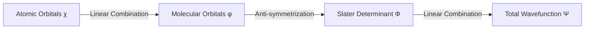

**图 2-1**：从原子轨道到总波函数的构建层次。

#### 2.1b 分子轨道与多电子分子波函数：是否同一对象？

**不是。** 二者处在 **不同变量个数与不同数学对象** 的层次上，但通过 HF / CI / CC 的构造规则紧密衔接。


| 对象                                                    | 变量与含义                                                                         | 典型角色                                                                            |
| :-------------------------------------------------------- | :----------------------------------------------------------------------------------- | :------------------------------------------------------------------------------------ |
| **分子轨道（MO）** $\psi_i(\mathbf{r})$                 | 三维空间的**单电子** 函数；与 $\alpha,\beta$ 组合成自旋轨道后参与行列式            | LCAO：$\psi_i=\sum_\mu C_{\mu i}\chi_\mu$；满足 Fock（或 Kohn–Sham）方程的本征函数 |
| **分子波函数** $\Psi(\mathbf{x}_1,\ldots,\mathbf{x}_N)$ | **$N$ 体** 函数，$\mathbf{x}_k=(\mathbf{r}_k,\omega_k)$；必须对电子交换 **反对称** | HF：单个 Slater 行列式 $                                                            |

**关系（层次链）**：**基组表** 定义固定的 AO 型基函数 $\{\chi_\mu\}$ → **LCAO** 得到 MO $\{\psi_i\}$（系数由 SCF 变分）→ **Slater 行列式**（及 CI/CC 叠加）得到多电子 $\Psi$。**不可**把「占据 MO 的集合」与「多电子 $\Psi$」等同：后者显式编码 **Pauli 反对称**；相关方法中精确 $\Psi$ **不能**由单一行列式的 MO 完全表示。

**闭壳层 Hartree–Fock 示例**（$N$ 偶数，$N/2$ 对自旋配对）：

$$
|\Phi_0\rangle
=
|\psi_1^\alpha\,\psi_1^\beta\,\psi_2^\alpha\,\psi_2^\beta\,\cdots\,\psi_{N/2}^\alpha\,\psi_{N/2}^\beta\rangle,

$$

其中每个 $\psi_k(\mathbf{r})$ 本身已是 $\sum_\mu C_{\mu k}\chi_\mu(\mathbf{r})$，但 $|\Phi_0\rangle$ **不是** $\psi_1(\mathbf{r}_1)\psi_1(\mathbf{r}_2)\cdots$ 的简单乘积，而是 **反对称化后的行列式**。

#### 2.1c 基组、基函数与原语高斯：STO-3G 如何构造并接到 MO 与 $\Psi$

**术语分清**：

- **基组（basis set）**：一整套 **写死的规则 + 参数表**（各元素有哪些壳、每个收缩由几条 **原语（primitive）** 高斯组成、指数 $\alpha_k$ 与 **收缩系数** $d_k$ 等）。名字 **STO-3G** 中 **3** 表示：用 **3 条** 原语 GTO 的 **固定** 线性组合去逼近 **1 条** Slater 型径向行为；**G** 表示以高斯为计算单元；**极小（minimal）** 指每个原子在给定壳层化学图像下只配 **最少** 条收缩函数（与分裂价基组相对）。
- **基函数（basis function）**：LCAO 展开里真正出现的 $\chi_\mu(\mathbf{r})$，通常为 **收缩高斯（contracted GTO）**，中心在某原子核 $\mathbf{R}_A$。

**原语 s 型高斯**（球对称，中心 $\mathbf{R}_A$）可写为

$$
g_{A,k}(\mathbf{r}) \propto \exp\!\bigl(-\alpha_{A,k}\,|\mathbf{r}-\mathbf{R}_A|^2\bigr)

$$

（归一化常数由程序按约定并入系数或单独存储。）

**收缩基函数**（STO-3G 对氢 1s 壳为 **一条**）：

$$
\chi_{A,\mathrm{1s}}^{\mathrm{STO\text{-}3G}}(\mathbf{r})
=
\sum_{k=1}^{3} d_{k}\,\tilde g_{A,k}(\mathbf{r}),

$$

其中 $\tilde g_{A,k}$ 为带规范的原语；$\alpha_k,d_k$ **全部来自基组文件**，不随分子变分。

**数值实例：氢原子 STO-3G（EMSL / Psi4 等程序内建表，Hehre–Stewart–Pople）**
每个 H 核一条 s 收缩，由 3 个原语组成，常用参数为

$$
\begin{aligned}
\alpha_1 &= 3.42525091, & d_1 &= 0.15432897,\\
\alpha_2 &= 0.62391373, & d_2 &= 0.53532814,\\
\alpha_3 &= 0.16885540, & d_3 &= 0.44463454.
\end{aligned}

$$

分子中有几个氢核，一般就有几条各 centered 的 $\chi$（记为 $\chi_A,\chi_B,\ldots$）。对 C、N、O 等，STO-3G 还常出现 **`SP` 壳**：**同一组** $\{\alpha_1,\alpha_2,\alpha_3\}$ 同时用于 **一条 s 收缩与三条 p 型收缩**，s 与 p 的 $d_k$ **不同**，仍全部由基组定义。

**LCAO–MO 与 Roothaan 方程**：

$$
\psi_i(\mathbf{r}) = \sum_{\mu=1}^{M} C_{\mu i}\,\chi_\mu(\mathbf{r}),
\qquad
\sum_{\nu} F_{\mu\nu} C_{\nu i} = \varepsilon_i \sum_{\nu} S_{\mu\nu} C_{\nu i}.

$$

**例：H$_2$ + STO-3G（极小基）**：$M=2$（两核各一条收缩 s），得 **2 个空间 MO** $\psi_1,\psi_2$（成键/反键型）；$C_{\mu i},\varepsilon_i$ 由 SCF 自洽给出。多中心积分先在 **原语** 上利用高斯乘积定理高效计算，再按收缩系数缩并到 $\chi_\mu$ 基上的 $S_{\mu\nu},(\mu\nu|\lambda\sigma)$ 等。

**再到多电子 HF 波函数**（2 电子闭壳层）：

$$
|\Phi_0\rangle = |\psi_1^\alpha\,\psi_1^\beta\rangle.

$$

**流水线小结**：基组表 $(\alpha_k,d_k)$ → 构造基函数 $\{\chi_\mu\}$ → LCAO 得 MO $\{\psi_i\}$ → Slater 行列式得 HF 的 $|\Phi_0\rangle$；CI/CC 仍在 **同一套** $\{\chi_\mu\}$ 上，多出来的自由度是组态系数或簇振幅，而不是为「每个电子」另换一套基组展开。

#### 2.2 STO 与 GTO 的博弈


| 特性           | Slater 型 (STO)              | Gaussian 型 (GTO)          |
| :--------------- | :----------------------------- | :--------------------------- |
| **形式**       | $e^{-\zeta r}$               | $e^{-\alpha r^2}$          |
| **物理正确性** | 高（核处有尖峰，远程衰减对） | 低（核处平滑，远程衰减快） |
| **计算效率**   | 极低（多中心积分无解析解）   | **极高**（高斯乘积定理）   |

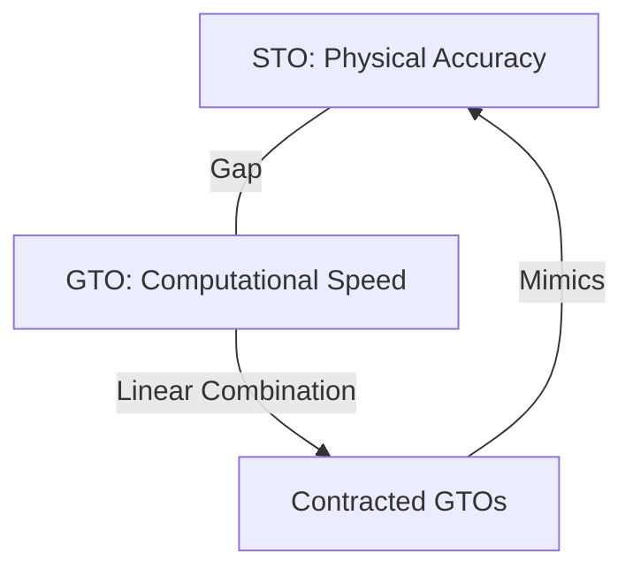

**图 2-2**：收缩高斯函数（CGTO）的逻辑：用多个计算极快的 GTO 叠加来模拟物理正确的 STO。

#### 2.3 基组的层级：从极小基到 CBS

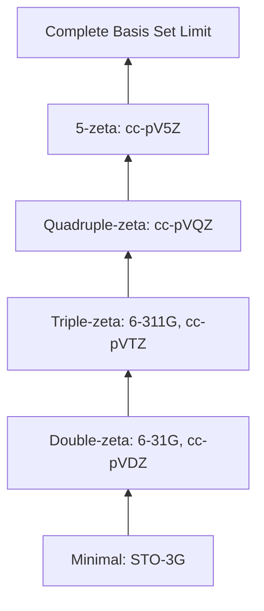

**图 2-3**：基组的系统性改进路径。

##### 分裂价、极化与 AO 角向（扩展阅读）

分裂价与极化函数的 **更细直觉**、与 **$\mathrm{s,p,d,f}$ 轨道及 $\mathrm{sp,sp^2,sp^3}$ 杂化** 的配图说明，见同目录专文：**[分裂价极化与原子轨道杂化.md](./分裂价极化与原子轨道杂化.md)**（含可重生成插图脚本 `generate_orbital_figures.py`）。

---

### 5.3 分裂价、极化、角动量与杂化的几何直观

#### 说明

本文在 **LCAO–MO / Hartree–Fock–Roothaan** 框架下，把三件事放在一起：

1. **分裂价（split-valence）** 基组为何能调节价层电子云的 **径向胖瘦**；
2. **极化（polarization）** 函数为何能描述 **角向形变**；
3. **原子轨道角动量** $s,p,d,f$ 与化学中常用的 **$\mathrm{sp},\mathrm{sp}^2,\mathrm{sp}^3$ 杂化** 的形状直觉。

文中的 **二维截面** 图由 `generate_orbital_figures.py` 生成（氢样径向包络 × 实笛卡尔角向因子）；**§3.1 三维** 图由 `generate_orbital_3d_figures.py` 生成。二者均为 **定性示意** 角向对称性，不替代具体基组 contracted GTO 系数。

---

#### 1. 分裂价：径向“多尺度”如何让环境调节胖瘦

##### 1.1 最小基的局限

在 **极小基** 中，每个原子每种对称类型（如价层一个 $s$、一组 $p$）往往只有 **一套** 固定的径向形状（由基组参数中的指数与收缩决定）。电子密度在环境中常常同时需要：

- **近核**更紧（控制核吸引能、避免不合理的外散）；
- **键间 / 价层外区**更松（把密度放到核间区域，或描述带电、激发等更弥散的价层）。

若只有 **一个** 径向模板，就像用单尺度去拟合“核附近陡、远处拖尾”的分布，**变分最优解仍被模板卡住**——这是基组 **径向不完备** 的来源之一。

##### 1.2 分裂价的数学图像

分裂价（如 6-31G 中的 “31”）把价层写成 **同一角动量对称性** 下多个径向自由度的线性组合：

$$
\chi_{\mathrm{valence}} = c_1\,\chi_{\mathrm{tight}} + c_2\,\chi_{\mathrm{loose}} + \cdots

$$

直觉上，$\chi_{\mathrm{tight}}$ 对应 **较大** 的高斯指数 $\zeta$（更集中在核附近），$\chi_{\mathrm{loose}}$ 对应 **较小** 的指数（更弥散）。
系数 $(c_1,c_2,\ldots)$ **不是手调的经验规则**，而是由 **Roothaan–Hall（或 Kohn–Sham）广义本征方程** 在 SCF 迭代中自动给出——等价于在更大的有限维子空间里做变分，使总能量最低。

化学环境（邻近原子、电荷、外场等）改变 **Fock / KS 矩阵元** $\Rightarrow$ 最优系数改变 $\Rightarrow$ 价层径向分布改变。这就是“**随环境自动调节电子云胖瘦**”的严格含义。

##### 1.3 示意图：紧 + 松


---

#### 2. 极化函数：角向自由度如何让电子云“形变”

##### 2.1 为什么 $s$ 不够

$l=0$ 的 $s$ 轨道是 **球对称** 的：绕核任意旋转，密度不变。
而成键方向、外加电场、低对称晶格环境等，往往给出 **各向异性** 的有效势。若基组在某一中心只有 $s$，则在该中心上可调的主要仍是 **球对称的径向调配**，**缺少把密度从一侧搬到另一侧的角向基**。

##### 2.2 在 $s$ 集合上加 $p$（或在 $p$ 上加 $d$）

**极化函数** 指在较低角动量壳层上增加 **更高角动量** 的函数（如碳的 $2s$ 上配 $2p$ 型极化、$2p$ 上配 $3d$ 型极化）。
物理图像：允许占据轨道出现

$$
\phi \approx c_s \chi_s + c_p \chi_{p} + \cdots

$$

的小的 $p$（或 $d$）混入，使原本近球形的密度获得 **偶极 / 更高多极** 的角向修正，从而降低在 **各向异性势** 下的能量。
计算实现上，它们只是 **更多的 AO 基函数** $\{\chi_\mu\}$，进入同样的重叠矩阵 $S_{\mu\nu}$ 与 Fock 矩阵 $F_{\mu\nu}$；**形变**来自解出的 MO 系数在这些函数上 **非零**。

##### 2.3 示意图：$s$ 与 $s+\varepsilon p_z$


---

#### 3. 量子数与角动量：$s,p,d,f$ 是什么

单电子原子（或 AO 的角向因子）用 **球谐函数** $Y_{l}^{m}(\theta,\varphi)$ 描述角向部分；$l$ 决定 **节面数与对称类型**：


| 符号 | $l$ | 简并度（不计自旋） | 角向特征（直觉）                        |
| :----: | :---: | :------------------: | :---------------------------------------- |
| $s$ |  0  |         1         | 球对称，无角向节面                      |
| $p$ |  1  |         3         | 哑铃形，一个平面节面                    |
| $d$ |  2  |         5         | 四瓣/环等，两个角向节面（型式依实组合） |
| $f$ |  3  |         7         | 更复杂的六瓣等图案                      |

**磁量子数** $m_l$ 标记角动量在某轴上的投影；化学绘图里常用 **实组合的笛卡尔型** $p_x,p_y,p_z$、$d_{z^2},d_{xz},\ldots$、$f_{xyz},\ldots$（与虚指数 $e^{im\varphi}$ 组合等价，仅换基）。

##### 3.1 三维角向形状（示意图）

下面给出与上表对应的 **三维** 图形（脚本 `generate_orbital_3d_figures.py`）。画法：在单位球方向 $(\theta,\varphi)$ 上取点 $(x,y,z)=(\sin\theta\cos\varphi,\,\sin\theta\sin\varphi,\,\cos\theta)$，将 **实笛卡尔角向因子** $A(x,y,z)$（与 §4–§6 截面图同一套多项式）映射为

- **矢径**：$R \propto \varepsilon + |A|^{1/2}$（常数 $\varepsilon$ 使 $s$ 仍接近球面，$l>0$ 时瓣状鼓起，便于看出节面与对称性）；
- **颜色**：$A$ 的 **正负**（红–白–蓝，定性对应波函数两瓣符号）。

每个子图 **左下角**（相对子图边框的嵌入小窗）附有 **右手直角坐标架**（红 $x$、绿 $y$、蓝 $z$），**视角与主图相同**（`elev`/`azim` 一致），便于对照屏幕上的空间取向。

这不是氢原子某能级下的 **固定半径** $|\psi|^2$ 等值面，而是 **突出角向对称性** 的教学示意；真实 AO 还需乘以径向因子 $R_{nl}(r)$，等值面会随主量子数 $n$ 改变。

**按 $l$ 各选一例**（与表中「哑铃 / 四瓣 / 更复杂」直觉对照）：


**$p$（简并度 3）**：


**$d$（简并度 5）**：


**$f$（简并度 7）**：


---

#### 4. 图示：$s,p$ 与截面选择

下图使用 **$xz$ 平面**（$y=0$）与 **$xy$ 平面**（$z=0$）两种截面。注意：**$p_y \propto y$ 在 $y=0$ 截面上恒为 0**，因此观察 $p_y$ 应看 $xy$ 截面。


---

#### 5. 图示：$d$ 轨道（实笛卡尔型）

$d$ 角向为 **二次齐次多项式**（乘以径向因子）。不同截面会突出不同分量：例如 $d_{xy}$ 在 $xy$ 平面最明显，而在 $xz$（$y=0$）截面上为 0。


---

#### 6. 图示：$f$ 轨道（实组合；混合截面）

$f$ 为 $l=3$，化学与量子化学程序中常用 **7 个实立方谐函数**（命名因文献略有差异，此处采用与 Gaussian 系程序常见的笛卡尔型命名一致的一类）。

**为何不能全是 $xz$（$y{=}0$）？** 三个分量 **整体含有因子 $y$**（因而写在 $xz$ 上时恒为 0）：

- $f_{yz^2} \propto y$；
- $f_{xyz} \propto xy$（在 $y{=}0$ 或 $x{=}0$ 或 $z{=}0$ 的坐标平面上都会消失，故用 **$x{=}y$ 斜面** $(u,u,z)$ 展示）；
- $f_{y(3x^2-y^2)} \propto y$。

若强行只画 $xz$，这三幅会变成 **全零截面**（`contourf` 看起来像空白），**不是程序出错**。当前图里对它们分别改用 **$yz$（$x{=}0$）**、**$x{=}y$**、**$xy$（$z{=}0$）** 切片，其余四个仍用 $xz$。


---

#### 7. 杂化（hybridization）：$sp$，$sp^2$，$sp^3$

##### 7.1 与 MO 理论的关系（重要）

**杂化不是哈密顿量的本征函数**：孤立原子的能量本征态仍按 $l$ 分类为 $s,p,d,\ldots$。
杂化是 **同一原子价层子空间** 内，把 $s$ 与 $p$（有时含 $d$）做 **固定的幺正线性组合**，使每个杂化轨道 **指向特定几何方向**，便于与键轴对齐来解释 **VSEPR / 成键方向**。
在完整的 LCAO–MO 计算中，**不必先声明杂化**：只要基组包含全部 $s,p,\ldots$，分子轨道会自行混合；杂化是 **同一线性空间** 的 **换基** 叙述。

##### 7.2 常见组合（归一化，示意）

令原子价层有 $s,p_x,p_y,p_z$。

- **$\mathrm{sp}$**（直线，如炔烃 sp–C 的 $\sigma$ 框架常用此语言）：两个等价方向相反，例如

$$
h_\pm = \frac{1}{\sqrt{2}}\bigl(s \pm p_z\bigr)

$$

（键轴若沿 $z$。）

- **$\mathrm{sp}^2$**（平面三角，$120^\circ$）：三个杂化轨道在平面内互成 $120^\circ$，典型写法

$$
h_k = \frac{1}{\sqrt{3}}\Bigl(s + \sqrt{2}\bigl(\cos\theta_k\, p_x + \sin\theta_k\, p_y\bigr)\Bigr),\quad \theta_k = 0,\ \frac{2\pi}{3},\ \frac{4\pi}{3}.

$$

- **$\mathrm{sp}^3$**（四面体，如甲烷）：四个等价方向，例如

$$
\begin{aligned}
h_1 &= \tfrac{1}{2}(s+p_x+p_y+p_z),\\
h_2 &= \tfrac{1}{2}(s-p_x-p_y+p_z),\\
h_3 &= \tfrac{1}{2}(s-p_x+p_y-p_z),\\
h_4 &= \tfrac{1}{2}(s+p_x-p_y-p_z).
\end{aligned}

$$

##### 7.3 图示


---

#### 8. 与基组设计的对应（小结）

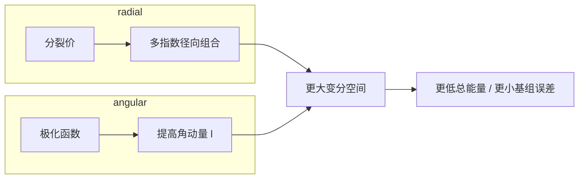

- **分裂价**：补 **径向多尺度**（紧/松），让 **同一 $l$** 的价层密度伸缩。
- **极化函数**：补 **角向**，让中心密度响应 **非球对称势**。
- **$s,p,d,f$ 与杂化**：描述 **AO 角向结构** 与 **价层指向性的化学语言**；数值 HF/DFT 中由 **基函数完备性与系数** 自动实现，不必手工指定杂化。

---

#### 9. 重新生成插图

在目录 `PandM/materials/learning/classical-chem/` 下执行：

```bash
python generate_orbital_figures.py
python generate_orbital_3d_figures.py
```

输出目录：`assets/orbitals/`（二维与三维 PNG 均在此目录）。

---

#### 参见

- 同目录总览笔记：[经典量子化学方法详解.md](./经典量子化学方法详解.md) **§2 基组**。

---

---

# 第三部分：Hartree-Fock 理论与算法

## 6. Hartree-Fock：从平均场到自洽场

本部分按照“先建立方法直觉，再进入严格推导，最后落实到矩阵算法与 SCF 迭代”的顺序展开。

### 6.1 方法总览与实践定位

#### 3.1 核心思想：平均场 + 单行列式

HF 将 $N$ 电子波函数限制为 **单个 Slater 行列式**（反对称乘积态）：

$$
\lvert\Phi_{\mathrm{HF}}\rangle = \lvert\phi_1 \phi_2 \cdots \phi_N\rangle_{\mathrm{det}}

$$

坐标表象下 $\Phi_{\mathrm{HF}}(\mathbf{x}_1,\ldots,\mathbf{x}_N)=\frac{1}{\sqrt{N!}}\det[\psi_i(\mathbf{x}_j)]$ 与 **§2.1**（反对称化算符 $\mathcal{A}$、Hartree 积）一致；$\psi_i$ 为自旋轨道，$\phi_i$ 为 MO 的空间因子。

##### 分子轨道与分子波函数：关系与区别（HF 语境）

- **分子轨道（MO）** $\phi_i(\mathbf{r})$：定义在 **单电子三维空间** 上的函数（与自旋因子组合成自旋轨道 $\psi_i(\mathbf{x})$）。HF 里它们是 Fock 方程的本征函数，并可通过 LCAO 在 AO 基 $\{\chi_\mu\}$ 上展开。
- **分子波函数（HF 近似下）** $|\Phi_{\mathrm{HF}}\rangle$：全体 $N$ 个电子坐标（及自旋）上的 **反对称** 多体态，即上式的 **Slater 行列式**；变量维数是 **$N$ 体**，不是 $3$ 维。

**二者关系**：$\{\phi_i\}$（或 $\{\psi_i\}$）是构造 $|\Phi_{\mathrm{HF}}\rangle$ 的 **单粒子砖块**，但 **不等于** $|\Phi_{\mathrm{HF}}\rangle$ 本身——行列式把 **Pauli 反对称** 编码进多体态；简单把「占据 MO 的乘积」写成 $\phi_1(\mathbf{r}_1)\phi_2(\mathbf{r}_2)\cdots$ **而未经反对称化** 是错误的。超越 HF 时，精确或近似的分子波函数常写为 **许多行列式** 的线性组合（CI）或 $e^{\hat{T}}|\Phi_0\rangle$（CC），MO 仍多指 **单粒子基**（正则轨道或自然轨道），而 $\Psi$ 指 **整个多电子态**。

更系统的对比表、闭壳层行列式写法及与基组（含 STO-3G）的衔接，见 **第二部分 §5.2** 小节 **2.1b、2.1c**；在「维度灾难 / 基组展开」处亦有 **提要** 互引。

$$
E_{\mathrm{HF}} = \langle\Phi_{\mathrm{HF}}\lvert\hat{H}\rvert\Phi_{\mathrm{HF}}\rangle

$$

对于闭壳层 RHF，还可写成更“能量分项”的形式：

$$
E_{\mathrm{RHF}} = 2\sum_i h_{ii} + \sum_{ij}\bigl(2J_{ij}-K_{ij}\bigr)

$$

其中

$$
h_{ii}=\langle i\lvert \hat{h}\rvert i\rangle,\qquad
J_{ij}=(ii\vert jj),\qquad
K_{ij}=(ij\vert ji)

$$

这里 $h_{ii}$ 是单电子动能 + 核吸引，$J_{ij}$ 是经典 Coulomb 排斥，$K_{ij}$ 是由反对称性强制出现的交换项。这个公式很值得记，因为它把 HF 的物理图像压缩成一句话：**HF = 单电子项 + 平均 Coulomb 场 + 交换修正**。

**从变分到单电子方程**：在单行列式约束下对轨道变分（保持正交归一），驻点条件即 **Hartree–Fock 方程**。**正则轨道** $\{\psi_i\}$ 满足同一形式的 **有效单电子方程**

$$
\hat{f}\,\psi_i = \varepsilon_i \psi_i

$$

**Fock 算符** $\hat{f}$ 只作用在 **一个** 电子的坐标上：动能 + 核吸引 + 由 **全体占据轨道** 构造的势。也就是说：多体问题在 HF 中被代换成「每个电子都在同一个 **自洽** 有效哈密顿量 $\hat{f}$ 里求本征态」——这正是 **平均场** 的数学含义：**不显式跟踪** 每一对电子的瞬时 $1/r_{ij}$，而用 **整体电荷分布** 生成单电子感受到的势。

**为何叫「平均」**：库仑项用电子密度 $\rho(\mathbf{r}')=\sum_{j}^{\mathrm{occ}}|\psi_j(\mathbf{r}')|^2$ 形成经典型势（如 $J(\mathbf{r})=\int \rho(\mathbf{r}')/|\mathbf{r}-\mathbf{r}'|\,d\mathbf{r}'$），相当于把其余电子的 **概率分布抹成密度** 再作用；同自旋的 **交换项** 与反对称单行列式一致，并抵消库仑自相互作用。$\hat{f}$ 依赖 $\{\psi_i\}$，故需 **SCF 迭代** 至自洽。

**需避免的误解**：此处的「等价」是 **HF 变分 ⟺ 自洽 Fock 方程 ⟺ 平均场单粒子图像**；**不** 表示与真实多体动力学或 **相关能**（超越平均场的部分）等价，后者需 CI/CC 等（§1.3、§4 以后）。

#### 3.2 Fock 算符与 Roothaan–Hall 方程

对闭壳层（RHF），令 $\mathbf{F}$ 为 **Fock 矩阵**（在 AO 基下），$\mathbf{S}$ 为重叠矩阵：

$$
\mathbf{F}\mathbf{C} = \mathbf{S}\mathbf{C}\boldsymbol{\varepsilon}

$$

其中 $\mathbf{C}$ 为分子轨道系数矩阵，$\boldsymbol{\varepsilon}$ 为轨道能量对角矩阵。

Fock 矩阵：

$$
F_{\mu\nu} = h_{\mu\nu} + \sum_{\lambda\sigma} P_{\lambda\sigma}\Bigl[(\mu\nu\vert\lambda\sigma) - \tfrac{1}{2}(\mu\lambda\vert\nu\sigma)\Bigr]

$$

若写成“算符作用”形式，单个自旋轨道满足

$$
\hat{f}(1) = \hat{h}(1) + \sum_{j}^{\mathrm{occ}}\bigl[\hat{J}_j(1)-\hat{K}_j(1)\bigr]

$$

其中 Coulomb 与 exchange 算符分别对任意试探轨道 $\varphi(1)$ 作用为

$$
\hat{J}_j(1)\varphi(1)=\left[\int \frac{|\psi_j(2)|^2}{r_{12}}\,d2\right]\varphi(1)

$$

$$
\hat{K}_j(1)\varphi(1)=\left[\int \frac{\psi_j^*(2)\varphi(2)}{r_{12}}\,d2\right]\psi_j(1)

$$

这两式特别能说明 **HF 为什么是平均场但又不只是经典静电学**：$\hat{J}$ 像“由电子密度抹开的平均排斥势”，而 $\hat{K}$ 则是纯量子力学的交换非局域作用，它没有经典对应物。

第一项 $h_{\mu\nu}$ 是单电子（动能+核吸引）积分；第二项是 **Coulomb 减 Exchange** 的双电子贡献，依赖密度矩阵 $P_{\lambda\sigma}$。

#### 3.3 SCF 迭代

由于 $\mathbf{F}$ 依赖 $\mathbf{P}$（即 $\mathbf{C}$），必须 **自洽场（Self-Consistent Field, SCF）** 迭代：

1. 初猜密度矩阵 $\mathbf{P}^{(0)}$
2. 构造 $\mathbf{F}^{(k)}$
3. 解广义本征值问题 → $\mathbf{C}^{(k)},\boldsymbol{\varepsilon}^{(k)}$
4. 更新 $\mathbf{P}^{(k+1)}$
5. 判断收敛（能量变化、密度变化 < 阈值）；未收敛则回到步骤 2

实际程序中常用 **DIIS（Direct Inversion in the Iterative Subspace）** 加速收敛。

```mermaid
flowchart TD
    A[Initial guess density P0] --> B[Build Fock matrix F[P]]
    B --> C[Solve FC = SCe]
    C --> D[Update orbitals and density]
    D --> E{Converged?}
    E -- No --> B
    E -- Yes --> F[HF stationary point]
```

**图 3-1**：SCF 的本质是一个非线性不动点问题。因为 Fock 矩阵依赖密度，而密度又来自 Fock 方程的本征矢，所以必须“猜测 -> 生成有效势 -> 重新解轨道 -> 更新密度”循环到自洽。

#### 3.4 RHF / UHF / ROHF


| 变体                                 | 适用                   | 轨道限制                       |
| -------------------------------------- | ------------------------ | -------------------------------- |
| **RHF**（Restricted HF）             | 闭壳层（所有电子成对） | $\alpha,\beta$ 共享空间轨道    |
| **UHF**（Unrestricted HF）           | 开壳层、键断裂         | $\alpha,\beta$ 独立优化        |
| **ROHF**（Restricted Open-shell HF） | 开壳层但要求自旋本征态 | 已占轨道受限，开壳层有特殊处理 |

**UHF 的自旋污染（spin contamination）**：UHF 波函数不是 $\hat{S}^2$ 的本征态，$\langle S^2\rangle$ 偏离目标值，可能导致能量与性质偏差。

#### 3.5 HF 捕捉了什么、遗漏了什么


| HF 包含                          | HF 遗漏                  |
| ---------------------------------- | -------------------------- |
| 动能                             | 动态相关（瞬时电子回避） |
| 核–电子吸引                     | 静态相关（多组态混合）   |
| 经典 Coulomb 排斥（平均场）      | 色散 / van der Waals     |
| **交换**（Fermi 洞，同自旋排斥） | Coulomb 洞（异自旋相关） |

#### 3.6 重要定理

- **Brillouin 定理**：在 RHF 收敛轨道下，$\langle\Phi_0\lvert\hat{H}\rvert\Phi_i^a\rangle = 0$（HF 与单激发之间的哈密顿矩阵元为零）。因此 **相关能的一阶修正来自双激发**（MP2 里只有双激发项对能量有贡献）。
- **Koopmans 定理**：HF 轨道能 $\varepsilon_i \approx -\mathrm{IP}_i$（第 $i$ 占据轨道的电离能），前提是忽略轨道弛豫和相关效应。是 **粗估** 电离势/电子亲和势的快速工具。

#### 3.7 计算标度


| 步骤                   | 标度                       |
| ------------------------ | ---------------------------- |
| 双电子积分生成         | $O(K^4)$（$K$ 为基函数数） |
| Fock 矩阵构建 + 对角化 | $O(K^3)$–$O(K^4)$         |
| 典型 SCF 总成本        | 常记为$O(N^3)$–$O(N^4)$   |

---

### 6.2 单行列式近似、能量泛函与变分推导

#### 4.1 单行列式近似与Slater行列式

（注：本节详细介绍Slater行列式的思想、数学原理和实际应用）

##### 一、思想来源：为什么需要Slater行列式？

##### 1.1 费米子的反对称性要求

**物理背景**：

- 电子是**费米子**（半整数自旋），必须遵守**泡利不相容原理**
- 两个电子不能处于完全相同的量子态
- 多电子波函数必须满足**反对称性**

**反对称性的要求**：
对于任意两个电子的交换，波函数必须改变符号：

$$
\psi(\ldots, \mathbf{x}_i, \ldots, \mathbf{x}_j, \ldots) = -\psi(\ldots, \mathbf{x}_j, \ldots, \mathbf{x}_i, \ldots)

$$

##### 1.2 简单乘积形式的失败（反对称性角度）

**注意**：波函数不能写成简单乘积有**两个独立的原因**：

1. **反对称性要求**（本节讨论）：费米子波函数必须反对称
2. **电子相关**（见5.2节）：库仑相互作用使电子运动相关

本节讨论第一个原因——反对称性。

**尝试1：简单乘积**

$$
\psi(\mathbf{x}_1, \ldots, \mathbf{x}_N) = \phi_1(\mathbf{x}_1) \phi_2(\mathbf{x}_2) \cdots \phi_N(\mathbf{x}_N)

$$

**问题**：不满足反对称性！

- 交换电子1和电子2：$\phi_1(\mathbf{x}_2) \phi_2(\mathbf{x}_1) \cdots \neq -\phi_1(\mathbf{x}_1) \phi_2(\mathbf{x}_2) \cdots$

**尝试2：对称化乘积**

$$
\psi = \frac{1}{\sqrt{N!}} \sum_{\text{所有排列}} \phi_1(\mathbf{x}_{P(1)}) \phi_2(\mathbf{x}_{P(2)}) \cdots \phi_N(\mathbf{x}_{P(N)})

$$

**问题**：这是**对称的**（适用于玻色子），但我们需要**反对称的**（费米子）！

##### 1.3 Slater的解决方案

**John C. Slater (1929)** 提出使用**行列式**来构造反对称波函数：

- 行列式天然具有反对称性
- 交换两行（对应交换两个电子）改变符号
- 两行相同（对应两个电子相同态）行列式为零（泡利原理）

##### 二、数学定义和构造

###### 2.1 Slater行列式的定义

对于 $N$ 电子系统，使用 $N$ 个单电子轨道 $\{\phi_1, \phi_2, \ldots, \phi_N\}$，Slater行列式定义为：

$$
\psi_{SD}(\mathbf{x}_1, \ldots, \mathbf{x}_N) = \frac{1}{\sqrt{N!}} \det\begin{pmatrix}
\phi_1(\mathbf{x}_1) & \phi_1(\mathbf{x}_2) & \cdots & \phi_1(\mathbf{x}_N) \\
\phi_2(\mathbf{x}_1) & \phi_2(\mathbf{x}_2) & \cdots & \phi_2(\mathbf{x}_N) \\
\vdots & \vdots & \ddots & \vdots \\
\phi_N(\mathbf{x}_1) & \phi_N(\mathbf{x}_2) & \cdots & \phi_N(\mathbf{x}_N)
\end{pmatrix}

$$

**简写形式**：

$$
\psi_{SD}(\mathbf{x}_1, \ldots, \mathbf{x}_N) = \frac{1}{\sqrt{N!}} \det[\phi_i(\mathbf{x}_j)]

$$

其中：

- $\mathbf{x}_i = (\mathbf{r}_i, \sigma_i)$ 是电子 $i$ 的坐标（空间坐标 $\mathbf{r}_i$ + 自旋 $\sigma_i$）
- $\phi_i(\mathbf{x})$ 是第 $i$ 个单电子轨道（自旋轨道）
- $\frac{1}{\sqrt{N!}}$ 是归一化因子

###### 2.2 行列式展开（两电子例子）

**两电子系统**（如He原子）：

$$
\psi_{SD}(\mathbf{x}_1, \mathbf{x}_2) = \frac{1}{\sqrt{2}} \det\begin{pmatrix}
\phi_1(\mathbf{x}_1) & \phi_1(\mathbf{x}_2) \\
\phi_2(\mathbf{x}_1) & \phi_2(\mathbf{x}_2)
\end{pmatrix}

$$

**展开行列式**：

$$
\psi_{SD}(\mathbf{x}_1, \mathbf{x}_2) = \frac{1}{\sqrt{2}} \left[\phi_1(\mathbf{x}_1)\phi_2(\mathbf{x}_2) - \phi_1(\mathbf{x}_2)\phi_2(\mathbf{x}_1)\right]

$$

**观察**：

- 第一项：$\phi_1(\mathbf{x}_1)\phi_2(\mathbf{x}_2)$（电子1在轨道1，电子2在轨道2）
- 第二项：$-\phi_1(\mathbf{x}_2)\phi_2(\mathbf{x}_1)$（电子1在轨道2，电子2在轨道1，带负号）
- 这自动包含了**交换项**，保证了反对称性

###### 2.3 三电子系统例子

$$
\psi_{SD}(\mathbf{x}_1, \mathbf{x}_2, \mathbf{x}_3) = \frac{1}{\sqrt{6}} \det\begin{pmatrix}
\phi_1(\mathbf{x}_1) & \phi_1(\mathbf{x}_2) & \phi_1(\mathbf{x}_3) \\
\phi_2(\mathbf{x}_1) & \phi_2(\mathbf{x}_2) & \phi_2(\mathbf{x}_3) \\
\phi_3(\mathbf{x}_1) & \phi_3(\mathbf{x}_2) & \phi_3(\mathbf{x}_3)
\end{pmatrix}

$$

**展开**（包含 $3! = 6$ 项）：

$$
\psi_{SD} = \frac{1}{\sqrt{6}} \left[
\begin{aligned}
&\phi_1(\mathbf{x}_1)\phi_2(\mathbf{x}_2)\phi_3(\mathbf{x}_3) \\
- &\phi_1(\mathbf{x}_1)\phi_2(\mathbf{x}_3)\phi_3(\mathbf{x}_2) \\
- &\phi_1(\mathbf{x}_2)\phi_2(\mathbf{x}_1)\phi_3(\mathbf{x}_3) \\
+ &\phi_1(\mathbf{x}_2)\phi_2(\mathbf{x}_3)\phi_3(\mathbf{x}_1) \\
+ &\phi_1(\mathbf{x}_3)\phi_2(\mathbf{x}_1)\phi_3(\mathbf{x}_2) \\
- &\phi_1(\mathbf{x}_3)\phi_2(\mathbf{x}_2)\phi_3(\mathbf{x}_1)
\end{aligned}
\right]

$$

**符号规律**：

- 每一项对应一个电子排列
- 符号由排列的**奇偶性**决定（偶排列为正，奇排列为负）

##### 三、数学性质

###### 3.1 反对称性（核心性质）

**定理**：Slater行列式自动满足反对称性。

**证明**：
交换电子 $i$ 和 $j$，相当于交换行列式的第 $i$ 列和第 $j$ 列：

$$
\psi_{SD}(\ldots, \mathbf{x}_i, \ldots, \mathbf{x}_j, \ldots) = \frac{1}{\sqrt{N!}} \det[\phi_k(\mathbf{x}_l)]

$$

交换列后：

$$
\psi_{SD}(\ldots, \mathbf{x}_j, \ldots, \mathbf{x}_i, \ldots) = \frac{1}{\sqrt{N!}} \det[\phi_k(\mathbf{x}_l')]

$$

其中 $\mathbf{x}_l'$ 是交换后的坐标。

由于行列式交换两列改变符号：

$$
\det[\phi_k(\mathbf{x}_l')] = -\det[\phi_k(\mathbf{x}_l)]

$$

因此：

$$
\psi_{SD}(\ldots, \mathbf{x}_j, \ldots, \mathbf{x}_i, \ldots) = -\psi_{SD}(\ldots, \mathbf{x}_i, \ldots, \mathbf{x}_j, \ldots)

$$

**✓ 反对称性得证！**

###### 3.2 泡利不相容原理

**定理**：如果两个电子处于相同的轨道，Slater行列式为零。

**证明**：
如果 $\phi_i = \phi_j$（$i \neq j$），那么行列式有两行相同：

$$
\det\begin{pmatrix}
\vdots & \vdots & \vdots \\
\phi_i(\mathbf{x}_1) & \phi_i(\mathbf{x}_2) & \cdots \\
\vdots & \vdots & \vdots \\
\phi_i(\mathbf{x}_1) & \phi_i(\mathbf{x}_2) & \cdots \\
\vdots & \vdots & \vdots
\end{pmatrix} = 0

$$

因为行列式有两行相同，其值为零。

**物理意义**：

- 两个电子不能处于完全相同的量子态
- 这自动实现了**泡利不相容原理**

###### 3.3 归一化

**定理**：如果轨道是正交归一的，Slater行列式自动归一化。

**证明**：

$$
\langle\psi_{SD}|\psi_{SD}\rangle = \int |\psi_{SD}(\mathbf{x}_1, \ldots, \mathbf{x}_N)|^2 d\mathbf{x}_1 \cdots d\mathbf{x}_N

$$

对于正交归一的轨道：$\int \phi_i^*(\mathbf{x}) \phi_j(\mathbf{x}) d\mathbf{x} = \delta_{ij}$

可以证明（使用行列式的性质）：

$$
\langle\psi_{SD}|\psi_{SD}\rangle = \frac{1}{N!} \sum_{P,Q} (-1)^{P+Q} \prod_{i=1}^N \int \phi_{P(i)}^*(\mathbf{x}_i) \phi_{Q(i)}(\mathbf{x}_i) d\mathbf{x}_i

$$

由于轨道正交归一，只有当 $P = Q$ 时项才非零，且每个这样的项贡献为1。共有 $N!$ 个排列，因此：

$$
\langle\psi_{SD}|\psi_{SD}\rangle = \frac{1}{N!} \cdot N! = 1

$$

**✓ 归一化得证！**

###### 3.4 轨道正交归一条件

为了保证Slater行列式归一化，轨道必须满足：

$$
\int \phi_i^*(\mathbf{x}) \phi_j(\mathbf{x}) d\mathbf{x} = \delta_{ij}

$$

这保证了轨道之间是正交归一的。

##### 四、具体例子：He原子

###### 4.1 基态He原子

**电子数**：$N = 2$

**轨道选择**：

- $\phi_1(\mathbf{x}) = 1s(\mathbf{r}) \alpha(\sigma)$（1s轨道，自旋上）
- $\phi_2(\mathbf{x}) = 1s(\mathbf{r}) \beta(\sigma)$（1s轨道，自旋下）

**Slater行列式**：

$$
\psi_{He}(\mathbf{x}_1, \mathbf{x}_2) = \frac{1}{\sqrt{2}} \det\begin{pmatrix}
1s(\mathbf{r}_1)\alpha(\sigma_1) & 1s(\mathbf{r}_2)\alpha(\sigma_2) \\
1s(\mathbf{r}_1)\beta(\sigma_1) & 1s(\mathbf{r}_2)\beta(\sigma_2)
\end{pmatrix}

$$

**展开**：

$$
\psi_{He} = \frac{1}{\sqrt{2}} \left[1s(\mathbf{r}_1)\alpha(\sigma_1) \cdot 1s(\mathbf{r}_2)\beta(\sigma_2) - 1s(\mathbf{r}_2)\alpha(\sigma_2) \cdot 1s(\mathbf{r}_1)\beta(\sigma_1)\right]

$$

**物理意义**：

- 两个电子都在1s轨道上
- 但自旋相反（一个上，一个下）
- 这满足泡利原理：虽然空间部分相同，但自旋不同

###### 4.2 激发态He原子

**轨道选择**：

- $\phi_1(\mathbf{x}) = 1s(\mathbf{r}) \alpha(\sigma)$
- $\phi_2(\mathbf{x}) = 2s(\mathbf{r}) \alpha(\sigma)$（注意：两个都是自旋上！）

**Slater行列式**：

$$
\psi_{He^*} = \frac{1}{\sqrt{2}} \left[1s(\mathbf{r}_1)\alpha(\sigma_1) \cdot 2s(\mathbf{r}_2)\alpha(\sigma_2) - 2s(\mathbf{r}_1)\alpha(\sigma_1) \cdot 1s(\mathbf{r}_2)\alpha(\sigma_2)\right]

$$

**物理意义**：

- 一个电子在1s轨道，另一个在2s轨道
- 两个都是自旋上（这是允许的，因为空间部分不同）

##### 五、实际应用

###### 5.1 Hartree-Fock方法

**核心**：使用**单个Slater行列式**作为试探波函数：

$$
\psi_{HF} = \frac{1}{\sqrt{N!}} \det[\phi_i(\mathbf{x}_j)]

$$

**优化**：通过变分原理优化轨道 $\{\phi_i\}$，使得能量最小。

**优点**：

- 自动满足反对称性
- 自动满足泡利原理
- 计算相对简单

**缺点**：

- 只包含一个Slater行列式
- 忽略了电子相关（动态相关）

###### 5.2 组态相互作用（CI）

**核心**：使用**多个Slater行列式**的线性组合：

$$
\psi_{CI} = \sum_I c_I \psi_{SD}^{(I)}

$$

其中每个 $\psi_{SD}^{(I)}$ 是不同的Slater行列式（不同的轨道占据）。

**例子**：

- **参考组态**：$\psi_{SD}^{(0)} = \det[1s\alpha, 1s\beta]$（基态）
- **单激发**：$\psi_{SD}^{(1)} = \det[1s\alpha, 2s\alpha]$（一个电子激发）
- **双激发**：$\psi_{SD}^{(2)} = \det[2s\alpha, 2s\beta]$（两个电子都激发）

**优点**：

- 可以包含电子相关
- 可以描述激发态

**缺点**：

- 需要大量Slater行列式
- 计算复杂度高

###### 5.3 耦合簇方法（CC）

**核心**：使用**指数算符**作用在参考Slater行列式上：

$$
\psi_{CC} = e^{\hat{T}} \psi_{SD}^{(0)}

$$

其中 $\hat{T}$ 是激发算符，展开后包含多个Slater行列式。

**为什么用指数算符？**（简要）数学上：分离系统时 $e^{\hat{T}_A + \hat{T}_B} = e^{\hat{T}_A} e^{\hat{T}_B}$，自动满足大小一致性；指数展开用少量振幅（$\hat{T}$ 的系数）自动生成高激发（如 $\hat{T}_2^2$ 给出四激发），参数少而表达能力强。物理上：指数形式对应"连接关联"的乘积结构，符合多体理论中能量与波函数可分解的图像；$e^{\hat{T}}$ 可理解为对参考态的"完全相关化"。详细推导见第 6.2 节"耦合簇方法"及其中"3.6 指数算符的数学与物理意义"。

###### 5.4 全组态相互作用（FCI）

**核心**：包含**所有可能的Slater行列式**：

$$
\psi_{FCI} = \sum_{\text{所有可能的占据}} c_I \psi_{SD}^{(I)}

$$

在基组完备时，FCI给出精确解。

##### 六、Slater行列式的优缺点总结

###### 优点：

1. **自动满足反对称性**：行列式天然反对称
2. **自动满足泡利原理**：相同轨道使行列式为零
3. **数学简洁**：行列式有成熟的理论和计算方法
4. **物理直观**：每个轨道对应一个电子（在HF中）

###### 缺点：

1. **单行列式限制**：一个Slater行列式只能描述平均场，不能描述电子相关
2. **组合爆炸**：多个行列式时，数量呈指数增长
3. **基组依赖**：结果依赖于基组的选择

##### 七、重要说明

**轨道就是函数**：

- $\phi_i(\mathbf{x})$ 是单电子波函数（轨道），是坐标和自旋的函数
- 在量子化学中，"轨道"和"单电子波函数"是同义词
- 这些轨道可以用基组 $\{\chi_\mu(\mathbf{r})\}$ 展开：

  $$
  \phi_i(\mathbf{x}) = \sum_{\mu=1}^M c_{i\mu} \chi_\mu(\mathbf{r}) \alpha(\sigma) \quad \text{或} \quad \phi_i(\mathbf{x}) = \sum_{\mu=1}^M c_{i\mu} \chi_\mu(\mathbf{r}) \beta(\sigma)

  $$

  其中 $\alpha(\sigma)$ 和 $\beta(\sigma)$ 是自旋函数

#### 4.2 Hartree-Fock能量泛函

##### 能量表达式

对于单Slater行列式，能量为：

$$
E_{HF}[\{\phi_i\}] = \sum_{i=1}^N h_i + \frac{1}{2}\sum_{i,j=1}^N (J_{ij} - K_{ij})

$$

其中：

- **单电子积分**：

  $$
  h_i = \int \phi_i^*(\mathbf{x}) \hat{h}(\mathbf{x}) \phi_i(\mathbf{x}) d\mathbf{x}

  $$

  其中 $\hat{h}(\mathbf{x}) = -\frac{1}{2}\nabla^2 - \sum_A \frac{Z_A}{|\mathbf{r} - \mathbf{R}_A|}$
- **库仑积分**：

  $$
  J_{ij} = \int \int \frac{|\phi_i(\mathbf{x}_1)|^2 |\phi_j(\mathbf{x}_2)|^2}{|\mathbf{r}_1 - \mathbf{r}_2|} d\mathbf{x}_1 d\mathbf{x}_2

  $$
- **交换积分**：

  $$
  K_{ij} = \int \int \frac{\phi_i^*(\mathbf{x}_1) \phi_j(\mathbf{x}_1) \phi_j^*(\mathbf{x}_2) \phi_i(\mathbf{x}_2)}{|\mathbf{r}_1 - \mathbf{r}_2|} d\mathbf{x}_1 d\mathbf{x}_2

  $$

##### 能量公式的详细推导

**一、能量期望值的定义**

对于单Slater行列式波函数 $|\Phi_0\rangle$，能量期望值为：

$$
E_{HF} = \langle\Phi_0|\hat{H}|\Phi_0\rangle

$$

其中电子哈密顿量为：

$$
\hat{H} = \sum_{i=1}^N \hat{h}(\mathbf{x}_i) + \frac{1}{2}\sum_{i\neq j}^N \frac{1}{|\mathbf{r}_i - \mathbf{r}_j|}

$$

**二、单电子项的期望值**

对于单电子算符，由于Slater行列式的反对称性，每个占据轨道贡献相同：

$$
\langle\Phi_0|\sum_{i=1}^N \hat{h}(\mathbf{x}_i)|\Phi_0\rangle = \sum_{i=1}^N \int \phi_i^*(\mathbf{x}) \hat{h}(\mathbf{x}) \phi_i(\mathbf{x}) d\mathbf{x} = \sum_{i=1}^N h_i

$$

**三、双电子项的期望值（两电子例子）**

对于两电子系统，Slater行列式为：

$$
\Phi_0(\mathbf{x}_1, \mathbf{x}_2) = \frac{1}{\sqrt{2}}[\phi_1(\mathbf{x}_1)\phi_2(\mathbf{x}_2) - \phi_1(\mathbf{x}_2)\phi_2(\mathbf{x}_1)]

$$

计算双电子积分：

$$
\langle\Phi_0|\frac{1}{|\mathbf{r}_1 - \mathbf{r}_2|}|\Phi_0\rangle = \frac{1}{2}\int \int [\phi_1^*(\mathbf{x}_1)\phi_2^*(\mathbf{x}_2) - \phi_1^*(\mathbf{x}_2)\phi_2^*(\mathbf{x}_1)] \frac{1}{|\mathbf{r}_1 - \mathbf{r}_2|} [\phi_1(\mathbf{x}_1)\phi_2(\mathbf{x}_2) - \phi_1(\mathbf{x}_2)\phi_2(\mathbf{x}_1)] d\mathbf{x}_1 d\mathbf{x}_2

$$

展开后得到4项：

1. **库仑项**：$\int \int \frac{|\phi_1(\mathbf{x}_1)|^2 |\phi_2(\mathbf{x}_2)|^2}{|\mathbf{r}_1 - \mathbf{r}_2|} d\mathbf{x}_1 d\mathbf{x}_2 = J_{12}$
2. **交换项**：$-\int \int \frac{\phi_1^*(\mathbf{x}_1)\phi_2(\mathbf{x}_1)\phi_2^*(\mathbf{x}_2)\phi_1(\mathbf{x}_2)}{|\mathbf{r}_1 - \mathbf{r}_2|} d\mathbf{x}_1 d\mathbf{x}_2 = -K_{12}$
3. **交换项**：$-\int \int \frac{\phi_1^*(\mathbf{x}_2)\phi_2(\mathbf{x}_2)\phi_2^*(\mathbf{x}_1)\phi_1(\mathbf{x}_1)}{|\mathbf{r}_1 - \mathbf{r}_2|} d\mathbf{x}_1 d\mathbf{x}_2 = -K_{12}$
4. **库仑项**：$\int \int \frac{|\phi_1(\mathbf{x}_2)|^2 |\phi_2(\mathbf{x}_1)|^2}{|\mathbf{r}_1 - \mathbf{r}_2|} d\mathbf{x}_1 d\mathbf{x}_2 = J_{12}$

合并：$\frac{1}{2}[J_{12} - K_{12} - K_{12} + J_{12}] = J_{12} - K_{12}$

**四、推广到N电子系统**

对于N电子系统，考虑所有电子对 $(i,j)$：

$$
\langle\Phi_0|\frac{1}{2}\sum_{i\neq j}^N \frac{1}{|\mathbf{r}_i - \mathbf{r}_j|}|\Phi_0\rangle = \frac{1}{2}\sum_{i,j=1}^N (J_{ij} - K_{ij})

$$

**注意**：当 $i = j$ 时，$J_{ii} = K_{ii}$，所以 $J_{ii} - K_{ii} = 0$，因此 $\sum_{i,j}$ 和 $\sum_{i\neq j}$ 等价。

**五、物理解释**

1. **单电子项** $\sum_i h_i$：每个电子的动能和核-电子相互作用
2. **库仑项** $\frac{1}{2}\sum_{i,j} J_{ij}$：电子之间的经典库仑排斥（使能量增加）
3. **交换项** $-\frac{1}{2}\sum_{i,j} K_{ij}$：费米子统计导致的交换能（使能量降低，稳定化）

**为什么有因子 $\frac{1}{2}$？**

- 每个电子对 $(i,j)$ 被计算了两次，但 $J_{ij} = J_{ji}$ 和 $K_{ij} = K_{ji}$，所以需要除以2。

**为什么交换项是负的？**

- 交换能是稳定化效应，由于泡利不相容原理，相同自旋的电子避免出现在同一位置，降低了库仑排斥。

#### 4.3 Hartree-Fock方程的变分推导

（注：本节详细介绍Hartree-Fock方程的变分推导过程）

##### 一、变分问题的提出

###### 1.1 优化问题

**目标**：找到最优的轨道 $\{\phi_i\}$，使得Hartree-Fock能量最小：

$$
\min_{\{\phi_i\}} E_{HF}[\{\phi_i\}] = \sum_{i=1}^N h_i + \frac{1}{2}\sum_{i,j=1}^N (J_{ij} - K_{ij})

$$

**约束条件**：轨道必须正交归一

$$
\int \phi_i^*(\mathbf{x}) \phi_j(\mathbf{x}) d\mathbf{x} = \delta_{ij}, \quad \forall i,j

$$

###### 1.2 为什么需要约束？

**物理原因**：

- 轨道必须正交归一，这是量子力学的基本要求
- 保证波函数的归一化
- 保证不同轨道之间的独立性

**数学原因**：

- 如果没有约束，可以任意缩放轨道来降低能量（这是非物理的）
- 约束确保我们找到物理上有意义的解

##### 二、拉格朗日乘数法

###### 2.1 基本思想

**无约束优化**：$\min f(\mathbf{x})$

- 条件：$\nabla f = 0$

**有约束优化**：$\min f(\mathbf{x})$，约束 $g(\mathbf{x}) = 0$

- 不能直接令 $\nabla f = 0$（可能违反约束）
- **拉格朗日乘数法**：构造拉格朗日函数
  $$
  \mathcal{L}(\mathbf{x}, \lambda) = f(\mathbf{x}) - \lambda g(\mathbf{x})

  $$
- 条件：$\nabla_{\mathbf{x}} \mathcal{L} = 0$ 和 $\nabla_{\lambda} \mathcal{L} = 0$

###### 2.2 应用到Hartree-Fock问题

**目标函数**：$E_{HF}[\{\phi_i\}]$

**约束函数**：$g_{ij}[\{\phi_i\}] = \int \phi_i^* \phi_j d\mathbf{x} - \delta_{ij} = 0$

**拉格朗日函数**：

$$
\mathcal{L}[\{\phi_i\}] = E_{HF}[\{\phi_i\}] - \sum_{i,j} \lambda_{ij} \left(\int \phi_i^* \phi_j d\mathbf{x} - \delta_{ij}\right)

$$

其中 $\lambda_{ij}$ 是拉格朗日乘数（待定常数）。

**为什么是 $\sum_{i,j}$？**

- 有 $N$ 个轨道，需要 $N \times N$ 个约束条件
- 每个约束对应一个拉格朗日乘数 $\lambda_{ij}$

##### 三、变分推导的详细步骤

###### 3.1 拉格朗日函数的展开

**完整形式**：

$$
\mathcal{L}[\{\phi_i\}] = \sum_{i=1}^N h_i + \frac{1}{2}\sum_{i,j=1}^N (J_{ij} - K_{ij}) - \sum_{i,j} \lambda_{ij} \left(\int \phi_i^* \phi_j d\mathbf{x} - \delta_{ij}\right)

$$

**展开各项**：

- 单电子项：$\sum_i h_i = \sum_i \int \phi_i^* \hat{h} \phi_i d\mathbf{x}$
- 库仑项：$\frac{1}{2}\sum_{i,j} J_{ij} = \frac{1}{2}\sum_{i,j} \int \int \frac{|\phi_i(\mathbf{x}_1)|^2 |\phi_j(\mathbf{x}_2)|^2}{|\mathbf{r}_1 - \mathbf{r}_2|} d\mathbf{x}_1 d\mathbf{x}_2$
- 交换项：$-\frac{1}{2}\sum_{i,j} K_{ij} = -\frac{1}{2}\sum_{i,j} \int \int \frac{\phi_i^*(\mathbf{x}_1)\phi_j(\mathbf{x}_1)\phi_j^*(\mathbf{x}_2)\phi_i(\mathbf{x}_2)}{|\mathbf{r}_1 - \mathbf{r}_2|} d\mathbf{x}_1 d\mathbf{x}_2$
- 约束项：$-\sum_{i,j} \lambda_{ij} \left(\int \phi_i^* \phi_j d\mathbf{x} - \delta_{ij}\right)$

###### 3.2 对 $\phi_k^*$ 的变分

**变分原理**：最优解满足

$$
\frac{\delta \mathcal{L}}{\delta \phi_k^*} = 0, \quad \forall k

$$

**关键技巧**：使用泛函导数（functional derivative）

**步骤1：单电子项的变分**

$$
\frac{\delta}{\delta \phi_k^*} \sum_i \int \phi_i^* \hat{h} \phi_i d\mathbf{x} = \hat{h} \phi_k(\mathbf{x})

$$

**推导**：

- 只有 $i = k$ 的项依赖于 $\phi_k^*$
- $\frac{\delta}{\delta \phi_k^*} \int \phi_k^* \hat{h} \phi_k d\mathbf{x} = \hat{h} \phi_k(\mathbf{x})$

**步骤2：库仑项的变分**

$$
\frac{\delta}{\delta \phi_k^*} \frac{1}{2}\sum_{i,j} \int \int \frac{|\phi_i(\mathbf{x}_1)|^2 |\phi_j(\mathbf{x}_2)|^2}{|\mathbf{r}_1 - \mathbf{r}_2|} d\mathbf{x}_1 d\mathbf{x}_2

$$

**分析**：

- 当 $i = k$ 时：$\frac{\delta}{\delta \phi_k^*} |\phi_k(\mathbf{x}_1)|^2 = \phi_k(\mathbf{x}_1)$
- 贡献：$\sum_j \int \frac{|\phi_j(\mathbf{x}_2)|^2}{|\mathbf{r}_1 - \mathbf{r}_2|} d\mathbf{x}_2 \phi_k(\mathbf{x}_1) = \sum_j \hat{J}_j(\mathbf{x}_1) \phi_k(\mathbf{x}_1)$

其中库仑算符定义为：

$$
\hat{J}_j(\mathbf{x}_1) = \int \frac{|\phi_j(\mathbf{x}_2)|^2}{|\mathbf{r}_1 - \mathbf{r}_2|} d\mathbf{x}_2

$$

**结果**：

$$
\frac{\delta}{\delta \phi_k^*} \frac{1}{2}\sum_{i,j} J_{ij} = \sum_j \hat{J}_j(\mathbf{x}) \phi_k(\mathbf{x})

$$

**步骤3：交换项的变分**

$$
\frac{\delta}{\delta \phi_k^*} \left(-\frac{1}{2}\sum_{i,j} \int \int \frac{\phi_i^*(\mathbf{x}_1)\phi_j(\mathbf{x}_1)\phi_j^*(\mathbf{x}_2)\phi_i(\mathbf{x}_2)}{|\mathbf{r}_1 - \mathbf{r}_2|} d\mathbf{x}_1 d\mathbf{x}_2\right)

$$

**分析**：

- 当 $i = k$ 时：$\frac{\delta}{\delta \phi_k^*} \phi_k^*(\mathbf{x}_1)\phi_k(\mathbf{x}_2) = \phi_k(\mathbf{x}_2)$
- 贡献：$-\sum_j \int \frac{\phi_j(\mathbf{x}_1)\phi_j^*(\mathbf{x}_2)}{|\mathbf{r}_1 - \mathbf{r}_2|} d\mathbf{x}_2 \phi_k(\mathbf{x}_1) = -\sum_j \hat{K}_j(\mathbf{x}_1) \phi_k(\mathbf{x}_1)$

其中交换算符定义为：

$$
\hat{K}_j(\mathbf{x}_1)\phi_k(\mathbf{x}_1) = \int \frac{\phi_j^*(\mathbf{x}_2)\phi_k(\mathbf{x}_2)}{|\mathbf{r}_1 - \mathbf{r}_2|} d\mathbf{x}_2 \phi_j(\mathbf{x}_1)

$$

**注意**：交换算符是**非局域**的（依赖于 $\phi_k$ 在 $\mathbf{x}_2$ 的值）。

**结果**：

$$
\frac{\delta}{\delta \phi_k^*} \left(-\frac{1}{2}\sum_{i,j} K_{ij}\right) = -\sum_j \hat{K}_j(\mathbf{x}) \phi_k(\mathbf{x})

$$

**步骤4：约束项的变分**

$$
\frac{\delta}{\delta \phi_k^*} \left(-\sum_{i,j} \lambda_{ij} \int \phi_i^* \phi_j d\mathbf{x}\right) = -\sum_j \lambda_{kj} \phi_j(\mathbf{x})

$$

**推导**：

- 当 $i = k$ 时，$\frac{\delta}{\delta \phi_k^*} \int \phi_k^* \phi_j d\mathbf{x} = \phi_j(\mathbf{x})$
- 贡献：$-\sum_j \lambda_{kj} \phi_j(\mathbf{x})$

###### 3.3 合并所有项

**变分方程**：

$$
\frac{\delta \mathcal{L}}{\delta \phi_k^*} = \hat{h}(\mathbf{x}) \phi_k(\mathbf{x}) + \sum_j \hat{J}_j(\mathbf{x}) \phi_k(\mathbf{x}) - \sum_j \hat{K}_j(\mathbf{x}) \phi_k(\mathbf{x}) - \sum_j \lambda_{kj} \phi_j(\mathbf{x}) = 0

$$

**定义Fock算符**：

$$
\hat{F}_k(\mathbf{x}) = \hat{h}(\mathbf{x}) + \sum_j \left[\hat{J}_j(\mathbf{x}) - \hat{K}_j(\mathbf{x})\right]

$$

**变分方程变为**：

$$
\hat{F}_k(\mathbf{x}) \phi_k(\mathbf{x}) - \sum_j \lambda_{kj} \phi_j(\mathbf{x}) = 0

$$

**注意**：$\hat{F}_k$ 依赖于所有占据轨道 $\{\phi_j\}$（因为 $\hat{J}_j$ 和 $\hat{K}_j$ 依赖于 $\phi_j$）。

##### 四、正则Hartree-Fock方程

###### 4.1 对角化拉格朗日乘数矩阵

**问题**：$\lambda_{ij}$ 矩阵不是对角的，方程耦合。

**解决方案**：通过酉变换对角化 $\lambda_{ij}$。

**关键观察**：

- 轨道可以任意酉变换而不改变Slater行列式（只改变表示）
- 我们可以选择使 $\lambda_{ij}$ 对角的表示

**结果**：在最优表示中，$\lambda_{ij} = \epsilon_i \delta_{ij}$（对角矩阵）

###### 4.2 正则Hartree-Fock方程

**对角化后**：

$$
\hat{F}_k(\mathbf{x}) \phi_k(\mathbf{x}) - \epsilon_k \phi_k(\mathbf{x}) = 0

$$

**进一步简化**：

- 对于所有占据轨道，Fock算符相同（因为都依赖于所有占据轨道）
- 可以写成统一形式：

$$
\hat{F}(\mathbf{x}) \phi_i(\mathbf{x}) = \epsilon_i \phi_i(\mathbf{x}), \quad i = 1, 2, \ldots, N

$$

其中：

$$
\hat{F}(\mathbf{x}) = \hat{h}(\mathbf{x}) + \sum_{j=1}^N \left[\hat{J}_j(\mathbf{x}) - \hat{K}_j(\mathbf{x})\right]

$$

**物理意义**：

- $\hat{F}$ 是**有效单电子哈密顿量**
- $\epsilon_i$ 是**轨道能量**（本征值）
- $\phi_i$ 是**轨道**（本征函数）

##### 五、Fock算符的详细形式

###### 5.1 库仑算符 $\hat{J}_j$

**定义**：

$$
\hat{J}_j(\mathbf{x}_1) = \int \frac{|\phi_j(\mathbf{x}_2)|^2}{|\mathbf{r}_1 - \mathbf{r}_2|} d\mathbf{x}_2

$$

**物理意义**：

- 电子在轨道 $j$ 中产生的**平均库仑势**
- 这是**局域**的（只依赖于 $\mathbf{r}_1$）
- 类似于经典静电势

**作用**：

$$
\hat{J}_j(\mathbf{x}_1) \phi_i(\mathbf{x}_1) = \left[\int \frac{|\phi_j(\mathbf{x}_2)|^2}{|\mathbf{r}_1 - \mathbf{r}_2|} d\mathbf{x}_2\right] \phi_i(\mathbf{x}_1)

$$

###### 5.2 交换算符 $\hat{K}_j$

**定义**：

$$
\hat{K}_j(\mathbf{x}_1)\phi_i(\mathbf{x}_1) = \int \frac{\phi_j^*(\mathbf{x}_2)\phi_i(\mathbf{x}_2)}{|\mathbf{r}_1 - \mathbf{r}_2|} d\mathbf{x}_2 \phi_j(\mathbf{x}_1)

$$

**物理意义**：

- 由于费米子统计（反对称性）导致的**交换势**
- 这是**非局域**的（依赖于 $\phi_i$ 在 $\mathbf{x}_2$ 的值）
- 没有经典对应

**关键特性**：

- 交换算符是**积分算符**（不是乘法算符）
- 依赖于被作用的轨道 $\phi_i$

##### 六、自洽场（SCF）方法

###### 6.1 为什么需要迭代？

**问题**：Fock算符 $\hat{F}$ 依赖于轨道 $\{\phi_i\}$，而轨道是我们要找的！

**解决方案**：自洽迭代

###### 6.2 SCF迭代过程

1. **初始化**：猜测初始轨道 $\{\phi_i^{(0)}\}$
2. **构建Fock算符**：

   $$
   \hat{F}^{(n)}(\mathbf{x}) = \hat{h}(\mathbf{x}) + \sum_{j=1}^N \left[\hat{J}_j^{(n)}(\mathbf{x}) - \hat{K}_j^{(n)}(\mathbf{x})\right]

   $$

   其中 $\hat{J}_j^{(n)}$ 和 $\hat{K}_j^{(n)}$ 用当前轨道 $\{\phi_i^{(n)}\}$ 计算
3. **求解本征值问题**：

   $$
   \hat{F}^{(n)} \phi_i^{(n+1)} = \epsilon_i^{(n+1)} \phi_i^{(n+1)}

   $$

   得到新的轨道 $\{\phi_i^{(n+1)}\}$ 和轨道能量 $\{\epsilon_i^{(n+1)}\}$
4. **检查收敛**：

   - 轨道变化：$\max_i \|\phi_i^{(n+1)} - \phi_i^{(n)}\| < \epsilon$
   - 能量变化：$|E_{HF}^{(n+1)} - E_{HF}^{(n)}| < \epsilon$
5. **重复**：如果不收敛，回到步骤2

###### 6.3 收敛性

**为什么能收敛？**

- 每次迭代，能量单调下降（变分原理）
- 有下界（基态能量），所以必须收敛

**可能的问题**：

- 收敛到局部最优（不是全局最优）
- 振荡（需要阻尼）
- 不收敛（需要更好的初始猜测）

##### 七、总结

**变分推导的核心思想**：

1. **优化问题**：最小化能量，约束正交归一
2. **拉格朗日乘数法**：将有约束优化转化为无约束优化
3. **变分原理**：对轨道变分，得到最优条件
4. **对角化**：通过酉变换简化方程
5. **自洽迭代**：因为Fock算符依赖于轨道

**最终结果**：

$$
\hat{F}(\mathbf{x}) \phi_i(\mathbf{x}) = \epsilon_i \phi_i(\mathbf{x})

$$

这是Hartree-Fock方程，描述了最优轨道必须满足的条件。

**为什么Fock方程给出M个轨道？**

Fock方程 $\hat{F}\phi_i = \epsilon_i\phi_i$ 是一个本征值问题：

- Fock算符 $\hat{F}$ 在 $M$ 维基组空间中作用
- 因此有 $M$ 个本征值和对应的 $M$ 个本征函数（轨道）
- 本征值 $\epsilon_i$ 称为轨道能量（orbital energy）
- 按照能量排序：$\epsilon_1 \leq \epsilon_2 \leq \cdots \leq \epsilon_M$

**占据轨道的选择**：

- 能量最低的 $N$ 个轨道被占据（根据Aufbau原理）
- 这些是**占据轨道**（occupied orbitals）：$\phi_1, \phi_2, \ldots, \phi_N$
- 剩余的 $M-N$ 个是**虚轨道**（virtual orbitals）：$\phi_{N+1}, \phi_{N+2}, \ldots, \phi_M$
- 虚轨道能量通常为正值，表示电子激发到这些轨道需要能量

（关于占据轨道和虚轨道的详细解释，参见2.1节"为什么需要构造M个轨道"部分）

### 6.3 从连续轨道方程到 Roothaan-SCF 算法

#### 0. 记号与约定

- **原子单位（a.u.）**：$\hbar = m_e = e = 1$；距离为 Bohr，能量为 Hartree。
- **空间轨道** $\phi_i(\mathbf{r})$：仅空间坐标；**自旋轨道** $\psi_i(\mathbf{x}) = \phi_i(\mathbf{r})\,\sigma(s)$，$\mathbf{x}=(\mathbf{r},s)$。
- **双电子积分（Mulliken / chemist 记号）**：

$$
(\mu\nu\vert\lambda\sigma) \equiv \iint
\frac{\chi_\mu^*(\mathbf{r}_1)\chi_\nu(\mathbf{r}_1)\,\chi_\lambda^*(\mathbf{r}_2)\chi_\sigma(\mathbf{r}_2)}
{|\mathbf{r}_1-\mathbf{r}_2|}\,
\mathrm{d}\mathbf{r}_1\,\mathrm{d}\mathbf{r}_2.

$$

- **闭壳层 RHF**：$N$ 为偶数，$N/2$ 个空间轨道各填 **2** 个电子（$\alpha,\beta$ 自旋相反）。

下文 **§1–§5** 给出 HF 的变分定义与驻点方程；**§6–§9** 给出 LCAO–Roothaan 矩阵形式与 SCF 算法；**§10** 起为 UHF 与常用定理的简表。

---

#### 1. Born–Oppenheimer 下的电子哈密顿量

核坐标固定时，电子问题由

$$
\hat{H}_{\mathrm{elec}}
= \sum_{i=1}^{N}\Bigl(-\tfrac{1}{2}\nabla_i^2 - \sum_{A}\frac{Z_A}{r_{iA}}\Bigr)
+ \sum_{i<j}\frac{1}{r_{ij}}
\equiv \sum_i \hat{h}(i) + \sum_{i<j}\hat{g}(i,j)

$$

描述。其中 $\hat{h}(i)$ 为 **单电子算符**（动能 + 核吸引），$\hat{g}(i,j)=1/r_{ij}$ 为 **双电子排斥**。

**HF 近似**：在反对称性约束下，将 $N$ 体波函数限制为 **单个 Slater 行列式**，并在该约束下 **变分求能量极小**。

---

#### 2. Slater 行列式与反对称性

取 **一组正交归一** 自旋轨道 $\{\psi_1,\ldots,\psi_N\}$。归一化 Slater 行列式

$$
\Phi(\mathbf{x}_1,\ldots,\mathbf{x}_N)
= \frac{1}{\sqrt{N!}}
\det\bigl[\psi_i(\mathbf{x}_j)\bigr]_{i,j=1}^{N}.

$$

它自动满足 **Pauli 原理**（交换两电子坐标，行列式变号）。

**Hartree 积**（无反对称）会允许两电子占据同一自旋–空间态；Slater 行列式通过反对称 **禁止** 此类非物理情况，并产生 **Fermi 相关**（同自旋电子的交换空穴）。

---

#### 3. 单行列式的能量期望值（一般自旋轨道形式）

对归一化单行列式 $\Phi$，能量

$$
E = \langle\Phi\vert\hat{H}_{\mathrm{elec}}\vert\Phi\rangle

$$

可用 **Slater–Condon 规则** 写出。对 **正交归一自旋轨道**，最紧凑的形式为

$$
E = \sum_{i=1}^{N} \langle i\vert\hat{h}\vert i\rangle
+ \frac{1}{2}\sum_{i=1}^{N}\sum_{j=1}^{N}
\Bigl(\langle ij\Vert ij\rangle\Bigr),

$$

其中 **反对称双电子积分**

$$
\langle ij\Vert ij\rangle \equiv
\iint \psi_i^*(\mathbf{x}_1)\psi_j^*(\mathbf{x}_2)\,
\frac{1}{r_{12}}\,
\bigl[\psi_i(\mathbf{x}_1)\psi_j(\mathbf{x}_2) - \psi_j(\mathbf{x}_1)\psi_i(\mathbf{x}_2)\bigr]
\,\mathrm{d}\mathbf{x}_1\mathrm{d}\mathbf{x}_2.

$$

展开括号即得 **直接（Coulomb）项** 与 **交换项**：

$$
E = \sum_i \langle i\vert\hat{h}\vert i\rangle
+ \frac{1}{2}\sum_{ij}\Bigl(\langle ij\vert ij\rangle - \langle ij\vert ji\rangle\Bigr),

$$

这里 $\langle ij\vert ij\rangle$ 表示按空间–自旋坐标积分的 **非反对称** Coulomb 型矩阵元（与上节 Mulliken 空间积分类似，但带自旋）。

---

#### 4. 闭壳层 RHF 的能量公式

闭壳层下，占据自旋轨道成对出现：对每个空间轨道 $\phi_i$ 有 $\psi_{i\alpha}=\phi_i\alpha$、$\psi_{i\beta}=\phi_i\beta$。代入上式并对自旋求和，得到仅用 **空间轨道** 的表达：

$$
E_{\mathrm{RHF}}
= 2\sum_{i=1}^{N/2} h_{ii}
+ \sum_{i=1}^{N/2}\sum_{j=1}^{N/2}\bigl[2J_{ij} - K_{ij}\bigr],

$$

其中

$$
h_{ii} = \langle \phi_i\vert\hat{h}\vert\phi_i\rangle,

$$

$$
J_{ij} = (\phi_i\phi_i\vert\phi_j\phi_j)
= \iint \frac{\lvert\phi_i(\mathbf{r}_1)\rvert^2\,\lvert\phi_j(\mathbf{r}_2)\rvert^2}{r_{12}}\,
\mathrm{d}\mathbf{r}_1\mathrm{d}\mathbf{r}_2,

$$

$$
K_{ij} = (\phi_i\phi_j\vert\phi_j\phi_i)
= \iint \frac{\phi_i^*(\mathbf{r}_1)\phi_j^*(\mathbf{r}_2)\,\phi_i(\mathbf{r}_2)\phi_j(\mathbf{r}_1)}{r_{12}}\,
\mathrm{d}\mathbf{r}_1\mathrm{d}\mathbf{r}_2.

$$

**物理解读**：

- $2\sum_i h_{ii}$：电子在核场中的单粒子能量（动能 + 核吸引）之和（每个空间轨道贡献两次自旋）。
- $2J_{ij}$：经典 Coulomb 排斥（$i$ 的电子云与 $j$ 的电子云）。
- $-K_{ij}$：**交换** 修正（纯量子，无经典点电荷对应）；对同自旋必需，且与 $J$ 配合消除 **自相互作用** 的非物理部分。

当 $i=j$ 时，$J_{ii}=K_{ii}$，故 $(2J_{ii}-K_{ii})=J_{ii}$，即 **自相互作用** 在闭壳层形式下只保留一份 Coulomb 项，这是交换项的关键作用之一。

---

#### 5. Hartree–Fock 变分问题与 Fock 方程

##### 5.1 变分原理

HF 问题表述为：在 $\{\phi_i\}$ 张成的 Slater 行列式流形上，**最小化** $E[\{\phi_i\}]$，并满足 **正交归一** 约束

$$
\langle \phi_i\vert\phi_j\rangle = \delta_{ij}.

$$

##### 5.2 Lagrange 乘子与驻点条件（从泛函到 Fock 方程）

将 **§4** 的 $E_{\mathrm{RHF}}[\{\phi_i\}]$ 视为 $\{\phi_i\}$ 的泛函，在约束 $\langle\phi_i|\phi_j\rangle=\delta_{ij}$ 下求驻点。构造 Lagrange 泛函（**闭壳层**下只需对 **空间** 轨道变分；$\alpha,\beta$ 给出相同方程）

$$
\mathcal{L}[\{\phi_i\},\{\varepsilon_{ij}\}]
= E_{\mathrm{RHF}}[\{\phi_i\}]
- \sum_{i,j=1}^{N/2}\varepsilon_{ij}\bigl(\langle\phi_i\vert\phi_j\rangle - \delta_{ij}\bigr),

$$

其中 $\varepsilon_{ij}$ 为 **Lagrange 乘子矩阵**（常取为 Hermite：$\varepsilon_{ij}=\varepsilon_{ji}^*$）。

对 $\phi_k^*(\mathbf{r})$ 做一阶变分 $\delta\phi_k^*$，要求 $\delta\mathcal{L}=0$。将 $E_{\mathrm{RHF}}$ 中显含 $\phi_k^*$ 的项逐项变分（单电子项给出 $\hat{h}\phi_k$；双电子项经 Coulomb/交换的对称配对后，可合并为 **对占据 $j$ 求和的 $2\hat{J}_j-\hat{K}_j$** 作用在 $\phi_k$ 上），约束项给出 $-\sum_j \varepsilon_{kj}\phi_j$。于是驻点满足

$$
\hat{f}\,\phi_k = \sum_{j=1}^{N/2} \varepsilon_{kj}\,\phi_j,
\qquad
\hat{f}=\hat{h}+\sum_{j=1}^{N/2}\bigl(2\hat{J}_j-\hat{K}_j\bigr).

$$

这是一组 **耦合的 integro-differential 方程**。由于占据子空间上的 **酉不变性**，可在不改变 Slater 行列式（至多整体相位）的前提下，选取 $\{\phi_j\}$ 使 $\varepsilon_{kj}$ **对角化**，记 $\varepsilon_{kk}\equiv\varepsilon_k$，得到 **正则 Hartree–Fock 方程**

$$
\hat{f}\,\phi_i = \varepsilon_i\,\phi_i,

$$

其中 $\hat{f}$ 即前一段已写出的 $\hat{f}=\hat{h}+\sum_j(2\hat{J}_j-\hat{K}_j)$（作用在电子坐标 $\mathbf{r}_1$ 上）。**Coulomb 算符** $\hat{J}_j$ 与 **交换算符** $\hat{K}_j$ 对任意试探函数 $\varphi(1)$ 的作用定义为

$$
\hat{J}_j(1)\,\varphi(1)
= \Biggl[\int \frac{\lvert\phi_j(2)\rvert^2}{r_{12}}\,\mathrm{d}2\Biggr]\varphi(1),

$$

$$
\hat{K}_j(1)\,\varphi(1)
= \Biggl[\int \frac{\phi_j^*(2)\,\varphi(2)}{r_{12}}\,\mathrm{d}2\Biggr]\phi_j(1).

$$

于是 $\hat{f}$ 是 **有效单电子哈密顿量**：每个电子在 **核场 + 其余 $N-1$ 个电子产生的平均 Coulomb 场 − 同自旋交换势** 中运动。由于 $\hat{J},\hat{K}$ 通过 $\{\phi_j\}$ 依赖于解本身，方程 **非线性**，需 **自洽场（SCF）** 迭代。

##### 5.3 轨道能 $\varepsilon_i$ 与总能量

由 $\langle \phi_i\vert\hat{f}\vert\phi_i\rangle = \varepsilon_i$ 可得

$$
\varepsilon_i = h_{ii} + \sum_j (2J_{ij} - K_{ij}).

$$

总能量 **不等于** $\sum_i 2\varepsilon_i$（否则会 **双重计算** 电子–电子相互作用）。常用关系：

$$
E_{\mathrm{RHF}} = \sum_{i=1}^{N/2} 2\varepsilon_i - \sum_{i,j=1}^{N/2}(2J_{ij} - K_{ij})
= \sum_i 2\varepsilon_i - \sum_{ij}(2J_{ij} - K_{ij}).

$$

（第二项与 $E=2\sum h_{ii}+\sum(2J-K)$ 等价，代数恒等。）

##### 5.4 占据子空间的酉不变性（补充）

在同一 **占据子空间** 内对 $\{\phi_i\}$ 做酉变换，Slater 行列式最多改变一个 **整体相位**，故 $E_{\mathrm{RHF}}$ 不变。**正则轨道** $\hat{f}\phi_i=\varepsilon_i\phi_i$ 只是选取了使 $\mathbf{\varepsilon}$ 对角化的一组便利基；虚轨道同理在虚子空间内酉等价。

---

#### 6. LCAO 展开：从连续轨道到矩阵代数

将每个空间轨道在 **原子轨道（AO）基** $\{\chi_\mu\}_{\mu=1}^{K}$ 上展开：

$$
\phi_i(\mathbf{r}) = \sum_{\mu=1}^{K} C_{\mu i}\,\chi_\mu(\mathbf{r}).

$$

**与多电子波函数的衔接**：上式只说明 **每个 MO 作为单电子函数** 如何在 AO 基上离散化；HF 的 **分子波函数** 仍是 $|\Phi_{\mathrm{HF}}\rangle=\lvert\phi_1\phi_2\cdots\phi_N\rangle_{\mathrm{det}}$（自旋轨道记号下为 $\det[\psi_i(\mathbf{x}_j)]/\sqrt{N!}$），即 **MO 系数 $\mathbf{C}$ 先进入 $\{\phi_i\}$，再经行列式进入 $|\Phi_{\mathrm{HF}}\rangle$**。MO 与 $\Psi$ 的区分及 CI/CC 情形，见 **第三部分 §6.1「方法总览」** 内「**分子轨道与分子波函数：关系与区别（HF 语境）**」小节与 **第二部分 §5.2–2.1b**。

定义 **密度矩阵**（闭壳层）

$$
P_{\mu\nu} = 2\sum_{i=1}^{N/2} C_{\mu i}\,C_{\nu i}^{*}.

$$

（若 AO 为实函数且 $C$ 为实矩阵，可写 $C_{\nu i}$。）
**电子密度** 为

$$
\rho(\mathbf{r}) = 2\sum_{i}\lvert\phi_i(\mathbf{r})\rvert^2
= \sum_{\mu\nu} P_{\mu\nu}\,\chi_\mu(\mathbf{r})\chi_\nu(\mathbf{r}).

$$

**重叠矩阵**

$$
S_{\mu\nu} = \langle \chi_\mu\vert\chi_\nu\rangle.

$$

**单电子积分**

$$
h_{\mu\nu} = \langle \chi_\mu\vert\hat{h}\vert\chi_\nu\rangle.

$$

---

#### 7. Fock 矩阵的 AO 矩阵元

将 Fock 方程 $\hat{f}\phi_i=\varepsilon_i\phi_i$ 投影到 AO 基，得到 **Fock 矩阵** $\mathbf{F}$，其元素为

$$
F_{\mu\nu} = h_{\mu\nu} + G_{\mu\nu},

$$

其中 **G 矩阵（双电子部分）** 为

$$
G_{\mu\nu}
= \sum_{\lambda\sigma} P_{\lambda\sigma}\Bigl[
(\mu\nu\vert\lambda\sigma) - \tfrac{1}{2}(\mu\lambda\vert\nu\sigma)
\Bigr].

$$

**逐项对应**：

- $(\mu\nu\vert\lambda\sigma)$：Coulomb 型收缩，与密度 $P_{\lambda\sigma}$ 配对后给出 **平均 Hartree 势** 对 $F_{\mu\nu}$ 的贡献。
- $-\tfrac{1}{2}(\mu\lambda\vert\nu\sigma)$：**交换** 贡献；系数 $\tfrac{1}{2}$ 来自闭壳层自旋求和与矩阵元对称性的标准整理。

若将 $\mathbf{G}$ 写为 **Coulomb 矩阵** $\mathbf{J}$ 与 **交换矩阵** $\mathbf{K}$ 的组合，有 $\mathbf{G} = \mathbf{J} - \tfrac{1}{2}\mathbf{K}$（定义因程序而异，上式为 **Gaussian / 多数量子化学教材** 常用写法）。

---

#### 8. Roothaan–Hall 广义本征方程

MO 系数矩阵 $\mathbf{C}$（$K\times K$，列向量为各 MO 在 AO 基下的系数）满足

$$
\mathbf{F}\,\mathbf{C} = \mathbf{S}\,\mathbf{C}\,\boldsymbol{\varepsilon},

$$

其中 $\boldsymbol{\varepsilon}=\mathrm{diag}(\varepsilon_1,\ldots,\varepsilon_K)$。这是 **广义本征问题**；当 $\mathbf{S}=\mathbf{I}$（正交基）时退化为普通本征问题 $\mathbf{F}\mathbf{C}=\mathbf{C}\boldsymbol{\varepsilon}$。

##### 8.1 从 $\hat{f}\phi_i=\varepsilon_i\phi_i$ 到矩阵形式（投影）

将 $\phi_i=\sum_{\nu} C_{\nu i}\chi_\nu$ 代入 $\hat{f}\phi_i=\varepsilon_i\phi_i$，左乘 $\langle\chi_\mu|$ 得

$$
\sum_{\nu} F_{\mu\nu} C_{\nu i} = \varepsilon_i \sum_{\nu} S_{\mu\nu} C_{\nu i}.

$$

记 $\mathbf{c}_i$ 为列向量 $(C_{1i},\ldots,C_{Ki})^{\mathsf T}$，则 $\mathbf{F}\mathbf{c}_i=\varepsilon_i\mathbf{S}\mathbf{c}_i$；把所有列并排即 $\mathbf{F}\mathbf{C}=\mathbf{S}\mathbf{C}\boldsymbol{\varepsilon}$。

**非正交 AO** 时常用 **对称正交化（Löwdin）**：$\mathbf{X}=\mathbf{S}^{-1/2}$，定义

$$
\mathbf{F}' = \mathbf{X}^{\mathsf T}\mathbf{F}\mathbf{X},\qquad
\mathbf{C}' = \mathbf{X}^{-1}\mathbf{C},

$$

则

$$
\mathbf{F}'\mathbf{C}' = \mathbf{C}'\boldsymbol{\varepsilon}

$$

为标准本征问题，求得 $\mathbf{C}'$ 后还原 $\mathbf{C}=\mathbf{X}\mathbf{C}'$。

---

#### 9. RHF 的 SCF 算法（逐步）

**输入**：$h_{\mu\nu}$、$S_{\mu\nu}$、$(\mu\nu\vert\lambda\sigma)$（或按壳层/密度拟合）、电子数 $N$。

**输出**：收敛的 $\mathbf{P},\mathbf{C}$、$E_{\mathrm{RHF}}$。

1. **初猜** $\mathbf{P}^{(0)}$（如 Hückel、叠加原子密度、或对角化 $\mathbf{h}$ 得到系数再构造 $\mathbf{P}$）。
2. 对迭代 $k=0,1,2,\ldots$：
   - **构造 Fock 矩阵** $\mathbf{F}^{(k)}$：用 $\mathbf{P}^{(k)}$ 计算 $G_{\mu\nu}$（若用 **直接 SCF**，不预存全积分，则按批计算 $(\mu\nu|\lambda\sigma)$ 与 $\mathbf{P}$ 收缩）。
   - **求解** $\mathbf{F}^{(k)}\mathbf{C}=\mathbf{S}\mathbf{C}\boldsymbol{\varepsilon}$，取 **最低的 $N/2$ 个** 空间轨道为占据（**Aufbau**）。
   - **更新密度** $\mathbf{P}^{(k+1)}$（闭壳层公式同上）。
3. **收敛判据**：例如 $\Delta E < \delta_E$，和/或 $\lVert\mathbf{P}^{(k+1)}-\mathbf{P}^{(k)}\rVert < \delta_P$。
4. **能量**：

$$
E_{\mathrm{RHF}}
= \sum_{\mu\nu} P_{\mu\nu} h_{\mu\nu}
+ \frac{1}{2}\sum_{\mu\nu\lambda\sigma} P_{\mu\nu} P_{\lambda\sigma}\Bigl[
(\mu\nu\vert\lambda\sigma) - (\mu\lambda\vert\nu\sigma)
\Bigr].

$$

（注意闭壳层因子：有的文献把 $\tfrac{1}{2}$ 吸收进 $\mathbf{P}$ 定义，需自洽核对。上式与 **§4** 的 $2\sum h_{ii}+\sum(2J-K)$ 在 LCAO 下等价。）

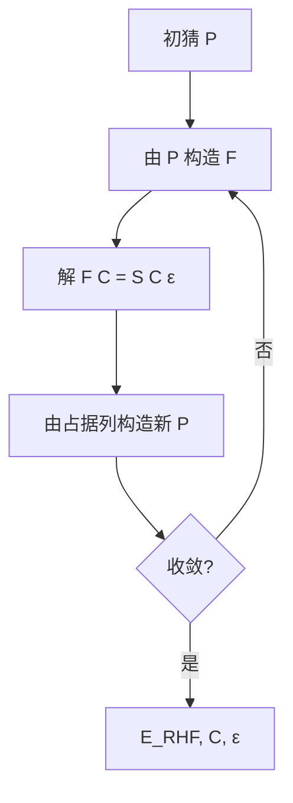

**DIIS（可选加速）**：用前若干步的 **误差向量**（如 $\mathbf{F}\mathbf{P}\mathbf{S}-\mathbf{S}\mathbf{P}\mathbf{F}$）外推下一个 $\mathbf{F}$，显著减少迭代次数（尤其是带金属/弱束缚体系）。

---

#### 10. UHF：两套轨道与自旋污染（公式骨架）

**Unrestricted HF**：$\alpha$ 与 $\beta$ 用 **不同** 的空间轨道 $\phi_i^\alpha,\phi_j^\beta$。能量

$$
E_{\mathrm{UHF}}
= \sum_{i\in\mathrm{occ}_\alpha}\langle i\vert\hat{h}\vert i\rangle
+ \sum_{j\in\mathrm{occ}_\beta}\langle j\vert\hat{h}\vert j\rangle
+ \frac{1}{2}\sum_{ij\in\mathrm{occ}_\alpha}\langle ij\Vert ij\rangle
+ \frac{1}{2}\sum_{ij\in\mathrm{occ}_\beta}\langle ij\Vert ij\rangle
+ \sum_{i\in\alpha}\sum_{j\in\beta} J_{ij},

$$

最后一项为 **$\alpha$–$\beta$ Coulomb**（无交换，因自旋相反）。
分别定义 $\mathbf{P}^\alpha,\mathbf{P}^\beta$ 与 $\mathbf{F}^\alpha,\mathbf{F}^\beta$，仍解两个广义本征问题并交替更新直至自洽。
**缺点**：$\langle \hat{S}^2\rangle$ 常偏离纯自旋多重态，即 **自旋污染**。

---

#### 11. 与后 HF 衔接的两个定理（陈述）

- **Brillouin 定理**：RHF 参考与 **单激发** 行列式之间的 $\langle\Phi_0|\hat{H}|\Phi_i^a\rangle=0$。故 MP2 等 **一阶能量修正** 主要来自 **双激发**。
- **Koopmans 定理**：在 **冻结轨道** 近似下，$\varepsilon_i$（占据）$\approx$ 移去该电子的 **电离能** 的负值；对虚轨道与电子亲和的类比更粗糙。实际量化计算中常作 **定性** 使用。

---

#### 12. 计算复杂度小结


| 环节                       | 标度（粗）                                              |
| :--------------------------- | :-------------------------------------------------------- |
| 双电子积分（存盘）         | $O(K^4)$                                                |
| 一轮 Fock 构造（直接收缩） | 亦可表为与积分筛选相关的近$O(K^4)$                      |
| 对角化 / 广义本征          | $O(K^3)$                                                |
| 整体 SCF                   | 常记**$O(K^3)$–$O(K^4)$** 量级（与基与积分阈值强相关） |

---

#### 13. 与主笔记 §3 的对应关系


|    主笔记 §3 小节    | 本文                           |
| :---------------------: | :------------------------------- |
| 3.1 平均场 + 单行列式 | **§2–§5**                   |
| 3.2 Fock 与 Roothaan | **§6–§8**                   |
|        3.3 SCF        | **§9**                        |
|   3.4 RHF/UHF/ROHF   | **§4, §10**（ROHF 细节从略） |
|  3.5–3.7 物理与标度  | **§4, §11–§12**            |

更完整的 **CI/CC/DFT** 脉络仍以主笔记后续章节为准。

---

#### 参考文献式延伸（自学）

- Szabo & Ostlund, *Modern Quantum Chemistry*（Roothaan 方程与 SCF 经典入门）。
- Helgaker, Jørgensen, Olsen, *Molecular Electronic-Structure Theory*（矩阵元与实现细节）。
- Levine, *Quantum Chemistry*（变分推导与 Koopmans）。

---

---

# 第四部分：电子相关与后 Hartree-Fock 方法

## 7. 电子相关性的数学描述

### 5.1 相关能定义

#### 精确相关能

$$
E_{corr} = E_{exact} - E_{HF}

$$

其中 $E_{exact}$ 是精确基态能量，$E_{HF}$ 是Hartree-Fock能量。

### 5.2 相关性的来源

#### 库仑相关（Coulomb Correlation）

电子之间的瞬时库仑排斥导致：

- **动态相关**：电子避免同时出现在同一空间区域
- **静态相关**：近简并态之间的相关

#### 为什么不能写成乘积形式：深入分析（电子相关角度）

**注意**：波函数不能写成简单乘积有**两个独立的原因**：

1. **反对称性要求**（见4.1节）：费米子波函数必须反对称，Slater行列式解决了这个问题
2. **电子相关**（本节讨论）：即使使用Slater行列式，单个行列式仍不能精确描述电子相关

本节讨论第二个原因——电子相关。

**简单乘积形式的失败**：

考虑最简单的两电子系统（如He原子）。如果波函数可以写成：

$$
\psi(\mathbf{r}_1, \mathbf{r}_2) = \phi_1(\mathbf{r}_1) \phi_2(\mathbf{r}_2)

$$

那么概率密度为：

$$
|\psi(\mathbf{r}_1, \mathbf{r}_2)|^2 = |\phi_1(\mathbf{r}_1)|^2 |\phi_2(\mathbf{r}_2)|^2

$$

这意味着：

- 电子1在 $\mathbf{r}_1$ 的概率：$P_1(\mathbf{r}_1) = |\phi_1(\mathbf{r}_1)|^2$
- 电子2在 $\mathbf{r}_2$ 的概率：$P_2(\mathbf{r}_2) = |\phi_2(\mathbf{r}_2)|^2$
- **联合概率**：$P(\mathbf{r}_1, \mathbf{r}_2) = P_1(\mathbf{r}_1) P_2(\mathbf{r}_2)$（独立！）

**但实际情况**：

- 由于库仑排斥 $\frac{1}{|\mathbf{r}_1 - \mathbf{r}_2|}$，两个电子**避免**同时出现在同一位置
- 如果电子1在 $\mathbf{r}_1$，电子2在 $\mathbf{r}_1$ 附近的概率会**降低**
- 因此：$P(\mathbf{r}_1, \mathbf{r}_2) \neq P_1(\mathbf{r}_1) P_2(\mathbf{r}_2)$（相关！）

**数学证明（两电子系统）**：

如果 $\psi(\mathbf{r}_1, \mathbf{r}_2) = \phi_1(\mathbf{r}_1)\phi_2(\mathbf{r}_2)$ 是精确解，那么：

$$
\hat{H}\psi = \left[\hat{h}_1 + \hat{h}_2 + \frac{1}{|\mathbf{r}_1 - \mathbf{r}_2|}\right] \phi_1(\mathbf{r}_1)\phi_2(\mathbf{r}_2) = E \phi_1(\mathbf{r}_1)\phi_2(\mathbf{r}_2)

$$

展开左边：

$$
\hat{h}_1\phi_1 \cdot \phi_2 + \phi_1 \cdot \hat{h}_2\phi_2 + \frac{1}{|\mathbf{r}_1 - \mathbf{r}_2|} \phi_1(\mathbf{r}_1)\phi_2(\mathbf{r}_2) = E \phi_1(\mathbf{r}_1)\phi_2(\mathbf{r}_2)

$$

**矛盾**：

- 左边第三项 $\frac{1}{|\mathbf{r}_1 - \mathbf{r}_2|} \phi_1(\mathbf{r}_1)\phi_2(\mathbf{r}_2)$ **不能**写成 $f_1(\mathbf{r}_1) f_2(\mathbf{r}_2)$ 的形式
- 因为 $\frac{1}{|\mathbf{r}_1 - \mathbf{r}_2|}$ 同时依赖于两个坐标
- 但右边是乘积形式
- 因此等式**不可能**成立（除非 $\frac{1}{|\mathbf{r}_1 - \mathbf{r}_2|}$ 项为零，但这是不可能的）

**结论**：精确波函数必须包含显式的电子-电子相关项。

**Hartree-Fock的近似**：

HF方法使用**单Slater行列式**（关于Slater行列式的详细解释，参见4.1节）：

$$
\psi_{HF}(\mathbf{r}_1, \mathbf{r}_2) = \frac{1}{\sqrt{2}} \det\begin{pmatrix} \phi_1(\mathbf{r}_1) & \phi_1(\mathbf{r}_2) \\ \phi_2(\mathbf{r}_1) & \phi_2(\mathbf{r}_2) \end{pmatrix} = \frac{1}{\sqrt{2}}[\phi_1(\mathbf{r}_1)\phi_2(\mathbf{r}_2) - \phi_1(\mathbf{r}_2)\phi_2(\mathbf{r}_1)]

$$

这**不是**简单乘积，而是**反对称化的乘积**（行列式形式）：

- 包含了交换项：$\phi_1(\mathbf{r}_2)\phi_2(\mathbf{r}_1)$
- 这捕获了**费米子统计**（交换相关）
- 但**仍然忽略了库仑相关**（动态相关）

**精确波函数需要更多项**：

#### 数学描述

精确波函数不能写成单Slater行列式，必须展开为多个行列式的线性组合：

$$
\psi_{exact} = c_0 \psi_{HF} + \sum_{i,a} c_i^a \psi_i^a + \sum_{i<j,a<b} c_{ij}^{ab} \psi_{ij}^{ab} + \cdots

$$

其中：

- $\psi_i^a$：单激发（一个电子从占据轨道 $i$ 激发到虚轨道 $a$）
- $\psi_{ij}^{ab}$：双激发（两个电子同时激发）
- 更高激发项...

**为什么需要这些项？**

- **单激发**：调整单个电子的分布以响应其他电子
- **双激发**：捕获两个电子同时移动的相关性
- **高激发**：捕获多个电子的联合相关

**物理图像**：

- 如果电子1移动到位置 $\mathbf{r}_1$，电子2会"感知"到并调整其分布
- 这种相关性需要多个Slater行列式来描述
- 单个Slater行列式（HF）只能描述平均场，不能描述瞬时相关

### 5.3 相关能的大小

#### 典型数值

- 小分子：相关能通常为总能量的 0.5-2%
- 但绝对值可能很大（几十到几百 kcal/mol）
- 化学键能主要由相关能贡献

#### 尺度分析

- **库仑能**：$O(N^2)$，但通过密度可以降低到 $O(N)$
- **交换能**：$O(N^2)$
- **相关能**：难以精确计算，需要多体方法

---

## 8. 后 Hartree-Fock 方法

本章先给出 CI、MBPT、CC 与多参考方法的整体版图，再回到更细的数学框架、方程结构与优缺点分析。

### 8.1 方法全景：CI、MBPT、CC 与多参考

#### §4 组态相互作用（Configuration Interaction, CI）

##### 4.1 基本思想

在 HF 给出的 **分子轨道** 基下，将多电子波函数写成 **所有可能 Slater 行列式的线性组合**：

$$
|\Psi_{\mathrm{CI}}\rangle = c_0|\Phi_0\rangle + \sum_{ia} c_i^a|\Phi_i^a\rangle + \sum_{ijab} c_{ij}^{ab}|\Phi_{ij}^{ab}\rangle + \cdots

$$

其中 $|\Phi_0\rangle$ 为 HF 参考，$|\Phi_i^a\rangle$ 表示从占据轨道 $i$ 到虚轨道 $a$ 的 **单激发**，$|\Phi_{ij}^{ab}\rangle$ 为 **双激发**，以此类推。

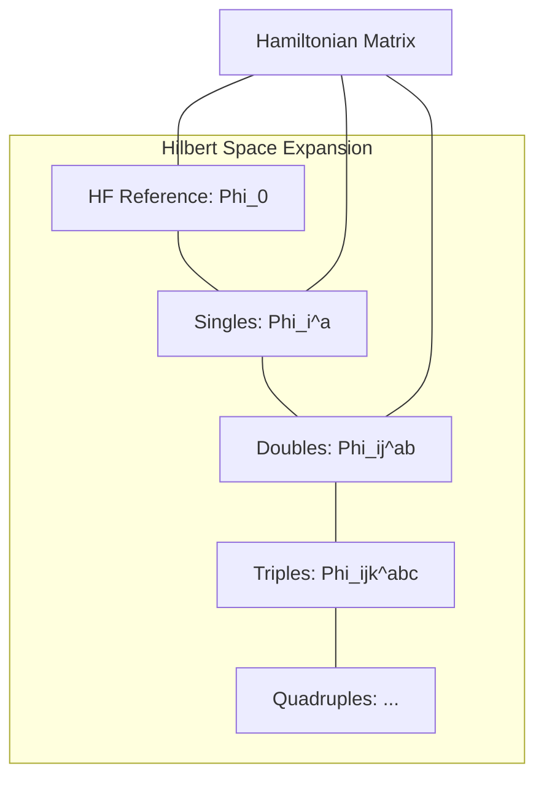

**图 4-1**：CI 方法的变分空间。通过在 HF 参考态上叠加不同激发阶的行列式，逐步恢复电子相关。

然后在哈密顿矩阵 $H_{IJ} = \langle\Phi_I|\hat{H}|\Phi_J\rangle$ 中对角化求最低本征值与本征矢量。

##### 4.2 Full CI（FCI）

若包含 **所有** 可能的激发（直到 $N$ 重激发），即 **Full CI（FCI）**，它在 **给定基组** 下给出 **精确解**（数值精确，仍受基组截断限制）。

$$
\dim(\text{FCI}) = \binom{K}{N_\alpha}\binom{K}{N_\beta}

$$

对 $K=100, N=20$ 量级，FCI 维度已达天文数字，实际只能用于 **极小体系**（几个电子 + 极小基）。

##### 4.3 截断 CI：CIS, CISD, CISDT...

实际常截断到某一激发阶：


| 方法      | 包含激发   | 标度     | 说明                                    |
| :---------- | :----------- | :--------- | :---------------------------------------- |
| **CIS**   | 单激发     | $O(K^4)$ | 常用于激发态（但基态无改进：Brillouin） |
| **CISD**  | 单+双激发  | $O(K^6)$ | 最常用的截断 CI 方法                    |
| **CISDT** | 单+双+三重 | $O(K^8)$ | 很贵，较少用                            |

##### 4.4 CI 的致命缺陷：大小一致性问题

**截断 CI 不满足大小一致性（size-consistency）**：对两个无相互作用的子系统 A 和 B，

$$
E_{\mathrm{CISD}}(A+B) \neq E_{\mathrm{CISD}}(A) + E_{\mathrm{CISD}}(B)

$$

原因：CISD 对 A+B 联合体系只包含「联合 S+D」，而 A 的双激发 $\times$ B 的双激发 = 联合四重激发，被截掉了。这导致截断 CI 在描述大体系或解离过程时存在本质缺陷。

**Davidson 校正（+Q）** 可 **近似** 补偿该误差：

$$
\Delta E_Q \approx (1 - c_0^2)\,(E_{\mathrm{CISD}} - E_{\mathrm{HF}})

$$

##### 4.5 Selected CI（选择性 CI）

近年发展的 **Selected CI** 方法不是按激发阶截断，而是 **自适应选择** 最重要的行列式：

- **CIPSI**（Configuration Interaction using a Perturbative Selection made Iteratively）
- **HCI**（Heat-Bath CI）
- **SHCI**（Semistochastic HCI）
- **ASCI**（Adaptive Sampling CI）

这些方法可以处理比传统 FCI 更大的活性空间（可达 ~50 轨道），是 **经典端逼近 FCI 的现代利器**。

---

#### §5 多体微扰理论（MBPT / Møller–Plesset）

##### 5.1 Rayleigh–Schrödinger 微扰论思路

将哈密顿量分解为 **零阶**（可解）+ **微扰**：

$$
\hat{H} = \hat{H}_0 + \lambda\hat{V}

$$

在 Møller–Plesset（MP）划分中，$\hat{H}_0$ 取为 **Fock 算符之和**（$\hat{H}_0 = \sum_i \hat{f}(i)$），微扰 $\hat{V} = \hat{H} - \hat{H}_0$ 是双电子排斥减去 HF 平均场的 **波动势（fluctuation potential）**。

##### 5.2 MP2：最常用的微扰

**二阶 Møller–Plesset（MP2）** 能量修正：

$$
E^{(2)} = \sum_{i<j}^{\mathrm{occ}}\sum_{a<b}^{\mathrm{vir}} \frac{|\langle ij \| ab\rangle|^2}{\varepsilon_i + \varepsilon_j - \varepsilon_a - \varepsilon_b}

$$

其中 $\langle ij \| ab\rangle$ 为 **反对称化双电子积分**，$\varepsilon$ 为 HF 轨道能量。

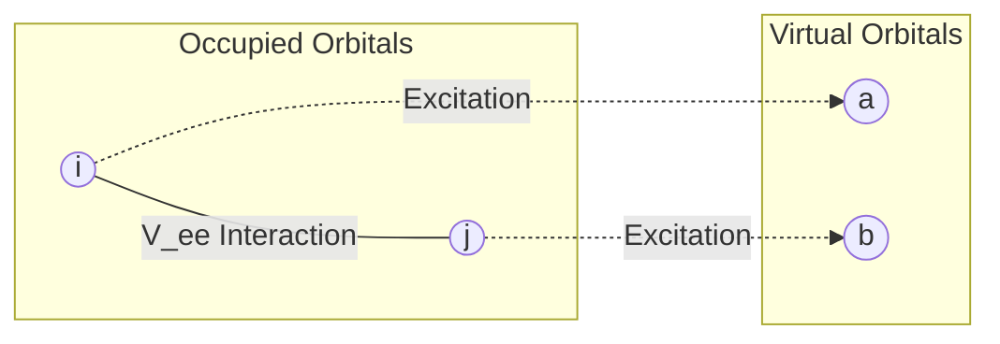

**图 5-1**：MP2 的物理图像。电子对 $(i,j)$ 通过瞬时排斥作用，同时激发到虚轨道 $(a,b)$。MP2 是相关能的第一个非零修正（一阶修正为零）。

**关键要点**：

- 标度：**$O(N^5)$** ——比 HF 贵，但远比 CCSD 便宜。
- MP2 通常恢复 **60–80%** 的相关能。
- 适合弱关联闭壳层分子；在小能隙体系容易失效。

##### 5.3 MP3, MP4 与收敛性


| 阶      | 标度     | 说明                                |
| :-------- | :--------- | :------------------------------------ |
| **MP3** | $O(N^6)$ | 修正不大，性价比一般                |
| **MP4** | $O(N^7)$ | 包含三重激发（MP4(SDTQ)），精度较高 |

**收敛性问题**：MP 展开 **不保证收敛**。对强关联或 UHF 自旋污染严重的情形，MP 序列可能振荡甚至发散。

---

#### §6 耦合簇理论（Coupled Cluster, CC）

##### 6.1 核心思想：指数 ansatz

耦合簇将波函数写为 **指数形式**：

$$
|\Psi_{\mathrm{CC}}\rangle = e^{\hat{T}}|\Phi_0\rangle = (1 + \hat{T} + \frac{1}{2}\hat{T}^2 + \cdots)|\Phi_0\rangle

$$

其中 $\hat{T} = \hat{T}_1 + \hat{T}_2 + \cdots$。指数展开会自动产生 **非连接激发（disconnected excitations）**，如 $\hat{T}_2^2/2!$ 产生的四重激发。

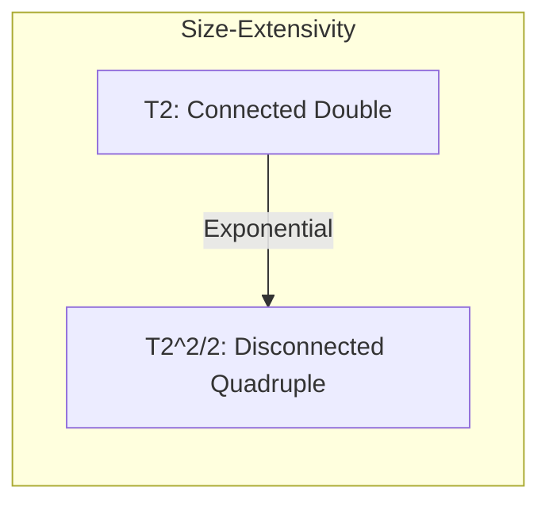

**图 6-1**：CC 的指数逻辑。通过低阶算符的幂次自动包含高阶激发，从而保证了 **大小延展性（size-extensivity）**：能量随粒子数线性增加。

##### 6.2 常用截断与“金标准”


| 方法        | 算符包含                        | 标度     | 说明                           |
| :------------ | :-------------------------------- | :--------- | :------------------------------- |
| **CCSD**    | $\hat{T}_1 + \hat{T}_2$         | $O(N^6)$ | 现代标准水平                   |
| **CCSD(T)** | CCSD + 三重激发微扰             | $O(N^7)$ | **“金标准”**，化学精度的标杆 |
| **CCSDT**   | $\hat{T}_1+\hat{T}_2+\hat{T}_3$ | $O(N^8)$ | 极贵，用于基准测试             |

##### 6.3 CC 的局限

- **非变分**：能量可能低于 FCI（无下界保证）。
- **单参考前提**：若 HF 参考权重不高（强关联），CC 结果不可靠。

##### 6.7 激发态：EOM-CCSD

**Equation-of-Motion CCSD（EOM-CCSD）** 在 CC 基态之上，用线性算符 $\hat{R}$ 描述激发态：

$$
\lvert\Psi_k\rangle = \hat{R}_k\, e^{\hat{T}}\lvert\Phi_0\rangle

$$

对 $\bar{H}$ 做非对称本征问题，给出激发能和跃迁性质。EOM-CCSD 是 **单参考激发态** 最系统的波函数方法之一，标度同 CCSD（$O(N^6)$），但对 **双激发占主导** 的态效果差。

---

#### §7 多参考方法（Multi-Reference Methods）

##### 7.1 为什么需要多参考

当 **多个行列式以相近权重参与基态** 时（如键断裂、过渡金属、双自由基），单参考方法（HF, MP2, CC）的起点即错误。

##### 7.2 CASSCF（Complete Active Space SCF）

**CASSCF** 同时优化 **CI 系数** 和 **分子轨道**。

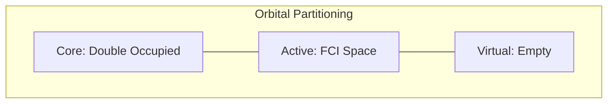

**图 7-1**：活性空间（Active Space）示意图。CASSCF 在活性空间内做完全 CI，捕捉 **静态相关**。

##### 7.3 动态相关的补充：CASPT2 与 NEVPT2

CASSCF 遗漏了活性空间外的 **动态相关**，需后续修正：


| 方法       | 特点                                                   |
| :----------- | :------------------------------------------------------- |
| **CASPT2** | 以 CASSCF 为零阶做 2 阶微扰；最常用 but 有入侵态问题。 |
| **NEVPT2** | 严格无入侵态，更稳健；现代程序推荐。                   |
| **MRCI**   | 多参考 + SD 激发；最系统 but 标度极高。                |

##### 7.4 DMRG（Density Matrix Renormalization Group）

**DMRG** 可作为 **大活性空间（~100 轨道）** 的 FCI 求解器，突破了传统 CASSCF (~18 轨道) 的限制，是处理复杂过渡金属体系的核心工具。


| 方法                                                               | 思路                        | 优缺点                                                   |
| -------------------------------------------------------------------- | ----------------------------- | ---------------------------------------------------------- |
| **CASPT2**（Complete Active Space Perturbation Theory, 2nd order） | 以 CASSCF 为零阶做 2 阶微扰 | 最常用；有入侵态（intruder state）问题，需 IPEA shift 等 |
| **NEVPT2**（N-Electron Valence Perturbation Theory）               | 类似 CASPT2 但严格无入侵态  | 更稳健；OpenMolcas、PySCF 均支持                         |
| **MRCI**（Multi-Reference CI）                                     | 多参考 + SD 激发            | 最系统但标度高；需 Davidson +Q 校正大小一致性            |
| **ic-MRCC**（internally contracted MRCC）                          | 多参考耦合簇                | 理论最优雅但实现极复杂                                   |

##### 7.5 态平均 CASSCF（SA-CASSCF）

当关心 **多个能量接近的电子态**（如激发态排序、圆锥交叉），单态优化可能导致 **根翻转** 或轨道对其他态不均衡。**态平均 CASSCF** 对若干态的能量加权平均后统一优化轨道：

$$
E_{\mathrm{SA}} = \sum_{k=1}^{n_{\mathrm{states}}} w_k\, E_k(\mathbf{C}_{\mathrm{MO}})

$$

##### 7.6 DMRG（Density Matrix Renormalization Group）

**DMRG** 是 **张量网络方法** 在一维/准一维系统中的高效变体。在量子化学中，DMRG 可作为 **替代 FCI 的活性空间求解器**，处理 **传统 CASSCF 无法企及的大活性空间**（50–100 轨道）。

核心参数是 **键维度（bond dimension）** $M$：$M$ 越大越精确，但成本 $\sim O(K^3 M^3)$ 或 $O(K^4 M^2)$ 量级。

DMRG-SCF = DMRG 替代 FCI + 轨道优化. 后接 DMRG-CASPT2 / DMRG-NEVPT2 可补动态相关.

##### 7.7 多参考方法与量子计算的衔接

多参考方法的核心瓶颈是 **活性空间内的 FCI 指数爆炸**——正是量子计算最有可能提供价值的地方。在 **嵌入 + 量子求解器** 框架中（如 DMET + VQE/SQD），量子处理器充当 **活性空间内的 FCI 求解器**，经典端负责轨道选择、嵌入构造和动态相关。详见 [量子计算-QC-ppt.md](../literature/量子计算-QC-ppt.md) §10 与 [学习问答记录.md](../literature/学习问答记录.md) 条目 33–34。

---

---

### 8.2 数学框架细讲：CI、CC 与 MP

#### 6.1 组态相互作用（Configuration Interaction, CI）

##### 数学框架

###### 波函数展开

将精确波函数展开为多个Slater行列式的线性组合：

$$
|\Psi_{CI}\rangle = \sum_I c_I |\Phi_I\rangle

$$

其中 $|\Phi_I\rangle$ 是不同电子组态的Slater行列式，$c_I$ 是展开系数。

（注：关于将薛定谔方程投影到组态空间的详细推导，参见1.3节"将薛定谔方程投影到组态空间"部分）

###### 组态分类

- **参考组态**：$|\Phi_0\rangle$（通常是HF基态）
- **单激发**：$|\Phi_i^a\rangle$（一个电子从占据轨道 $i$ 激发到虚轨道 $a$）
- **双激发**：$|\Phi_{ij}^{ab}\rangle$
- **三激发、四激发**：等等

###### 截断级别

- **CIS**：只包含单激发（用于激发态）
- **CID**：只包含双激发
- **CISD**：单激发 + 双激发
- **CISDT**：单、双、三激发
- **FCI**：全组态相互作用（包含所有可能的激发）

##### 矩阵方程

###### 本征值问题

将薛定谔方程投影到组态空间：

$$
\mathbf{H}\mathbf{c} = E\mathbf{c}

$$

其中：

- $\mathbf{H}_{IJ} = \langle\Phi_I|\hat{H}|\Phi_J\rangle$ 是哈密顿矩阵
- $\mathbf{c} = (c_0, c_1, \ldots)^T$ 是系数向量
- $E$ 是能量本征值

（注：详细的投影推导参见1.3节）

###### 矩阵元计算

使用Slater-Condon规则计算矩阵元：

- **对角元**：$\langle\Phi_I|\hat{H}|\Phi_I\rangle$ 可以通过轨道能量和双电子积分计算
- **非对角元**：只有当两个行列式相差不超过两个轨道时，矩阵元才非零

（注：Slater-Condon规则的详细说明参见1.3节"矩阵元的计算"部分）

##### 大小一致性（Size Consistency）

###### 定义

**大小一致性**：若系统 $A + B$ 由两个**无相互作用**的片段 $A$、$B$ 组成（例如两分子相距无穷远），则方法应满足：

$$
E(A+B) = E(A) + E(B)

$$

且基态波函数应为两片段基态的张量积：$|\Psi_{A+B}\rangle = |\Psi_A\rangle \otimes |\Psi_B\rangle$。

###### 为什么 CISD 不满足大小一致性：完整数学推导

**1. 分离系统的精确波函数与哈密顿量**

设片段 $A$ 有 $N_A$ 个电子、$M_A$ 个自旋轨道，片段 $B$ 有 $N_B$ 个电子、$M_B$ 个自旋轨道；$A$ 与 $B$ 无相互作用时，总哈密顿量为：

$$
\hat{H}_{A+B} = \hat{H}_A \otimes \hat{I}_B + \hat{I}_A \otimes \hat{H}_B

$$

此时基态为**乘积态**：

$$
|\Psi_{A+B}^{exact}\rangle = |\Psi_A^{exact}\rangle \otimes |\Psi_B^{exact}\rangle

$$

总能量为：

$$
E_{exact}(A+B) = E_{exact}(A) + E_{exact}(B)

$$

**2. CISD 的组态空间**

对**单个**片段 $A$，CISD 波函数为：

$$
|\Psi_A^{CISD}\rangle = c_0^A |\Phi_0^A\rangle + \sum_{i,a} c_i^{a,A} |\Phi_i^{a,A}\rangle + \sum_{i<j,a<b} c_{ij}^{ab,A} |\Phi_{ij}^{ab,A}\rangle

$$

即参考组态 + 所有单激发 + 所有双激发（**无三激发、四激发**）。对 $B$ 同理。

**3. 复合系统 $A+B$ 的 CISD 空间**

复合系统的 CISD 空间定义为：参考 $|\Phi_0^{A+B}\rangle = |\Phi_0^A\rangle \otimes |\Phi_0^B\rangle$，加上**所有相对于该参考的单激发与双激发**。

关键点：在 $A+B$ 中，"双激发"是指**在整个大系统中只激发 2 个电子**（可来自 $A$、可来自 $B$、或各一个）。因此 $A+B$ 的 CISD 空间**包含**：

- 参考；
- 单激发（1 个电子在 $A$ 或 $B$ 中激发）；
- 双激发（2 个电子都在 $A$ 中激发，或都在 $B$ 中激发，或 1 个在 $A$、1 个在 $B$）。

**4. 两片段各自双激发的乘积不在 CISD 空间内**

若 $|\Psi_A^{CISD}\rangle$ 含有双激发项 $c_{ij}^{ab,A}|\Phi_{ij}^{ab,A}\rangle$，$|\Psi_B^{CISD}\rangle$ 含有双激发项 $c_{kl}^{cd,B}|\Phi_{kl}^{cd,B}\rangle$，则乘积态中会出现：

$$
|\Phi_{ij}^{ab,A}\rangle \otimes |\Phi_{kl}^{cd,B}\rangle

$$

这一项表示：在 $A$ 中有 2 个电子被激发，在 $B$ 中也有 2 个电子被激发，**总共 4 个电子被激发**，即相对于 $|\Phi_0^{A+B}\rangle$ 而言是一个**四激发**组态。

CISD 的定义是**只包含单激发和双激发**，不包含三激发、四激发。因此上述四激发组态**不在** $A+B$ 的 CISD 空间内。于是：

$$
\text{CISD 空间}(A+B) \not\supset \operatorname{span}\bigl\{ |\Psi_A\rangle \otimes |\Psi_B\rangle : |\Psi_A\rangle, |\Psi_B\rangle \in \text{CISD 空间} \bigr\}

$$

即"$A$ 的 CISD 波函数"与"$B$ 的 CISD 波函数"的**任意乘积**所张成的空间，并不完全落在 $A+B$ 的 CISD 空间里（缺四激发部分）。

**5. 能量不等式**

设 $|\Psi_{A+B}^{CISD}\rangle$ 是 $A+B$ 在 CISD 空间内得到的基态（能量最小）。由于 CISD 空间不包含"$A$ 双激发 × $B$ 双激发"这类四激发项，一般有：

$$
|\Psi_{A+B}^{CISD}\rangle \neq |\Psi_A^{CISD}\rangle \otimes |\Psi_B^{CISD}\rangle

$$

由变分原理，CISD 能量是精确能量的上界，故：

$$
E_{CISD}(A+B) \geq E_{exact}(A+B) = E_{exact}(A) + E_{exact}(B)

$$

另一方面，$|\Psi_A^{CISD}\rangle \otimes |\Psi_B^{CISD}\rangle$ 是 $A+B$ 的一个**试探态**，但它不在 CISD 空间内（因为含有四激发分量），所以**不能**作为 CISD 的优化解。在 CISD 约束下优化得到的 $E_{CISD}(A+B)$ 通常**严格大于** $E_{CISD}(A) + E_{CISD}(B)$，即：

$$
E_{CISD}(A+B) > E_{CISD}(A) + E_{CISD}(B)

$$

**数值示例**：两个远离的 He 原子，$E_{CISD}(A) = E_{CISD}(B) = E_{CISD}(\text{He})$。若大小一致，应有 $E_{CISD}(\text{He}_2) = 2 E_{CISD}(\text{He})$。实际计算中 $E_{CISD}(\text{He}_2)$ 会**高于** $2 E_{CISD}(\text{He})$，多出的部分即大小不一致误差。

**6. 小结（CI）**


| 内容             | 结论                                                |
| ------------------ | ----------------------------------------------------- |
| 精确$A+B$ 波函数 | $                                                   |
| CISD 空间        | 仅单、双激发，无四激发                              |
| 乘积态中的四激发 | $A$ 中双激发 × $B$ 中双激发 = 四激发，不在 CISD 内 |
| 能量             | $E_{CISD}(A+B) > E_{CISD}(A) + E_{CISD}(B)$         |

###### 解决方案

- **CISDTQ**：显式加入四激发，使空间包含"双×双"型组态，可恢复大小一致性（代价为计算量大幅增加）。
- **CC方法**：通过指数算符自动生成高激发，乘积形式 $e^{\hat{T}_A}e^{\hat{T}_B}$ 自然满足大小一致性（见下节）。

#### 6.2 耦合簇方法（Coupled Cluster, CC）

（注：本节详细介绍耦合簇方法的思想、数学推导与求解流程。）

##### 一、基本思想与动机

###### 1.1 核心问题

如何用**单个**参考 Slater 行列式 $|\Phi_0\rangle$（通常为 HF 基态）构造包含电子相关的波函数，并使其在增大系统时具有正确的**大小一致性**（见 6.1 节）？

###### 1.2 CI 的局限为何难以接受

CI 波函数为线性组合：

$$
|\Psi_{CI}\rangle = c_0|\Phi_0\rangle + \sum_{i,a} c_i^a|\Phi_i^a\rangle + \sum_{i<j,a<b} c_{ij}^{ab}|\Phi_{ij}^{ab}\rangle + \cdots

$$

- **截断到 CISD** 时：不包含四激发，导致 $E_{CISD}(A+B) > E_{CISD}(A) + E_{CISD}(B)$，即大小不一致。
- **若包含到 FCI**：组态数 $\binom{M}{N}$ 随体系指数增长，计算不可行。
- **本质**：线性组合中各组态系数 $c_I$ 彼此独立；截断即强制部分 $c_I=0$，无法自然得到“分离时能量相加”的乘积结构。

###### 1.3 CC 的出发点：用算符代替系数

**思路**：不直接优化各组态系数，而是引入**激发算符** $\hat{T}$，令波函数为：

$$
|\Psi_{CC}\rangle = e^{\hat{T}} |\Phi_0\rangle, \quad \hat{T} = \hat{T}_1 + \hat{T}_2 + \hat{T}_3 + \cdots

$$

- $\hat{T}_1$：单激发算符（振幅 $t_i^a$）
- $\hat{T}_2$：双激发算符（振幅 $t_{ij}^{ab}$）
- 更高 $\hat{T}_k$ 类推。

**为何用指数**：指数展开 $e^{\hat{T}} = \hat{I} + \hat{T} + \frac{1}{2}\hat{T}^2 + \cdots$ 会**自动**生成高激发（如 $\hat{T}_2^2$ 产生四激发），且对分离系统有 $e^{\hat{T}_A+\hat{T}_B}=e^{\hat{T}_A}e^{\hat{T}_B}$，从而**自动满足大小一致性**（详见本节“大小一致性证明”）。

###### 1.4 从薛定谔方程到 CC 方程

将 $|\Psi_{CC}\rangle = e^{\hat{T}}|\Phi_0\rangle$ 代入薛定谔方程 $\hat{H}|\Psi\rangle = E|\Psi\rangle$：

$$
\hat{H} e^{\hat{T}} |\Phi_0\rangle = E\, e^{\hat{T}} |\Phi_0\rangle

$$

左乘 $e^{-\hat{T}}$（因 $e^{-\hat{T}}e^{\hat{T}}=\hat{I}$）得**相似变换形式**：

$$
e^{-\hat{T}} \hat{H} e^{\hat{T}} |\Phi_0\rangle = E |\Phi_0\rangle

$$

定义**相似变换哈密顿量**：

$$
\bar{H} = e^{-\hat{T}} \hat{H} e^{\hat{T}}

$$

则上式变为 $\bar{H}|\Phi_0\rangle = E|\Phi_0\rangle$，即**参考态 $|\Phi_0\rangle$ 是 $\bar{H}$ 的本征态，本征值为 $E$**。后续的能量公式与振幅方程都由此出发，对 $\bar{H}$ 在参考态与激发态上的投影得到（见第四节）。

##### 二、激发算符的详细定义

###### 2.1 二次量子化记号与约定

**产生/湮灭算符**：

- $a_p^\dagger$：在自旋轨道 $p$ 上产生一个电子
- $a_p$：在自旋轨道 $p$ 上湮灭一个电子

**反对易关系**：

$$
\{a_p, a_q^\dagger\} = \delta_{pq}, \quad \{a_p, a_q\} = 0, \quad \{a_p^\dagger, a_q^\dagger\} = 0

$$

**占据与虚轨道**：在 HF 参考态 $|\Phi_0\rangle$ 下，被占据的自旋轨道指标记为 $i,j,k,\ldots$（占据轨道），未被占据的记为 $a,b,c,\ldots$（虚轨道）。总自旋轨道数记为 $M$，电子数 $N$。

###### 2.2 单激发算符 $\hat{T}_1$

**定义**：

$$
\hat{T}_1 = \sum_{i \in occ} \sum_{a \in virt} t_i^a \, a_a^\dagger a_i

$$

- $i$：占据轨道；$a$：虚轨道。
- $a_a^\dagger a_i$：从 $i$ 湮灭一个电子，在 $a$ 产生一个电子，即“单激发”。
- $t_i^a$：单激发振幅（待求实或复数参数）。

**作用**：$\hat{T}_1 |\Phi_0\rangle$ 是**所有单激发 Slater 行列式**的线性组合，系数为 $t_i^a$。

**为何没有 $1/2$ 等因子**：$(i,a)$ 与 $(a,i)$ 在求和中是不同指标对，每个单激发只出现一次，故无需对称化因子。

###### 2.3 双激发算符 $\hat{T}_2$

**定义**：

$$
\hat{T}_2 = \frac{1}{4} \sum_{ij} \sum_{ab} t_{ij}^{ab} \, a_a^\dagger a_b^\dagger a_j a_i

$$

**$\frac{1}{4}$ 因子的来源**：在无约束求和 $\sum_{i,j,a,b}$ 中，$(i,j)$ 与 $(j,i)$、$(a,b)$ 与 $(b,a)$ 各算一次，但费米子算符满足 $a_i^\dagger a_j^\dagger = -a_j^\dagger a_i^\dagger$，故同一物理双激发会以不同顺序出现 4 次。约定振幅对称化：$t_{ij}^{ab} = -t_{ji}^{ab} = -t_{ij}^{ba} = t_{ji}^{ba}$，并限制求和为 $i<j,\,a<b$ 时可写为：

$$
\hat{T}_2 = \sum_{i<j} \sum_{a<b} t_{ij}^{ab} \, (a_a^\dagger a_b^\dagger a_j a_i - a_a^\dagger a_b^\dagger a_i a_j - \cdots)

$$

等价地，在**无约束**求和下用系数 $\frac{1}{4}$ 避免同一组态被重复计数 4 次，从而与“独立振幅个数”一致。

**作用**：$\hat{T}_2 |\Phi_0\rangle$ 是**所有双激发组态** $|\Phi_{ij}^{ab}\rangle$ 的线性组合，系数由 $t_{ij}^{ab}$ 及反对称化给出；双激发是电子相关的主要来源。

##### 2.4 更高激发算符

**三激发算符**：

$$
\hat{T}_3 = \frac{1}{36}\sum_{i,j,k,a,b,c} t_{ijk}^{abc} \hat{a}_a^\dagger \hat{a}_b^\dagger \hat{a}_c^\dagger \hat{a}_k \hat{a}_j \hat{a}_i

$$

**四激发算符**：

$$
\hat{T}_4 = \frac{1}{576}\sum_{i,j,k,l,a,b,c,d} t_{ijkl}^{abcd} \hat{a}_a^\dagger \hat{a}_b^\dagger \hat{a}_c^\dagger \hat{a}_d^\dagger \hat{a}_l \hat{a}_k \hat{a}_j \hat{a}_i

$$

##### 三、指数算符的展开和作用

###### 3.1 指数算符的定义与在组态空间中的形式

**CC 波函数**：

$$
|\Psi_{CC}\rangle = e^{\hat{T}} |\Phi_0\rangle, \qquad \hat{T} = \hat{T}_1 + \hat{T}_2 + \hat{T}_3 + \cdots

$$

形式上也可写成**组态的线性组合**（与 CI 类比）：

$$
|\Psi_{CC}\rangle = |\Phi_0\rangle + \sum_{i,a} c_i^a |\Phi_i^a\rangle + \sum_{i<j,a<b} c_{ij}^{ab} |\Phi_{ij}^{ab}\rangle + \sum_{i<j<k,a<b<c} c_{ijk}^{abc} |\Phi_{ijk}^{abc}\rangle + \cdots

$$

但这里的系数 $c_i^a,\,c_{ij}^{ab},\,c_{ijk}^{abc},\ldots$ **不是独立参数**：它们由 $\hat{T}$ 的振幅 $t_i^a,\,t_{ij}^{ab},\ldots$ 通过指数展开**代数地**给出（例如 $c_{ij}^{ab}$ 中含 $t_{ij}^{ab}$ 以及 $t_i^a t_j^b$ 等）。因此 CC 用**少量振幅**（$t$）生成**大量组态系数**（$c$），并自动满足大小一致性；而 CI 中每个 $c_I$ 都是独立参数。

###### 3.2 指数算符的级数展开

**泰勒展开**：

$$
e^{\hat{T}} = \hat{I} + \hat{T} + \frac{1}{2!}\hat{T}^2 + \frac{1}{3!}\hat{T}^3 + \frac{1}{4!}\hat{T}^4 + \cdots

$$

其中 $\hat{I}$ 是单位算符。

##### 3.3 指数算符作用在参考态上

**展开结果**：

$$
|\Psi_{CC}\rangle = e^{\hat{T}} |\Phi_0\rangle = |\Phi_0\rangle + \hat{T}|\Phi_0\rangle + \frac{1}{2!}\hat{T}^2|\Phi_0\rangle + \frac{1}{3!}\hat{T}^3|\Phi_0\rangle + \cdots

$$

**逐项分析**：

**第0项**：$|\Phi_0\rangle$

- 参考组态（HF基态）

**第1项**：$\hat{T}|\Phi_0\rangle = (\hat{T}_1 + \hat{T}_2 + \cdots)|\Phi_0\rangle$

- 单激发：$\hat{T}_1|\Phi_0\rangle = \sum_{i,a} t_i^a |\Phi_i^a\rangle$
- 双激发：$\hat{T}_2|\Phi_0\rangle = \sum_{i<j,a<b} t_{ij}^{ab} |\Phi_{ij}^{ab}\rangle$
- 等等...

**第2项**：$\frac{1}{2!}\hat{T}^2|\Phi_0\rangle = \frac{1}{2}(\hat{T}_1 + \hat{T}_2)^2|\Phi_0\rangle$

- 展开：$\frac{1}{2}(\hat{T}_1^2 + 2\hat{T}_1\hat{T}_2 + \hat{T}_2^2)|\Phi_0\rangle$
- **关键**：$\hat{T}_1^2$ 可以生成双激发（两个单激发）
- **关键**：$\hat{T}_2^2$ 可以生成四激发（两个双激发）

**第3项及更高项**：

- 包含更高阶的激发
- 例如：$\hat{T}_1^3$ 可以生成三激发

##### 3.4 具体例子：CCSD（只包含单激发和双激发）

**CCSD波函数**：

$$
|\Psi_{CCSD}\rangle = e^{\hat{T}_1 + \hat{T}_2} |\Phi_0\rangle

$$

**展开**：

$$
|\Psi_{CCSD}\rangle = |\Phi_0\rangle + \hat{T}_1|\Phi_0\rangle + \hat{T}_2|\Phi_0\rangle + \frac{1}{2}\hat{T}_1^2|\Phi_0\rangle + \hat{T}_1\hat{T}_2|\Phi_0\rangle + \frac{1}{2}\hat{T}_2^2|\Phi_0\rangle + \cdots

$$

**各项的Slater行列式内容**：

1. **$|\Phi_0\rangle$**：参考组态（0激发）
2. **$\hat{T}_1|\Phi_0\rangle$**：所有单激发组态

   - $|\Phi_i^a\rangle$：电子从轨道 $i$ 激发到 $a$
3. **$\hat{T}_2|\Phi_0\rangle$**：所有双激发组态

   - $|\Phi_{ij}^{ab}\rangle$：电子从轨道 $i,j$ 激发到 $a,b$
4. **$\frac{1}{2}\hat{T}_1^2|\Phi_0\rangle$**：通过两个单激发生成的双激发

   - 例如：$\hat{T}_1$ 将电子1从 $i$ 激发到 $a$，再 $\hat{T}_1$ 将电子2从 $j$ 激发到 $b$
   - 结果：双激发 $|\Phi_{ij}^{ab}\rangle$
5. **$\hat{T}_1\hat{T}_2|\Phi_0\rangle$**：单激发和双激发的组合

   - 可以生成三激发
6. **$\frac{1}{2}\hat{T}_2^2|\Phi_0\rangle$**：两个双激发的组合

   - 可以生成四激发

**关键观察**：

- 即使只包含 $\hat{T}_1$ 和 $\hat{T}_2$，指数展开会**自动生成**更高激发
- 这是CC方法比CI方法更强大的原因之一

##### 3.5 为什么指数形式能表示更精确的波函数？

**1. 自动包含高激发**：

- CI方法：需要显式包含所有需要的激发
- CC方法：指数展开自动生成高激发
- 例如：CCSD自动包含四激发（通过 $\hat{T}_2^2$）

**2. 大小一致性**：

- CI方法：CISD不是大小一致的
- CC方法：指数形式自动保证大小一致性

**3. 更紧凑的表示**：

- 用较少的参数（振幅）可以表示更多的组态
- 通过指数展开，参数数量是多项式的，但组态数量是指数的

**4. 物理意义**：

- 激发算符 $\hat{T}$ 可以理解为"相关算符"
- 指数形式 $e^{\hat{T}}$ 表示"完全相关化"
- 类似于统计物理中的配分函数

##### 3.6 指数算符的数学与物理意义

下面从数学和物理两方面说明**为什么用指数算符** $e^{\hat{T}}$ 而不是线性组合。

###### 数学上为什么用指数

**（1）分离系统时变成乘积：大小一致性**

对两个互不作用的子系统 $A$ 和 $B$，各自的激发算符只作用在各自电子上，因此**对易**：$[\hat{T}_A, \hat{T}_B] = 0$。于是：

$$
e^{\hat{T}_{A+B}} = e^{\hat{T}_A + \hat{T}_B} = e^{\hat{T}_A} e^{\hat{T}_B}

$$

即总波函数是两子系统的波函数形式"乘在一起"（各自 $e^{\hat{T}}$ 作用各自的参考态再张量积），能量自然满足 $E_{CC}(A+B) = E_{CC}(A) + E_{CC}(B)$，即**大小一致性**。

若用 CI 的线性形式 $|\Psi_{CI}\rangle = c_0|\Phi_0\rangle + \sum c_i^a|\Phi_i^a\rangle + \cdots$，对 $A+B$ 必须在"大空间"里展开；若只做到 CISD，不会自动拆成两边的 CISD 之和，必须显式加入四激发等才能修正。指数形式则一次保证：只要两边各自用各自的 $\hat{T}$，大系统自然呈乘积。

**（2）用少量参数生成高激发**

指数展开 $e^{\hat{T}} = \hat{I} + \hat{T} + \frac{1}{2!}\hat{T}^2 + \cdots$ 作用在 $|\Phi_0\rangle$ 上时，$\hat{T}|\Phi_0\rangle$ 给出单、双激发等；$\frac{1}{2}\hat{T}^2|\Phi_0\rangle$ 中 $\hat{T}_2^2$ 自动给出**四激发**；更高次项自动给出六激发、八激发等。因此只优化 $t_i^a$、$t_{ij}^{ab}$ 等有限个振幅，波函数中却已包含由它们"乘积"出来的高激发。即：**参数是多项式数量**（$\hat{T}$ 的振幅），通过指数生成**指数多的组态**，且高激发的系数由低激发振幅代数地决定，不必再独立拟合。这样比 CISD 多包含了高激发，又比 FCI 省参数。

###### 物理上为什么用指数

**（1）"连接关联"的乘积结构（linked cluster）**

多体理论中，有物理意义的是**连接（linked）**的关联；若系统可拆成不相互作用的两块 $A$ 和 $B$，总能量应为 $E_A + E_B$，波函数应为两边波函数的张量积。若波函数写成 $|\Psi\rangle = e^{\hat{T}}|\Phi_0\rangle$，且 $\hat{T}$ 只包含**连接型**激发（如 $\hat{T}_2$ 对应"一对电子一起激发"的连通图），则能量和波函数仅由这些连接振幅决定；**非连接**部分（如 $A$ 中一个双激发与 $B$ 中一个双激发独立）会自然以乘积 $e^{\hat{T}_A}e^{\hat{T}_B}$ 出现，不破坏 $E(A+B)=E(A)+E(B)$。因此指数形式对应：用"连接在一起"的关联（$\hat{T}$）作为基本量，再通过指数自动生成所有"多块关联的乘积"，既满足大小一致性，又符合"相关可分解"的物理图像。

**（2）"完全相关化"的直观**

$e^{\hat{T}}$ 可理解为：用算符 $\hat{T}$ 对参考态 $|\Phi_0\rangle$ 做**完全相关化**。$\hat{T}$ 代表单次、双次激发等的叠加，$e^{\hat{T}}$ 则是"把这些激发以所有可能方式叠加"。统计物理中配分函数或波函数也常写成指数形式，对应所有涨落/激发的累积。因此指数 = 把 $\hat{T}$ 所代表的关联以一致的方式全部作用上去。

###### 与 CI 的对比小结

| 方面 | CI：$c_0|\Phi_0\rangle + \sum c_I|\Phi_I\rangle$ | CC：$e^{\hat{T}}|\Phi_0\rangle$ |
|------|--------------------------------------------------|----------------------------------|
| 形式 | 线性组合 | 指数算符作用参考态 |
| 高激发 | 需显式加 CISDT、CISDTQ 等 | $\hat{T}^2,\hat{T}^3$ 自动生成 |
| 大小一致性 | CISD 不满足，需显式补四激发等 | $e^{\hat{T}_A+\hat{T}_B}=e^{\hat{T}_A}e^{\hat{T}_B}$ 自动满足 |
| 参数 | 每个组态一个系数 | 只优化 $\hat{T}$ 的振幅，更紧凑 |
| 物理 | 各组态权重独立 | 关联以"连接振幅 + 指数"组织 |

##### 四、投影方程和求解

###### 4.1 能量方程从何而来

由 $e^{-\hat{T}}\hat{H}e^{\hat{T}}|\Phi_0\rangle = E|\Phi_0\rangle$，左乘 $\langle\Phi_0|$ 并利用 $\langle\Phi_0|\Phi_0\rangle=1$，得：

$$
E_{CC} = \langle\Phi_0| e^{-\hat{T}}\hat{H}e^{\hat{T}} |\Phi_0\rangle

$$

因此 **CC 能量** 就是相似变换哈密顿量 $\bar{H} = e^{-\hat{T}}\hat{H}e^{\hat{T}}$ 在参考态上的期望值。

**为何用相似变换**：

- $e^{-\hat{T}}e^{\hat{T}}=\hat{I}$，故 $\bar{H}$ 与 $\hat{H}$ **本征值相同**（相似变换不改变谱）。
- 将 $\hat{H}$ 换成 $\bar{H}$ 后，本征态从 $e^{\hat{T}}|\Phi_0\rangle$ 变为 $|\Phi_0\rangle$，在参考态上的期望值即能量，便于与振幅方程在同一套“参考态 + 激发态”基下写出。

**Baker-Campbell-Hausdorff（BCH）展开**：

$$
e^{-\hat{T}}\hat{H}e^{\hat{T}} = \hat{H} + [\hat{H}, \hat{T}] + \frac{1}{2!}[[\hat{H}, \hat{T}], \hat{T}] + \frac{1}{3!}[[[\hat{H}, \hat{T}], \hat{T}], \hat{T}] + \cdots

$$

- $\hat{H}$ 是单、双电子算符之和；$\hat{T}$ 是单、双激发算符之和。
- 对易子 $[\hat{H}, \hat{T}]$ 仍由单、双电子与单、双激发组合，产生有限多种算符类型。
- 逐次对易后，**CCSD** 下（仅 $\hat{T}_1,\hat{T}_2$）该级数在有限步后**必然截断**：例如 $[[[\hat{H},\hat{T}_2],\hat{T}_2],\hat{T}_2],\hat{T}_2]$ 中会出现超过双电子的算符，在 Fock 空间矩阵元中为零。因此实际计算中 BCH 只需算到有限项（CCSD 常到 $\hat{T}_2^4$ 量级）。

###### 4.2 振幅方程从何而来

$\bar{H}|\Phi_0\rangle = E|\Phi_0\rangle$ 等价于：**$\bar{H}|\Phi_0\rangle$ 在任意与 $|\Phi_0\rangle$ 正交的态上分量为零**（即 $\bar{H}|\Phi_0\rangle$ 与 $|\Phi_0\rangle$ 平行）。故对任意激发组态 $|\Phi_I\rangle \neq |\Phi_0\rangle$，应有：

$$
\langle\Phi_I| e^{-\hat{T}}\hat{H}e^{\hat{T}} |\Phi_0\rangle = 0

$$

这就是 **CC 振幅方程**（投影方程）：激发通道 $I$ 上的“残差”为零。

**CCSD 时的具体形式**：

- **单激发**：$\langle\Phi_i^a| \bar{H} |\Phi_0\rangle = 0$，对所有 $(i,a)$。
- **双激发**：$\langle\Phi_{ij}^{ab}| \bar{H} |\Phi_0\rangle = 0$，对所有 $i<j,\,a<b$。

未知量为振幅 $t_i^a$、$t_{ij}^{ab}$；上述方程是**关于振幅的非线性方程组**（因 $\bar{H}$ 中含 $e^{-\hat{T}}\hat{H}e^{\hat{T}}$，展开后是 $t$ 的多项式）。

**物理含义**：要求相似变换后的哈密顿量 $\bar{H}$ 在参考态 $|\Phi_0\rangle$ 上的作用**没有单、双激发分量**，即 $|\Phi_0\rangle$ 是 $\bar{H}$ 在“参考+单+双”子空间内的本征态；通过调节 $t$ 使残差为零，即得到自洽的 CC 振幅。

###### 4.3 求解流程（迭代）

振幅方程无解析解，需**迭代**：

1. **初猜**：通常取 MP2 给出的双激发振幅 $t_{ij}^{ab}$，单激发 $t_i^a$ 取零（或从 HF 轨道的小修正得到）。
2. **第 $n$ 步**：
   - 用当前振幅 $t^{(n)}$ 构造 $\bar{H}$（或其在需要的 Slater 基上的矩阵元）。
   - 计算**残差**：
     - 单激发残差 $r_i^a = \langle\Phi_i^a|\bar{H}|\Phi_0\rangle$；
     - 双激发残差 $r_{ij}^{ab} = \langle\Phi_{ij}^{ab}|\bar{H}|\Phi_0\rangle$。
   - 通过“残差 → 振幅更新”的规则（源于线性化振幅方程或 Newton 步）得到 $t^{(n+1)}$。
3. **收敛判据**：$\max_I |r_I| < \epsilon$ 且/或 $|E^{(n+1)}-E^{(n)}| < \epsilon$。

**注意**：CC 能量 $E_{CC}$ 由 $\langle\Phi_0|\bar{H}|\Phi_0\rangle$ 给出，**不是**变分极小化得到的；因此 CC 能量可略低于真实基态能量（非变分）。振幅方程保证的是 $|\Phi_0\rangle$ 为 $\bar{H}$ 在所用激发空间内的本征态。

##### 五、截断级别

###### 截断级别

- **CCD**：$\hat{T} = \hat{T}_2$（只包含双激发）

  - 忽略单激发
  - 适用于闭壳层系统
- **CCSD**：$\hat{T} = \hat{T}_1 + \hat{T}_2$（单激发 + 双激发）

  - 最常用的CC方法
  - 自动包含四激发（通过 $\hat{T}_2^2$）
- **CCSDT**：包含三激发

  - 更高精度
  - 计算复杂度 $O(N^3 M^5)$
- **CCSDTQ**：包含四激发

  - 接近FCI精度
  - 计算复杂度 $O(N^4 M^6)$

##### 六、与CI方法的对比


| 方面           | CI方法         | CC方法         |
| ---------------- | ---------------- | ---------------- |
| **波函数形式** | 线性组合       | 指数形式       |
| **大小一致性** | ✗（CISD不是） | ✓（自动满足） |
| **高激发**     | 需要显式包含   | 自动生成       |
| **参数效率**   | 较低           | 较高           |
| **计算复杂度** | 类似           | 类似           |

##### 七、实际应用与截断选择

**CCSD**：

- 只含 $\hat{T}_1 + \hat{T}_2$，自动包含 $\hat{T}_2^2$ 等带来的四激发成分；计算量 $O(N^2 M^4)$。
- 适用于小到中等分子、单参考性较好的体系；能量误差常 < 1 kcal/mol，键长、振动频率也较可靠。

**CCSD(T)**（“金标准”）：

- 在 CCSD 基础上，用 **Møller-Plesset 型微扰** 加入**三激发 (T)** 的贡献，不显式求解 $\hat{T}_3$ 方程。
- 能量精度通常优于 CCSD，计算量 $O(N^7)$（随体系增大比 CCSD 贵很多）。
- 适用于需要高精度单点能、结合能、反应能垒等的单参考体系。

**更高截断**：

- **CCSDT**：显式包含 $\hat{T}_3$，$O(N^3 M^5)$，仅在必要时使用。
- **CCSDTQ**：含 $\hat{T}_4$，接近 FCI，仅用于极小体系或基准比较。

**使用限制**：

- 计算成本随电子数和基组增大迅速上升，通常限于中等大小、单参考占主导的分子。
- 强相关体系（多参考）需多参考 CC 或其它方法；CC 单参考方法在此时可能收敛差或精度不足。

##### 大小一致性证明（完整数学推导）

###### 1. 分离系统的设定

设系统 $A+B$ 由无相互作用片段 $A$、$B$ 组成：

$$
\hat{H}_{A+B} = \hat{H}_A \otimes \hat{I}_B + \hat{I}_A \otimes \hat{H}_B

$$

轨道与电子也按片段划分：$A$ 的轨道指标集合为 $\mathcal{O}_A$，电子在 $A$ 上；$B$ 的为 $\mathcal{O}_B$。参考态取为乘积态：

$$
|\Phi_0^{A+B}\rangle = |\Phi_0^A\rangle \otimes |\Phi_0^B\rangle

$$

###### 2. 激发算符的对易性 $[\hat{T}_A, \hat{T}_B] = 0$

$\hat{T}_A$ 只含 $A$ 的轨道的产生/湮灭算符（$i,a \in \mathcal{O}_A$），$\hat{T}_B$ 只含 $B$ 的轨道的产生/湮灭算符（$k,b \in \mathcal{O}_B$）。由于 $A$ 与 $B$ 的轨道互不相同，任意 $a_p^\dagger a_q$（$p,q \in \mathcal{O}_A$）与 $a_r^\dagger a_s$（$r,s \in \mathcal{O}_B$）**对易**（费米子算符作用在不同轨道上时对易）。因此 $\hat{T}_A$ 与 $\hat{T}_B$ 的每一项都对易，有：

$$
\boxed{[\hat{T}_A, \hat{T}_B] = 0}

$$

###### 3. 指数分解：$e^{\hat{T}_A + \hat{T}_B} = e^{\hat{T}_A} e^{\hat{T}_B}$

一般地，若两个算符 $\hat{X}$、$\hat{Y}$ 满足 $[\hat{X}, \hat{Y}] = 0$，则：

$$
e^{\hat{X} + \hat{Y}} = e^{\hat{X}} e^{\hat{Y}}

$$

**证明**：由 Baker-Campbell-Hausdorff 公式，$\ln(e^{\hat{X}}e^{\hat{Y}}) = \hat{X} + \hat{Y} + \frac{1}{2}[\hat{X},\hat{Y}] + \cdots$。当 $[\hat{X},\hat{Y}]=0$ 时，所有对易子项为零，故 $\ln(e^{\hat{X}}e^{\hat{Y}}) = \hat{X}+\hat{Y}$，即 $e^{\hat{X}}e^{\hat{Y}} = e^{\hat{X}+\hat{Y}}$。取 $\hat{X}=\hat{T}_A$，$\hat{Y}=\hat{T}_B$，即得：

$$
e^{\hat{T}_{A+B}} = e^{\hat{T}_A + \hat{T}_B} = e^{\hat{T}_A} e^{\hat{T}_B}

$$

（这里 $\hat{T}_{A+B}$ 表示复合系统的激发算符，在分离情形下等于 $\hat{T}_A + \hat{T}_B$，且只含 $A$ 的激发与 $B$ 的激发的直和。）

###### 4. CC 波函数的乘积形式

复合系统的 CC 波函数（截断到单双激发时，$\hat{T}_{A+B} = \hat{T}_A + \hat{T}_B$）为：

$$
|\Psi_{CC}^{A+B}\rangle = e^{\hat{T}_A + \hat{T}_B} |\Phi_0^A\rangle \otimes |\Phi_0^B\rangle = e^{\hat{T}_A} e^{\hat{T}_B} |\Phi_0^A\rangle \otimes |\Phi_0^B\rangle

$$

由于 $\hat{T}_B$ 只作用在 $B$ 的轨道上，$e^{\hat{T}_B}$ 对 $|\Phi_0^A\rangle$ 无影响（等价于恒等）；同理 $e^{\hat{T}_A}$ 对 $|\Phi_0^B\rangle$ 无影响。因此：

$$
e^{\hat{T}_A} e^{\hat{T}_B} \bigl( |\Phi_0^A\rangle \otimes |\Phi_0^B\rangle \bigr) = \bigl( e^{\hat{T}_A} |\Phi_0^A\rangle \bigr) \otimes \bigl( e^{\hat{T}_B} |\Phi_0^B\rangle \bigr) = |\Psi_{CC}^A\rangle \otimes |\Psi_{CC}^B\rangle

$$

即复合系统 CC 波函数为两片段 CC 波函数的**张量积**。

###### 5. 能量的可加性

能量期望值为：

$$
E_{CC}(A+B) = \langle\Psi_{CC}^{A+B}|\hat{H}_{A+B}|\Psi_{CC}^{A+B}\rangle = \langle\Psi_{CC}^{A+B}| \bigl( \hat{H}_A \otimes \hat{I}_B + \hat{I}_A \otimes \hat{H}_B \bigr) |\Psi_{CC}^{A+B}\rangle

$$

将 $|\Psi_{CC}^{A+B}\rangle = |\Psi_{CC}^A\rangle \otimes |\Psi_{CC}^B\rangle$ 代入，并利用 $\hat{H}_A$ 只作用在 $A$、$\hat{H}_B$ 只作用在 $B$，以及 $\langle\Psi_{CC}^A|\Psi_{CC}^A\rangle = \langle\Psi_{CC}^B|\Psi_{CC}^B\rangle = 1$（归一化），得：

$$
E_{CC}(A+B) = \langle\Psi_{CC}^A|\hat{H}_A|\Psi_{CC}^A\rangle \cdot \langle\Psi_{CC}^B|\Psi_{CC}^B\rangle + \langle\Psi_{CC}^A|\Psi_{CC}^A\rangle \cdot \langle\Psi_{CC}^B|\hat{H}_B|\Psi_{CC}^B\rangle = E_{CC}(A) + E_{CC}(B)

$$

因此：

$$
\boxed{E_{CC}(A+B) = E_{CC}(A) + E_{CC}(B)}

$$

CC 方法自动满足大小一致性。

###### 6. 与 CI 的对比（为何指数形式能自动包含“四激发”）

在 CC 中，$e^{\hat{T}_A} e^{\hat{T}_B}$ 展开后会出现例如 $\hat{T}_{2,A} \hat{T}_{2,B}$ 的项，作用在 $|\Phi_0^A\rangle \otimes |\Phi_0^B\rangle$ 上即产生“$A$ 中双激发 × $B$ 中双激发”的**四激发**型组态。这些项是由**指数乘积**自然生成的，不需要在 $\hat{T}$ 中显式加入四激发算符 $\hat{T}_4$。相反，CI 的波函数是线性组合 $c_0|\Phi_0\rangle + \sum c_I|\Phi_I\rangle$，若截断到 CISD，则四激发系数被强制为零，乘积态 $|\Psi_A^{CISD}\rangle \otimes |\Psi_B^{CISD}\rangle$ 无法被 CISD 空间表示，导致大小不一致。

##### 本节小结（6.2 耦合簇方法）

- **波函数**：$|\Psi_{CC}\rangle = e^{\hat{T}}|\Phi_0\rangle$，$\hat{T} = \hat{T}_1 + \hat{T}_2 + \cdots$；用振幅 $t_i^a,\,t_{ij}^{ab}$ 等参数化。
- **方程来源**：将 $e^{-\hat{T}}\hat{H}e^{\hat{T}}|\Phi_0\rangle = E|\Phi_0\rangle$ 对参考态投影得能量 $E = \langle\Phi_0|\bar{H}|\Phi_0\rangle$，对单/双激发态投影得振幅方程 $\langle\Phi_I|\bar{H}|\Phi_0\rangle=0$。
- **求解**：振幅方程非线性，用迭代（初猜常取 MP2）+ 残差收敛；能量由 $\langle\Phi_0|\bar{H}|\Phi_0\rangle$ 计算。
- **性质**：指数形式自动含高激发、大小一致；CC 能量非变分（可略低于真值）；与微扰结合得 CCSD(T) 等“金标准”方法。

##### 计算复杂度

- **CCSD**：$O(N^2 M^4)$，其中 $N$ 是占据轨道数，$M$ 是基函数数
- **CCSDT**：$O(N^3 M^5)$
- **CCSDTQ**：$O(N^4 M^6)$

#### 6.3 Møller-Plesset微扰理论（MP）

##### 数学框架

###### 哈密顿量分解

$$
\hat{H} = \hat{H}_0 + \lambda \hat{V}

$$

其中：

- **零级哈密顿量**：$\hat{H}_0 = \sum_i \hat{F}_i$（Fock算符之和）
- **微扰**：$\hat{V} = \hat{H} - \hat{H}_0$

###### 微扰展开

能量和波函数按 $\lambda$ 展开：

$$
E = E^{(0)} + \lambda E^{(1)} + \lambda^2 E^{(2)} + \lambda^3 E^{(3)} + \cdots

$$

$$
|\Psi\rangle = |\Psi^{(0)}\rangle + \lambda |\Psi^{(1)}\rangle + \lambda^2 |\Psi^{(2)}\rangle + \cdots

$$

##### 各级修正

###### 零级（MP0）

$$
E^{(0)} = \sum_i \epsilon_i

$$

这是轨道能量之和，但重复计算了电子相互作用。

###### 一级（MP1）

$$
E^{(1)} = \langle\Phi_0|\hat{V}|\Phi_0\rangle = E_{HF} - E^{(0)}

$$

因此：

$$
E_{MP1} = E_{HF}

$$

###### 二级（MP2）

$$
E^{(2)} = -\sum_{i<j,a<b} \frac{|\langle\Phi_0|\hat{V}|\Phi_{ij}^{ab}\rangle|^2}{\epsilon_a + \epsilon_b - \epsilon_i - \epsilon_j}

$$

这是最重要的相关能修正。

###### 三级（MP3）和四级（MP4）

包含更复杂的项，计算复杂度急剧增加。

##### 收敛性

###### 问题

MP级数可能不收敛，特别是对于强相关系统。

###### 原因

- 微扰参数 $\lambda$ 可能不够小
- 零级波函数可能不是好的起点

###### 解决方案

- 使用多参考方法
- 使用CC方法（非微扰）

---

# 第五部分：密度泛函理论

## 9. 密度泛函理论

本章先建立 DFT 的理论逻辑，再补上 Jacob's Ladder、实践选型与 TDDFT 等实际工作中经常需要的内容。

### 9.1 理论基础：从 Hohenberg-Kohn 到 Kohn-Sham

#### 7.0 DFT的核心思想：为什么用密度代替波函数？

##### 问题的提出

**波函数方法的困难**：

- $N$ 电子波函数：$\psi(\mathbf{r}_1, \mathbf{r}_2, \ldots, \mathbf{r}_N)$ 是 $3N$ 维函数
- 存储和计算复杂度随 $N$ 指数增长
- 例如：100个电子需要处理300维空间（不可行！）

**DFT的革命性思想**：

- 用**电子密度** $\rho(\mathbf{r})$ 代替波函数
- 密度只是3维函数：$\rho(\mathbf{r}) = \rho(x, y, z)$
- 复杂度从 $3N$ 维降到3维！

##### 电子密度的定义

$$
\rho(\mathbf{r}) = N \int |\psi(\mathbf{r}, \mathbf{r}_2, \ldots, \mathbf{r}_N)|^2 d\mathbf{r}_2 \cdots d\mathbf{r}_N

$$

**物理意义**：

- $\rho(\mathbf{r})$ 是在位置 $\mathbf{r}$ 找到**任意一个**电子的概率密度
- 归一化：$\int \rho(\mathbf{r}) d\mathbf{r} = N$（总电子数）

##### 关键问题

**能否只用密度就完全描述系统？**

直觉上似乎不行：

- 波函数包含所有量子信息
- 密度似乎丢失了很多信息（相位、相关性等）

**Hohenberg和Kohn的回答（1964年）**：可以！至少对于基态。

#### 7.1 Hohenberg-Kohn定理：DFT的理论基础

##### 第一定理（存在性定理）

**定理**：外势 $v_{ext}(\mathbf{r})$ 由基态电子密度 $\rho_0(\mathbf{r})$ 唯一确定（除了一个常数）。

**通俗解释**：

- 给定一个基态密度 $\rho_0(\mathbf{r})$
- 就能唯一确定外势 $v_{ext}(\mathbf{r})$（即原子核的位置和电荷）
- 进而确定哈密顿量 $\hat{H}$
- 从而确定所有性质（能量、激发态等）

**意义**：密度包含了系统的全部信息！

###### 证明（反证法）

假设存在两个不同的外势 $v_{ext}^{(1)}$ 和 $v_{ext}^{(2)}$，它们给出相同的基态密度 $\rho_0$，但不同的基态波函数 $|\Psi_0^{(1)}\rangle$ 和 $|\Psi_0^{(2)}\rangle$。

对应的哈密顿量为：

$$
\hat{H}^{(i)} = \hat{T} + \hat{V}_{ee} + \int v_{ext}^{(i)}(\mathbf{r}) \hat{\rho}(\mathbf{r}) d\mathbf{r}

$$

基态能量为：

$$
E_0^{(i)} = \langle\Psi_0^{(i)}|\hat{H}^{(i)}|\Psi_0^{(i)}\rangle

$$

使用变分原理：

$$
E_0^{(1)} < \langle\Psi_0^{(2)}|\hat{H}^{(1)}|\Psi_0^{(2)}\rangle = E_0^{(2)} + \int [v_{ext}^{(1)}(\mathbf{r}) - v_{ext}^{(2)}(\mathbf{r})] \rho_0(\mathbf{r}) d\mathbf{r}

$$

同样：

$$
E_0^{(2)} < E_0^{(1)} + \int [v_{ext}^{(2)}(\mathbf{r}) - v_{ext}^{(1)}(\mathbf{r})] \rho_0(\mathbf{r}) d\mathbf{r}

$$

相加得到矛盾：$E_0^{(1)} + E_0^{(2)} < E_0^{(1)} + E_0^{(2)}$

因此，外势由密度唯一确定。

**链条关系**：

$$
\rho_0(\mathbf{r}) \xrightarrow{\text{唯一确定}} v_{ext}(\mathbf{r}) \xrightarrow{\text{确定}} \hat{H} \xrightarrow{\text{确定}} \psi_0, E_0, \text{所有性质}

$$

##### 第二定理（变分原理）

**定理**：对于任意试探密度 $\tilde{\rho}(\mathbf{r})$，如果它是 $v$-可表示的（即存在某个外势的基态密度），则：

$$
E[\tilde{\rho}] \geq E_0

$$

**通俗解释**：

- 能量是密度的泛函：$E = E[\rho]$
- 真实基态密度 $\rho_0$ 使能量最小
- 任何其他密度给出的能量都更高
- 这是DFT版本的变分原理

**能量泛函**：

$$
E[\rho] = F[\rho] + \int v_{ext}(\mathbf{r}) \rho(\mathbf{r}) d\mathbf{r}

$$

**普适泛函**（与系统无关，只依赖于密度）：

$$
F[\rho] = T[\rho] + V_{ee}[\rho]

$$

其中：

- $T[\rho]$：动能泛函（密度的泛函）
- $V_{ee}[\rho]$：电子-电子相互作用能泛函

**问题**：$F[\rho]$ 的精确形式未知！这是DFT的核心困难。

#### 7.2 Kohn-Sham方法：DFT的实用方案

##### 直接DFT的困难

**问题**：如何从密度计算动能 $T[\rho]$？

**Thomas-Fermi模型**（1927年）尝试：

$$
T_{TF}[\rho] = C_F \int \rho^{5/3}(\mathbf{r}) d\mathbf{r}

$$

**失败原因**：

- 无法描述化学键（所有分子都不稳定！）
- 动能的局域近似太粗糙

##### Kohn-Sham的天才想法（1965年）

**核心思路**：引入一个**虚构的无相互作用系统**，它具有与真实系统**相同的密度**。

**为什么这样做？**

- 无相互作用系统的动能可以精确计算（通过轨道）
- 把"不知道如何计算"的部分集中到一个小项中

##### Kohn-Sham系统的构造

**虚构系统**：$N$ 个**无相互作用**的电子，在有效势 $v_{KS}(\mathbf{r})$ 中运动。

**哈密顿量**：

$$
\hat{H}_{KS} = \sum_{i=1}^N \left[-\frac{1}{2}\nabla_i^2 + v_{KS}(\mathbf{r}_i)\right]

$$

**关键要求**：选择 $v_{KS}(\mathbf{r})$ 使得无相互作用系统的密度等于真实系统的密度：

$$
\rho_{KS}(\mathbf{r}) = \rho_{真实}(\mathbf{r})

$$

**为什么无相互作用系统更容易处理？**

- 无相互作用 → 波函数可以写成单Slater行列式
- 动能可以精确计算：$T_s = \sum_i \langle\phi_i|-\frac{1}{2}\nabla^2|\phi_i\rangle$

##### 能量泛函的巧妙分解

**Kohn-Sham的分解策略**：把能量分成"可以精确计算的部分"和"需要近似的部分"。

$$
E[\rho] = \underbrace{T_s[\rho]}_{\text{无相互作用动能}} + \underbrace{E_H[\rho]}_{\text{经典库仑能}} + \underbrace{E_{xc}[\rho]}_{\text{交换相关能}} + \underbrace{\int v_{ext}(\mathbf{r}) \rho(\mathbf{r}) d\mathbf{r}}_{\text{外势能}}

$$

**各项详解**：

1. **无相互作用动能** $T_s[\rho]$：

   $$
   T_s[\rho] = \sum_{i=1}^N \langle\phi_i|-\frac{1}{2}\nabla^2|\phi_i\rangle = -\frac{1}{2}\sum_{i=1}^N \int \phi_i^*(\mathbf{r}) \nabla^2 \phi_i(\mathbf{r}) d\mathbf{r}

   $$

   - 这是**无相互作用**系统的动能（不是真实动能！）
   - 可以通过Kohn-Sham轨道精确计算
2. **Hartree能**（经典库仑能）$E_H[\rho]$：

   $$
   E_H[\rho] = \frac{1}{2}\int\int \frac{\rho(\mathbf{r})\rho(\mathbf{r}')}{|\mathbf{r}-\mathbf{r}'|} d\mathbf{r} d\mathbf{r}'

   $$

   - 把电子当作经典电荷分布
   - 是电子-电子相互作用的**经典近似**
   - 可以从密度精确计算
3. **外势能**：

   $$
   E_{ext}[\rho] = \int v_{ext}(\mathbf{r}) \rho(\mathbf{r}) d\mathbf{r}

   $$

   - $v_{ext}(\mathbf{r}) = -\sum_A \frac{Z_A}{|\mathbf{r} - \mathbf{R}_A|}$（核-电子相互作用）
   - 可以从密度精确计算
4. **交换相关能** $E_{xc}[\rho]$（**关键！**）：

   $$
   E_{xc}[\rho] = \underbrace{(T[\rho] - T_s[\rho])}_{\text{动能修正}} + \underbrace{(V_{ee}[\rho] - E_H[\rho])}_{\text{非经典电子相互作用}}

   $$

   包含：

   - **动能修正**：真实动能与无相互作用动能之差
   - **交换能**：费米子统计导致的能量降低
   - **相关能**：电子相关导致的能量降低

   **这是DFT中唯一需要近似的部分！**

##### Kohn-Sham方程的推导

**变分原理**：最小化能量泛函 $E[\rho]$，约束密度归一化。

**结果**：Kohn-Sham方程（单电子方程）

$$
\left[-\frac{1}{2}\nabla^2 + v_{eff}(\mathbf{r})\right] \phi_i(\mathbf{r}) = \epsilon_i \phi_i(\mathbf{r})

$$

**有效势**：

$$
v_{eff}(\mathbf{r}) = v_{ext}(\mathbf{r}) + v_H(\mathbf{r}) + v_{xc}(\mathbf{r})

$$

各部分：

- **外势**：$v_{ext}(\mathbf{r}) = -\sum_A \frac{Z_A}{|\mathbf{r} - \mathbf{R}_A|}$（核-电子吸引）
- **Hartree势**：$v_H(\mathbf{r}) = \int \frac{\rho(\mathbf{r}')}{|\mathbf{r}-\mathbf{r}'|} d\mathbf{r}'$（电子-电子经典排斥）
- **交换相关势**：$v_{xc}(\mathbf{r}) = \frac{\delta E_{xc}[\rho]}{\delta \rho(\mathbf{r})}$（交换相关泛函的泛函导数）

##### 密度的自洽计算

**密度由Kohn-Sham轨道给出**：

$$
\rho(\mathbf{r}) = \sum_{i=1}^N |\phi_i(\mathbf{r})|^2

$$

**自洽场（SCF）循环**：

```
1. 猜测初始密度 ρ(0)
2. 计算有效势 v_eff = v_ext + v_H[ρ] + v_xc[ρ]
3. 求解Kohn-Sham方程得到轨道 {φ_i}
4. 计算新密度 ρ_new = Σ|φ_i|²
5. 检查收敛：|ρ_new - ρ_old| < ε？
   - 是：结束
   - 否：用ρ_new更新，回到步骤2
```

**与Hartree-Fock的对比**：


| 方面       | Hartree-Fock     | Kohn-Sham DFT          |
| ------------ | ------------------ | ------------------------ |
| 基本变量   | 轨道$\{\phi_i\}$ | 密度$\rho(\mathbf{r})$ |
| 交换       | 精确（非局域）   | 近似（通常局域）       |
| 相关       | 忽略             | 包含（近似）           |
| 计算复杂度 | $O(N^4)$         | $O(N^3)$-$O(N^4)$      |

#### 7.3 交换相关泛函：DFT的核心近似

##### 为什么交换相关泛函如此重要？

**回顾**：DFT的精确性完全取决于 $E_{xc}[\rho]$ 的近似质量。

**精确定义**：

$$
E_{xc}[\rho] = \underbrace{(T[\rho] - T_s[\rho])}_{\text{动能相关修正}} + \underbrace{(V_{ee}[\rho] - E_H[\rho])}_{\text{非经典电子相互作用}}

$$

**分解为交换和相关**：

$$
E_{xc}[\rho] = E_x[\rho] + E_c[\rho]

$$

- **交换能** $E_x[\rho]$：来自费米子统计（泡利原理），使同自旋电子避免彼此
- **相关能** $E_c[\rho]$：来自电子的瞬时相关运动

##### 泛函近似的层次结构（Jacob's Ladder）

John Perdew提出的"雅各布天梯"比喻：从"凡间"（简单近似）到"天堂"（化学精度）。

###### 第一阶梯：LDA（局域密度近似）

**思想**：假设每个点的交换相关能只取决于该点的密度。

$$
E_{xc}^{LDA}[\rho] = \int \epsilon_{xc}(\rho(\mathbf{r})) \rho(\mathbf{r}) d\mathbf{r}

$$

**$\epsilon_{xc}(\rho)$ 的来源**：

- 来自**均匀电子气**（jellium模型）的精确计算
- 交换部分：$\epsilon_x(\rho) = -\frac{3}{4}\left(\frac{3}{\pi}\right)^{1/3} \rho^{1/3}$
- 相关部分：通过量子蒙特卡洛计算（Ceperley-Alder），用解析公式拟合

**优点**：

- 简单，计算快
- 对固体（接近均匀）效果不错

**缺点**：

- 对分子（不均匀）误差较大
- 高估结合能
- 低估键长

###### 第二阶梯：GGA（广义梯度近似）

**思想**：考虑密度的变化率（梯度），因为真实系统密度不均匀。

$$
E_{xc}^{GGA}[\rho] = \int f(\rho(\mathbf{r}), |\nabla\rho(\mathbf{r})|) d\mathbf{r}

$$

**常见GGA泛函**：

- **PBE**（Perdew-Burke-Ernzerhof）：基于物理约束，无经验参数
- **BLYP**（Becke-Lee-Yang-Parr）：含经验参数，对分子效果好
- **PW91**：PBE的前身

**改进**：

- 更好的分子几何
- 更准确的结合能
- 更好的反应势垒

###### 第三阶梯：meta-GGA

**思想**：进一步包含动能密度 $\tau(\mathbf{r}) = \frac{1}{2}\sum_i |\nabla\phi_i|^2$

$$
E_{xc}^{meta-GGA}[\rho] = \int f(\rho, \nabla\rho, \tau) d\mathbf{r}

$$

**常见泛函**：TPSS, SCAN

###### 第四阶梯：杂化泛函（Hybrid Functionals）

**思想**：混合精确的Hartree-Fock交换和DFT交换。

$$
E_{xc}^{hybrid} = a E_x^{HF} + (1-a) E_x^{DFT} + E_c^{DFT}

$$

**为什么要混合？**

- HF交换是精确的，但没有相关
- DFT交换是近似的，但与DFT相关配合好
- 混合可以取长补短

**常见杂化泛函**：

- **B3LYP**：$E_{xc} = 0.2 E_x^{HF} + 0.8 E_x^{Slater} + 0.72 \Delta E_x^{B88} + 0.81 E_c^{LYP} + 0.19 E_c^{VWN}$
  - 量子化学中最常用的泛函
  - 对有机分子效果很好
- **PBE0**：25% HF交换 + 75% PBE交换 + PBE相关
- **HSE**：用于固体，屏蔽的HF交换

###### 第五阶梯：双杂化泛函（Double Hybrid）

**思想**：进一步加入MP2相关能。

$$
E_{xc}^{DH} = a_x E_x^{HF} + (1-a_x) E_x^{DFT} + b E_c^{MP2} + (1-b) E_c^{DFT}

$$

**常见泛函**：B2PLYP, XYG3

**优点**：精度接近CCSD
**缺点**：计算成本高（$O(N^5)$）

##### 如何选择泛函？


| 应用               | 推荐泛函           |
| -------------------- | -------------------- |
| 有机分子几何和频率 | B3LYP, PBE0        |
| 反应能和热化学     | B3LYP, M06-2X      |
| 过渡金属           | PBE0, TPSSh        |
| 固体和表面         | PBE, HSE           |
| 弱相互作用         | ωB97X-D, B3LYP-D3 |
| 高精度             | 双杂化泛函         |

#### 7.4 DFT的优势与局限

##### 优点

1. **计算效率**：

   - 复杂度：$O(N^3)$（纯泛函）到 $O(N^4)$（杂化泛函）
   - 比CCSD的 $O(N^6)$ 快得多
   - 可以处理数百甚至数千原子的系统
2. **包含电子相关**：

   - 与HF不同，DFT通过 $E_{xc}$ 包含相关效应
   - 对很多系统给出比HF更准确的结果
3. **实用性**：

   - 对分子几何、振动频率、反应能等性质效果好
   - 是目前应用最广泛的量子化学方法

##### 局限性

1. **交换相关泛函未知**：

   - 精确的 $E_{xc}[\rho]$ 不知道
   - 所有泛函都是近似
   - 不同泛函对不同问题效果不同（需要经验选择）
2. **无系统改进途径**：

   - 波函数方法：HF → MP2 → CCSD → CCSDT → ... → 精确
   - DFT：没有系统的改进路径
   - 无法保证更复杂的泛函一定更好
3. **自相互作用误差**：

   - Hartree能包含电子与自己的相互作用
   - HF交换正好抵消这个误差
   - 近似的DFT交换不能完全抵消
   - 导致：电荷转移态误差、解离曲线错误等
4. **强相关系统**：

   - 过渡金属、镧系/锕系化合物
   - 多参考态系统
   - 标准DFT可能严重失效
5. **激发态**：

   - 基态DFT只能计算基态
   - 激发态需要时间依赖DFT（TD-DFT）
   - TD-DFT对某些激发态不准确
6. **弱相互作用**：

   - 标准泛函难以描述范德华力
   - 需要加色散修正（如DFT-D3）

##### DFT与波函数方法的对比


| 方面     | DFT                    | 波函数方法        |
| ---------- | ------------------------ | ------------------- |
| 基本变量 | 密度$\rho(\mathbf{r})$ | 波函数$\psi$      |
| 理论基础 | Hohenberg-Kohn定理     | 薛定谔方程        |
| 近似位置 | 交换相关泛函           | 波函数截断        |
| 系统改进 | 无                     | 有（CI/CC层次）   |
| 计算成本 | 低                     | 高                |
| 适用系统 | 大系统                 | 小到中等系统      |
| 相关能   | 包含（近似）           | 可以精确（如FCI） |

#### G.2 `经典量子化学方法详解.md` — §8–§10（DFT 基础、Jacob 阶梯、实践与 TDDFT）

### 9.2 泛函阶梯、实践指南与 TDDFT

#### §8 DFT 理论基础

##### 8.1 从波函数到电子密度

波函数方法的变量是 $3N$ 维的多电子波函数 $\Psi(\mathbf{r}_1,\ldots,\mathbf{r}_N)$。DFT 的核心思想：**电子密度** $\rho(\mathbf{r})$ 作为基本变量（3 维函数）**原则上足以确定** 基态的一切性质。

$$
\rho(\mathbf{r}) = N\int |\Psi(\mathbf{r},\mathbf{r}_2,\ldots,\mathbf{r}_N)|^2\, d\mathbf{r}_2\cdots d\mathbf{r}_N

$$

##### 8.2 Hohenberg–Kohn 定理

**第一定理（存在性）**：外势 $v_{\mathrm{ext}}(\mathbf{r})$ 与基态密度 $\rho_0(\mathbf{r})$ 之间存在 **一一对应**。因此基态能量是密度的 **唯一泛函**：

$$
E[\rho] = T[\rho] + V_{\mathrm{ee}}[\rho] + \int v_{\mathrm{ext}}(\mathbf{r})\,\rho(\mathbf{r})\,d\mathbf{r}

$$

**第二定理（变分原理）**：对任何试探密度 $\tilde{\rho}$（满足 $\int\tilde{\rho}=N$）：

$$
E[\tilde{\rho}] \ge E_0

$$

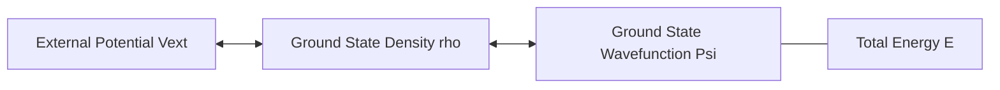

**图 8-1**：Hohenberg–Kohn 定理的逻辑映射。电子密度包含了构建哈密顿量所需的所有信息，从而决定了体系的所有性质。

##### 8.3 Kohn–Sham 方案

Kohn–Sham（KS）引入一个 **虚拟的无相互作用参考体系**，其密度与真实体系 **完全相同**：

$$
\rho(\mathbf{r}) = \sum_{i=1}^{N} |\phi_i^{\mathrm{KS}}(\mathbf{r})|^2

$$

能量泛函重组为：

$$
E[\rho] = T_s[\rho] + J[\rho] + E_{\mathrm{xc}}[\rho] + \int v_{\mathrm{ext}}\,\rho\,d\mathbf{r}

$$

其中 $E_{\mathrm{xc}}[\rho]$ 是 **交换–相关泛函**，包含所有未知的复杂相互作用。

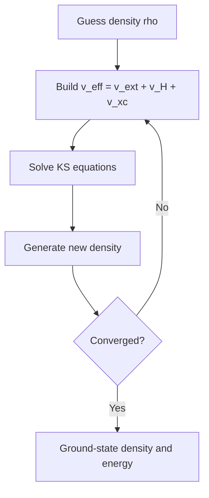

**图 8-2**：KS-DFT 的自洽场（SCF）流程。

##### 8.4 自相互作用误差（SIE）

在 DFT 中，近似 $E_{\mathrm{xc}}$ 不能精确抵消 $J[\rho]$ 中的自排斥部分，导致 **自相互作用误差（SIE）**。这是 DFT 许多系统性偏差（如能垒偏低、带隙偏小）的根源。

---

#### §9 交换–相关泛函：Jacob's Ladder

John Perdew 提出的 **Jacob's ladder**（雅各布天梯）按泛函依赖的信息量从少到多分为五阶：

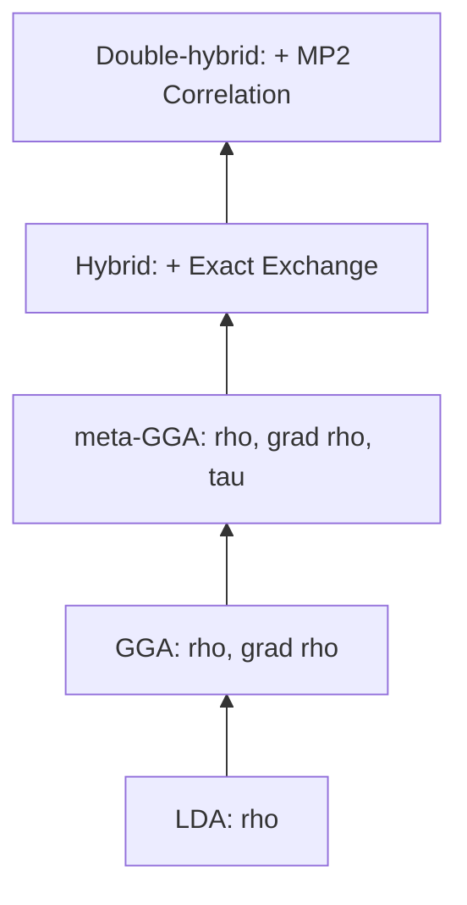

**图 9-1**：Jacob's ladder。每一阶都引入了更多的物理信息，理论上精度逐步提高。

##### 9.1 常用泛函分类


| 阶层              | 代表泛函     | 特点                             |
| :------------------ | :------------- | :--------------------------------- |
| **LDA**           | SVWN         | 均匀电子气模型，分子计算中已少用 |
| **GGA**           | PBE, BLYP    | 引入密度梯度，固体与大体系常用   |
| **meta-GGA**      | SCAN, M06-L  | 引入动能密度，精度优于 GGA       |
| **Hybrid**        | B3LYP, PBE0  | 混合 HF 交换，有机化学的通用选择 |
| **Double-Hybrid** | B2PLYP, XYG3 | 包含 MP2 相关，精度接近 CCSD(T)  |

##### 9.2 色散校正（Dispersion Correction）

标准 DFT 无法描述 van der Waals 力。常用 **Grimme 的 DFT-D3/D4** 校正：

$$
E_{\mathrm{total}} = E_{\mathrm{DFT}} + E_{\mathrm{disp}}

$$

这对于描述分子间相互作用（如 $\pi-\pi$ 堆积、蛋白质折叠）至关重要。

---

#### §10 DFT 实践指南

##### 10.1 方法选择建议


| 场景               | 推荐泛函         | 理由                           |
| :------------------- | :----------------- | :------------------------------- |
| **有机反应**       | ωB97X-D, M06-2X | 包含色散与高比例交换，能垒准确 |
| **大规模固体**     | PBE, SCAN        | 效率高，结构描述好             |
| **激发态 (TDDFT)** | CAM-B3LYP        | 范围分离泛函改善电荷转移态     |
| **过渡金属**       | PBE0, TPSSh      | 杂化泛函缓解离域误差           |

##### 10.2 TDDFT（含时 DFT）

**含时密度泛函理论（TDDFT）** 是计算激发态的主流方法。其核心是求解 **Casida 方程**：

$$
\begin{pmatrix} \mathbf{A} & \mathbf{B} \\ \mathbf{B}^* & \mathbf{A}^* \end{pmatrix} \begin{pmatrix} \mathbf{X} \\ \mathbf{Y} \end{pmatrix} = \omega \begin{pmatrix} \mathbf{1} & \mathbf{0} \\ \mathbf{0} & -\mathbf{1} \end{pmatrix} \begin{pmatrix} \mathbf{X} \\ \mathbf{Y} \end{pmatrix}

$$

这允许我们获得激发能 $\omega$ 和振子强度。

```mermaid
graph TD
    GS[Ground State Density rho_0] --> |"Time-dependent Potential v(t)"| TDS[Time-dependent Density rho(t)]
    TDS --> |"Linear Response"| Exc[Excited States / Spectra]
```

**图 10-1**：TDDFT 的物理逻辑。通过密度对随时间变化的外场的响应来获取激发态信息。

---

##### G.3 `经典量子化学方法详解.md` — `# Part IV` 篇间标题（§10 与 §11 之间）

---

# 第六部分：方法比较、误差分析与现代发展

## 10. 方法层次与决策

#### 11.1 Pople 图（精度 vs 成本）

方法精度大致遵循 **Pople 图** 的双轴框架：

- **纵轴**：方法层次（HF → MP2 → CCSD → CCSD(T) → FCI）
- **横轴**：基组大小（STO-3G → DZ → TZ → QZ → CBS）

精度随两个方向的提升而提高，最终收敛到 **非相对论 BO 精确解**。

```mermaid
flowchart LR
    A[Small basis + low-level method] --> B[DZ/TZ + MP2 or hybrid DFT]
    B --> C[Large basis + CCSD(T)]
    C --> D[CBS / benchmark limit]
    E[DFT path] --> F[Accuracy depends on functional, not monotonic ladder]
```

**图 11-1**：Pople 图。理解两种独立改进方向：一是扩大一电子空间（基组），二是优化多电子相关（方法）。

#### 11.2 方法对照表


| 方法        | 标度      | 大小一致 | 变分 | 适用         | 典型精度       |
| :------------ | :---------- | :--------- | :----- | :------------- | :--------------- |
| **HF**      | $O(N^4)$  | 是       | 是   | 起点/参考    | 无相关，差     |
| **MP2**     | $O(N^5)$  | 是       | 否   | 弱关联闭壳层 | ~80% 相关能    |
| **CCSD**    | $O(N^6)$  | 是       | 否   | 中等精度     | ~95% 相关能    |
| **CCSD(T)** | $O(N^7)$  | 是       | 否   | **金标准**   | ~1 kcal/mol    |
| **FCI**     | $\exp(N)$ | 是       | 是   | 小体系       | 精确（基组内） |
| **DFT**     | $O(N^3)$  | 是       | 否   | 大体系、材料 | 泛函依赖       |

#### 11.3 方法选择决策树

```mermaid
graph TD
    Start[Choose Method] --> Main[Main Group?]
    Main -->|Yes| SingleRef[Single Reference?]
    SingleRef -->|Yes| Quick[Quick/Large?]
    Quick -->|Yes| DFT[DFT: B3LYP-D3, wB97X-D]
    Quick -->|No| Gold[Gold Standard: CCSD(T)/CBS]
    SingleRef -->|No| MultiRef[Multi-Reference: CASSCF + NEVPT2]
    Main -->|No| Metal[Transition Metal?]
    Metal -->|Yes| DFTU[DFT+U / Hybrid DFT]
    Metal -->|No| Solid[Solid State?]
    Solid -->|Yes| PBE[PBE / SCAN]
```

**图 11-2**：量子化学方法选择决策逻辑。

---

## 11. 误差分析和数学性质

#### 9.1 误差来源

##### 方法误差

- **HF**：忽略电子相关
- **CISD**：忽略高激发
- **DFT**：交换相关泛函近似

##### 基组误差

- 基组不完备
- 基组叠加误差

##### 数值误差

- 积分精度
- 矩阵对角化精度
- SCF收敛精度

#### 9.2 误差估计

##### 基组外推

使用多个基组大小，外推到CBS极限：

$$
E(M) = E_{CBS} + A e^{-\alpha M}

$$

##### 方法层次

比较不同级别的方法，估计方法误差。

#### 9.3 计算复杂度

##### 方法比较


| 方法  | 复杂度            | 可扩展性 |
| ------- | ------------------- | ---------- |
| HF    | $O(N^4)$          | 好       |
| MP2   | $O(N^5)$          | 中等     |
| CCSD  | $O(N^6)$          | 中等     |
| CCSDT | $O(N^8)$          | 差       |
| DFT   | $O(N^3)$-$O(N^4)$ | 好       |
| FCI   | 指数              | 不可扩展 |

## 12. 现代发展趋势（2020-2026）

### 12.1 局域相关方法：DLPNO-CCSD(T)

利用电子相关的 **局域性**，将成本降至 **近线性标度**：

$$
\text{DLPNO-CCSD(T)} \sim O(N^{1\text{-}2})

$$

这使得对 **数百个原子** 的大分子进行 CCSD(T) 精度的计算成为可能。

### 12.2 机器学习势能面（MLIP）

目标是 **以量子化学精度训练、以分子力学成本预测**：


| 方法         | 代表      | 关键特征              |
| :------------- | :---------- | :---------------------- |
| **NequIP**   | 2022      | E(3)-等变图神经网络   |
| **MACE**     | 2022      | 高阶等变消息传递      |
| **通用力场** | MACE-MP-0 | 2024–26 年的主流趋势 |

### 12.3 经典方法与量子计算的衔接

量子算法 **不替代** 经典的轨道准备，而是在 **最难的子问题**（如活性空间内的 FCI）上提供加速。

```mermaid
flowchart LR
    A[Classical: Orbitals + Integrals] --> B[Quantum: Active Space FCI]
    B --> C[Classical: Post-processing / ML Training]
```

**图 12-1**：经典与量子计算的混合流程。

### 12.8 经典方法与量子计算的衔接点

```
经典前端                        量子中间层                    经典后端
─────────────────────────      ──────────────                ────────────
DFT/HF → 轨道 + 积分   ──→   活性空间 + 映射（JW/BK） ──→   1-RDM 回写
AVAS → 活性空间选择     ──→   VQE / SQD / QPE         ──→   片段能量
DMET/嵌入 → bath 构造   ──→   量子求解器              ──→   ML 训练数据
CASSCF → 多参考参考     ──→   UCC ansatz 设计         ──→   DFT 校正
```

核心要点：

- 量子算法 **不替代** 经典的轨道/积分/嵌入准备，而是在 **最难的子问题**（活性空间内的 FCI）上提供另一条路
- 经典方法的精度天花板（尤其 **活性空间 FCI 的指数爆炸**）正是量子计算的切入点
- DLPNO-CCSD(T)、DMRG、Selected CI 的进步也在 **抬高经典基线**，量子算法需要瞄准经典确实做不到的问题

---

## 13. 理论思想总结

### 10.1 近似方法的层次结构

1. **单参考方法**：HF → MP2 → CCSD → CCSDT
2. **多参考方法**：CASSCF → MRCI → MRCC
3. **密度泛函方法**：LDA → GGA → 杂化 → 双杂化

### 10.2 精度与效率的权衡

- **高精度**：CCSDT, FCI（计算昂贵）
- **中等精度**：CCSD, MP2（实用）
- **快速方法**：DFT, HF（大系统）

### 10.3 可扩展性挑战

传统方法的计算复杂度随系统大小快速增长，限制了可处理系统的规模。

## 14. 思考题

1. 为什么CI方法不是大小一致的？CC方法如何解决这个问题？
2. MP微扰级数为什么不总是收敛？
3. Hohenberg-Kohn定理的物理意义是什么？
4. Kohn-Sham方法如何将多体问题简化为单电子问题？
5. 基组误差如何系统性地减小？
6. 传统方法的可扩展性瓶颈在哪里？

## 15. 总结

第3周将学习如何使用经典机器学习方法（神经网络、变分蒙特卡洛等）近似求解薛定谔方程，探索新的计算范式。

## 参考文献

### 教科书

[T1] A. Szabo, N. S. Ostlund. *Modern Quantum Chemistry: Introduction to Advanced Electronic Structure Theory*. Dover, 1996.

[T2] T. Helgaker, P. Jørgensen, J. Olsen. *Molecular Electronic-Structure Theory*. Wiley, 2000.

[T3] R. G. Parr, W. Yang. *Density-Functional Theory of Atoms and Molecules*. Oxford, 1989.

[T4] F. Jensen. *Introduction to Computational Chemistry*. 3rd ed., Wiley, 2017.

[T5] C. J. Cramer. *Essentials of Computational Chemistry: Theories and Models*. 2nd ed., Wiley, 2004.

### 综述与关键论文

[R1] J. P. Perdew, K. Schmidt. Jacob's ladder of density functional approximations for the exchange-correlation energy. *AIP Conf. Proc.* **577**, 1 (2001).

[R2] S. Grimme, A. Hansen, J. G. Brandenburg, C. Bannwarth. Dispersion-corrected mean-field electronic structure methods. *Chem. Rev.* **116**, 5105 (2016).

[R3] C. Riplinger, P. Pinski, U. Becker, E. F. Valeev, F. Neese. Sparse maps — A systematic infrastructure for reduced-scaling electronic structure methods. II. Linear scaling domain based pair natural orbital coupled cluster theory. *J. Chem. Phys.* **144**, 024109 (2016).

[R4] N. Mardirossian, M. Head-Gordon. Thirty years of density functional theory in computational chemistry: an overview and extensive assessment of 200 density functionals. *Mol. Phys.* **115**, 2315 (2017).

[R5] M. G. Medvedev, I. S. Bushmarinov, J. Sun, J. P. Perdew, K. A. Lyssenko. Density functional theory is straying from the path toward the exact functional. *Science* **355**, 49 (2017).

[R6] J. J. Eriksen et al. The ground state electronic energy of benzene. *J. Phys. Chem. Lett.* **11**, 8922 (2020).

[R7] G. K.-L. Chan, S. Sharma. The density matrix renormalization group in quantum chemistry. *Annu. Rev. Phys. Chem.* **62**, 465 (2011).

[R8] B. O. Roos, P. R. Taylor, P. E. M. Siegbahn. A complete active space SCF method (CASSCF) using a density matrix formulated super-CI approach. *Chem. Phys.* **48**, 157 (1980).

[R9] J. P. Perdew, M. Ernzerhof, K. Burke. Rationale for mixing exact exchange with density functional approximations. *J. Chem. Phys.* **105**, 9982 (1996).

[R10] S. Grimme, J. Antony, S. Ehrlich, H. Krieg. A consistent and accurate ab initio parametrization of density functional dispersion correction (DFT-D) for the 94 elements H-Pu. *J. Chem. Phys.* **132**, 154104 (2010).

[R11] P. G. Szalay, T. Müller, G. Gidofalvi, H. Lischka, R. Shepard. Multiconfiguration self-consistent field and multireference configuration interaction methods and applications. *Chem. Rev.* **112**, 108 (2012).

[R12] K. D. Vogiatzis, D. Ma, J. Olsen, L. Gagliardi, W. A. de Jong. Pushing configuration-interaction to the limit: Towards massively parallel MCSCF calculations. *J. Chem. Phys.* **147**, 184111 (2017).

[R13] L. Goerigk, A. Hansen, C. Bauer et al. A look at the density functional theory zoo with the advanced GMTKN55 database for general main group thermochemistry, kinetics and noncovalent interactions. *Phys. Chem. Chem. Phys.* **19**, 32184 (2017).

---

*本文档为学习笔记，侧重直觉与层次。更深入的推导参见上列教科书 [T1]–[T5]。与量子计算化学的衔接参见 [量子计算-QC-ppt.md](../literature/量子计算-QC-ppt.md)、[量子计算在计算化学中的方法与文献地图.md](../literature/量子计算在计算化学中的方法与文献地图.md)、[学习问答记录.md](../literature/学习问答记录.md)。*
