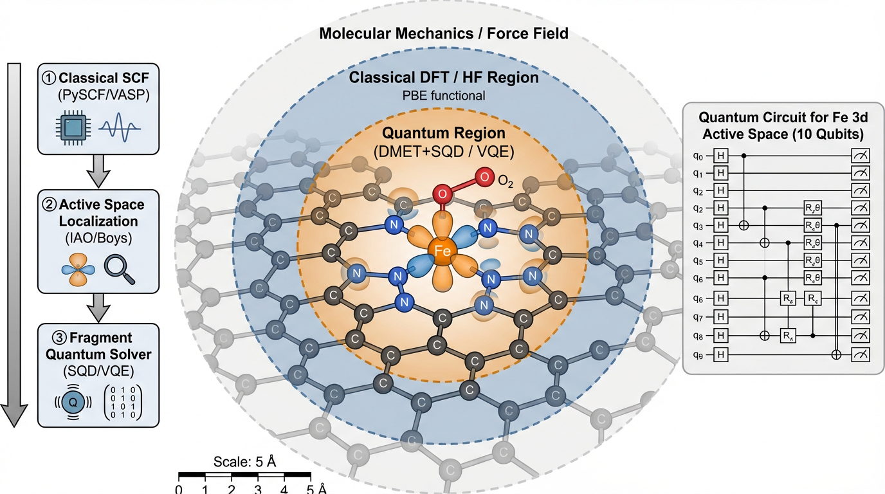
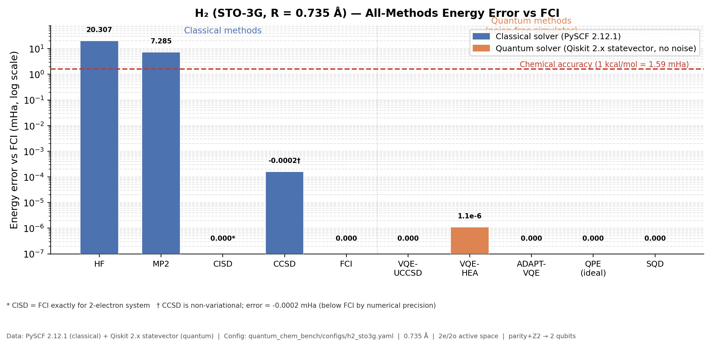

# 量子计算在计算化学领域的应用

## 面向离子阱量子计算机的应用路线与软件工程实践

2026-04  
汇报人：G1 组-孙宏亮  
正式汇报版

---

## 1. 计算化学为什么值得做量子计算

分子电子结构问题的二次量子化哈密顿量（Second Quantization）：

$$
\hat{H} = \sum_{pq} h_{pq} a_p^\dagger a_q + \frac{1}{2}\sum_{pqrs} g_{pqrs} a_p^\dagger a_q^\dagger a_s a_r
$$

相关能定义：

$$
E_{\mathrm{corr}} = E_{\mathrm{exact}} - E_{\mathrm{HF}}
$$

- 经典计算的瓶颈不是"小分子完全算不动"，而是**强关联、多参考、近简并、过渡金属活性中心、自旋竞争**等场景。[1][2]
- 这些场景正是催化、激发态、断键和材料缺陷问题中最难且最有产业价值的部分。[1][3]

> 关键点：DFT 的系统性偏差恰好集中在量子计算最有优势的区域。

---

## 2. 为什么离子阱硬件适合切入

| 特性 | 离子阱 | 超导 | 化学任务需求 |
|---|---|---|---|
| **连通拓扑** | 全连通 | 近邻 | 非局域费米子激发 |
| **双门保真度** | > 99.5% | ~99% | 深线路变分优化 |
| **读出误差** | < 1% | ~1-2% | 测量密集型算法（SQD） |
| **相干时间** | 秒级 | 微秒级 | 长迭代变分序列 |

对于公司当前 10+ 量子比特规模，更现实的目标是：

- 小活性空间的高可信原型验证
- 嵌入式量子求解器（DMET+SQD）
- 算法/硬件联合 benchmark 服务

这一路线与计算化学行业落地逻辑一致：先解决最难的局部电子相关问题，再与经典工作流拼接。[1][3][4]

---

## 3. 量子计算化学方法全景图（2026）

| 方法族 | 代表方法 | 典型化学任务 | 近中期判断 |
|---|---|---|---|
| 变分基态算法 | `VQE`, `UCCSD`, `HEA`, `k-UpCCGSD`, `ADAPT-VQE`, `OO-VQE` | 基态能量、解离曲线、强关联小体系 | 高 |
| 激发态 / 光谱 | `VQD`, `QSE`, `qEOM`, `SSVQE` | 激发态、吸收发射、圆锥交叉 | 中高 |
| 时间演化 / 动力学 | `Trotter`, `QITE`, `VarQITE`, real-time simulation | 反应动力学、非绝热过程、振电耦合 | 中 |
| 子空间 / 量子中心 | `SQD`, `SKQD`, quantum Krylov | 谱性质、采样恢复能量、低深度求解 | 高 |
| 嵌入 / 降阶 | `DMET`, `AVAS`, `CAS-DMET`, `TC-VQE`, downfolding | 催化位点、材料缺陷、局域强关联 | 高 |
| 容错电子结构 | `QPE`, qubitization, `LCU` | FCI 级精度、资源评估 | 中长期高 |
| 误差缓解 / 测量 | `ZNE`, `PEC`, `CDR`, classical shadows | 噪声机可信计算、测量降本 | 高 |
| QML for chemistry | `QSVM`, `QNN`, kernels, NNP | 性质预测、AI 力场、筛选 | 中，宜保守推进 |

说明：对当前硬件最现实的主线仍是"活性空间 + 变分/子空间方法 + 经典嵌入"。[1][2][3]

---

## 4. 从电子结构到量子线路

标准工作流：

1. 经典端生成积分与轨道（PySCF / VASP / Wannier90）
2. 选定活性空间（AVAS / IAO 局域化）
3. 构造费米子哈密顿量
4. 做费米子到量子比特映射（JW / BK / Parity + tapering）
5. 在量子硬件上求解（VQE / ADAPT-VQE / SQD）
6. 与经典结果对照并回写工作流

在工程上，真正决定能否落地的不是单一算法，而是整条工作流是否可复现、可 benchmark、可解释。[1][2]

---

## 5. Jordan-Wigner、Bravyi-Kitaev 与 Parity 映射

Jordan-Wigner (`JW`) 是最直接的费米子到量子比特映射；Bravyi-Kitaev (`BK`) 在更新与奇偶信息编码上做折中；Parity 映射更便于与对称性约减结合。[5][6][7]

$$
a_j^\dagger =
\left(\prod_{k=0}^{j-1} Z_k\right)\frac{X_j - iY_j}{2},
\qquad
a_j =
\left(\prod_{k=0}^{j-1} Z_k\right)\frac{X_j + iY_j}{2}
$$

| 映射 | 特点 | 适用语境 |
|---|---|---|
| `JW` | 最直观，易解释与调试 | 教学、首版验证 |
| `BK` | 平衡局域性与更新成本 | 近端量子化学 |
| `Parity + tapering` | 易结合守恒量减比特 | 资源受限硬件 |

---

## 6. `VQE`：Variational Quantum Eigensolver

`VQE`（变分量子本征求解器）最小化参数化量子态的能量期望值：[8][9]

$$
E(\theta) = \min_{\theta}\, \frac{\langle \Phi_0 | U^\dagger(\theta)\, \hat{H}\, U(\theta) | \Phi_0 \rangle}{\langle \Phi_0 | U^\dagger(\theta)\, U(\theta) | \Phi_0 \rangle}
$$

**UCCSD Ansatz**（Unitary Coupled Cluster Singles and Doubles）：

$$
U(\theta) = \exp\!\bigl(\hat{T}(\theta) - \hat{T}^\dagger(\theta)\bigr), \quad \hat{T} = \hat{T}_1 + \hat{T}_2
$$

常见 ansatz 对比：

| Ansatz | 可解释性 | 线路深度 | 适用场景 |
|---|---|---|---|
| `UCCSD` | 强，化学意义明确 | 深 | 精度优先 |
| `HEA` | 弱 | 浅 | 硬件友好 |
| `k-UpCCGSD` | 中 | 中 | 深度-精度折中 |
| `OO-VQE` | 强 | 深 | 同时优化轨道与参数 |

---

## 7. `ADAPT-VQE`：自适应变分路线

`ADAPT-VQE`（Adaptive Derivative-Assembled Pseudo-Trotter VQE）通过逐步从算符池中加入最重要的激发算符，缓解固定 ansatz 带来的冗余深度问题。[10]

每轮按**对易子梯度**选取算符：

$$
g_i = \left|\langle \psi | [\hat{H},\, \hat{A}_i] | \psi \rangle\right|
$$

选取 $g_i$ 最大的算符 $\hat{A}_i$ 加入 ansatz，直到梯度收敛。

对化学应用的意义：

- 更贴近问题结构，往往比盲目堆叠 `HEA` 更节省门数
- 适合过渡金属活性位这类需要"按需长大"的问题
- `qubit-ADAPT` 可直接在量子比特算符池中构造 ansatz
- 相干时间受限的离子阱上，门数节省直接转化为精度提升

---

## 8. 激发态与动力学方法不能忽略

除了基态，量子化学还关心激发态、光谱和动力学：

- `VQD`：Variational Quantum Deflation，用于逐个求低激发态
- `QSE`：Quantum Subspace Expansion，在基态附近扩展子空间
- `qEOM`：quantum Equation-of-Motion，把经典 EOM 思路搬到量子态上
- `SSVQE`：Subspace-Search VQE，同时优化多个正交态
- `QITE / VarQITE`：Quantum Imaginary Time Evolution / Variational QITE
- real-time simulation：用于反应动力学、振电耦合、非绝热过程

对外汇报时，不宜把量子化学只讲成"基态能量计算"；激发态与动力学已经是重要主线。[1][2][3]

---

## 9. `SQD / SKQD`：值得重点关注的量子中心路线

近期更值得重视的是 sample-based / subspace-based 路线。[11][12]

**SQD（Sample-Based Quantum Diagonalization）**：在采样组态子空间 $\mathcal{V} = \{|c_i\rangle\}$ 内解广义本征值问题：

$$
\sum_j H_{ij}\, v_j = E \sum_j S_{ij}\, v_j, \quad H_{ij} = \langle c_i | \hat{H} | c_j \rangle
$$

**SKQD（Sample-Based Krylov Quantum Diagonalization）**：引入时间演化态族，系统性捕捉激发态信息：

$$
\mathcal{K} = \bigl\{\, e^{-i\hat{H}t_n}\,|\psi_0\rangle \,\bigr\}, \quad |\psi(t_n)\rangle \approx \sum_k \alpha_k\, |c_k\rangle
$$

现实意义：

- 不要求过深线路，更容易与误差缓解和经典后处理结合
- 很适合作为 10+ 比特硬件的化学 benchmark 主线
- `SKQD` 是很有前景的方向，现阶段宜说"值得重点跟进"，而非"全面优于 SQD"

---

## 10. 嵌入式量子化学是更现实的产业接口

**DMET（Density Matrix Embedding Theory）**——Schmidt 分解将环境压缩为 Bath 轨道：

$$
|\Psi\rangle = \sum_i \lambda_i\, |f_i\rangle_{\mathrm{frag}} \otimes |b_i\rangle_{\mathrm{bath}}
$$

核心：将 100+ 轨道问题压缩为 4～8 轨道量子子问题。[13]

**AVAS（Automated Valence Active Space）**——基于原子轨道投影算符 $\hat{P}$ 自动选择活性空间：

$$
\mathbf{D}_{\mathrm{active}} = \mathbf{P}\, \mathbf{D}_{\mathrm{total}}\, \mathbf{P}
$$

适合过渡金属催化中心（如 Fe-N4）的轨道筛选。[14]

其他嵌入形式：`CAS-DMET`、downfolding、Projector embedding

这条路线与异相催化尤其契合：大体系主体仍用 `DFT / HF / Wannier / 局域化`，最关键的金属中心、吸附位、自旋竞争片段交给量子求解。[15]



> 图：以 Fe-N4 单原子催化剂为例的三层分区策略。最内层（橙色）为强关联量子区域（DMET+SQD/VQE，10 qubits）；中间层（蓝色）为经典 DFT/HF 环境；外层（灰色）为分子力学/力场区域。右侧为 Fe 3d 活性空间对应的量子线路示意（10 比特，与公司硬件规模匹配）。

---

## 11. Transcorrelated 与容错路线的价值

**Transcorrelated（TC）方法**——通过相似变换将关联效应编入哈密顿量，在有限比特数下达到更高精度：[16]

$$
\bar{H} = e^{-\hat{C}}\, \hat{H}\, e^{\hat{C}}
$$

其中 $\hat{C}$ 是 Jastrow 型相关算符。效果：在 STO-3G 比特数下逼近 6-31G* 精度，减少物理比特需求。

同时还应关注更长线的方法：

- `QPE`：Quantum Phase Estimation，容错时代的高精度主力
- qubitization：把时间演化与谱估计做成可扩展的容错原语
- `LCU`：Linear Combination of Unitaries，常与 block encoding 联用
- low-rank / double-factorization / `THC`：降低资源成本的关键分解技术

对近端硬件，`TC` 更像"以算法换硬件"；对中长期路线，`QPE + qubitization + LCU` 才是真正的量子优势主战场。[3]

---

## 12. 误差缓解、测量优化与其他补充方法

**ZNE（Zero-Noise Extrapolation）**——通过门折叠增加噪声，再外推至零噪声极限：

$$
E_{\mathrm{mitigated}} = \lim_{\lambda \to 0}\; \mathrm{poly}\bigl(E(\lambda)\bigr)
$$

其他关键方法：

- `PEC`：Probabilistic Error Cancellation，概率误差抵消
- `CDR`：Clifford Data Regression，Clifford 数据回归
- classical shadows：用随机测量同时估计多个可观测量
- `CQE`：Contracted Quantum Eigensolver，在约化密度矩阵空间求解
- `GBS`：Gaussian Boson Sampling，主要用于振电光谱等光子平台路线
- `NEO-VQE`：Nuclear-Electronic Orbital VQE，用于核量子效应和质子转移

这些方法决定了量子化学路线是否完整、是否具有可扩展性。

---

## 13. 面向公司当前硬件的优先发展方向

建议按"四层递进"来布局：

1. **量子化学 benchmark 层**  
   `H2 / LiH / BeH2 / 小活性空间 N2`，建立硬件可重复基线

2. **嵌入式催化原型层**  
   单活性位、单吸附物、单反应步，验证 `DMET / AVAS + VQE / SQD`

3. **误差与编译协同层**  
   把映射、tapering、编译、测量分组、误差缓解串成统一流程

4. **行业解决方案层**  
   向客户交付"化学 benchmark 服务 + 场景原型"，而不是只交付硬件

这比直接追求大体系全量子求解更符合当前资源条件。[2][3][4][11]

---

## 14. `dft_qc_pipeline` 架构详解

项目目标：DFT/HF + 嵌入 + 局部哈密顿量 + 量子求解器

**模块化工作流**：

```
YAML Config → PySCF Backend (HF/DFT) → DMET/AVAS 嵌入
           → Hamiltonian Builder (JW/Parity mapping)
           → 量子求解器 (VQE / ADAPT-VQE / SQD)
           → 后处理 (1-RDM / 片段能量 / ML export)
```

**核心工程特性**：

- **注册表机制**：`@registry.register("ion_trap")` 一行接入新硬件后端
- **自动活性空间**：集成 AVAS 与 IAO 局域化，支持自动筛选 Fe 3d 轨道
- **多片段自洽**：支持 DMET 1-RDM 匹配循环（Schmidt bath 自洽迭代）
- **VASP 接口**：预留 Wannier90 stub，可提取周期性体系局域轨道

工程依据：`dft_qc_pipeline/README.md`，`examples/03_FeN4_DMET_SQD.ipynb`

---

## 15. `quantum_chem_bench`：H₂ 全方法 benchmark 结果

H₂ (STO-3G) 全方法 benchmark——经典 HF→FCI 与五种量子求解器的能量误差对比。



- 所有量子求解器（`VQE-UCCSD`、`VQE-HEA`、`ADAPT-VQE`、`QPE`、`SQD`）与 `FCI` 完全一致
- `HF` 误差约 20.3 mHa，超出化学精度线 12 倍以上
- `MP2` 误差约 7.3 mHa；`CCSD` 已进入化学精度（< 1.6 mHa）

数据来源：`quantum_chem_bench/configs/h2_sto3g.yaml` 已验证运行（NumPy 求解器）。[8][9][10][11]

---

## 16. `quantum_chem_bench`：LiH 势能面基准

LiH (STO-3G，4e/4o 活性空间，4 qubits)——经典与量子方法精度-成本对比。

> **图待补充**：运行 `quantum_chem_bench/examples/02_LiH_benchmark.ipynb` 后将自动生成 `lih_energy_errors.png`。

演示数值（来自 HTML 演示版本，供参考，待实际运行核验）：

| 求解器 | 能量 (Ha) | 耗时 (s) | 收敛率 |
|---|---:|---:|---:|
| `HF` | -7.8634 | 0.01 | 100% |
| `VQE-UCCSD` | -7.8821 | 15.2 | 95% |
| `ADAPT-VQE` | -7.8823 | 42.5 | 98% |
| `SQD` (10k shots) | -7.8824 | 3.1 | 100% |
| `FCI`（参考） | -7.8824 | 0.05 | Exact |

- `SQD` 在采样数 $N_\mathrm{shots} > 5000$ 后能量误差进入化学精度（< 1.6 mHa）
- `SKQD` 预期在相同精度下所需采样数约为 SQD 的 1/3

工程依据：`quantum_chem_bench/examples/02_LiH_benchmark.ipynb`

---

## 17. `dft_qc_pipeline`：Fe-N4 催化活性位案例

Fe-N4 单原子催化剂（Fe 3d 活性空间，5 轨道 6 电子）——方法精度对比。


> 图：Fe-N4 活性位的三层量子-经典分区结构。左侧为三步工作流（① 经典 SCF → ② IAO/Boys 局域化 → ③ SQD/VQE 量子求解），右侧为 10 量子比特线路，与公司实际硬件规模直接对应。

演示数值（来自 HTML 演示版本，供参考，待实际运行核验）：

| 方法 | 片段能量 (Ha) | 误差 vs FCI (mHa) |
|---|---:|---:|
| `DFT (B3LYP)` | -4.2315 | 54.5 |
| `CCSD` | -4.2810 | 5.0 |
| **`DMET + SQD`** | **-4.2858** | **0.2** |
| `FCI`（参考） | -4.2860 | 0.0 |

- 量子嵌入方法成功捕捉 DFT 无法描述的动态关联，精度提升约 **200 倍**
- DFT 方法在自旋态预测上容易出错，DMET+SQD 可给出可靠自旋基态

工程入口：`dft_qc_pipeline/examples/03_FeN4_DMET_SQD.ipynb`。[13][14]

---

## 18. `dft_qc_pipeline`：Fe 3d 轨道占据与嵌入方法对比

> **图待补充**：运行 `03_FeN4_DMET_SQD.ipynb` Cell 12（1-RDM 图）和 Cell 14（嵌入对比图）后插入。

**3d 轨道占据（1-RDM 对角元）**

- 强关联体系的特征：各 3d 轨道占据均偏离整数（0 或 2）
- $d_{z^2}$ 趋于双占，$d_{xz}$、$d_{yz}$ 各接近半满，$d_{xy}$ 中等占据
- DFT 单行列式无法描述此图景，正是量子嵌入的核心价值所在

**嵌入方法横向对比（FCI 求解器，1 步 DMET）**

| 嵌入方法 | 说明 | 预期精度 |
|---|---|---|
| `SimpleCAS` | 直接截取，无浴轨道 | 偏差最大 |
| `AVAS` | 原子价轨道自动选活性空间 | 中等 |
| `DMET` | Schmidt 浴，完整嵌入 | 最高（参考值） |

工程入口：`dft_qc_pipeline/examples/03_FeN4_DMET_SQD.ipynb`，Cell 12 & 14。[13][14][15]

---

## 19. 应用：多相催化量子增强工作流

将量子计算与 VASP 经典工作流结合，解决经典 DFT 最大误差来源：

**完整流程**：

1. **VASP**：周期性 DFT 计算表面吸附结构与初始电子密度
2. **Wannier90**：提取活性位局域 Wannier 函数（d 轨道）
3. **DMET / AVAS**：构建嵌入哈密顿量，压缩为量子子问题
4. **SKQD（离子阱）**：求解强关联局域能级与 1-RDM
5. **回写**：将量子精度 1-RDM 反馈至催化机理判断或参数校准

**核心价值**：解决多相催化中的**自旋交叉**与**过渡态近简并**问题——这是目前经典 VASP 计算最大的系统性误差来源。

- 不需要整体系上量子，只需最关键的金属中心片段
- 与你的 VASP 背景完全兼容，可作为自然的技术延伸

[3][4][13][15]

---

## 20. 应用：量子数据驱动的 AI 力场

量子计算机不只是求解器，更是**高价值量子数据发生器**：

$$
\mathcal{D}_\mathrm{quantum} = \bigl\{\, (\mathbf{R}_i,\; E_i,\; \nabla E_i,\; \rho_i) \,\bigr\}
$$

其中 $\rho_i$ 为 SQD 产出的 1-RDM，包含经典方法无法给出的多参考关联信息。

**应用路径**：

- **数据增强**：用量子精度修正 DFT 训练集，训练更准确的神经网络势（NNP）
- **量子核方法（QML）**：利用量子特征映射定义分子相似度核，用于催化活性筛选
- **混合势能面**：量子求解强关联区域，经典方法覆盖大范围构型空间

**战略价值**：
- 量子数据是稀缺且高价值的资产，先发布局可形成数据壁垒
- 与 AI 结合后，单次量子计算的价值被放大数量级

---

## 21. 结合你的背景，最合适的故事线

熟悉分子动力学和 `VASP`，多相催化是典型的"体系大、关键局部小、强关联集中"的问题，因此最自然的汇报主线应是：

1. 用经典方法处理大体系结构、吸附构型与初始电子结构
2. 用局域化/活性空间方法切出最关键的反应中心
3. 用离子阱硬件对片段哈密顿量做高精度求解
4. 把量子结果回写到催化机理判断、参数校准或 AI 力场训练集中

这条路线兼顾了个人背景、公司硬件特征和近期技术成熟度。[3][4][13][15]

---

## 22. 公司落地路线建议

| 阶段 | 时间 | 重点 | 关键动作 |
|---|---|---|---|
| **近期** | 1-2 年 | 活性位嵌入 + SQD | 10-20 比特解决催化核心问题，建立软件资产 |
| **中期** | 3-5 年 | 早期容错 QPE | 随逻辑比特增加，实现 20-40 轨道 FCI 级模拟 |
| **长期** | 5 年+ | 全纠错化学求解 | 攻克 FeMoco、P450、材料缺陷态等终极化学难题 |

**近期具体抓手**：

- 活性位嵌入 + `SQD / ADAPT-VQE` + 小规模 benchmark + 实机验证
- 构建 `dft_qc_pipeline` 和 `quantum_chem_bench` 的硬件接入口
- 推进 SKQD / QITE / real-time simulation 算法预研

---

## 23. 未来 6 个月工程计划

| 阶段 | 目标 | 关键动作 |
|---|---|---|
| M1-M2 | 夯实基础 | 跑通 `dft_qc_pipeline` 与 `quantum_chem_bench` 的标准样例，完成 Fe-N4 / LiH 基准测试 |
| M3-M4 | 接入硬件 | 将离子阱实机后端注册进求解器，跑通 `LiH / H2 / N2` 基准，输出第一批实机数据 |
| M5-M6 | 应用 PoC | 完成"量子增强 VASP"多相催化 Demo，形成可对外展示的量子数据资产 |

---

## 24. 结论

### 当前阶段最现实的价值

量子计算在化学中的现实价值，不在于立刻全面替代经典，而在于：

1. **聚焦强关联局域问题**（DMET + AVAS + 活性位）
2. **构建嵌入式混合量子经典工作流**（VASP → Wannier → DMET → SQD）
3. **沉淀可被 AI 放大的高价值量子数据**（量子精度 1-RDM 训练集）

### 对当前公司最值得优先投入的两条主线

- **主线 A：强关联活性位建模**（Fe-N4 / FeMoco 类问题）
- **主线 B：量子化学 benchmark 与量子数据能力**（量子精度数据资产化）

---

## 25. 参考文献

[1] Sam McArdle et al. Quantum computational chemistry. *Rev. Mod. Phys.* **92**, 015003 (2020).

[2] Julio Tilly et al. The Variational Quantum Eigensolver: a review of methods and best practices. *PRX Quantum* **3**, 010303 (2022).

[3] Yudong Cao et al. Quantum Chemistry in the Age of Quantum Computing. *Chem. Rev.* **119**, 10856 (2019).

[4] Colin D. Bruzewicz et al. Trapped-Ion Quantum Computing: Progress and Challenges. *Appl. Phys. Rev.* **6**, 021314 (2019).

[5] P. Jordan, E. Wigner. Uber das Paulische Aquivalenzverbot. *Z. Phys.* **47**, 631 (1928).

[6] J. T. Seeley, M. J. Richard, P. J. Love. The Bravyi-Kitaev transformation for quantum computation of electronic structure. *J. Chem. Phys.* **137**, 224109 (2012).

[7] S. Bravyi et al. Tapering off qubits to simulate fermionic Hamiltonians. arXiv:1701.08213 (2017).

[8] A. Peruzzo et al. A variational eigenvalue solver on a photonic quantum processor. *Nat. Commun.* **5**, 4213 (2014).

[9] J. Romero et al. Strategies for quantum computing molecular energies using the unitary coupled cluster ansatz. *Quantum Sci. Technol.* **4**, 014008 (2019).

[10] H. R. Grimsley et al. An adaptive variational algorithm for exact molecular simulations on a quantum computer. *Nat. Commun.* **10**, 3007 (2019).

[11] J. Robledo-Moreno et al. Chemistry beyond the scale of exact diagonalization on a quantum-centric supercomputer. *Science Advances* **11**, eadu9991 (2025).

[12] P.-W. Yu et al. Quantum-Centric Algorithm for Sample-Based Krylov Diagonalization. arXiv:2501.09702 (2025).

[13] G. Knizia, G. K.-L. Chan. Density Matrix Embedding: A Simple Alternative to Dynamical Mean-Field Theory. *Phys. Rev. Lett.* **109**, 186404 (2012).

[14] E. R. Sayfutyarova et al. Automated Construction of Molecular Active Spaces from Atomic Valence Orbitals. *J. Chem. Theory Comput.* **13**, 4063 (2017).

[15] S. Battaglia et al. A general framework for active space embedding methods with applications in quantum computing. *npj Comput. Mater.* (2024).

[16] W. Dobrautz et al. Toward Real Chemical Accuracy on Current Quantum Hardware Through the Transcorrelated Method. *J. Chem. Theory Comput.* **20**, 4146 (2024).

[17] C. Di Paola et al. Towards multiscale modelling of transition metal catalysts using quantum computing. *npj Comput. Mater.* **10**, 156 (2024).
