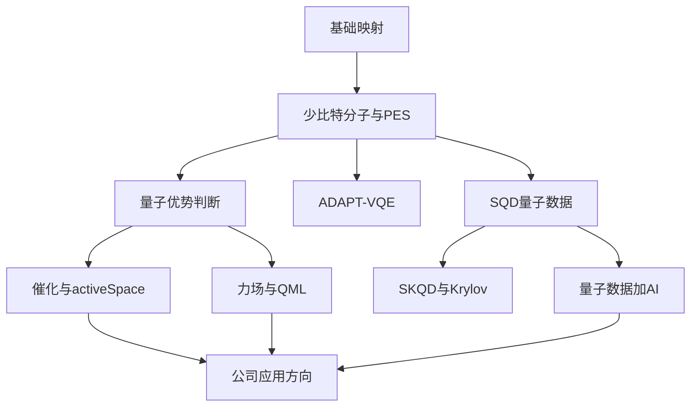
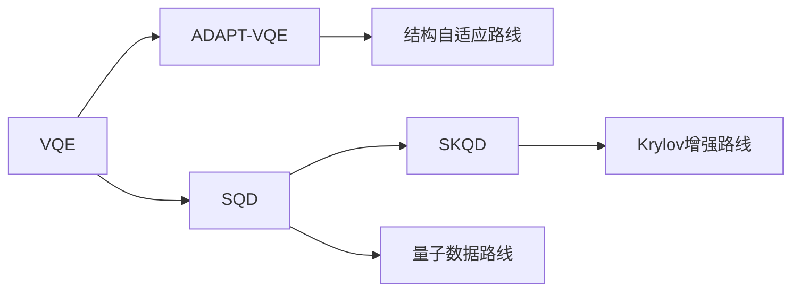
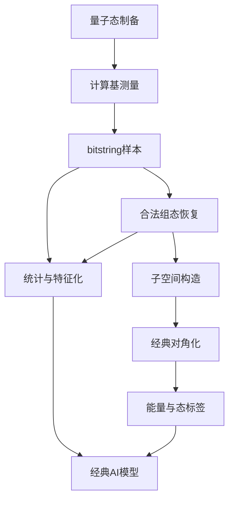

# 工作计划

---

## 第一部分：核心知识地图

这份知识地图的目标只有一个：把最重要的 6 份核心材料，压缩成一套可以反复复述的统一框架。

### 一句话总图

`基础映射 -> 少比特分子算法 -> 量子优势判断 -> SQD/量子数据路线 -> 催化与力场应用`

### 六个核心文件与各自使命

| 文件 | 你要从中拿走什么 |
|------|------------------|
| `README.md` | 全局结构、阶段依赖、外部论文入口、当前工作区的学习路线 |
| `Phase2_CoreAlgorithms/02_Qiskit_Nature_H2_LiH.ipynb` | 分子哈密顿量、PES、active space、`ParityMapper`、少比特化学例子为什么有意义 |
| `Phase3_AdvancedMethods/02_量子优势分析.ipynb` | 量子优势不是口号，而是复杂度、资源、误差、时间线和问题类型共同决定 |
| `SQD.md` | `bitstring -> 合法组态 -> 投影子空间 -> 经典对角化` 这条量子数据主线 |
| `Phase3_AdvancedMethods/01_进阶算法综述.ipynb` | `ADAPT-VQE / SQD / SKQD / qDRIFT` 的关系与边界 |
| `Phase4_Applications/01_非均相催化量子计算.ipynb` 与 `Phase4_Applications/02_量子计算辅助力场开发.ipynb` | 公司最关心的两个应用故事：强关联活性位与高精度训练数据/QML 力场 |

### 四条核心主线

#### 1. 少比特应用线

"比特不多的时候，量子计算还有没有价值？"

- 在于验证算法、刻画强关联局域问题、形成 active space 工作流、构建量子数据和建立混合量子经典管线。
- `H2`、`LiH`、`2-site Hubbard`、`Fe-N4 4 比特 toy model` 都不是毫无意义的玩具，而是用来训练对哈密顿量、活性空间、线路深度、误差来源和应用叙事的直觉。
- 少比特阶段的真正价值是找准未来会放大的方法和数据路线。

#### 2. 量子优势线

- 容错阶段的 `QPE` 在理论上对 FCI 级问题有多项式量子复杂度优势，但真正落地需要大量物理比特与纠错开销。
  - 长期优势：强关联大体系、FCI 级精度、容错量子计算。
  - 近期机会：NISQ 下的 shallow 算法、采样型方法、量子嵌入、量子数据与 QML。
- 量子优势不是"是否比经典快"这么单一，而是"在什么精度、什么体系、什么资源预算、什么经典 baseline 下更值得"。

#### 3. 化学应用线

- 化学天然是量子多体问题，问题本身与量子计算语言高度同构。
- 强关联体系、近简并、自旋态竞争、断键成键、过渡金属活性中心，正是经典近似方法最脆弱而工业又非常在意的地方。
- 两个特别重要的应用故事：
  - `非均相催化`：`Fe-N4 / Co-N4 / TM oxide / active space / embedding`
  - `力场开发`：`PES 数据 -> ReaxFF / NNP / QML`

#### 4. 量子数据线

"公司为什么会关心 SQD 和量子测量数据？"

- 在 `SQD` 路线里，量子设备产出的不是单纯一个能量数字，而是比特串分布、组态样本、时间演化后的采样快照。
- 这些样本不是噪声垃圾，而是能被恢复、筛选、投影、特征化的"量子数据"。
- 这类数据最容易与经典 AI 形成协作，而不是简单替代经典 AI。

### 统一逻辑框架

### 关键词速查

| 关键词 | 你应该如何解释 |
|--------|----------------|
| `active space` | 只把最强关联、最化学关键的轨道映射到量子比特上 |
| `logical qubits` | 在算法语境中，通常指问题所需的信息量子比特数，不是纠错语境里的逻辑比特 |
| `PES` | 势能面，是反应、力场、动力学模型的基础数据面 |
| `VQE` | 通过参数化线路最小化能量的变分路线 |
| `ADAPT-VQE` | 动态长出 ansatz 结构，而不是一开始就固定线路 |
| `SQD` | 量子端采样，经典端子空间对角化，核心是"量子数据" |
| `SKQD` | 在 SQD 骨架上加入 Krylov 时间演化与更强理论收敛结构 |
| `qDRIFT` | 随机化哈密顿量模拟手段，常与 SKQD 相关 |
| `embedding` | 量子只解活性区域，其余环境用经典方法处理 |
| `quantum advantage` | 某类问题在特定资源和精度条件下，量子路线比最佳经典路线更有价值 |

---

## 第二部分：少比特应用与量子优势调研报告

### 执行摘要

核心结论：

- 少比特应用有价值，但价值主要体现在 `方法验证、active space 工作流、局域强关联建模、量子数据生成、混合量子经典方案验证`，而不是立刻全面替代经典计算。
- 真正意义上的大规模量子优势，更可能出现在容错量子计算阶段的 `QPE -> FCI 级电子结构` 路线上。
- NISQ 近期更现实的方向，不是"直接求解全部大分子"，而是 `浅层算法 + 子空间方法 + 嵌入 + 量子数据 + AI`。
- 对当前公司最值得关注的两条路线是：
  - `化学/催化/材料中的强关联活性位问题`
  - `量子数据（SQD 思想）与 AI/力场/QML 的结合`

### 一、什么是少比特应用

#### 1. 小分子与小活性空间的电子结构问题

典型例子来自 `Phase2_CoreAlgorithms/02_Qiskit_Nature_H2_LiH.ipynb`：

- `H2`、`LiH` 等体系可用于建立从分子哈密顿量到量子比特哈密顿量的完整工作流。
- `ParityMapper`、`ActiveSpaceTransformer` 这类工具表明，化学问题不是机械地"轨道数 = 比特数"，而是可以通过对称性和活性空间缩减成少比特问题。

这类问题的价值不在于体系大，而在于它们是量子化学算法的最小可验证单元。

#### 2. 强关联局域中心的 toy model 与 active site model

- `2-site Hubbard` 用来表现 `U/t` 提高后 DFT/HF 对相关效应的失效。
- `Fe-N4` 4 比特模型用来展示自旋态竞争、活性位近简并以及 VQE 的应用直觉。

这类少比特模型的意义：
- 把"为什么化学值得做量子"讲清楚。
- 它们对应的是将来更大活性空间嵌入方案的前身，而不是纯教学玩具。

#### 3. 浅层采样型算法

- 比起一味增加 ansatz 深度，某些 NISQ 算法更依赖测量采样、子空间恢复和经典线性代数。
- 这意味着"少比特 + 浅线路 + 更多采样处理"本身就是一种独立的方法学方向。

#### 4. 量子增强数据生成

- 用 `VQE/SQD` 生成关键反应点的高精度 PES 数据。
- 这些数据再进入 `ReaxFF / NNP / Quantum Kernel Ridge` 等后续建模流程。

少比特阶段最现实的价值，往往不是直接给出最终工业答案，而是生成更有价值的数据、构建更合理的混合工作流。

### 二、为什么少比特应用有真实价值

#### 1. 它训练的是问题缩放前的正确方法

少比特阶段的工作能帮助判断：
- 哪类 ansatz 更稳。
- 哪类测量策略更有效。
- 哪类 active space/embedding 更合理。
- 哪类量子数据在经典后处理环节最有价值。

#### 2. 它能与经典体系形成最自然的混合

当前最现实的路线不是量子完全替代经典，而是：
- 量子负责强关联、局域精细问题、高价值数据点。
- 经典负责环境、尺度扩展、训练、部署和统计学习。

### 三、什么是量子优势

量子优势不是一句"量子比经典快"，而是一个四维判断题：

- `问题类型`：问题本身是否有量子结构优势。
- `资源需求`：需要多少 qubit、多少门、多少采样。
- `精度要求`：是否要求化学精度、是否需要激发态或动力学信息。
- `经典基线`：要比较的是 HF、DFT、CCSD(T)、DMRG 还是 FCI。

#### 1. 长期量子优势

- `QPE` 对电子结构问题在理论上具有多项式量子复杂度。
- 相比 `FCI` 的指数复杂度，这意味着在强关联体系上存在原则性的量子加速空间。
- 问题：这类优势通常需要容错量子计算，真实资源消耗仍然非常高。

#### 2. 近期 NISQ 优势窗口

近期更有现实意义的，不是宣称"全面超越经典"，而是寻找 `局部优势窗口`：

- 强关联 active space 的混合求解。
- 采样型子空间算法如 `SQD`。
- 局域区域的量子嵌入。
- 量子生成高价值数据，再由经典 AI 放大使用。
- 特定结构下的量子核方法和量子特征映射。

### 四、化学中最可能先出现量子优势的地方

#### 1. 强关联电子结构

- 过渡金属活性位。
- 近简并自旋态。
- 断键成键过程。
- 多参考电子结构问题。

#### 2. 量子嵌入与局域子系统

- 大体系整体仍由 DFT、QM/MM、多尺度方法处理。
- 活性位、小局域区域交给 VQE、SQD 或未来更强的量子子程序。

优势：不需要一开始就拿下整套大体系，更容易和现有计算化学工作流融合。

#### 3. 量子数据增强的 AI 流程

- 用量子算法生成高价值 PES 点。
- 对 bitstring 和采样分布做恢复与特征化。
- 进入力场拟合、代理模型、候选筛选或 QML 管线。

这一方向符合"少量高价值数据驱动更大规模经典模型"的现代工业研发模式。

---

## 第三部分：SQD 专题

`为什么量子测量输出的 bitstring 可以成为高价值量子数据`

### 一、先把问题讲清楚

"很多人对量子计算的直觉是，量子机跑完以后给出一个能量或者一个答案。但在 SQD 这类方法里，量子设备更像一个数据发生器。它输出的不只是一个数，而是一批带有物理结构的测量样本。这些 bitstring 经过恢复、筛选和投影后，可以变成用于求解电子结构问题的小子空间，这就是 SQD 的核心价值。"

### 二、SQD 到底是什么

最简定义：

`SQD = 量子端采样 + 经典端子空间对角化`

5 步解释：

1. 用参数化线路或某个参考态制备量子态。
2. 在计算基上重复测量，得到 bitstring 样本。
3. 把不合法或受噪声污染的样本做 `configuration recovery`。
4. 用保留下来的组态张成一个小子空间。
5. 在这个子空间里构造投影哈密顿量并做经典对角化。

一句话版："量子设备负责告诉我们哪些组态重要，经典计算负责在这些重要组态张成的小空间里严肃地解本征问题。"

### 三、为什么它不是 VQE 的简单变种

**VQE 的核心逻辑**

- 量子端主要输出：能量期望值等标量。
- 经典端主要工作：优化参数，尽量压低能量。
- 关键挑战：参数优化、贫瘠高原、ansatz 设计、测量代价。

**SQD 的核心逻辑**

- 量子端主要输出：bitstring 分布、组态样本。
- 经典端主要工作：恢复、筛选、构造子空间、对角化。
- 关键挑战：采样质量、恢复质量、子空间质量、后处理成本。

记忆要点："VQE 的经典端像优化器，SQD 的经典端像线性代数求解器。"

### 四、为什么 bitstring 不是噪声垃圾，而是量子数据

- 单个 bitstring 看起来很粗糙，但大量 bitstring 组成的分布，反映了量子态在组态基上的支撑结构。
- 如果目标基态在某个组态基下是稀疏的，那么高频出现的 bitstring 很可能包含真正重要的电子组态信息。
- 经过粒子数、自旋、对称性等物理约束恢复后，这些样本可以成为一个高价值、低维、带物理意义的子空间入口。

"量子数据不是泛泛指来自量子机的所有输出，而是指那些能够被物理约束、统计结构和后续算法有效利用的测量样本与派生特征。"

### 五、SQD 为什么适合 NISQ 语境

**浅层**：比起某些深线路方案，SQD 更强调采样和后处理，因此更容易与有限深度硬件兼容。

**混合**：它天然就是量子经典协同方法，最适合今天的硬件现实，而不是等到完美容错才有意义。

**可与 AI 协作**：bitstring、组态、恢复规则、特征统计都更容易和 AI 形成连接，这一点比单纯输出一个能量值更有扩展性。

### 六、SQD、ADAPT-VQE、SKQD 三者怎么区分

- `ADAPT-VQE`：核心在"长线路"，靠梯度信息逐步挑选更好的算符来扩展 ansatz。
- `SQD`：核心在"采样 + 子空间"，靠 bitstring 和经典对角化榨取多组态信息。
- `SKQD`：核心在"Krylov 时间演化 + 采样 + 子空间"，它比 SQD 多了一条系统化构造态族的路线。

边界判断："ADAPT-VQE 更像结构自适应变分优化，SQD 更像量子采样驱动的子空间求解，SKQD 则是在子空间路线中加入 Krylov 时间演化和更强的理论组织。"

### 七、SKQD 为什么值得继续追

- SQD 已经证明了"采样型子空间路线"在 NISQ 下有现实意义。
- SKQD 把这条路线进一步系统化，引入时间演化态、Krylov 子空间和 qDRIFT 等工具。
- 从研究潜力看，SKQD 比单纯"再调一个 ansatz"更像一条可持续拓展的方法学主线。

> 如果有人问"那是不是 SQD 就落后了"：不是。SQD 更贴近当前可理解的量子数据工作流，SKQD 则更像它在理论结构和收敛层面的增强版本。

---

## 第四部分：SQD / ADAPT-VQE / SKQD 对比表

这份材料的作用不是做学术综述，而是让你在内部沟通时能迅速说清三条路线的定位差异。

### 一页总表

| 维度 | ADAPT-VQE | SQD | SKQD |
|------|-----------|-----|------|
| 核心思想 | 自适应扩展 ansatz | 采样驱动子空间对角化 | Krylov 时间演化 + 采样型子空间 |
| 量子端主要输出 | 能量梯度、期望值 | bitstring / 组态样本 | 多时刻演化态的采样样本 |
| 经典端主要工作 | 外层选算符 + 内层优化 | 恢复、筛选、投影、对角化 | 构造 Krylov 型子空间、广义本征问题 |
| 主要瓶颈 | 梯度测量代价、优化难度、线路增长 | 采样质量、恢复质量、子空间构造 | 时间演化实现、qDRIFT/Trotter 开销、采样成本 |
| 对硬件深度要求 | 中等到偏高 | 偏低到中等 | 中等，取决于时间演化实现 |
| 对 NISQ 友好度 | 一般，受优化和深度影响 | 较高 | 中等偏高，但工程实现更复杂 |
| 最适合回答的问题 | 如何构造更好的变分线路 | 如何把测量样本变成可解子空间 | 如何系统扩展采样型子空间并增强理论结构 |
| 与 AI 的接口 | 相对弱 | 很强 | 强 |
| 公司表达关键词 | 结构自适应、变分优化 | 量子数据、bitstring、子空间 | Krylov、收敛性、进阶采样方法 |

### 三条路线的最短定义

**ADAPT-VQE**："每轮看哪个算符最能继续降能量，就把它加进 ansatz，再重新优化全部参数。"

**SQD**："量子机负责采样重要组态，经典机负责在这些组态张成的小空间里对角化。"

**SKQD**："在 SQD 的采样和子空间思路上，再加入时间演化产生的 Krylov 态族，让子空间扩展更系统。"

### 站在公司视角怎么选重点

**如果目标是近期可讲、可做、可连接 AI**

优先级建议：`SQD`

原因：
- 最适合把"量子数据"讲成核心资产。
- 最适合和采样、bitstring、特征化、后处理结合。
- 最适合做 NISQ 阶段的混合量子经典叙事。

**如果目标是方法论深度与可持续研究线**

优先级建议：`SQD -> SKQD`

**如果目标是展示对变分算法也很熟**

保留 `ADAPT-VQE` 作为对照线，在内部交流时能同时讲清两条路线，会显得判断更全面。

### 三者关系图

### 对外和对内的推荐表述

**对技术同事**："ADAPT-VQE 解决的是 ansatz 结构问题，SQD 解决的是采样结果如何进入有效子空间问题，SKQD 进一步把采样型子空间组织成 Krylov 结构。"

**对领导**："如果我们想优先做出更贴近公司业务和 AI 结合的成果，最值得先押注的是 SQD 所代表的量子数据路线；ADAPT-VQE 是重要参照，SKQD 是未来可以继续深挖的升级方向。"

### 你应该记住的结论

- `ADAPT-VQE` 是"更聪明地长线路"。
- `SQD` 是"更聪明地用采样数据"。
- `SKQD` 是"更系统地扩展采样子空间"。

---

## 第五部分：量子数据与 AI 结合

### 一、定义问题

**核心思路**："量子计算提供新的高价值数据与特征来源，AI 负责放大这些数据的价值。"

`量子数据 = 由量子态制备与测量产生，并可被物理约束、统计处理和经典算法继续利用的数据对象`

在当前工作区语境下，这些数据对象主要包括：

- bitstring 样本
- 组态分布
- 恢复后的合法电子组态集合
- 投影子空间矩阵
- 不同时刻的演化采样快照
- 由采样派生的统计特征和物理标签

### 二、从 SQD 出发的量子数据流

这个流程说明：
- 量子机本质上负责数据生成与状态采样。
- AI 不一定直接接原始量子态，而是接量子测量后的结构化结果。

### 三、最现实的四条结合路径

#### 路径 1：量子生成高价值训练数据

做法：
- 用 `VQE/SQD` 计算 DFT 相对不可靠、但又很关键的点。
- 用这些点增强 PES 或反应路径数据集。
- 再交给 `ReaxFF / NNP / Kernel Ridge / 代理模型` 等经典模型。

适用场景：断键成键点、过渡金属中间体、自旋态竞争点、电荷转移相关构型。

价值：量子计算不需要覆盖全部数据点，只要覆盖最关键、最稀缺的数据点即可。

#### 路径 2：量子样本派生特征进入经典模型

做法：
- 从 bitstring 分布、组态频率、子空间权重中提取统计特征。
- 将这些特征作为经典 ML 的额外输入。

可行的特征示例：高频组态占比、组态熵或分布压缩度、子空间维数与收敛速度、不同时刻采样分布差异、特定物理约束下的样本保真度。

价值：把量子测量输出从"过程副产物"变成"可消费的模型特征"。

#### 路径 3：AI 辅助 configuration recovery 与样本筛选

做法：
- 用规则 + 机器学习的混合方式识别不合法、低价值或噪声主导的 bitstring。
- 学习从含噪样本到合法组态的映射。

价值：
- 能直接增强 SQD 类方法的工程可用性。
- 对公司来说，这是一条"量子数据工程"而非纯理论算法的切入口。

#### 路径 4：量子核方法进入势能面与力场建模

做法：
- 用量子特征映射定义 kernel。
- 在小规模例子上用 `Quantum Kernel Ridge` 与经典 `RBF kernel` 对比。
- 先不强求绝对性能碾压，而是识别何种高维、强关联特征下量子核可能更有表达力。

价值：适合对接已有 `ReaxFF / QML / ML-FF` 经验，最容易形成"量子 + AI"的可视化 demo。

### 四、建议优先级

从近期可做性和业务表达效果看，建议优先级如下：

1. `量子生成高价值训练数据`
2. `AI 辅助 SQD 样本恢复与筛选`
3. `量子样本派生特征进入经典模型`
4. `量子核方法扩展到力场/QML`

### 五、建议的内部 PoC 结构

**PoC A：SQD 数据管线演示**

目标：展示从 bitstring 到能量/子空间结果的全过程。

输入：小分子或 toy Hamiltonian 的采样数据。

输出：合法组态集合、子空间维数、最低本征值、若干统计特征。

**PoC B：VQE/SQD 数据增强的 PES 训练**

目标：展示少量高价值量子数据点如何增强力场或代理模型。

输入：一条小体系 PES 或反应坐标。

输出：使用纯 DFT 数据与量子增强数据训练后的模型对比。

---

## 第六部分：公司应用方向建议书

### 一、三条主线

**主线 A：化学/催化/材料中的强关联局域问题**

关键词：`active space`、`强关联活性位`、`量子嵌入`、`VQE / SQD`、`催化反应关键中间体`

**主线 B：量子数据 + AI**

关键词：`bitstring`、`SQD`、`量子测量数据`、`PES 高价值数据`、`QML / 力场 / 代理模型`

**延伸线 C：生物制药中的局域量子化学问题**

关键词：`局域活性位`、`小分子反应`、`结合位点微环境`、`高精度能量点`

建议：本阶段不把"生物制药"定义成完整药物研发全栈，先把它定义成"可从电子结构、反应路径和局域化学环境切入的量子化学问题"。

### 二、为什么优先做主线 A：化学/催化/材料

**1. 最符合现有材料与能力基础**

- 经典 DFT 处理大体系环境。
- 量子算法处理强关联活性位或活性空间。
- 先从少比特和 toy model 建直觉，再走向更大 active space。

**2. 最容易找到"经典不完美但工业很在意"的痛点**

以 `Fe-N4 / Co-N4 / TM oxide` 这类体系为例：
- 自旋态竞争强。
- 近简并和强关联明显。
- DFT 或 DFT+U 容易出现经验参数依赖和结果不稳。

**3. 最适合讲"局部先突破"的路线**

先把关键活性位看成量子子系统，用嵌入思路处理其余环境，先抓住最决定机制与趋势的局域问题。

**4. 最容易在近期做出"可演示、可复用"的成果**

相比抽象的量子优越性讨论，量子数据路线更容易形成实际资产：
- bitstring 数据处理模板
- 小规模 SQD 流程 demo
- PES 数据增强样板
- 量子核与经典核对比页

### 三、优先级矩阵

| 方向 | 技术可行性 | 业务可讲性 | 与现有背景匹配度 | 建议优先级 |
|------|------------|------------|------------------|------------|
| 催化/材料活性位 | 高 | 高 | 高 | 最高 |
| 量子数据 + AI | 高 | 高 | 高 | 最高 |
| 力场/PES 数据增强 | 高 | 高 | 很高 | 最高 |
| 生物制药局域切入 | 中 | 高 | 中 | 中高 |
| 完整药物发现全栈 | 低 | 高 | 低 | 低 |

### 四、建议公司内部的两条立项式方案

**方案 A：强关联活性位的混合量子经典建模**

目标：用少比特或中等 active space 的量子算法，提升对关键催化活性位的理解和计算精度。

技术路径：
1. 从 toy model 和小 active space 问题出发。
2. 建立 `PySCF / Qiskit Nature / active space / mapper / VQE or SQD` 流程。
3. 逐步走向嵌入式问题。

近期价值：内部形成样板案例，为未来更大规模量子嵌入做准备。

**方案 B：量子数据驱动的 AI 增强工作流**

目标：把量子计算输出的 bitstring、组态、PES 高精度点转化为 AI 可消费的数据资产。

技术路径：
1. 以 `SQD` 作为量子数据主线。
2. 定义 bitstring 和恢复后的组态数据结构。
3. 与 `ReaxFF / NNP / Kernel / 代理模型` 对接。

近期价值：最容易形成跨团队协作，最容易做出中短期演示。

### 五、结论

当前最应该做的不是在所有量子应用方向平均用力，而是抓住最有胜率、最能形成公司语言的两条主线：

- `强关联化学活性位`
- `量子数据 + AI`

生物制药则作为一条谨慎、可信、可逐步外推的延伸方向来定义。

---

## 第七部分：应用 Demo 讲解稿——催化活性位与量子增强力场

### 一、主 demo：Fe-N4 活性位与量子嵌入叙事

**开场目标**

"这个 demo 想回答一个非常具体的问题：在过渡金属单原子催化体系里，为什么经典 DFT 会不稳，以及量子算法最适合从哪里切入。"

**第一页：问题背景**

- `TM oxides`、`Fe-N4`、`Co-N4` 这类体系常存在强关联与多自旋态竞争。
- DFT 或 DFT+U 往往需要经验处理，结果对参数和泛函敏感。
- 真正值得量子计算切入的不是整个大体系，而是 `活性位局域问题`。

**第二页：Hubbard toy model**

- 当 `U/t` 变大时，HF/DFT 类近似和精确解的差距明显增大。
- 在强关联区间，经典低成本近似有结构性风险。

"这里的重点不是这 2-site Hubbard 本身多重要，而是它非常直观地告诉我们，强关联一上来，传统均场图景就会偏。真实催化活性位里的难点，本质上就和这种相关效应有关。"

**第三页：Fe-N4 4 比特模型**

"这个 4 比特模型当然不是完整 Fe-N4，但它抓住了活性位、自旋态竞争和局域强关联这几个最关键的物理点。少比特的意义，不是一次解决全部问题，而是把最关键的求解模块先做对。"

**第四页：完整研究工作流模板**

1. `PySCF` 做结构和活性空间准备。
2. `Qiskit Nature` 做问题变换和 qubit Hamiltonian。
3. `VQE` 或 `SQD` 处理 active space。
4. 经典方法继续处理环境与吸附能拆分。

**总结句**："如果公司要选一个最适合量子切入的化学方向，催化活性位和局域强关联问题是最自然的起点，因为它既有明确工业意义，又允许我们先做局域突破。"

### 二、5 分钟版本讲法

只讲 3 张图：

1. `Hubbard / DFT 失效图`
2. `Fe-N4 active site + embedding workflow`
3. `N2 PES / VQE 数据增强图`

对应三句话：
- "经典方法在强关联局域区间会失效。"
- "量子最适合先处理活性位而不是整套体系。"
- "量子也可以先作为高价值数据源服务于力场和 AI。"

### 三、15 分钟版本讲法

| 模块 | 时间 |
|------|------|
| 问题背景：为什么选催化和力场 | 2 分钟 |
| Hubbard 与 Fe-N4 活性位 | 5 分钟 |
| 量子嵌入工作流 | 3 分钟 |
| 力场与量子数据增强 | 3 分钟 |
| 结论与公司意义 | 2 分钟 |

### 四、被追问时的标准回答

**问：4 比特 Fe-N4 模型是不是太简单了？**

答："是简化模型，但它不是无意义简化。它承担的是建立 active space 和局域强关联求解直觉的角色，后续可以自然扩展到更大的活性空间和嵌入框架。"

---

## 第八部分：入职汇报 PPT 大纲

主题建议：`少比特应用、量子优势与量子数据在化学方向的落地路径`

建议控制在 24 页左右，分为 6 个部分。

### 第一部分：为什么现在值得关注量子计算化学

- **第 1 页**：封面（标题、姓名、背景与角色定位、日期）
- **第 2 页**：领导提出的两个关键问题（少比特应用与量子优势场景、化学/生物制药、量子数据与 AI）
- **第 3 页**：一句话结论（近期最值得布局 `强关联局域化学问题` 与 `量子数据 + AI`；长期最硬优势来自容错阶段量子电子结构求解）

### 第二部分：少比特应用为什么仍然重要

- **第 4 页**：什么是少比特应用（小分子、active space、toy model、浅层采样型方法）
- **第 5 页**：少比特应用的真实价值（方法验证、工作流搭建、强关联局域问题原型、量子数据生成）
- **第 6 页**：H2/LiH 与 active space 的意义（从分子问题到 qubit Hamiltonian、`ParityMapper`、活性空间缩减）
- **第 7 页**：少比特不是终点，而是路线验证（未来扩展逻辑、与公司当前资源阶段的匹配）

### 第三部分：量子优势到底意味着什么

- **第 8 页**：量子优势不是一句"更快"（问题结构、精度、资源、经典 baseline）
- **第 9 页**：长期优势图景（`QPE`、FCI 级问题、容错量子计算）
- **第 10 页**：近期 NISQ 优势窗口（shallow 方法、子空间方法、量子嵌入、量子数据）
- **第 11 页**：行业判断（什么可以讲、什么暂时不能吹）

### 第四部分：为什么公司应重点看化学和量子数据

- **第 12 页**：为什么化学是天然落地方向（电子结构是量子多体问题、强关联体系痛点明确、工业价值高）
- **第 13 页**：催化活性位案例（`Fe-N4 / Co-N4`、自旋态竞争、强关联、DFT 局限）
- **第 14 页**：量子嵌入思路（活性位量子、环境经典、现实可落地）
- **第 15 页**：量子数据是什么（bitstring、组态、子空间、物理约束后的高价值样本）
- **第 16 页**：SQD 为什么关键（量子端采样、经典端对角化、最贴近 NISQ 和 AI 协同）

### 第五部分：公司可优先推进的两条方案

- **第 17 页**：方案 A 强关联活性位建模（技术路线、适合的 benchmark、近期可做结果）
- **第 18 页**：方案 B 量子数据 + AI（`SQD`、高价值 PES 数据、QML / 力场 / 代理模型）
- **第 19 页**：为什么这两条线互补（一个切电子结构核心、一个切数据与模型放大）
- **第 20 页**：生物制药如何谨慎切入（不做全栈神话、从局域问题切入、从高精度能量点与活性位问题切入）

### 第六部分：个人计划与后续路线

- **第 21 页**：我在一个月内已形成的能力结构（基础路线图、算法对比能力、应用映射能力、汇报与答辩能力）
- **第 22 页**：未来 3 到 6 个月建议路线（benchmark、SQD 数据流、demo、小范围 PoC）
- **第 23 页**：公司建议投入点（人员协同、工具链、方向优先级）
- **第 24 页**：总结页（近期主线、中期目标、愿意承担的角色定位）

### 可选附录页

- 附录 1：`ADAPT-VQE / SQD / SKQD` 对比表
- 附录 2：`bitstring -> 子空间 -> 对角化` 流程图
- 附录 3：催化活性位与力场 demo 图
- 附录 4：高频问答备份页

### 每页讲法提醒

- 不要每页放太多公式。
- 每页只保留一个结论句。
- 多用"为什么这对公司重要"的表述，而不只是"这是什么算法"。

### 推荐首页金句

"当前阶段，量子计算在化学中的最现实价值，不在于全面替代经典，而在于聚焦强关联局域问题并生成可被 AI 放大的高价值量子数据。"

---

## 第九部分：未来 3 到 6 个月路线图

这份路线图的目标不是继续泛泛学习，而是把接下来 3 到 6 个月的动作变成可衡量、可复盘、可汇报的推进计划。

### 总体目标

围绕两条主线形成连续积累：

- `主线 A：强关联活性位 / 量子嵌入`
- `主线 B：量子数据 / SQD / AI 结合`

### 第一阶段（第 1～4 周后的延续动作）：把"会讲"变成"会做"

重点动作：
1. 固化 benchmark 集合。
2. 固化工具链。
3. 固化标准输出模板。

建议 benchmark：
- `H2`
- `LiH`
- `2-site Hubbard`
- `Fe-N4 4 比特模型`
- 1 条小型 PES 示例

建议工具链：
- `Qiskit`
- `Qiskit Nature`
- `qiskit-addon-sqd`
- `PySCF`
- `numpy / scipy / matplotlib`
- 已有的 `ReaxFF / QML / MD` 工具链

### 第二阶段（第 2 个月）：建立真正可复用的内部样板

**目标 1：把 SQD 数据流做成模板**

需要沉淀的内容：输入样例、bitstring 表示格式、合法组态恢复规则、子空间构造逻辑、结果输出模板。

验收标准：
- 能用 1 个小例子完整演示 `采样 -> 恢复 -> 子空间 -> 对角化 -> 输出`
- 能向同事解释每一步的物理意义

**目标 2：把活性位工作流做成模板**

需要沉淀的内容：`PySCF -> active space -> mapper -> qubit Hamiltonian`、`VQE / SQD` 两条解法接口、结果可视化模板。

验收标准：
- 至少完成 1 个催化活性位或其 toy model 的标准讲解版本
- 能说明未来如何扩展到 embedding

**目标 3：把量子数据 + AI 做成小 PoC**

可选形式：
- 少量高价值量子数据增强 PES
- quantum kernel 与 classical kernel 的对照
- AI 辅助样本筛选/恢复的小实验

验收标准：能形成 3 到 5 页独立汇报材料，能明确说出收益、限制和下一步。

### 第三阶段（第 3 个月）：从"样板"走向"公司内部能力"

**目标 1：形成统一叙事**

需要把以下内容讲成一个完整故事：
- 为什么先做活性位
- 为什么先做量子数据
- 为什么这两条线能在未来会合

**目标 2：形成小型内部方法资产**

可能的资产形式：一套 benchmark 清单、一套汇报模板、一套量子数据处理模板、一套 demo 图和标准结论页。

**目标 3：明确中期研究选题**

到第三个月末，建议做出明确选择：
- 更偏 `SQD / SKQD / 量子数据路线`
- 更偏 `催化活性位 / 量子嵌入路线`
- 或者把二者结合成 `量子数据驱动的化学建模路线`

### 6 个月目标

**目标 A：形成一个稳定的对内展示主题**

建议主题：`量子数据与化学应用落地路径` 或 `强关联活性位与量子嵌入`

**目标 B：形成至少一个具有外部交流潜力的方向**

例如：
- 催化活性位 + active space + SQD
- PES 高价值数据增强 + 力场/QML
- AI 辅助 SQD 样本恢复

**目标 C：形成"你在公司里的独特标签"**

建议标签不是"什么都懂"，而是以下二选一：
- 公司里最懂 `SQD / 量子数据路线` 的人
- 公司里最懂 `量子计算如何进入真实化学工作流` 的人

### 里程碑表

| 时间 | 里程碑 | 验收标准 |
|------|--------|----------|
| 1 个月 | 完成调研、讲稿、建议书、汇报包 | 能独立汇报和答辩 |
| 2 个月 | 跑通至少 1 条 SQD 数据流与 1 条活性位案例流 | 能稳定复现 demo |
| 3 个月 | 形成小型 PoC 与统一叙事 | 能内部立项讨论 |
| 6 个月 | 形成公司内部特色方向 | 能对外交流或继续申请项目 |

### 推荐投入顺序

1. 先沉淀 `SQD / 量子数据`，因为这是最容易做出个人标签的方向。
2. 同时保留 `催化活性位` 作为应用落点，因为这是最容易向领导解释价值的方向。
3. 将 `力场 / QML` 作为最强背景连接器，用于提升可执行性和差异化。
4. 将 `生物制药` 作为后续延伸，而不是当前的主战场。

### 需要主动补齐的能力

未来 3 到 6 个月，建议刻意补以下能力：

- 更熟悉 `qiskit-addon-sqd`
- 更熟悉 `SKQD / qDRIFT / Krylov` 的原论文结构
- 更熟悉 active space 与 embedding 的化学选择逻辑
- 更熟悉如何把量子结果写成对业务友好的表达

---

## 第十部分：高频问答题库

这份题库用于应对领导、同事或跨团队交流中的高频追问。

### Q1. 为什么少比特应用还有意义？

少比特阶段的价值不在于立刻替代所有经典计算，而在于验证方法、建立 active space 工作流、处理强关联局域问题、生成高价值量子数据，并为未来更大规模方案打基础。

### Q2. 量子优势是不是已经实现了？

如果指大规模、严格意义上的电子结构全面优势，目前还没有。长期最硬的优势更可能出现在容错量子计算阶段。当前更现实的是在特定局域问题、子空间方法、嵌入和量子数据方向寻找阶段性优势窗口。

### Q3. 为什么化学是量子计算的重要方向？

因为电子结构本身是量子多体问题，哈密顿量、态和测量与量子计算框架天然贴合。尤其在强关联、近简并和断键成键问题上，经典近似常有明显局限。

### Q4. 为什么公司要关注 SQD？

因为 SQD 代表一种很适合当前硬件条件的量子数据路线。量子机输出 bitstring 和组态样本，经典机再做恢复、筛选和对角化。这条路线既贴近 NISQ，也更容易和 AI 结合。

### Q5. bitstring 不就是一堆测量结果吗，为什么有价值？

单个 bitstring 很粗糙，但大量 bitstring 形成的分布会反映量子态在组态基上的支撑结构。经过粒子数、自旋等物理约束恢复后，它们可以构成一个高价值的小子空间入口。

### Q6. SQD 和 VQE 的区别是什么？

VQE 主要依赖量子端输出能量期望值，再由经典优化器调整参数。SQD 则主要依赖量子端输出测量样本，再由经典线性代数在小子空间里求解。一个更像优化路线，一个更像量子数据路线。

### Q7. SKQD 又是什么？

SKQD 可以理解为在 SQD 思路上进一步引入 Krylov 时间演化态族，使子空间构造更系统，并与 qDRIFT 等时间演化近似方法结合，理论结构更强。

### Q8. 为什么不直接研究更大的体系？

当前硬件和算法更适合先抓住局域难点，而不是一口气吞下完整大体系。先做活性位、active space 和局域嵌入，是现实且专业的路线。

### Q9. 生物制药方向现在能做什么？

更适合先从局域量子化学问题切入，比如小分子反应路径、酶活性位、结合位点局域电子结构、高精度能量点增强等，而不是宣称量子计算会立刻完成整套药物发现流程。

### Q10. 为什么量子数据容易和 AI 结合？

因为量子测量输出可以变成结构化数据对象，如 bitstring、组态、统计分布、子空间特征等。AI 可以放大这些数据的价值，而不是与量子竞争做同一件事。

### Q11. 量子核方法现在就比经典核强吗？

不能这么说。现阶段更合理的表述是，量子核提供了新的特征映射方式和表达能力探索空间，在某些高维、强关联场景可能更有潜力，但不宜夸大为当前普遍优势。

### Q12. 少比特的 H2、LiH 例子是不是太玩具了？

它们是方法验证和工作流训练的标准入口。真正价值不在体系大，而在它们能帮我们完整理解从分子问题到 qubit Hamiltonian、再到算法求解的全过程。

### Q13. Fe-N4 的 4 比特模型是不是太简化？

它是局域强关联和自旋态竞争的教学与方法原型，不是完整真实体系。但它的作用是为更大的 active space 与嵌入方案建立正确直觉，因此仍然有价值。

### Q14. 为什么说活性空间很重要？

因为真正决定化学本质的问题往往集中在少量轨道和电子上。活性空间允许我们把量子资源聚焦在最关键的自由度上，而不是平均分配给所有部分。

### Q15. 量子优势一定意味着速度更快吗？

不一定。更准确的说法是，在特定问题、资源和精度约束下，量子路线可能比最佳经典路线更有价值。这个价值可以体现为更好精度、更好扩展性或更合理的复杂度，而不只是运行时间。

### Q16. 当前公司最适合做哪两个方向？

第一是强关联化学活性位与量子嵌入，第二是量子数据加 AI。这两条线既贴近工作区已有材料，也最容易形成近期成果和长期方向。

### Q17. 为什么量子数据路线比单纯追求更深 ansatz 更值得关注？

因为当前硬件更容易承受浅层采样和强后处理，而不是极深线路。量子数据路线更贴近 NISQ 现实，也更容易和 AI、统计学习、经典后处理结合。

### Q18. 未来 3 到 6 个月最该补什么？

最该补的是三件事：`qiskit-addon-sqd` 的真正上手、`SKQD/qDRIFT` 的深入理解、以及把催化活性位和量子数据写成统一公司叙事的能力。

### Q19. 我一个月内能做到什么程度才算达标？

达标不是指你在所有方向都达到长期研究专家深度，而是你已经能够独立完成调研、讲清算法差异、讲明应用边界、拿出 demo 和汇报材料，并能在内部问答里表现出清晰判断。

### Q20. 公司应该怎么投入才最划算？

先围绕小规模 benchmark、SQD 数据流、催化活性位案例和量子数据增强 AI 工作流做积累，而不是平均用力铺太多方向。这样最容易先形成能力资产。

### 你最该背熟的三句总回答

**总回答 1**："当前阶段少比特应用的价值不在于规模，而在于方法、工作流和量子数据路线的验证。"

**总回答 2**："真正的大规模量子优势更可能出现在容错阶段，但 NISQ 已经可以在强关联 active space、量子嵌入和量子数据方向提前积累。"

**总回答 3**："对公司来说，最值得优先投入的两条线是强关联化学活性位和量子数据加 AI，这两条线既现实，也最容易沉淀成长期能力。"
